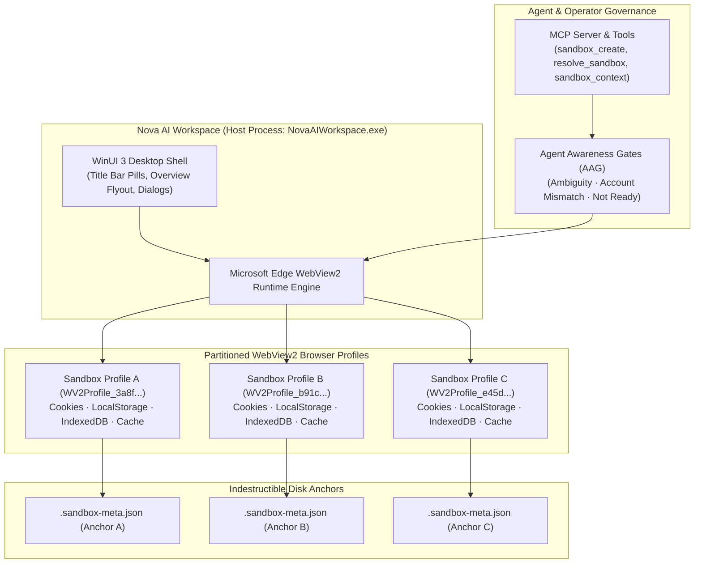
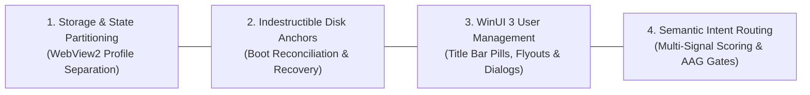
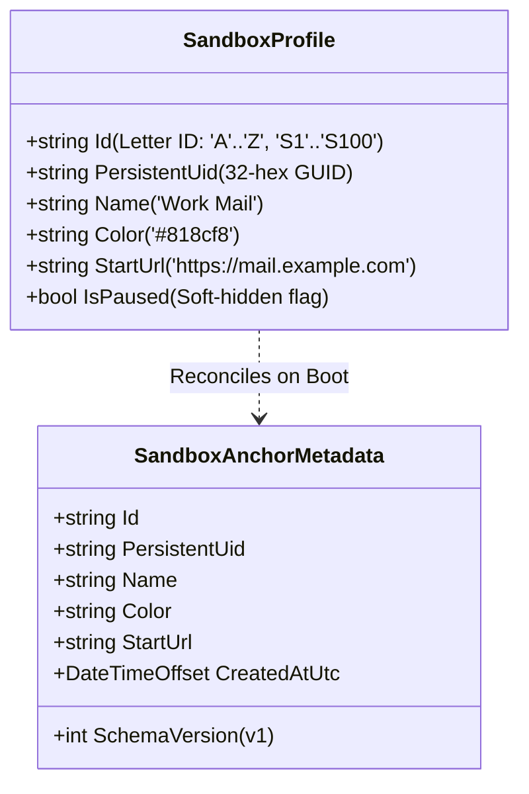
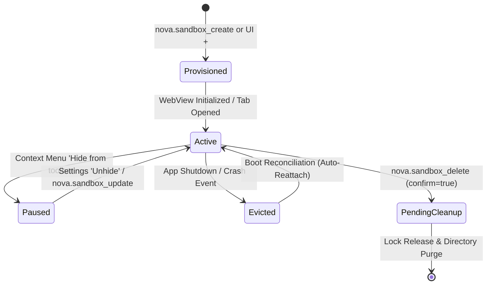

# Multi-Sandbox Session Isolation

> "Every identity deserves its own sandbox; true agent autonomy requires fearless session boundaries."
>
> — Nova Architectural Principles

> [!NOTE]
> Multi-Sandbox Session Isolation enables Nova AI Workspace (`NovaAIWorkspace.exe`) to execute multiple independent web identities, user logins, and administrative sessions concurrently within a single, lightweight browser process. Powered by partitioned Microsoft Edge WebView2 profiles, each sandbox maintains an isolated environment for cookies, `localStorage`, `sessionStorage`, `IndexedDB`, and cache stores. Human operators and autonomous Model Context Protocol (MCP) agents can operate across personal, corporate, staging, and administrative accounts simultaneously without authentication collisions or token bleed.

---

## 1. Architectural Principles & Isolation Boundaries

Traditional browser automation approaches multi-identity browsing either through heavyweight virtualization (spinning up multi-gigabyte virtual machines or Docker containers) or through ephemeral automation instances (Puppeteer/Playwright scripts launching independent Chromium processes). Both approaches introduce severe operational friction: high memory consumption, long boot latencies, lack of unified UI controls, and brittle session persistence.

Nova solves this with a **Single-Process, Multi-Profile WinUI 3 Architecture**:



### Architectural Comparison

| Dimension | OS Containers / Hypervisors | Multi-Process Automation (Puppeteer) | Nova AI Workspace Multi-Sandbox |
|---|---|---|---|
| **Memory Footprint** | 2–4 GB per instance | 300–600 MB per browser process | ~80–120 MB baseline per active profile |
| **Boot & Switch Latency** | 10–45 seconds | 2–5 seconds | **Instantaneous** (sub-10 ms active tab switch) |
| **Process Tree** | Separate OS kernels or containers | Discrete Chromium subprocesses | Single browser process + shared GPU & utility processes |
| **Session Persistence** | Volatile or heavyweight disk images | Ephemeral unless manual dump scripts run | **Indestructible on-disk LevelDB & SQLite** |
| **Crash Protection** | External hypervisor restart | Script termination | Outrider process fence + boot reconciliation |
| **Operator UI** | Disjointed desktop windows | Headless or unstyled debug windows | **Unified WinUI 3 title bar pills & flyouts** |

---

## 2. The Four Pillars of Sandbox Isolation

Nova's sandbox architecture is founded upon four complementary subsystems:



1. **Storage & State Partitioning:**
   Strict physical and logical separation of all browser state stores (HTTP cookies, Web Storage, IndexedDB, Service Workers, and HTTP cache) under isolated disk paths (`WV2Profile_<persistentUid>`).
2. **Indestructible Disk Anchors:**
   A dual-truth persistence model where on-disk `.sandbox-meta.json` files own the immutable identity, preventing accidental session loss or orphan profile generation during configuration corruption or unexpected power events.
3. **WinUI 3 User Management:**
   Rich desktop chrome controls, including responsive title bar pills (Expanded vs. Compact layout), custom 10-color palettes, dynamic site favicons, agent tab activity rings, and scoped data clearing dialogs.
4. **Semantic Intent Routing:**
   High-level agent intent matching (`nova.resolve_sandbox`) powered by multi-signal scoring ($w_{\text{preferred}}$, $w_{\text{purpose}}$, $w_{\text{service}}$, $w_{\text{alias}}$, $w_{\text{account}}$, readiness bonus, and learned domain affinity) backed by Agent Awareness Gates.

---

## 3. Storage Layout & Identity Contracts

All sandbox profiles reside in the operator's local application data directory:

```
%LOCALAPPDATA%\nova-cognitive\Nova\UserData\Shared\EBWebView\WV2Profile_<persistentUid>\
```

> [!NOTE]
> Installations upgraded from earlier preview builds may retain `%LOCALAPPDATA%\NovaBrowser\` as their local data root. Nova's path resolver detects legacy directories automatically and maintains full backward compatibility.

### System Limits & Identification Contracts

Nova enforces rigorous capacity boundaries and distinguishes between ephemeral display handles and permanent disk anchors:



- **Capacity Bounds:** Nova supports between **1** and **100** concurrent sandboxes (`MaxSandboxes = 100`). At least one sandbox must always exist at all times; attempting to delete the final active sandbox is strictly prohibited by host validation gates.
- **Short Letter IDs (`A` through `Z`, then `S1` through `S100`):** Ephemeral UI and command handles used in tabs, window chrome, and MCP parameters (`sandboxId="A"`). When a sandbox is deleted, its Short Letter ID is recycled and made available for the next created profile.
- **Persistent UIDs (`32-character hexadecimal GUID`):** Globally unique, cryptographically random identifiers minted exactly once when the profile is created. Persistent UIDs are **never recycled**. Physical directories on disk are named `WV2Profile_<persistentUid>`.
- **Knowledge Store Binding:** All persistent data stores—such as Domain Notes, Operator Notes, and Episodic Task Memory (ETM)—anchor their records strictly to `PersistentUid`. Recycling a Short Letter ID (e.g., deleting Sandbox B and creating a new Sandbox B) never results in cross-account data leakage or accidental note contamination.

---

## 4. Storage Partitioning vs. Process-Shared Stack

Nova maintains a strict boundary between what is isolated per profile and what is shared across the host process:

| Feature / Subsystem | Isolation Level | Technical Implementation & Boundary |
|---|---|---|
| **Cookies** | **Strictly Isolated** | Dedicated SQLite database (`Network\Cookies`) per profile. Zero cookie leakage across sandboxes. |
| **Local & Session Storage** | **Strictly Isolated** | Dedicated LevelDB key-value stores (`Local Storage\leveldb`). |
| **IndexedDB & WebSQL** | **Strictly Isolated** | Dedicated folder hierarchy (`IndexedDB\`) partitioned by origin. |
| **HTTP Disk & Memory Cache** | **Strictly Isolated** | Separate disk cache folders; clearing cache in Sandbox A has zero effect on Sandbox B. |
| **Service Workers & Cache API** | **Strictly Isolated** | Isolated service worker registrations, background fetch tokens, and offline caches. |
| **File System Access Handles** | **Strictly Isolated** | Granted origin permissions and file handles remain strictly scoped to the issuing profile. |
| **Browser Process Tree** | **Shared** | Single underlying WebView2 browser process, GPU process, and network utility process for efficiency. |
| **Global Proxy Pipeline** | **Shared** | Upstream SOCKS5/HTTP proxy configuration is maintained globally; sandboxes can disconnect locally. |
| **WebRTC & DNS Shielding** | **Shared** | Global host socket binding and centralized DNS leak prevention across all network adapters. |
| **Browser Identity (User-Agent)** | **Shared** | Global User-Agent preset and architecture strings applied across all WebView instances. |

---

## 5. Lifecycle State Machine

A sandbox transitions through distinct operational phases throughout its lifetime:



- **Provisioned:** The sandbox record is created, its `.sandbox-meta.json` disk anchor is atomically staged, and a Short Letter ID is assigned.
- **Active:** The WebView2 environment initializes the profile directory. Tabs can be opened, navigated, and automated.
- **Paused (Soft-Hidden):** The sandbox is hidden from the title bar pill strip to reduce visual clutter. Profile data, cookies, and active sessions remain intact on disk.
- **Evicted:** During application shutdown, WebView2 instances flush storage buffers and release directory locks.
- **Pending Cleanup:** When deleted, the sandbox's Short ID is released, its UID is registered in `SuppressedRecoveryAnchorUids`, and disk cleanup is queued until all background locks are freed.

---

## 6. Comprehensive Documentation Index

Explore the dedicated deep-dive guides for technical specifications, recovery workflows, and API details:

| Guide | Focus & Core Topics Covered |
|---|---|
| [**Profile Storage, Disk Anchors & Recovery**](profile-storage-and-disk-anchors.md) | File system directory hierarchy, SQLite cookie databases, LevelDB structures, `.sandbox-meta.json` schema, atomic `.tmp` staging, startup identity reconciliation rules (Identity-Merge, Catastrophic Empty Restore, Auto-Reattach, Orphan Routing, Anchor Backfill), deletion suppression markers, and the interactive `SandboxRecoveryDialog`. |
| [**Intent Routing & Agent Interaction**](intent-routing-and-agent-interaction.md) | Semantic attributes (`Purpose`, `Aliases`, `AccountLabel`, `PreferredFor`, `DetectedAccountName`), multi-signal intent scoring formula ($w_{\text{preferred}}$, $w_{\text{purpose}}$, $w_{\text{service}}$, $w_{\text{alias}}$, $w_{\text{account}}$, readiness bonus, affinity boost), the 4 Agent Awareness Gates (low confidence, multi-match ambiguity, account mismatch, not ready), and the complete MCP sandbox tool catalog. |
| [**User Management & GUI Controls**](user-management-and-gui.md) | WinUI 3 title bar pills, responsive Expanded vs. Compact layout, marker badges (Color dot, dynamic Site Favicon, Agent Activity Pulse Ring), hardware recording indicators (webcam, mic, screen share), right-click context menu actions, granular data clearing dialog (`SandboxDataClearDialog`), SettingsView configuration, and Detour Host whitelists. |

---

## 7. Related Documentation

- [Site Data Management](../site-data-management/README.md) — Cookie inspections, storage quotas, and cache clearing.
- [Agent Awareness Gates (AAG)](../agent-awareness-gates-aag/README.md) — Pre-action validation and account ambiguity protection.
- [Network & Proxy Routing](../network/README.md) — Shared proxy pipelines, sandbox disconnect toggles, and SSL/TLS diagnostics.
- [Privacy & Fingerprint Protection](../privacy/README.md) — Per-sandbox canvas jitter, audio noise, and credential vault policies.
- [Native Dialogs & UI Prompts](../native-dialogs-and-prompts/README.md) — Security prompts, file dialogs, and recovery modals.
- [Outrider Component](../../components/outrider/README.md) — Native helper process boundaries and crash isolation.

[All core features](../README.md)
