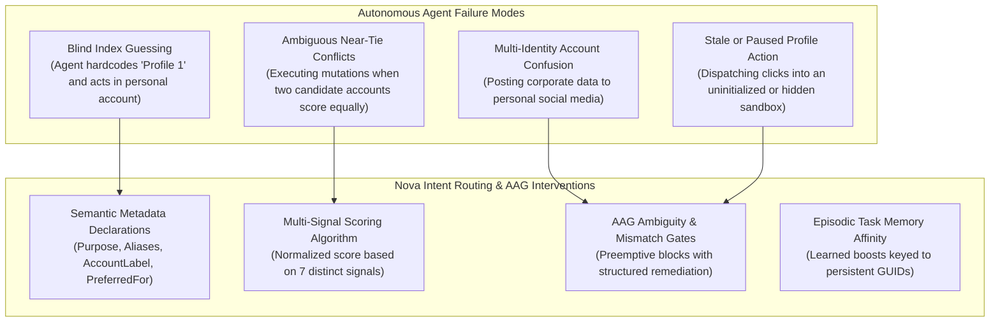
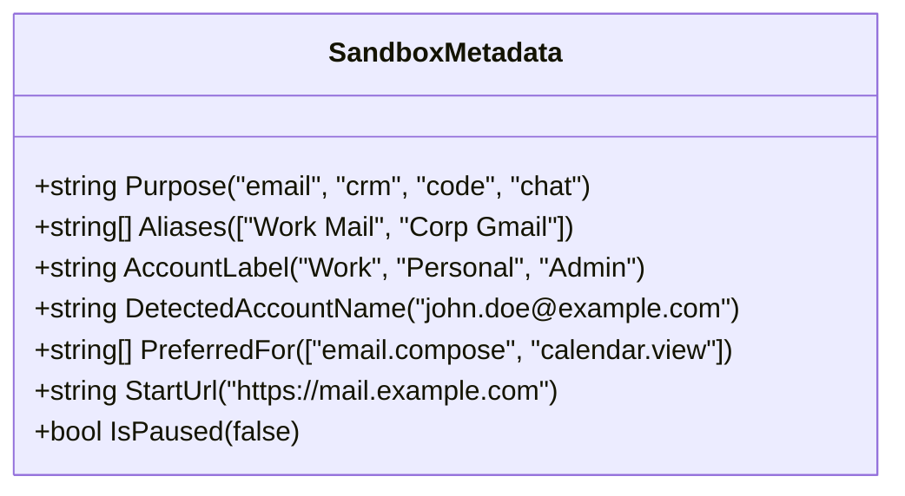
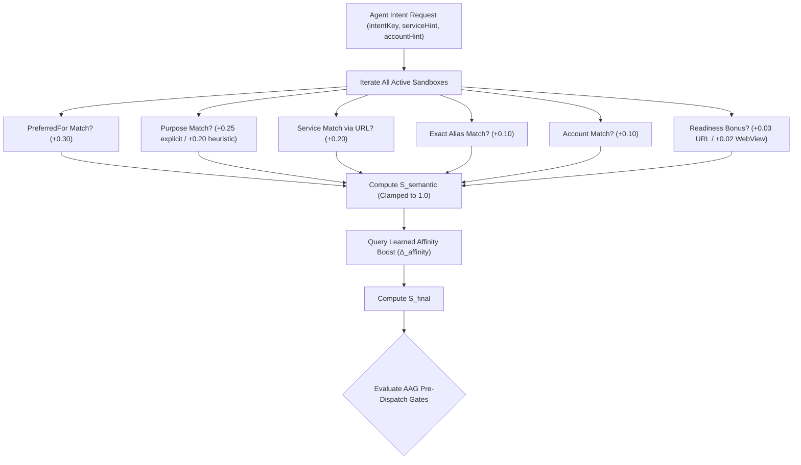
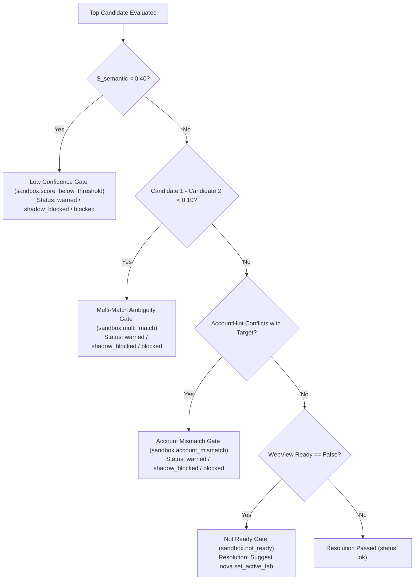

# Multi-Sandbox Intent Routing & Agent Interaction

> "An agent that cannot distinguish between work and personal accounts is a security hazard waiting to happen."
>
> — Agent Awareness Principles

> [!NOTE]
> In autonomous multi-agent environments, AI models frequently need to route actions to the appropriate browser sandbox (e.g., dispatching an email from a corporate account, submitting a bug report in a staging environment, or querying personal documentation). Nova provides semantic intent routing that maps high-level task goals to the optimal sandbox profile using multi-signal scoring, learned domain affinities, and preemptive Agent Awareness Gates (AAG).

---

## 1. The Autonomous Multi-Identity Problem

When an autonomous agent automates web tasks across multiple accounts, classic automation frameworks fail because they rely on hardcoded profile indices or static URLs. In complex real-world workflows, these shortcomings lead to critical failure modes:



---

## 2. Semantic Sandbox Attributes

Operators can annotate sandbox profiles with declarative metadata. These attributes enable automated routing without exposing physical filesystem paths or database handles to the language model:



### Attribute Specifications

| Attribute | Schema Type | Origin & Role | Example |
|---|---|---|---|
| **`Purpose`** | string | Broad functional category configured by operator. | `"email"`, `"crm"`, `"code"`, `"chat"`, `"docs"` |
| **`Aliases`** | string array | Alternative brand names, project titles, and colloquial handles. | `["Work Mail", "Corp Gmail", "Primary Inbox"]` |
| **`AccountLabel`** | string | Operator-declared account tier or organization boundary. | `"Work"`, `"Personal"`, `"Staging QA"`, `"Admin"` |
| **`DetectedAccountName`** | string | Runtime heuristic identity detected from live DOM elements or cookies. | `"john.doe@company.com"`, `"admin@corp.internal"` |
| **`PreferredFor`** | string array | Explicit task intent keys that this sandbox is dedicated to handling. | `["email.compose", "email.read", "calendar.schedule"]` |
| **`StartUrl`** | string (URL) | Default entry point navigation URL. | `"https://mail.google.com"` |
| **`IsPaused`** | boolean | Indicates whether the sandbox is soft-hidden from the active toolbar. | `false` (active) / `true` (paused) |

---

## 3. Multi-Signal Intent Scoring Algorithm (`nova.resolve_sandbox`)

When an agent needs to determine the appropriate sandbox, it queries `nova.resolve_sandbox` with an `intentKey` and optional hints:

```json
{
  "intentKey": "email.compose",
  "serviceHint": "gmail",
  "accountHint": "work"
}
```

### Mathematical Scoring Formula

Nova computes a normalized match score $S \in [0.0, 1.0]$ across all candidate sandboxes:

$$S_{\text{semantic}} = w_{\text{preferred}} + w_{\text{purpose}} + w_{\text{service}} + w_{\text{alias}} + w_{\text{account}} + \text{Bonus}_{\text{readiness}}$$

$$S_{\text{final}} = \min\left(1.0, S_{\text{semantic}} + \Delta_{\text{affinity}}\right)$$



### Detailed Signal Weights

1. **`PreferredFor` Match ($w_{\text{preferred}} = 0.30$):**
   Strongest declarative signal. Evaluates whether the sandbox's `PreferredFor` array explicitly contains the requested `intentKey` (`preferredFor={intentKey}(settings)`).
2. **`Purpose` Match ($w_{\text{purpose}} = 0.25 \text{ or } 0.20$):**
   Matches the root purpose token extracted from the intent (e.g., `"email"` from `"email.compose"`).
   - If explicitly defined in sandbox settings: $+0.25$.
   - If derived heuristically from service URL recognition: $+0.20$.
3. **`Service` Match ($w_{\text{service}} = 0.20$):**
   Matches `serviceHint` against the recognized service key of the sandbox's active URL or startup URL (e.g., `serviceKey="gmail"` from `https://mail.google.com`).
4. **`Alias` Match ($w_{\text{alias}} = 0.10$):**
   Evaluates whether `serviceHint` or `accountHint` exactly equals an entry in `Aliases` (case-insensitive equality, not substring match, preventing false positives like `"a"` matching everything).
5. **`Account` Match ($w_{\text{account}} = 0.10$):**
   Evaluates whether `accountHint` matches `AccountLabel` (settings-priority) or `DetectedAccountName` (runtime-heuristic).
6. **Readiness Bonus ($\text{Bonus}_{\text{readiness}} \le 0.05$):**
   - $+0.03$ if the sandbox currently has an active, non-empty URL loaded.
   - $+0.02$ if the sandbox's WebView2 instance is initialized and ready (`WebViewReady == true`).
7. **Learned Domain Affinity Boost ($\Delta_{\text{affinity}} \le 0.10$):**
   Queried from the Episodic Task Memory (ETM) affinity repository (`SandboxAffinityRepository`), keyed strictly to the profile's immutable `PersistentUid` (`SandboxRef`).

> [!IMPORTANT]
> **Semantic Score vs. Affinity Boost Invariant:**
> Nova tracks $S_{\text{semantic}}$ and $\Delta_{\text{affinity}}$ as separate metrics. Preemptive safety gates evaluate $S_{\text{semantic}}$ directly so that a high historical affinity boost cannot mask a semantically weak or ambiguous match.

---

## 4. Agent Awareness Gates (AAG) for Sandbox Resolution

To prevent autonomous agents from mutating or reading data from incorrect accounts, Nova evaluates four strict safety gates on every resolution:



### Gate Breakdown & Thresholds

| Gate Identifier | Trigger Condition | Severity & Remediation |
|---|---|---|
| **`sandbox.score_below_threshold`** | Best candidate has $S_{\text{semantic}} < 0.40$. | Warns or blocks the action. Advises the agent to provide more specific hints (`serviceHint`, `accountHint`) or solicit clarification from the human operator. |
| **`sandbox.multi_match`** | Margin between top candidate and runner-up is $< 0.10$. | Preempts execution when two sandboxes (e.g., Work Mail and Personal Mail) have nearly identical relevance. Demands explicit disambiguation. |
| **`sandbox.account_mismatch`** | `accountHint` provided, but top match has no account data or conflicts with declared account. | Blocks action to prevent cross-account data leakage. Reports requested account vs. detected account. |
| **`sandbox.not_ready`** | Best match has uninitialized WebView2 runtime (`WebViewReady == false`). | Emits actionable resolution payload suggesting `nova.set_active_tab` to initialize the target before mutating DOM elements. |

### Enforcement Modes

Each gate can be configured independently via host settings (`AppSettings.SandboxLowConfidenceGateMode`, `SandboxMultiMatchGateMode`, etc.):

- **`Off`:** Gate is bypassed; no warnings or blocks are emitted.
- **`Warn`:** Gate evaluates and attaches structured warnings to the tool result (`status: "warned"`), allowing execution to continue.
- **`ShadowBlock`:** Gate records internal telemetry and marks status as `"shadow_blocked"` without halting execution, allowing operators to diagnose threshold behavior safely.
- **`Block`:** Gate halts execution immediately and returns an MCP-compliant `AagBlockResult` (`isError: true` + `_meta`) containing detailed recovery options.

---

## 5. Complete MCP Tool Reference for Sandboxes

All sandbox operations are exposed via five dedicated tools in the `browser_automation` bundle:

### 1. `nova.resolve_sandbox`

Resolves the optimal sandbox profile for a specified task intent:

```json
// Tool Call Arguments
{
  "intentKey": "crm.contact_update",
  "serviceHint": "hubspot",
  "accountHint": "sales"
}
```

```json
// Tool Response Payload
{
  "matched": true,
  "intentKey": "crm.contact_update",
  "serviceHint": "hubspot",
  "accountHint": "sales",
  "best": {
    "targetId": "B",
    "profileId": "WV2Profile_b8a4f91e32d04a6c891e8432a105c901",
    "sandboxId": "B",
    "sandboxRef": "b8a4f91e32d04a6c891e8432a105c901",
    "semanticScore": 0.85,
    "affinityBoost": 0.05,
    "score": 0.90,
    "reasons": [
      "preferredFor=crm.contact_update(settings)",
      "purpose=crm(settings)",
      "service=hubspot(url_match)",
      "account=sales(settings)",
      "url_available(live)",
      "webview_ready",
      "affinity_boost=0.050(learned)"
    ]
  },
  "candidates": [ ... ],
  "status": "ok",
  "_aagGates": {
    "scoreBelowThreshold": { "gateId": "sandbox.score_below_threshold", "status": "passed" },
    "multiMatch": { "gateId": "sandbox.multi_match", "status": "passed" },
    "accountMismatch": { "gateId": "sandbox.account_mismatch", "status": "passed" },
    "notReady": { "gateId": "sandbox.not_ready", "status": "passed" }
  }
}
```

### 2. `nova.sandbox_context`

Retrieves deep semantic metadata, active tabs, and proxy bindings for a specific sandbox handle:

```json
// Tool Call Arguments
{
  "targetId": "B"
}
```

```json
// Response includes:
// - Sandbox identity (Id, PersistentUid, Name, Color)
// - Semantic declarations (Purpose, Aliases, AccountLabel, PreferredFor)
// - Runtime status (IsPaused, DetectedAccountName, EffectiveProxy)
// - Active tab list and claim ownership
```

### 3. `nova.sandbox_create`

Provisions a new isolated sandbox profile programmatically:

```json
// Tool Call Arguments
{
  "name": "Staging QA",
  "color": "#34d399",
  "startUrl": "https://staging.internal.net",
  "purpose": "code",
  "accountLabel": "QA Team",
  "aliases": ["Staging", "Dev Portal"],
  "preferredFor": ["code.test", "staging.deploy"]
}
```

- **Validation Rules:** `color` must match hex regex `^#[0-9a-fA-F]{6}$`. Maximum 100 concurrent sandboxes. Atomically creates disk anchor before UI mount.

### 4. `nova.sandbox_update`

Modifies metadata or toggles pause state for an existing sandbox:

```json
// Tool Call Arguments
{
  "sandboxId": "B",
  "name": "Updated Staging Workspace",
  "isPaused": false
}
```

### 5. `nova.sandbox_delete`

Destroys a sandbox profile and securely cleans up its disk files:

```json
// Tool Call Arguments
{
  "sandboxId": "C",
  "confirm": true
}
```

> [!CAUTION]
> Deleting a sandbox permanently removes its cookies, web storage, and session tokens. `confirm: true` is strictly required. Attempting to delete the final remaining sandbox fails immediately with a validation error.

---

## 6. Cross-Sandbox Tab Operations & Leases

- **Scoped Tab Creation:**
  `nova.tab_new(sandbox="B", url="https://example.com")` opens a tab directly bound to Sandbox B's profile.
- **Tab Leases & Agent Activity Rings:**
  When an agent calls `nova.tab_claim(targetId=...)`, an animated pulse ring appears around the sandbox pill in the browser chrome, alerting human operators that an autonomous session is active.
- **Switching Visible View:**
  `nova.guarded_switch_sandbox` enables interactive viewport switching while respecting Agent Awareness Gates.

---

## 7. Related Documentation

- [Profile Storage, Disk Anchors & Recovery](profile-storage-and-disk-anchors.md) — Directory layout and boot-time reconciliation.
- [User Management & GUI Controls](user-management-and-gui.md) — Title bar pills and data clearing dialogs.
- [Agent Awareness Gates (AAG)](../agent-awareness-gates-aag/README.md) — Preemptive tool execution gates.
- [Multi-Sandbox Overview](README.md) — Master architectural index.

[All core features](../README.md)
