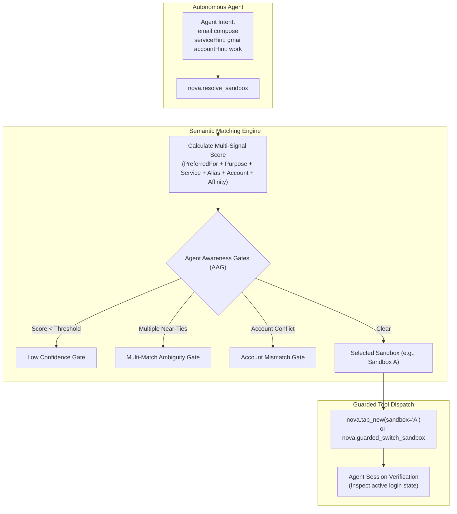
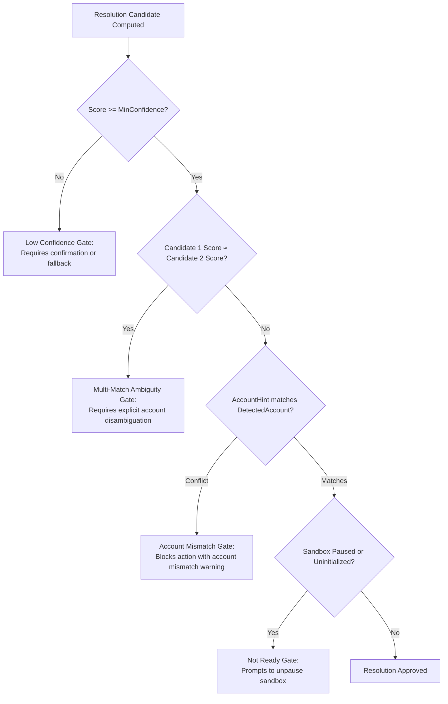

# Multi-Sandbox Intent Routing & Agent Interaction

In multi-agent and automated workflows, an AI agent often needs to determine which browser sandbox belongs to a specific account, service, or task. Nova provides semantic routing tools that map high-level intents (e.g., `email.compose`, `crm.lead_update`) to the optimal sandbox profile while enforcing strict safety gates against account ambiguity.



---

## 1. Semantic Sandbox Attributes

Operators can annotate sandboxes with rich semantic metadata. These attributes enable automated routing without exposing raw filesystem paths or database identifiers to the AI model:

| Attribute | Schema Type | Description & Example |
|---|---|---|
| **`Purpose`** | string | Broad functional category: `"email"`, `"chat"`, `"project"`, `"code"`, `"docs"`. |
| **`Aliases`** | array of strings | Alternative search terms and brand names: `["Work Mail", "Google Workspace", "Corp Gmail"]`. |
| **`AccountLabel`** | string | Human-declared tier: `"Work"`, `"Personal"`, `"Pro Team"`, `"Admin"`. |
| **`DetectedAccountName`** | string | Heuristically detected login identity extracted from live tab sessions: `"john.doe@company.com"`. |
| **`PreferredFor`** | array of strings | Specific semantic task intent keys: `["email.compose", "email.read", "calendar.view"]`. |
| **`StartUrl`** | string (URL) | Default entry point: `"https://mail.google.com"`. |

---

## 2. Intent Resolution Algorithm (`nova.resolve_sandbox`)

When an agent needs to act on an external service, it queries `nova.resolve_sandbox` with an `intentKey` and optional hints:

```json
{
  "intentKey": "email.compose",
  "serviceHint": "gmail",
  "accountHint": "work"
}
```

### Multi-Signal Scoring Formula

The matching engine computes a normalized candidate score $S \in [0.0, 1.0]$ across all active sandboxes:

$$S = w_{\text{preferred}} + w_{\text{purpose}} + w_{\text{service}} + w_{\text{alias}} + w_{\text{account}} + \Delta_{\text{affinity}}$$

1. **`PreferredFor` Match ($w_{\text{preferred}} = 0.30$):**
   Strongest signal. Evaluates whether the sandbox's `PreferredFor` array explicitly lists the target `intentKey`.
2. **`Purpose` Match ($w_{\text{purpose}} = 0.25 \text{ or } 0.20$):**
   Matches the root purpose token extracted from the intent (e.g., `email` from `email.compose`). Settings-explicit purpose awards $0.25$; heuristic service recognition awards $0.20$.
3. **`Service` Match ($w_{\text{service}} = 0.20$):**
   Matches `serviceHint` against the recognized domain service key of the sandbox's current or startup URL.
4. **`Alias` Match ($w_{\text{alias}} = 0.10$):**
   Exact case-insensitive match between `serviceHint` or `accountHint` and an entry in `Aliases`.
5. **`Account` Match ($w_{\text{account}} = 0.15$):**
   Matches `accountHint` against `AccountLabel` or `DetectedAccountName`.
6. **Domain Affinity Bonus ($\Delta_{\text{affinity}} \le 0.10$):**
   Bonus derived from Nova's historical domain-to-sandbox affinity repository (`SandboxAffinityRepository`).

---

## 3. Agent Awareness Gates (AAG) for Sandbox Resolution

To prevent an AI agent from accidentally posting or reading data from the wrong account, Nova evaluates four strict safety gates on resolution:



### Gate Breakdown

- **Low Confidence Gate:** If the highest-scoring candidate fails to reach the confidence threshold, Nova rejects automatic routing with reason code `sandbox.low_confidence`.
- **Multi-Match Ambiguity Gate:** If two sandboxes (e.g., Sandbox A and Sandbox B) produce near-identical scores (score difference $< 0.05$), Nova blocks blind execution with `sandbox.ambiguous_match`, prompting the agent to specify an account hint.
- **Account Mismatch Gate:** If the agent requested `accountHint="personal"`, but the selected sandbox has `DetectedAccountName="john.work@company.com"`, Nova raises `sandbox.account_mismatch`.
- **Not Ready Gate:** If the matched sandbox is soft-hidden (`IsPaused = true`), Nova alerts the agent to unhide the sandbox before creating tabs.

> [!IMPORTANT]
> **Guidance vs. Guarantee Contract:**
> Resolving a sandbox selects the profile most likely configured for that intent; it **does not guarantee** that the session is currently authenticated. An agent must inspect the target page's DOM or cookies before assuming an active login.

---

## 4. MCP Tool Catalog for Multi-Sandbox Operations

Nova exposes five core tools dedicated to sandbox management:

### 1. `nova.sandbox_context`

Retrieves detailed semantic metadata, active tabs, and proxy bindings for a specific sandbox target:

```json
// Parameters
{
  "targetId": "B"
}
```

### 2. `nova.resolve_sandbox`

Resolves the best matching sandbox for an intent key with scoring breakdowns:

```json
// Parameters
{
  "intentKey": "crm.contact_update",
  "serviceHint": "hubspot",
  "accountHint": "sales"
}
```

### 3. `nova.sandbox_create`

Programmatically provisions a new isolated sandbox profile:

```json
// Parameters
{
  "name": "Testing Staging",
  "color": "#34d399",
  "startUrl": "https://staging.example.com",
  "purpose": "code",
  "accountLabel": "QA Team",
  "aliases": ["Staging", "Dev Portal"],
  "preferredFor": ["code.test", "staging.deploy"]
}
```

### 4. `nova.sandbox_update`

Modifies metadata or toggles pause state for an existing sandbox:

```json
// Parameters
{
  "sandboxId": "B",
  "name": "Updated Workspace",
  "isPaused": false
}
```

### 5. `nova.sandbox_delete`

Permanently destroys a sandbox profile and queues its disk files for secure deletion. Requires mandatory `confirm: true`:

```json
// Parameters
{
  "sandboxId": "C",
  "confirm": true
}
```

> [!CAUTION]
> Deleting a sandbox destroys all its stored cookies, `localStorage`, and session credentials. This action cannot be undone.

---

## 5. Tab Operations Across Sandboxes

Standard browsing tools support multi-sandbox addressing:

- **Creating a Tab in a Specific Sandbox:**
  `nova.tab_new(sandbox="B", url="https://example.com")` opens a tab directly bound to Sandbox B's isolated profile.
- **Switching Active Sandbox View:**
  `nova.guarded_switch_sandbox(selector=...)` enables interactive switching in the WinUI chrome.
- **Per-Sandbox Fingerprint Customization:**
  `nova.fingerprint_set_sandbox(sandboxId="B", level="strict")` pins Sandbox B to strict canvas jitter and audio masking without altering global defaults.
