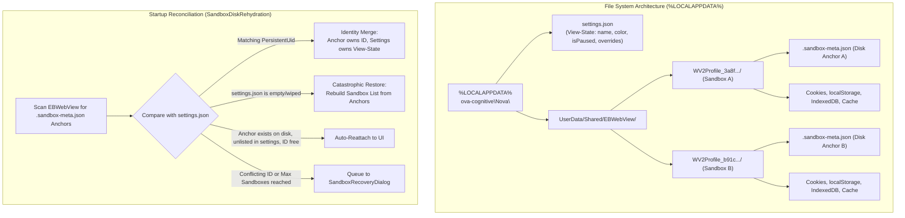
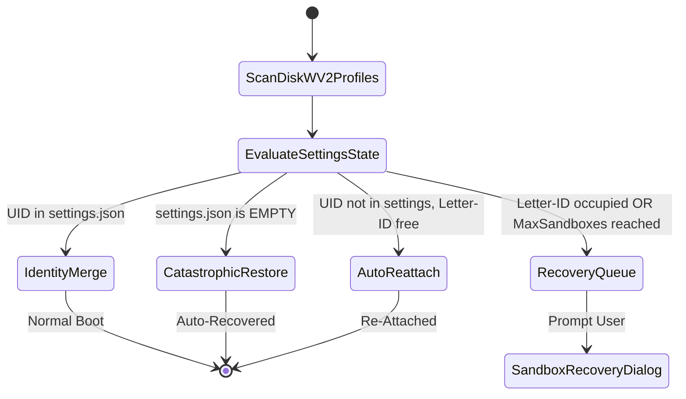

# Multi-Sandbox Profile Storage, Disk Anchors & Recovery

Nova achieves complete multi-session separation by partitioning Edge WebView2 into isolated browser profiles stored on disk. To protect user logins from settings corruption or unintended data loss, Nova implements an indestructible **Disk Anchor** architecture combined with boot-time **Identity Reconciliation**.



---

## 1. WebView2 Profile Directory Layout

All sandbox data lives under a centralized profile hierarchy on the local filesystem:

```
%LOCALAPPDATA%\nova-cognitive\Nova\
  ├── settings.json                           # Mutable view-state, preferences, and overrides
  └── UserData\
        └── Shared\
              └── EBWebView\
                    ├── WV2Profile_<uid-A>\   # Dedicated profile directory for Sandbox A
                    │     ├── .sandbox-meta.json  # Indestructible disk anchor
                    │     ├── Network\Cookies # SQLite cookie store
                    │     ├── Local Storage\  # LevelDB web storage
                    │     └── IndexedDB\      # Application database storage
                    └── WV2Profile_<uid-B>\   # Dedicated profile directory for Sandbox B
                          ├── .sandbox-meta.json
                          └── ...
```

> [!NOTE]
> Installations upgraded from earlier preview builds may retain `%LOCALAPPDATA%\NovaBrowser\` as their profile root. Nova's path resolver detects legacy directories automatically.

### Short Letters vs. Persistent UIDs

Nova separates user-facing identifiers from physical filesystem storage:

- **Short Letter ID (`A`, `B`, `C`, ... `S1`..`S100`):** Ephemeral UI handles used in tabs, window titles, and MCP tool parameters. Short IDs can be recycled when a sandbox is deleted.
- **Persistent UID (`32-character hex GUID`):** Globally unique, immutable identifier minted once at sandbox creation. The profile folder is permanently named `WV2Profile_<persistentUid>`. Knowledge stores (such as Domain Notes and Operator Notes) anchor sandbox-specific data exclusively to the `PersistentUid`, ensuring that recycling a letter ID never causes identity collisions.

---

## 2. Storage Isolation Matrix

Nova enforces strict boundaries between what is partitioned per sandbox and what is shared across the underlying browser process:

| Feature / Subsystem | Isolation Level | Technical Implementation |
|---|---|---|
| **Cookies** | **Strictly Isolated** | Stored in per-profile SQLite databases (`Network\Cookies`). Zero cookie leakage across sandboxes. |
| **Local & Session Storage** | **Strictly Isolated** | Per-profile LevelDB stores (`Local Storage\leveldb`). |
| **IndexedDB & WebSQL** | **Strictly Isolated** | Partitioned per profile directory (`IndexedDB\`). |
| **HTTP Disk & Memory Cache** | **Strictly Isolated** | Separate cache folders; clearing cache in A does not affect B. |
| **Service Workers & Cache API** | **Strictly Isolated** | Partitioned service worker registrations and offline caches. |
| **File System Access API** | **Strictly Isolated** | Sandbox-specific origins and granted folder handles. |
| **Browser Engine & Process Tree** | **Shared** | Single underlying WebView2 browser process, GPU process, and network utility process. |
| **Proxy Configuration** | **Shared** | All sandboxes share the global proxy configuration; individual proxy profiles apply globally or disconnect per sandbox. |
| **WebRTC & DNS Leak Protection** | **Shared** | Global browser-wide socket binding and proxy DNS resolution. |
| **Browser Identity (User-Agent)** | **Shared** | User-Agent preset applied across all WebView instances. |

---

## 3. The Disk Anchor Architecture (`.sandbox-meta.json`)

Historically, web browsers treated the master settings file (`settings.json`) as the sole source of truth. If that file became corrupted or was wiped during an unexpected crash, all profile folders on disk became "orphaned" and user logins were lost.

Nova inverts this architecture with **Disk Anchors**:

1. **Self-Describing Profiles:** Each `WV2Profile_<uid>` directory contains a `.sandbox-meta.json` file storing the canonical identity.
2. **Schema Versioning:**
   ```json
   {
     "schemaVersion": 1,
     "id": "A",
     "persistentUid": "b8a4f91e32d04a6c891e8432a105c901",
     "name": "Work Mail",
     "color": "#818cf8",
     "startUrl": "https://mail.example.com",
     "createdAtUtc": "2026-06-15T08:30:00.0000000Z"
   }
   ```
3. **Atomic Staging:** When creating or renaming a sandbox, Nova writes metadata to a `.tmp` file and executes an atomic replace (`File.Move(..., overwrite: true)`). A crash mid-write can never result in a half-written or corrupt anchor file.
4. **Ownership Invariant:**
   - **Disk Anchor owns Identity:** `Id`, `PersistentUid`, and `CreatedAtUtc`.
   - **`settings.json` owns View-State:** `Name`, `Color`, `StartUrl`, `IsPaused`, and security overrides.

---

## 4. Boot-Time Identity Reconciliation (`SandboxDiskRehydration`)

During application startup, Nova executes an automatic reconciliation pass:



### The 5 Reconciliation Rules

1. **Identity Merge:** For every sandbox present in `settings.json` whose `PersistentUid` matches a disk anchor, the anchor wins for identity (`Id`, `CreatedAtUtc`), while `settings.json` wins for mutable preferences (`Name`, `Color`, `StartUrl`, `IsPaused`).
2. **Catastrophic Empty Restore:** If `settings.json` is missing, corrupt, or has an empty sandbox list, Nova automatically re-attaches all valid disk anchors up to the 100-sandbox limit, completely recovering all accounts without user intervention.
3. **Auto-Reattach:** If an anchor exists on disk that was temporarily omitted from `settings.json` (e.g., from an aborted file write), and its Letter ID is free, Nova re-attaches it automatically so the user never loses active logins.
4. **Orphan Anchor Routing:** If an unlisted disk anchor's Letter ID is already taken by a different sandbox, or if the sandbox limit is reached, Nova routes it to the **Sandbox Recovery Dialog** rather than overwriting existing sandboxes.
5. **Anchor Backfill:** If `settings.json` lists a sandbox that lacks a disk anchor file (e.g., after manual configuration editing), Nova writes the missing anchor to disk immediately.

### Deletion Protection & Markers

To ensure that intentionally deleted sandboxes are never resurrected by the recovery engine:
- When a sandbox is deleted, Nova writes a `deleted_marker.json` and records the UID in `SuppressedRecoveryAnchorUids`.
- The reconciliation engine skips suppressed UIDs silently during boot scans.

---

## 5. The Interactive Sandbox Recovery Dialog

When disk-only profiles with conflicting IDs or unattached data are detected, Nova presents a non-blocking modal dialog on startup (`SandboxRecoveryDialog`):

```
┌─────────────────────────────────────────────────────────────┐
│  Recover sandbox profiles                                   │
│  These sandbox profiles exist on disk but are not active.   │
│  Pick an action for each entry.                             │
├─────────────────────────────────────────────────────────────┤
│  [A] Work Mail (WV2Profile_b8a4f9...)                       │
│      Last used: 2026-06-15 · Logins present                 │
│      Action: [ Restore (Assign next free ID: C) ▼ ]         │
│                                                             │
│  [B] Old Staging Test (WV2Profile_7c12e0...)                │
│      Action: [ Delete Permanently               ▼ ]         │
├─────────────────────────────────────────────────────────────┤
│                       [ Apply Decisions ]  [ Leave For Now ]│
└─────────────────────────────────────────────────────────────┘
```

### Available Decisions

- **Restore This:** Re-registers the profile into `settings.json`, automatically assigning the next available Letter ID (`NextSandboxId`). All existing cookies and logins are instantly available.
- **Delete Permanently:** Deletes the profile directory from disk and records a permanent deletion marker.
- **Leave For Now:** Leaves the files on disk and suppresses recovery prompts for the remainder of the session without modifying configuration.
