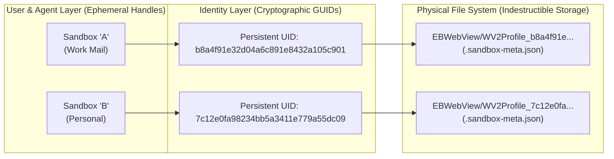
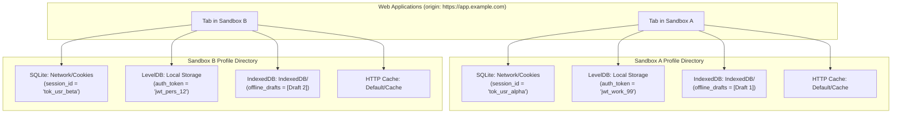
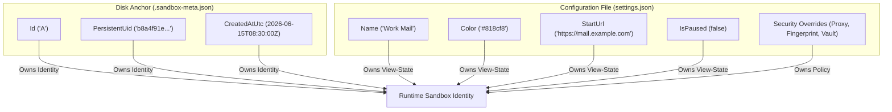
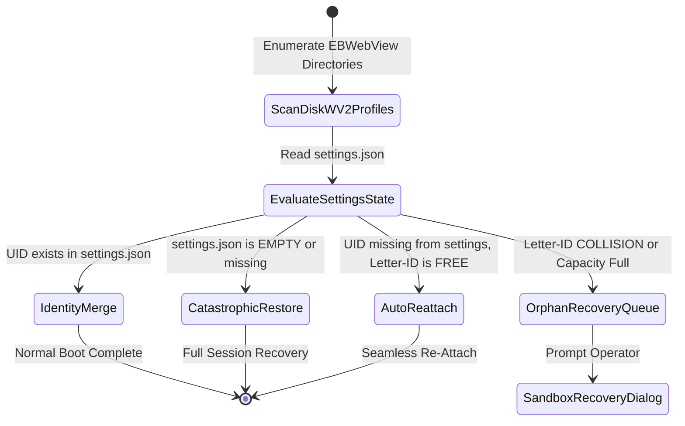
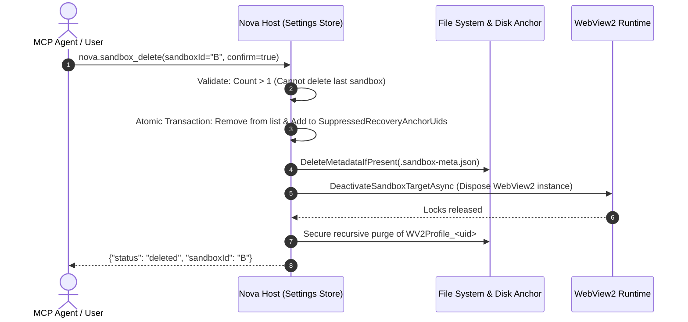

# Multi-Sandbox Profile Storage, Disk Anchors & Recovery

> "A browser profile is not just configuration; it holds the user's active trust, authentication sessions, and web history. Storage loss is identity loss."
>
> — Nova Architectural Invariants

> [!NOTE]
> Nova AI Workspace achieves complete multi-session separation by partitioning Microsoft Edge WebView2 into isolated browser profiles stored on disk. To protect user logins and credentials from configuration corruption, sudden process termination, or disk desynchronization, Nova implements an **Indestructible Disk Anchor** architecture combined with boot-time **Identity Reconciliation** and an interactive recovery subsystem.

---

## 1. WebView2 Profile Directory Layout

All sandbox profiles live under a structured, centralized file hierarchy within the operator's Windows profile directory:

```
%LOCALAPPDATA%\nova-cognitive\Nova\
  ├── settings.json                                 # View-state, preferences, overrides, and suppression lists
  └── UserData\
        └── Shared\
              └── EBWebView\
                    ├── Crashpad\                   # Shared crash reporting and mini-dumps
                    ├── WV2Profile_<persistentUid-A>\  # Dedicated profile directory for Sandbox A
                    │     ├── .sandbox-meta.json        # Indestructible disk anchor
                    │     ├── Network\
                    │     │     └── Cookies            # Isolated SQLite cookie jar
                    │     ├── Local Storage\
                    │     │     └── leveldb\           # LevelDB key-value store (localStorage)
                    │     ├── Session Storage\         # Ephemeral tab session storage
                    │     ├── IndexedDB\               # Origin-partitioned application databases
                    │     │     └── https_mail.example.com_0.indexeddb.leveldb\
                    │     └── Default\
                    │           ├── Cache\             # HTTP network disk cache
                    │           └── Code Cache\js\     # V8 compiled bytecode cache
                    └── WV2Profile_<persistentUid-B>\  # Dedicated profile directory for Sandbox B
                          ├── .sandbox-meta.json        # Indestructible disk anchor
                          └── ...
```

> [!NOTE]
> Installations upgraded from earlier preview builds may retain `%LOCALAPPDATA%\NovaBrowser\` as their profile root. Nova's path resolver automatically detects legacy directory layouts and handles migrations transparently.

### Ephemeral Short Letters vs. Immutable Persistent UIDs

Nova strictly decouples user-facing UI handles from physical filesystem directory naming:



- **Short Letter ID (`A`, `B`, `C`, ... `S1`..`S100`):**
  - Ephemeral user-facing handles used in tabs, window title bar pills, and MCP tool parameters (`sandbox="A"`).
  - Assigned sequentially (`A` through `Z`, then `S1` through `S100`).
  - **Recyclable:** When a sandbox is deleted, its Short Letter ID is returned to the pool and can be reassigned to the next created profile.
- **Persistent UID (`32-character hexadecimal GUID`):**
  - Globally unique, immutable identifier minted once upon sandbox creation.
  - Formatted as a 32-character hexadecimal string without hyphens (e.g., `b8a4f91e32d04a6c891e8432a105c901`).
  - Physical profile directories on disk are named permanently: `WV2Profile_<persistentUid>`.
  - **Never Recycled:** Even after profile deletion, the UID is permanently retired.
- **Knowledge Store Anchoring:**
  - All auxiliary knowledge engines—such as Domain Notes, Operator Notes, and Episodic Task Memory (ETM)—anchor their data records strictly to `PersistentUid` (`SandboxRef`).
  - Because Short Letter IDs can be recycled, binding notes to the persistent UID guarantees that deleting Sandbox B and later provisioning a new Sandbox B never causes historical notes, cookies, or learned task affinities to bleed between unrelated accounts.

---

## 2. Storage Partitioning & Data Isolation Mechanics

Nova partitions web storage at the native browser engine level, ensuring absolute isolation:



### Technical Isolation Matrix

| Storage Mechanism | Physical Format | Storage Path | Isolation Guarantee |
|---|---|---|---|
| **HTTP Cookies** | SQLite Database | `Network\Cookies` | **Strictly Isolated.** SQLite file locked to profile. Tables (`cookies`) store encrypted tokens. Zero leakage across profiles. |
| **Local Storage** | LevelDB Key-Value | `Local Storage\leveldb\` | **Strictly Isolated.** Origins partitioned per directory. Writes in Sandbox A cannot be observed or modified by Sandbox B. |
| **Session Storage** | Chromium Memory/Disk | `Session Storage\` | **Strictly Isolated.** Scoped to individual tab contexts within the sandbox profile. |
| **IndexedDB** | LevelDB Databases | `IndexedDB\<origin>.indexeddb.leveldb\` | **Strictly Isolated.** Offline databases, blobs, and object stores strictly partitioned by origin within the profile. |
| **Service Workers & Cache API** | LevelDB & Storage Keys | `Service Worker\` | **Strictly Isolated.** Service worker scripts, background push registrations, and Cache API stores are isolated. |
| **HTTP Network Cache** | Block-based Disk Cache | `Default\Cache\` | **Strictly Isolated.** Cached resources, images, scripts, and bytecode caches (`Code Cache\js\`) are profile-scoped. |
| **File System Access API** | Origin Handle Permissions | Chromium State Store | **Strictly Isolated.** Granted directory and file permissions are scoped strictly to the profile. |

---

## 3. The Indestructible Disk Anchor Architecture (`.sandbox-meta.json`)

Historically, web browsers and wrapper automation frameworks treated a single centralized configuration file (`settings.json`) as the sole source of truth. If that configuration file became corrupted, truncated during an OS crash, or overwritten by a misconfigured test harness, all profile folders on disk were orphaned: their data remained on disk, but the browser had no knowledge of which profile belonged to which account.

Nova inverts this architecture with **Self-Describing Disk Anchors**:



### Disk Anchor Schema (Version 1)

Every sandbox profile directory contains a `.sandbox-meta.json` file in its root:

```json
{
  "schemaVersion": 1,
  "id": "A",
  "persistentUid": "b8a4f91e32d04a6c891e8432a105c901",
  "name": "Work Mail",
  "color": "#818cf8",
  "startUrl": "https://mail.example.com",
  "createdAtUtc": "2026-06-15T08:30:00.0000000Z"
}
```

### Field Definitions

- `schemaVersion` (integer): Metadata format version (currently `1`). Incremented additively for future extensions. Unknown fields are ignored by Nova's deserializer.
- `id` (string): The assigned Short Letter ID at creation time.
- `persistentUid` (string): The immutable 32-character hexadecimal GUID.
- `name` (string): Human-readable descriptive name at creation.
- `color` (string): Hex color code assigned at creation (e.g., `#818cf8`).
- `startUrl` (string, optional): Default starting URL.
- `createdAtUtc` (string, ISO 8601): Exact UTC timestamp of sandbox creation.

### Atomic Staging Algorithm

To eliminate partial-file corruption during unexpected shutdowns or sudden power losses, Nova writes disk anchors using two-phase atomic file staging:

1. **Stage to Temporary File:**
   Metadata is serialized to `.sandbox-meta.json.tmp` in the target profile directory.
2. **Buffer Flush:**
   The file stream is explicitly flushed and closed to ensure all bytes are committed to the filesystem journal.
3. **Atomic Replace:**
   Nova invokes an atomic move with overwrite (`File.Move(source, destination, overwrite: true)`).
4. **Crash Safety Guarantee:**
   Because filesystem directory entries are updated atomically by the Windows NTFS/ReFS kernel, any reading process will observe either the complete previous anchor or the complete new anchor. A partially written or corrupt file is physically impossible.

### Ownership Invariant: Identity vs. View-State

- **Disk Anchor owns Identity:** `Id`, `PersistentUid`, and `CreatedAtUtc`. If `settings.json` is wiped, identity is reconstructed from the anchors.
- **`settings.json` owns View-State & Policy:** `Name`, `Color`, `StartUrl`, `IsPaused`, proxy disconnection overrides, fingerprint protection levels, and vault autofill policies.

---

## 4. Boot-Time Identity Reconciliation (`SandboxDiskRehydration`)

During application startup, Nova executes an automatic reconciliation pass before launching any browser windows:



### The Five Boot Reconciliation Rules

Nova processes discovered disk anchors deterministically (sorted chronologically by `CreatedAtUtc`, then ordinally by `Id`):

1. **Rule 1: Identity-Merge (Normal Boot):**
   - For every sandbox in `settings.json` whose `PersistentUid` matches an on-disk anchor, Nova merges the records:
   - The disk anchor owns `Id` and `CreatedAtUtc` (guaranteeing that identity never drifts).
   - `settings.json` owns `Name`, `Color`, `StartUrl`, and `IsPaused` (preserving user customization).
2. **Rule 2: Catastrophic Empty Restore:**
   - If `settings.json` was deleted, corrupted, or contains an empty sandbox list, Nova automatically scans `EBWebView` for all surviving `.sandbox-meta.json` anchors.
   - All valid anchors (up to `MaxSandboxes = 100`) are automatically re-attached to the active configuration.
   - UIDs registered in `SuppressedRecoveryAnchorUids` (intentionally deleted sandboxes) are skipped silently.
   - The user's active accounts, cookies, and tabs return immediately without data loss.
3. **Rule 3: Auto-Reattach (Seamless Recovery):**
   - If an on-disk anchor's `PersistentUid` is absent from `settings.json` (e.g., due to an interrupted file write or third-party editing), AND:
     - The sandbox was NOT deleted (UID is not in suppression lists), AND
     - The anchor's original Short Letter ID is currently **free** in `settings.json`, AND
     - The system is below the 100-sandbox limit:
   - Nova re-attaches the sandbox to the active UI automatically. Active logins and cookies remain seamlessly accessible.
4. **Rule 4: Orphan Anchor Routing:**
   - If an unlisted disk anchor's Short Letter ID is already occupied by a different sandbox, or if the maximum sandbox limit is reached:
   - Nova does **not** silently overwrite the occupying sandbox.
   - Instead, the unattached profile is classified as a *Disk-Only Profile* and routed to the **Sandbox Recovery Dialog** for operator confirmation.
5. **Rule 5: Anchor Backfill:**
   - If `settings.json` lists a valid sandbox that lacks a `.sandbox-meta.json` file on disk (e.g., after manual profile migration), Nova automatically writes the missing anchor during boot to ensure future recovery resilience.

---

## 5. Deletion Protection & Cleanup Safeguards

Deleting a sandbox is a destructive operation that must be protected against race conditions and crash windows:



### Safety Invariants

1. **Minimum Floor Invariant ($\ge 1$ Sandbox):**
   Nova strictly enforces that at least one sandbox must always exist. Attempting to delete the final remaining sandbox fails immediately with an error. This invariant is checked both prior to the deletion and inside the atomic settings mutation lock.
2. **Two-Phase Suppression (Crash Window Shield):**
   If Nova crashes after `settings.json` is updated but before the physical profile folder is purged from disk:
   - On the next boot, the rehydration engine discovers the orphaned folder.
   - Because the UID was atomically committed to `SuppressedRecoveryAnchorUids` in `settings.json`, Nova recognizes that the profile was intentionally deleted and silently skips it rather than prompting the user with a confusing recovery dialog.
3. **Delayed Lock Release:**
   WebView2 locks SQLite cookie databases and LevelDB files while running. Deleting the physical folder immediately would trigger OS file lock exceptions (`ERROR_SHARING_VIOLATION`). Nova first disposes the WebView2 runtime, waits for process handles to close, and executes directory cleanup in the background.

---

## 6. The Interactive Sandbox Recovery Dialog

When unattached disk-only profiles with conflicting IDs or leftover data are detected, Nova presents a non-blocking modal dialog on startup (`SandboxRecoveryDialog`):

```
┌─────────────────────────────────────────────────────────────────┐
│  Recover sandbox profiles                                       │
│  These sandbox profiles exist on disk but are not active.       │
│  Pick an action for each entry.                                 │
├─────────────────────────────────────────────────────────────────┤
│  [A] Work Mail (WV2Profile_b8a4f91e...)                         │
│      Created: 2026-06-15 · Cookies and logins present           │
│      Action: [ Restore (Assign next free ID: C)             ▼ ] │
│                                                                 │
│  [B] Deprecated QA Test (WV2Profile_7c12e0fa...)                │
│      Created: 2026-04-10 · Storage: 45 MB                       │
│      Action: [ Delete Permanently                           ▼ ] │
├─────────────────────────────────────────────────────────────────┤
│                                 [ Apply Decisions ] [ Leave ]   │
└─────────────────────────────────────────────────────────────────┘
```

### Operator Decision Matrix

| Action | Technical Operation | Impact on Data |
|---|---|---|
| **Restore This** | Re-registers the profile in `settings.json` and assigns the next available Short Letter ID (`NextSandboxId`). | All existing cookies, saved logins, and web storage are immediately re-mounted and available in the browser chrome. |
| **Delete Permanently** | Adds the UID to `SuppressedRecoveryAnchorUids` and securely purges the profile directory from disk. | Profile directory and all authentication tokens are permanently removed from the system. |
| **Leave For Now** | Leaves the profile files untouched on disk without modifying `settings.json`. Suppresses recovery prompts for the active session. | No files are altered. The profile can be restored or purged during a future application session. |

---

## 7. Related Documentation

- [User Management & GUI Controls](user-management-and-gui.md) — Title bar pills, responsive layout, and data cleanup dialogs.
- [Intent Routing & Agent Interaction](intent-routing-and-agent-interaction.md) — Multi-signal scoring and MCP tool operations.
- [Site Data Management](../site-data-management/README.md) — Inspecting cookies and clearing caches per sandbox.
- [Multi-Sandbox Overview](README.md) — Master architectural index and system boundaries.

[All core features](../README.md)
