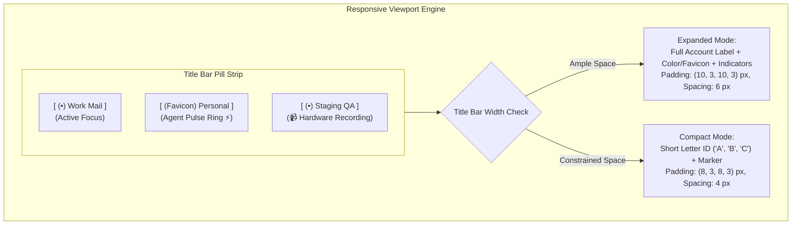
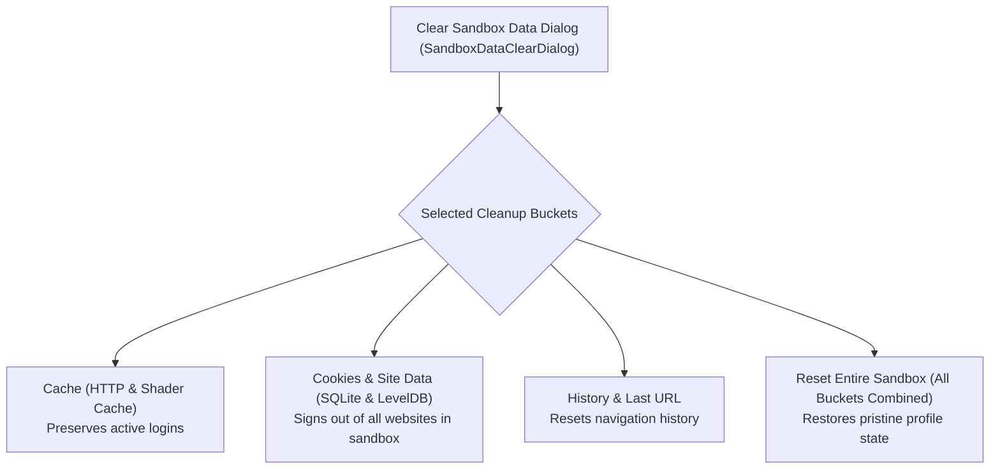
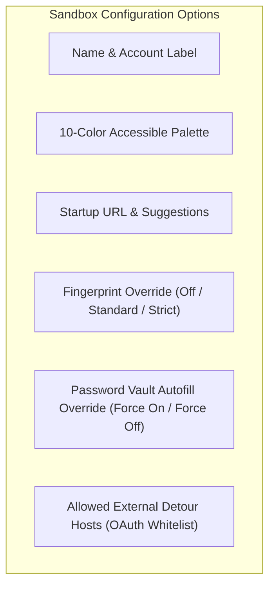

# Multi-Sandbox User Management & GUI Controls

> "Power without visibility is chaos; human operators must always know at a glance which account is active, who is recording, and where agents are working."
>
> — WinUI 3 Chrome Experience Guidelines

> [!NOTE]
> Nova AI Workspace provides an integrated WinUI 3 desktop interface designed for seamless multi-identity management. Operators can switch between sandboxes, customize visual markers, inspect hardware device indicators, configure per-sandbox security overrides, and execute scoped data clearing without affecting any other session.

---

## 1. The Sandbox Pill Bar in the Browser Chrome

Active sandboxes appear as interactive pill buttons positioned directly within Nova's top title bar and tab strip:



### Visual Structure of a Sandbox Pill

Every sandbox pill combines three visual components:

1. **Identity Marker Badge:**
   - **Color Dot:** A circular badge rendered in the sandbox's assigned hex accent color.
   - **Site Icon (Favicon):** Dynamically loads, caches, and renders the high-resolution favicon of the active domain.
   - **Agent Activity Pulse Ring:** An animated accent glow ring surrounding the marker whenever an autonomous MCP agent holds an active tab lease (`_mcpServer.IsTabClaimed`) on that sandbox.
2. **Hardware Recording Indicator:**
   - An SVG camera warning icon (`camera_16_filled_site-warning.svg`) appears automatically whenever an active tab within the sandbox accesses media capture APIs (webcam, microphone, or desktop screen sharing).
   - Tooltip: *"This sandbox is using camera, microphone, or screen sharing."*
3. **Identity Label:**
   - Displays the user-defined name (e.g., `Work Mail`) or the automatically detected identity (e.g., `john.doe@example.com`).

### Responsive Chrome (Expanded vs. Compact Mode)

When multiple sandboxes are active or narrow window geometries constrain the title bar, Nova adjusts the pill layout dynamically:

| Layout Mode | Geometry & Padding | Visual Content | Space Efficiency |
|---|---|---|---|
| **Expanded Mode** | Padding: `(10, 3, 10, 3)` px<br>Spacing: `6` px | Full custom name or detected account label (`Work Mail`) | Complete human-readable context; ideal for wide screens and 1–4 sandboxes. |
| **Compact Mode** | Padding: `(8, 3, 8, 3)` px<br>Spacing: `4` px | Short Letter ID (`A`, `B`, `S1`) + marker badge | Ultra-compact footprint. Full name remains instantly accessible via hover tooltip and accessibility automation tree. |

### The Sandbox Overview Flyout (`SandboxOverviewFlyout`)

When the total number of provisioned sandboxes exceeds available title bar space, Nova displays an overflow affordance button. Clicking opens a high-density grid flyout listing all sandboxes, their active tab counts, proxy states, and agent lease statuses for instantaneous one-click navigation.

---

## 2. Sandbox Pill Context Menu Flyout

Right-clicking any sandbox pill opens a dedicated context management flyout:

```
┌────────────────────────────────────────────────────────┐
│  Sandbox A (Work Mail)                                 │
├────────────────────────────────────────────────────────┤
│  ⚡ Release agent                                       │
│  🛡️ Proxy                                             ▶│
│     ├── Disconnect proxy for this sandbox (direct)     │
│     └── Open proxy settings...                         │
│  🎨 Mark                                              ▶│
│     ├── ( ) None                                       │
│     ├── (•) Colour                                     │
│     └── ( ) Site icon (favicon)                        │
│  ☑ Allow tabs in this sandbox                          │
│  👁️ Hide from toolbar                                  │
├────────────────────────────────────────────────────────┤
│  🧹 Clear sandbox data...                              │
└────────────────────────────────────────────────────────┘
```

### Context Actions Breakdown

- **⚡ Release Agent:**
  Appears dynamically when an autonomous MCP agent holds an active tab claim (`nova.tab_claim`). Clicking immediately revokes the lease, returning control to the human operator.
- **🛡️ Proxy Submenu:**
  Displays the effective proxy connection for the sandbox. Operators can toggle **Disconnect proxy for this sandbox** to force direct, unproxied connections specifically for that profile while leaving global proxy settings active for all other sandboxes.
- **🎨 Mark Submenu:**
  Configures the visual marker badge:
  - *None:* Clears the marker badge.
  - *Colour:* Renders a circular color chip in the sandbox's accent hue.
  - *Site icon (favicon):* Preloads and renders the current website's high-resolution favicon inside the pill badge.
- **☑ Allow Tabs in This Sandbox (Popup Routing):**
  Controls how window-open requests (`window.open` or `target="_blank"`) are routed:
  - *Enabled (Default):* New popup tabs open within the same sandbox profile, preserving session credentials and authentication cookies.
  - *Disabled:* Popup requests route to the global browser profile.
- **👁️ Hide from Toolbar (Soft-Pause):**
  Pauses the sandbox by hiding its pill from the active toolbar strip. The profile directory, cookies, and saved logins remain completely intact on disk. The sandbox can be unpaused at any time in Settings.
- **🧹 Clear Sandbox Data:**
  Opens the scoped sandbox cleanup dialog.

---

## 3. Scoped Sandbox Data Clearing (`SandboxDataClearDialog`)

Nova allows operators to purge stored data from an individual sandbox without touching any other profile:



### Granular Cleanup Buckets

In the **Clear sandbox data** dialog, operators select precisely which data categories to purge:

| Cleanup Bucket | Target Storage Subsystem | Impact on Active Session |
|---|---|---|
| **Cache** | HTTP disk cache (`Default\Cache`), memory cache, shader cache, V8 code cache (`Code Cache\js`) | Purges cached images, stylesheets, and scripts. **Preserves user logins and session cookies.** |
| **Cookies and site data** | SQLite cookie store (`Network\Cookies`), `localStorage`, `sessionStorage`, `IndexedDB`, Service Workers | **Signs the user out of all websites in this sandbox.** Cookies in all other sandboxes remain completely unaffected. |
| **History and last URL** | Visited URL history, navigation stack, remembered startup page | Resets the sandbox's default startup URL without affecting active cookies or logins. |
| **Reset entire sandbox** | All of the above combined | Restores the sandbox profile to a pristine, freshly initialized state. |

> [!IMPORTANT]
> **Zero Cross-Sandbox Bleed Invariant:**
> Purging data in Sandbox B has zero impact on Sandbox A. SQLite files, LevelDB directories, and cache folders are physically partitioned on disk.

---

## 4. Settings Panel Configuration (`SettingsView`)

Complete configuration of all sandbox identities and security policies is accessible via **Menu → Settings → AI & agents → Sandboxes**:



### Adding and Customizing Sandboxes

Operators can provision up to **100 sandboxes** (`AppSettings.MaxSandboxes = 100`). At least one sandbox must always remain active.

- **Name & Account Label:** Custom descriptive titles (e.g., `Personal Banking`, `Production AWS Console`).
- **Curated 10-Color Accessible Palette:**
  Nova provides a high-contrast, accessibility-tested color palette:
  - `#818cf8` (Indigo)
  - `#34d399` (Emerald)
  - `#f472b6` (Pink)
  - `#fbbf24` (Amber)
  - `#60a5fa` (Blue)
  - `#a78bfa` (Purple)
  - `#2dd4bf` (Teal)
  - `#fb7185` (Rose)
  - `#4ade80` (Green)
  - `#f97316` (Orange)
- **Startup URL & Auto-Suggestions:**
  Specify a default entry URL. Nova provides intelligent autocomplete suggestions based on recent bookmarks and history entries.

### Granular Per-Sandbox Policy Overrides

Each sandbox profile can override global browser security policies independently:

1. **Fingerprint Protection Override:**
   - `Inherit Global (Default)`: Inherits the system-wide protection setting (`Off`, `Standard`, `Strict`).
   - `Off`: Neutralizes Canvas and Audio noise for compatibility on sensitive portals.
   - `Standard`: Applies uniform timing and Canvas jitter.
   - `Strict`: Applies maximum entropy masking and hardware API neutralization.
2. **Password Vault Autofill Override:**
   - `Inherit Global`: Uses the main password vault preference.
   - `Force On`: Automatically fills credentials even if global autofill is cautious.
   - `Force Off`: Prohibits credential filling in this sandbox (ideal for shared demonstration or untrusted sandboxes).
3. **Allowed External Detour Hosts (OAuth / SSO Whitelist):**
   - Whitelist of permitted third-party domains that tabs in this sandbox are authorized to visit during authentication detours (e.g., `accounts.google.com`, `login.microsoftonline.com`, `appleid.apple.com`, `checkout.stripe.com`, `paypal.com`).
   - Prevents unintended cross-site navigations while facilitating legitimate Single Sign-On (SSO) and checkout workflows.

---

## 5. Keyboard Navigation & Accessibility

- **Keyboard Focus:** Tabbing through the title bar places high-contrast focus rings around sandbox pills using `NovaPalette.AccentWash`.
- **Keyboard Activation:** Pressing `Space` or `Enter` activates the focused sandbox immediately.
- **Screen Reader Support:** Every pill exposes an `AutomationProperties.Name` formatted with the sandbox ID, custom name, and detected account status, ensuring complete accessibility compliance.

---

## 6. Related Documentation

- [Profile Storage, Disk Anchors & Recovery](profile-storage-and-disk-anchors.md) — Disk architecture and boot-time reconciliation.
- [Intent Routing & Agent Interaction](intent-routing-and-agent-interaction.md) — Multi-signal scoring and MCP tool operations.
- [Site Data Management](../site-data-management/README.md) — Cookie inspections and storage quotas.
- [Multi-Sandbox Overview](README.md) — Master architectural index.

[All core features](../README.md)
