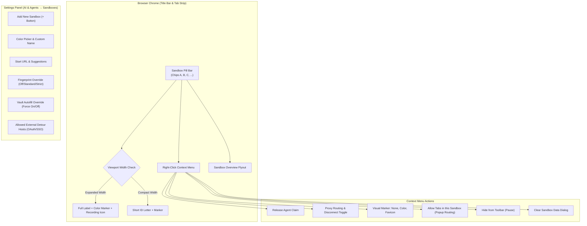
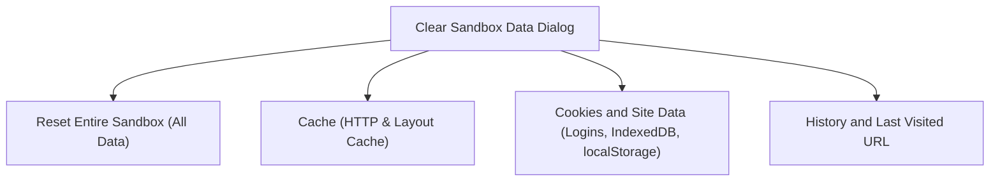

# Multi-Sandbox User Management & GUI Controls

Nova AI Workspace provides a rich WinUI 3 desktop interface for managing isolated browser sandboxes. Operators can switch between separate accounts, customize sandbox colors and icons, configure granular security policies, and clear profile data per sandbox without affecting any other session.



---

## 1. The Sandbox Pill Bar in the Browser Chrome

Active sandboxes appear as interactive pill buttons directly within Nova's top browser title bar and tab strip:

### Visual Structure of a Sandbox Pill

Each pill button integrates three visual components:

1. **Identity Marker:**
   - **Color Dot:** A circular badge displaying the sandbox's assigned hex color (e.g., `#818cf8`, `#34d399`).
   - **Site Icon (Favicon):** Renders the active site's high-resolution favicon inside the marker badge.
   - **Agent Activity Ring:** An animated pulse ring surrounding the marker when an MCP agent holds an active tab claim on that sandbox.
2. **Hardware Recording Indicator:**
   - An SVG camera indicator (`camera_16_filled_site-warning.svg`) appears automatically whenever an active tab in the sandbox accesses the webcam, microphone, or screen sharing APIs.
3. **Identity Label:**
   - Displays the user-defined name (e.g., `Work Mail`) or the automatically detected account name (e.g., `john.doe@example.com`).

### Responsive Chrome (Expanded vs. Compact Mode)

When multiple sandboxes or narrow window geometries constrain title bar width, Nova dynamically adjusts the pill layout:

| Mode | Layout & Padding | Label Content | Space Optimization |
|---|---|---|---|
| **Expanded** | Padding: `(10, 3, 10, 3)` px, Spacing: `6` px | Full name / account label (`Work Mail`) | Complete human-readable context. |
| **Compact** | Padding: `(8, 3, 8, 3)` px, Spacing: `4` px | Short letter ID (`A`, `B`, `S1`) | Minimal footprint; full name remains visible via hover tooltip and automation accessibility names. |

---

## 2. Sandbox Pill Context Menu

Right-clicking any sandbox pill in the title bar opens a dedicated management context flyout:

```
┌───────────────────────────────────────────────┐
│  Sandbox A (Work Mail)                        │
├───────────────────────────────────────────────┤
│  ⚡ Release agent                              │
│  🛡️ Proxy                                    ▶│
│     ├── Disconnect proxy for this sandbox     │
│     └── Proxy settings...                     │
│  🎨 Mark                                     ▶│
│     ├── None                                  │
│     ├── (•) Colour                            │
│     └── ( ) Site icon (favicon)               │
│  ☑ Allow tabs in this sandbox                 │
│  👁️ Hide from toolbar                         │
├───────────────────────────────────────────────┤
│  🧹 Clear sandbox data...                     │
└───────────────────────────────────────────────┘
```

### Context Actions Breakdown

- **Release Agent:** Appears when an autonomous agent holds an exclusive tab claim (`_mcpServer.IsTabClaimed(sandboxId)`). Clicking immediately revokes the claim, releasing the sandbox for human control.
- **Proxy Submenu:** Shows the effective proxy profile for the sandbox. Allows toggling proxy disconnection specifically for that sandbox (forcing direct connections) or navigating directly to proxy settings.
- **Mark Selection:** Toggles between `None`, `Colour`, or `Site icon`. When set to *Site icon*, the pill dynamically fetches and renders the site's favicon.
- **Allow Tabs in this Sandbox:** Configures popup window routing:
  - *Enabled (Default):* Links requesting `window.open` or `target="_blank"` open as secondary tabs within the same sandbox profile, preserving login sessions.
  - *Disabled:* Window-open requests route to the global browser-tab profile.
- **Hide from Toolbar:** Soft-hides (pauses) the sandbox. Its profile data, logins, and storage remain intact on disk, but the pill is removed from the active toolbar until unhidden in Settings.
- **Clear Sandbox Data:** Opens the scoped data cleanup dialog.

---

## 3. Scoped Sandbox Data Clearing

Nova allows operators to purge stored data from a specific sandbox without touching any other profile:



### Granular Cleanup Buckets

In the **Clear sandbox data** dialog (`SandboxDataClearDialog`), users select exactly which data categories to purge:

| Cleanup Bucket | Data Purged | Impact on Session |
|---|---|---|
| **Cache** | HTTP disk cache, memory cache, shader cache | Clears cached images and scripts; user remains signed in. |
| **Cookies and site data** | Session cookies, persistent cookies, `localStorage`, `sessionStorage`, `IndexedDB`, Service Workers | Signs the user out of all websites in this sandbox. |
| **History and last URL** | Visited URL history, navigation stack, remembered last URL | Resets the sandbox's default startup page without signing out. |
| **Reset entire sandbox** | All of the above combined | Restores the sandbox profile to a pristine, freshly initialized state. |

> [!IMPORTANT]
> Purging data in Sandbox B has zero impact on Sandbox A. Cookies, tokens, and active sessions in Sandbox A remain completely unaffected.

---

## 4. Settings Panel Configuration (`SettingsView`)

Full configuration of sandbox identities and security policies is available under **Menu → Settings → AI & agents → Sandboxes**:

### Adding and Editing Sandboxes

Operators can create up to **100 sandboxes** (`AppSettings.MaxSandboxes = 100`). At least one sandbox must always remain.

- **Name & Account Label:** Custom descriptive names (e.g., `Personal Shopping`, `Production AWS Console`).
- **Color Palette Selection:** Choose from Nova's curated 10-color accessible palette:
  `#818cf8` (Indigo), `#34d399` (Emerald), `#f472b6` (Pink), `#fbbf24` (Amber), `#60a5fa` (Blue), `#a78bfa` (Purple), `#2dd4bf` (Teal), `#fb7185` (Rose), `#4ade80` (Green), `#f97316` (Orange).
- **Startup URL & Auto-Suggestions:** Specify a default URL to navigate to when the sandbox opens. Nova provides autocomplete suggestions based on recent bookmarks and history.

### Granular Per-Sandbox Overrides

Each sandbox profile can override global browser security policies:

1. **Fingerprint Protection Level Override:**
   - `Inherit Global (Default)`: Follows global setting (`Off`, `Standard`, `Strict`).
   - `Off`: Disables Canvas, Audio, and WebGL noise for compatibility on sensitive portals.
   - `Standard`: Applies uniform timing and Canvas jitter.
   - `Strict`: Maximum entropy masking and hardware API neutralization.
2. **Password Vault Autofill Override:**
   - `Inherit Global`: Uses the main password vault preference.
   - `Force On`: Enables automatic password filling even if global auto-fill is cautious.
   - `Force Off`: Prohibits credential filling in this sandbox (ideal for shared demonstration sandboxes).
3. **Allowed External Detour Hosts:**
   - Whitelist of external domains that this sandbox is permitted to visit during authentication detours (e.g., `accounts.google.com`, `login.microsoftonline.com`, `appleid.apple.com`, `checkout.stripe.com`, `paypal.com`).
   - Prevents unintended cross-site navigations while allowing legitimate Single Sign-On (SSO) and payment redirects.

---

## 5. Keyboard Navigation & Accessibility

- **Keyboard Focus:** Tabbing through the title bar places high-contrast focus rings around sandbox pills using `NovaPalette.AccentWash`.
- **Keyboard Activation:** Pressing `Space` or `Enter` activates the focused sandbox.
- **Screen Reader Support:** Every pill exposes an `AutomationProperties.Name` formatted with the sandbox ID, custom name, and detected account status.
