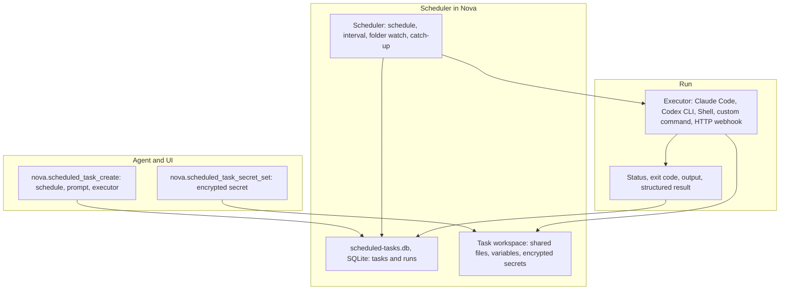

# Scheduled Tasks & Background Automation Engine

> [!NOTE]
> Scheduled Tasks let Nova AI Workspace run work in the background while it is open: on a schedule, at a fixed interval, or when files in a folder change. A run can hand a prompt to Claude Code or the Codex CLI, run a PowerShell script, a custom command or an HTTP webhook, and keeps its history, output, variables and encrypted secrets.

---

## 1. Problem Statement: Recurring Workflows & Unattended Execution

Many analytical, monitoring, and web automation tasks must occur periodically:
* Hourly price tracking and product availability checks.
* Daily status checks of websites and APIs.
* Weekly reports and regular clean-up jobs.

**Problems with naive script loops (`sleep`):**
* They block the agent conversation and waste tokens while idling.
* They do not survive a sleeping computer, a dropped network or a restart.
* Credentials end up hard-coded in scripts or in prompt logs.

Nova runs such work as scheduled tasks with a stored run history, catch-up after downtime and encrypted per-task secrets.

---

## 2. Task Runner Architecture

---

## 3. Core Features & Security Safeguards

1. **Schedules:**
   * `cronExpression` takes one of these readable patterns (not classic five-field cron): `daily HH:MM`, `weekdays HH:MM`, `weekly mon HH:MM` (any weekday), `hourly :MM`, `every Nh`, `every Nm`. Times use `timeZoneId` (IANA or Windows name); default is UTC.
   * Alternatively `intervalSeconds` (minimum 60), or `watchPath` to start a run when files in a folder change (2-second debounce).
   * A run missed while Nova was closed or the computer was asleep is caught up once at the next start, within 24 hours (`catchUpMissed`, on by default). While runs are active, Nova keeps the computer from going to standby.
2. **Executors:** `ClaudeCode` (default), `CodexCli`, `Shell` (PowerShell script; needs the setting "Allow scheduled tasks to run PowerShell scripts (Shell executor)"), `CustomCommand` and `HttpWebhook`. Claude Code and Codex runs use `autonomyMode='Safe'` by default; `Unsafe` (full access) is refused unless `scheduledTaskUnsafeModeEnabled` is set in the settings file; there is no switch for it on the Settings page. `mcpAccess` (off by default) gives the run access to Nova's tools.
3. **Run limits:** `timeoutSeconds` (default 300), `maxTurns` (default 50), optional `maxBudgetUsd` per run and `totalBudgetCapUsd` across all runs — the task disables itself when the total is exceeded. Overlapping runs are skipped by default (`concurrencyPolicy`). Repeated failures trip a per-task circuit breaker; `nova.scheduled_task_enable` resets it.
4. **Chaining:** `triggerNextTaskId` starts another task when a run completes (or always), optionally only if a key in the structured result is true. Chains are limited to a depth of 5.
5. **Task workspaces:**
   * Each task is bound to a terminal workspace — by default Nova creates a dedicated one — so its run files can be opened in the terminal dock. `nova.scheduled_task_workspace_write`, `_read` and `_list` work on the task's `shared/` folder.
6. **Encrypted secrets and persistent variables:**
   * Secrets set with `nova.scheduled_task_secret_set` are encrypted with Windows DPAPI for the current user and stored with the task workspace. They are decrypted only when a run starts: `Shell` and `CustomCommand` runs receive them as environment variables, and `{SECRET:keyname}` placeholders in the argument template of `CustomCommand` and `HttpWebhook` tasks are filled in. `nova.scheduled_task_secret_list` shows key names only.
   * Variables (`nova.scheduled_task_var_*`, up to 64 KB per value) keep state between runs.
7. **Run history:**
   * Every run records status (for example `Completed`, `Failed`, `Timeout`, `Cancelled`, `Missed`, `SkippedOverlap`), duration, exit code and cost; `nova.scheduled_task_run_output` reads the tail of its stdout and stderr. By default Nova keeps runs for 30 days and at most 100 runs per task.
8. **Templates:** `nova.scheduled_task_templates` lists ready-made tasks, such as a website status check, an SEO audit, a backup check, a weekly report, an API health check and a data clean-up.

---

## 4. MCP Tool Reference for Scheduled Tasks

All tools are in the `scheduled_tasks` bundle.

| Tool | Purpose |
| :--- | :--- |
| `nova.scheduled_task_list`, `nova.scheduled_task_get` | Lists tasks with status, next run and costs; shows one task in full. |
| `nova.scheduled_task_create`, `nova.scheduled_task_update`, `nova.scheduled_task_delete` | Creates, changes or deletes a task. |
| `nova.scheduled_task_enable`, `nova.scheduled_task_disable` | Resumes or pauses a task. |
| `nova.scheduled_task_trigger` | Starts a run immediately, outside the schedule. |
| `nova.scheduled_task_active_runs`, `nova.scheduled_task_run_cancel` | Lists running runs; cancels one. |
| `nova.scheduled_task_runs`, `nova.scheduled_task_run_output` | Run history; output of one run. |
| `nova.scheduled_task_workspace`, `nova.scheduled_task_workspace_list`, `_read`, `_write` | Workspace information and files in its `shared/` folder. |
| `nova.scheduled_task_secret_set`, `nova.scheduled_task_secret_list` | Stores an encrypted secret; lists secret names. |
| `nova.scheduled_task_var_set`, `_get`, `_list`, `_delete` | Persistent variables. |
| `nova.scheduled_task_export`, `nova.scheduled_task_import` | Exports task definitions as JSON (without secrets and history); imports them with new task IDs. |
| `nova.scheduled_task_templates` | Lists task templates. |
