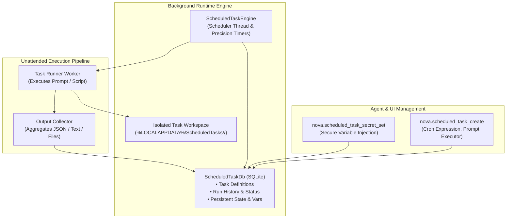

# Scheduled Tasks & Background Automation Engine

> [!NOTE]
> The Scheduled Tasks engine turns Nova AI Workspace into an autonomous background runner. Tasks execute on customizable schedules (Cron or interval), collect structured outputs, and maintain persistent state and variables — completely unattended.

---

## 1. Problem Statement: Recurring Workflows & Unattended Execution

Many analytical, monitoring, and web automation tasks must occur periodically:
* Hourly competitor price tracking and product availability checks.
* Daily status board verification and infrastructure health checks.
* Nightly summaries of unread emails, pull requests, or RSS feeds.

**Problems with naive script loops (`sleep`):**
* Blocks agent conversation contexts and wastes tokens while idling.
* Fails when the host system sleeps, networks drop, or the browser restarts.
* Insecure credential management (secrets are frequently hardcoded or leaked into prompt logs).

Nova resolves these issues with a resilient **Fire-and-Collect background scheduling system**.

---

## 2. Task Runner Architecture

---

## 3. Core Features & Security Safeguards

1. **Standard Cron & Flexible Intervals:**
   * Supports standard 5-field Cron syntax (e.g., `0 9 * * 1-5` for weekdays at 9:00 AM) or fixed periodic intervals.
2. **Isolated Task Workspaces:**
   * Each scheduled task receives a dedicated directory on disk. Tools like `nova.scheduled_task_workspace_write` and `_read` allow staging input files and inspecting generated output artifacts.
3. **Encrypted Secret & Variable Management:**
   * API tokens and passwords stored via `nova.scheduled_task_secret_set` are encrypted using Windows DPAPI and injected into the task environment only during execution.
4. **Complete Run History & Execution Logs:**
   * Every execution records timestamps, elapsed duration, exit status (`success`, `failed`, `cancelled`), and full console output in SQLite (`nova.scheduled_task_runs`).
5. **Reusable Task Templates:**
   * Built-in blueprints for frequent web scraping, periodic auditing, and automated reporting tasks (`nova.scheduled_task_templates`).

---

## 4. MCP Tool Reference for Scheduled Tasks

| Tool | Purpose |
| :--- | :--- |
| `nova.scheduled_task_list` | Lists all configured background tasks, active schedules, and next run times. |
| `nova.scheduled_task_create` | Configures a new autonomous task with Cron schedule, prompt, and execution parameters. |
| `nova.scheduled_task_trigger` | Manually triggers an immediate execution of a scheduled task outside its normal cadence. |
| `nova.scheduled_task_runs` | Inspects historical executions, duration metrics, and status codes. |
| `nova.scheduled_task_run_output` | Retrieves the raw log output and captured artifacts of a specific execution run. |
| `nova.scheduled_task_workspace_*` | Manages files within the task's isolated filesystem (`list`, `read`, `write`). |
| `nova.scheduled_task_secret_set` | Securely sets encrypted credentials required by background task scripts. |

---

## 5. Codebase Implementation

* **Task Engine & Background Loop:** `NovaBrowser/Core/ScheduledTasks/`
* **MCP Scheduled Task Handler:** `NovaBrowser/Core/Mcp/McpScheduledTaskHandler.cs`
* **Workspace Storage & Permissions:** `NovaBrowser/Core/ScheduledTasks/Workspace/`
