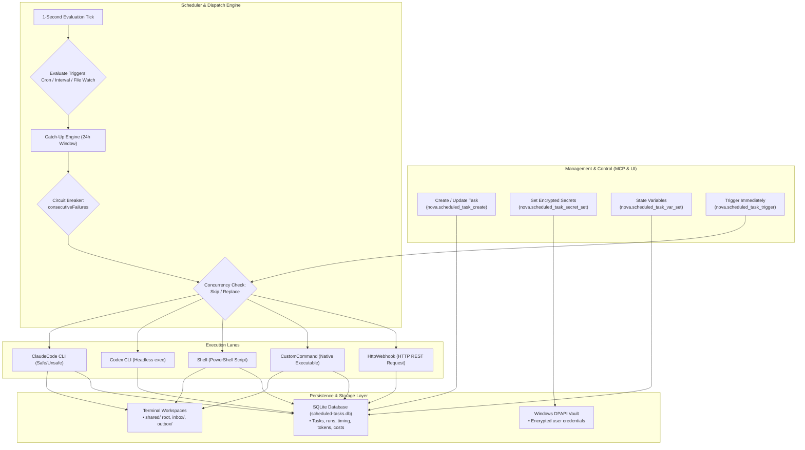

# Scheduled Tasks & Background Automation Engine

Autonomous web intelligence, recurring monitoring, and automated maintenance workflows require reliable execution beyond interactive user sessions. Running periodic tasks using naive terminal loops (`sleep`) is fragile: loops break when windows close, have no persistent run history, fail to handle system sleep states, and risk leaking plain-text credentials into scripts.

Nova AI Workspace provides an enterprise-grade background automation engine backed by SQLite (`scheduled-tasks.db`). It enables autonomous AI coding agents (Claude Code, Codex CLI), PowerShell scripts, system binaries, and HTTP webhooks to execute on human-readable cron schedules, fixed intervals, or filesystem directory changes—complete with Windows DPAPI credential encryption, terminal workspaces, and conditional multi-task pipeline chaining.

---

## 1. High-Level Engine Architecture

The Scheduled Tasks engine integrates scheduling, execution, credential vaults, and terminal workspaces into a unified control plane:



---

## 2. In-Depth Subsystems & Architecture Guides

Explore each specialized subsystem within the Scheduled Tasks suite:

| Subsystem Guide | Primary Focus | Key Architectural Scope & Enforcements |
| :--- | :--- | :--- |
| [Schedules, Triggers & Concurrency](scheduling-and-triggers/README.md) | Temporal & Event Triggers | Human-readable cron syntax (`daily HH:MM`, `weekdays`, `hourly`, `every Nh`), IANA/Windows time zone resolution, fixed intervals, filesystem directory watching with 2-second debounce, 24-hour downtime catch-up recovery, and automatic circuit breakers. |
| [Task Executors & Autonomy Modes](executors-and-autonomy/README.md) | Execution Engines & Governance | The five execution lanes (`ClaudeCode`, `CodexCli`, `Shell`, `CustomCommand`, `HttpWebhook`), `Safe` vs. `Unsafe` autonomy modes, turn limits, per-run budget caps ($1 default), cumulative lifetime budget caps, and run lifecycle state auditing. |
| [Workspaces, Secrets & Chaining](workspaces-secrets-and-chaining/README.md) | Data Plane & Orchestration | Terminal workspace integration, `shared/` directory management with 1 MiB UTF-8 byte boundary, transient mailboxes (`inbox/`, `outbox/`), DPAPI secret encryption, 64 KB persistent variables, conditional JSON pipeline chaining, and task templates. |

---

## 3. The Four Core Control Planes

Nova structures scheduled operations across four distinct architectural pillars:

```
+-----------------------------------------------------------------------------------+
| CONTROL PLANE               | RESPONSIBILITIES & OPERATIONAL MECHANISMS           |
+-----------------------------------------------------------------------------------+
| 1. Scheduling & Triggers    | Time-based schedules (cron, interval), event-driven |
|                             | folder monitoring (watchPath), and downtime recovery|
|                             | (catchUpMissed within 24 hours).                    |
+-----------------------------+-----------------------------------------------------+
| 2. Execution & Autonomy     | Headless AI agents (Claude Code, Codex), PowerShell |
|                             | scripts, native binaries, and HTTP webhooks with    |
|                             | strict Safe/Unsafe autonomy mode enforcement.       |
+-----------------------------+-----------------------------------------------------+
| 3. Workspaces & Secrets     | Local file isolation in shared/, Windows DPAPI-     |
|                             | encrypted credentials, and 64 KB state variables.   |
+-----------------------------+-----------------------------------------------------+
| 4. Governance & Pipelines   | Multi-task chaining (triggerNextTaskId), circuit    |
|                             | breakers, per-run dollar limits, and lifetime caps. |
+-----------------------------------------------------------------------------------+
```

---

## 4. MCP Scheduled Tasks Tool Matrix

All tools belong to the `scheduled_tasks` capability bundle:

| MCP Tool Name | Subsystem | Action & Operational Scope |
| :--- | :--- | :--- |
| [`nova.scheduled_task_create`](../../mcp-reference/tools/scheduled-tasks/nova-scheduled-task-create.md) | Definition | Creates a new scheduled task (schedule, prompt, executor, limits, workspace). |
| [`nova.scheduled_task_update`](../../mcp-reference/tools/scheduled-tasks/nova-scheduled-task-update.md) | Definition | Modifies properties, schedules, prompts, or limits of an existing task. |
| [`nova.scheduled_task_delete`](../../mcp-reference/tools/scheduled-tasks/nova-scheduled-task-delete.md) | Definition | Permanently deletes a task definition, its run history, and bound variables. |
| [`nova.scheduled_task_get`](../../mcp-reference/tools/scheduled-tasks/nova-scheduled-task-get.md) | Definition | Returns full task configuration, schedule state, next fire time, and usage metrics. |
| [`nova.scheduled_task_list`](../../mcp-reference/tools/scheduled-tasks/nova-scheduled-task-list.md) | Definition | Lists all configured tasks with execution status, next run times, and costs. |
| [`nova.scheduled_task_enable`](../../mcp-reference/tools/scheduled-tasks/nova-scheduled-task-enable.md) | Lifecycle | Resumes a paused task and resets any tripped circuit breaker failure counter. |
| [`nova.scheduled_task_disable`](../../mcp-reference/tools/scheduled-tasks/nova-scheduled-task-disable.md) | Lifecycle | Pauses a task, suppressing automated scheduled executions. |
| [`nova.scheduled_task_trigger`](../../mcp-reference/tools/scheduled-tasks/nova-scheduled-task-trigger.md) | Execution | Immediately dispatches a run outside of the normal schedule. |
| [`nova.scheduled_task_active_runs`](../../mcp-reference/tools/scheduled-tasks/nova-scheduled-task-active-runs.md) | Execution | Lists all currently active, in-flight task executions. |
| [`nova.scheduled_task_run_cancel`](../../mcp-reference/tools/scheduled-tasks/nova-scheduled-task-run-cancel.md) | Execution | Delivers a graceful cancellation signal to an active task execution. |
| [`nova.scheduled_task_runs`](../../mcp-reference/tools/scheduled-tasks/nova-scheduled-task-runs.md) | History | Queries historical execution runs, statuses, durations, and costs. |
| [`nova.scheduled_task_run_output`](../../mcp-reference/tools/scheduled-tasks/nova-scheduled-task-run-output.md) | History | Retrieves stdout, stderr tail, and structured JSON results for a specific run. |
| [`nova.scheduled_task_workspace`](../../mcp-reference/tools/scheduled-tasks/nova-scheduled-task-workspace.md) | Workspace | Returns disk location and status of the task's bound terminal workspace. |
| [`nova.scheduled_task_workspace_list`](../../mcp-reference/tools/scheduled-tasks/nova-scheduled-task-workspace-list.md) | Workspace | Lists files and directories in the task workspace's `shared/` directory. |
| [`nova.scheduled_task_workspace_read`](../../mcp-reference/tools/scheduled-tasks/nova-scheduled-task-workspace-read.md) | Workspace | Reads file content from the task workspace's `shared/` directory. |
| [`nova.scheduled_task_workspace_write`](../../mcp-reference/tools/scheduled-tasks/nova-scheduled-task-workspace-write.md) | Workspace | Writes content to a file in `shared/` (enforces 1 MiB UTF-8 byte boundary). |
| [`nova.scheduled_task_secret_set`](../../mcp-reference/tools/scheduled-tasks/nova-scheduled-task-secret-set.md) | Secrets | Encrypts and stores a credential via Windows DPAPI for the task. |
| [`nova.scheduled_task_secret_list`](../../mcp-reference/tools/scheduled-tasks/nova-scheduled-task-secret-list.md) | Secrets | Lists secret key names (raw values are never returned over MCP). |
| [`nova.scheduled_task_var_set`](../../mcp-reference/tools/scheduled-tasks/nova-scheduled-task-var-set.md) | Variables | Stores a persistent key-value state variable (up to 64 KB per value). |
| [`nova.scheduled_task_var_get`](../../mcp-reference/tools/scheduled-tasks/nova-scheduled-task-var-get.md) | Variables | Retrieves the full value of a persistent state variable. |
| [`nova.scheduled_task_var_list`](../../mcp-reference/tools/scheduled-tasks/nova-scheduled-task-var-list.md) | Variables | Lists all state variables for a task with value previews. |
| [`nova.scheduled_task_var_delete`](../../mcp-reference/tools/scheduled-tasks/nova-scheduled-task-var-delete.md) | Variables | Deletes a persistent state variable from the task. |
| [`nova.scheduled_task_export`](../../mcp-reference/tools/scheduled-tasks/nova-scheduled-task-export.md) | Portability | Exports task definitions as portable JSON (excluding secrets and history). |
| [`nova.scheduled_task_import`](../../mcp-reference/tools/scheduled-tasks/nova-scheduled-task-import.md) | Portability | Imports tasks from JSON, creating fresh task IDs and isolated workspaces. |
| [`nova.scheduled_task_templates`](../../mcp-reference/tools/scheduled-tasks/nova-scheduled-task-templates.md) | Portability | Lists built-in templates (health checks, SEO audits, backup verification). |

---

## 5. Decision Matrix: Selecting the Right Task Executor

| Automation Objective | Recommended Executor | Autonomy Mode | Key Configuration Parameters |
| :--- | :--- | :--- | :--- |
| **Complex web research, analysis & multi-step scraping** | `ClaudeCode` | `Safe` | `mcpAccess: true`, `maxBudgetUsd: 2.0`, `maxTurns: 30` |
| **Headless code repository generation & refactoring** | `CodexCli` | `Safe` | `workingDirectory: "C:\\Repos\\Project"` |
| **Windows administration, file cleanup & local diagnostics** | `Shell` | Not applicable | Prompt contains valid PowerShell; requires Shell setting enabled. |
| **Calling custom CLI tools, Python scripts or Go binaries** | `CustomCommand` | Not applicable | `command: "python"`, `argsTemplate: "script.py {VAR:cursor}"` |
| **Pinging status endpoints or dispatching webhook alerts** | `HttpWebhook` | Not applicable | Endpoint URL, payload JSON, `Authorization: Bearer {SECRET:token}` |

---

## 6. Safety, Power & Boundary Invariants

Nova enforces strict architectural safeguards to ensure background automation remains secure, bounded, and resource-efficient:

1. **Windows Power Assertions:**
   * While scheduled tasks are actively executing, Nova requests Windows power assertions (`SetThreadExecutionState`) to prevent the host machine from entering standby sleep mid-task. Standby is restored once all runs complete.
2. **The Shell Executor Gate:**
   * Running PowerShell scripts via `Shell` requires explicit opt-in in application settings (`AppSettings.ShellTaskExecutorEnabled`).
   * `CustomCommand` strictly blocks `powershell.exe` and `cmd.exe` to enforce this policy boundary.
3. **The Unsafe Mode Hard Gate:**
   * Executing AI agents in `Unsafe` mode (`--dangerously-skip-permissions`) is refused unless `"scheduledTaskUnsafeModeEnabled": true` is added directly to `settings.json`.
4. **Circuit Breaker Protection:**
   * If a task fails repeatedly (`consecutiveFailures >= maxConsecutiveFailures`), the scheduler trips the circuit breaker and pauses the task, preventing runaway error loops.
5. **DPAPI Credential Isolation:**
   * Secret values are stored with Windows DPAPI encryption and never appear in MCP tool outputs, server logs, or export payloads.
6. **Workspace Write Size Boundaries:**
   * Workspace write operations via `nova.scheduled_task_workspace_write` enforce a strict **1 MiB limit in UTF-8 bytes**, protecting host memory.

---

## 7. Related References

### Subsystem Architecture Guides
* [Schedules, Triggers & Concurrency](scheduling-and-triggers/README.md): Detailed cron syntax, time zones, file watching, and catch-up policies.
* [Task Executors & Autonomy Modes](executors-and-autonomy/README.md): Deep dive into all five execution lanes, budget caps, and run states.
* [Workspaces, Secrets & Chaining](workspaces-secrets-and-chaining/README.md): Workspaces, DPAPI vaults, 64 KB variables, and multi-task pipelines.

### Related Core Features & Tools
* [Terminal Workspaces](../terminal-workspaces/README.md): Managing project directories and interactive terminal docks.
* [Task Memory & Profiles (ETM)](../learning/episodic-task-memory-etm/README.md): Linking scheduled tasks to task profiles.
* [Password Vault & DPAPI Credentials](../privacy/vault-and-secrets/README.md): System-wide credential storage architecture.
* [Scheduled Task MCP Tool Reference](../../mcp-reference/tools/scheduled-tasks/README.md): JSON-RPC schemas and parameters for all 25 tools.

---

[All core features](../README.md)
