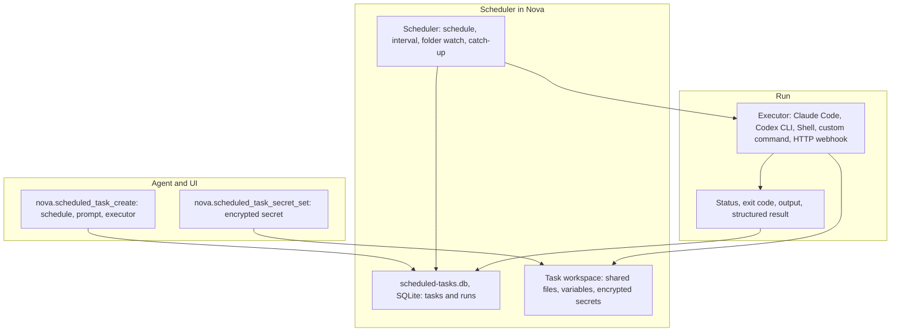

# Scheduled Tasks & Background Automation Engine

> [!NOTE]
> Scheduled Tasks let Nova AI Workspace run work in the background while it is open: on a schedule, at a fixed interval, or when files in a folder change. A run can hand a prompt to Claude Code or the Codex CLI, run a PowerShell script, a custom command or an HTTP webhook, and keeps its history, output, variables and encrypted secrets.

---

## 1. Create and Check Your First Scheduled Task

To create a first scheduled research task:

1. Open **Menu → Scheduled tasks**, then choose **New task**. If tasks are disabled, enable **Scheduled tasks (run automatically in background)** under **Settings → AI & agents → Tasks & terminal**.
2. Enter a **Name**, such as `Daily WebView2 release check`.
3. Under **Executor**, choose an installed, configured **Claude Code** or **Codex**. This starts a new CLI run; it does not reuse your current conversation.
4. In **Prompt / instruction**, describe the result you want, for example:

   > Use Nova to check Microsoft's official WebView2 release notes. Summarize the latest release, include its date and source link, and report any access problem. No login or downloads needed.

5. Enable **MCP access (Nova tools)** because this example needs Nova. Under **Fixed schedule (optional)** enter `daily 08:00`, and set **Time zone (for cron)** to your time zone, for example `Europe/Berlin`. Leaving the time zone empty uses UTC. For a repeating interval instead, set **Interval** and its unit and leave the fixed schedule empty.
6. Choose **Save**. Open the saved task and select **Run now** for a first check.
7. Inspect **Logs** and the run's status. Verify the source link and date in the output. If the run fails, read its error before waiting for the next scheduled attempt.

The executor must already be able to run on your machine. An unattended run cannot wait for you to approve every request; permission requirements can cause it to fail. Review the relevant authorization rather than granting unrestricted access just to make a test pass.

Keep Nova open for scheduled dispatch. If it was closed at the scheduled time, eligible catch-up can launch one run after it starts again. Nova's scheduler does not keep dispatching while the app is closed.

## 2. Execution Success and Task Success

| Result | What it establishes |
| :--- | :--- |
| `Completed` for Shell or CustomCommand | The launched process exited successfully. |
| `Completed` for HttpWebhook | The HTTP request received a successful response status. |
| CLI run output or structured result | What the executor or agent reported, subject to that executor's result handling. |
| Expected artifact or verified state | Evidence that the requested work actually produced its intended outcome. |

A successful run status does not by itself prove that a report is correct or a backup is restorable. Include meaningful checks in the task, and inspect their evidence. [ETM](../episodic-task-memory-etm/README.md) provides a separate task-coverage model; a scheduled run's lifecycle status is not equivalent to verified completion of every work unit.

## 3. Why Schedule Work with a Run History?

Many analytical, monitoring, and web automation tasks must occur periodically:

* Hourly price tracking and product availability checks.
* Daily status checks of websites and APIs.
* Weekly reports and regular clean-up jobs.

**Problems with naive script loops (`sleep`):**

* Manual supervision keeps an agent waiting for recurring work instead of leaving a durable schedule and run record.
* A loop alone provides no persisted catch-up policy or run history across restarts and downtime.
* Credentials end up hard-coded in scripts or in prompt logs.

Nova runs such work as scheduled tasks with a stored run history, catch-up after downtime and encrypted per-task secrets.

---

## 4. Task Runner Architecture

---

## 5. Core Features & Security Safeguards

1. **Schedules:**
   * `cronExpression` takes one of these readable patterns (not classic five-field cron): `daily HH:MM`, `weekdays HH:MM`, `weekly mon HH:MM` (any weekday), `hourly :MM`, `every Nh`, `every Nm`. Times use `timeZoneId` (IANA or Windows name); default is UTC.
   * Alternatively `intervalSeconds` (minimum 60), or `watchPath` to start a run when files in a folder change (2-second debounce).
   * A run missed while Nova was closed or the computer was asleep is caught up once at the next start, within 24 hours (`catchUpMissed`, on by default). While runs are active, Nova keeps the computer from going to standby.
2. **Executors:** `ClaudeCode` (default), `CodexCli`, `Shell` (PowerShell script; needs the setting "Allow scheduled tasks to run PowerShell scripts (Shell executor)"), `CustomCommand` and `HttpWebhook`. Claude Code and Codex runs use `autonomyMode='Safe'` by default; `Unsafe` (full access) is refused unless `scheduledTaskUnsafeModeEnabled` is set in the settings file; there is no switch for it on the Settings page. `mcpAccess` (off by default) gives the run access to Nova's tools.
3. **Run limits:** `timeoutSeconds` defaults to 300. Tasks created through MCP default to `maxTurns=50`; executor support determines which turn and per-run budget controls are applied. `totalBudgetCapUsd` uses reported run costs, so unavailable cost data cannot establish a spending cap. Overlapping runs are skipped by default (`concurrencyPolicy`). Repeated failures trip a per-task circuit breaker; `nova.scheduled_task_enable` resets it.
   * Claude Code receives `--max-turns` and `--max-budget-usd` (a $1 per-run budget when none is configured). The current Codex executor does not pass equivalent turn or dollar-budget limits. Inspect executor support rather than assuming every saved field is enforced by every runner.
4. **Chaining:** `triggerNextTaskId` requests another task after a matching run status (`Completed` by default, or `Any`). `triggerConditionKey` evaluates a truthy value when a structured result is present; the current implementation does not make missing structured output block the chain. Do not treat this condition as a safety gate. Chains are limited to a depth of 5.
5. **Task workspaces:**
   * Each task is bound to a terminal workspace — by default Nova creates a dedicated one — so its run files can be opened in the terminal dock. `nova.scheduled_task_workspace_write`, `_read` and `_list` work on the task's `shared/` folder.
6. **Encrypted secrets and persistent variables:**
   * Secrets set with `nova.scheduled_task_secret_set` are encrypted with Windows DPAPI for the current user and stored with the task workspace. They are decrypted only when a run starts: `Shell` and `CustomCommand` runs receive them as environment variables, and `{SECRET:keyname}` placeholders in the argument template of `CustomCommand` and `HttpWebhook` tasks are filled in. `nova.scheduled_task_secret_list` shows key names only.
   * Encryption protects stored values, not everything the receiving program does. Argument substitution can expose a secret in process arguments; programs can also print environment values. Prefer environment delivery where the executor and program support it.
   * Variables (`nova.scheduled_task_var_*`, up to 64 KB per value) keep state between runs.
7. **Run history:**
   * Every run records its status (for example `Completed`, `Failed`, `Timeout`, `Cancelled`, `Missed`, `SkippedOverlap`) and available timing, exit-code and cost information; `nova.scheduled_task_run_output` reads the tail of its stdout and stderr. By default Nova keeps runs for 30 days and at most 100 runs per task.
8. **Templates:** `nova.scheduled_task_templates` lists ready-made tasks, such as a website status check, an SEO audit, a backup check, a weekly report, an API health check and a data clean-up.

---

## 6. MCP Tool Reference for Scheduled Tasks

All tools are in the `scheduled_tasks` bundle.

| Tool | Purpose |
| :--- | :--- |
| `nova.scheduled_task_list`, `nova.scheduled_task_get` | Lists tasks with status, next run and costs; shows one task in full. |
| `nova.scheduled_task_create`, `nova.scheduled_task_update`, `nova.scheduled_task_delete` | Creates, changes or deletes a task. |
| `nova.scheduled_task_enable`, `nova.scheduled_task_disable` | Resumes or pauses a task. |
| `nova.scheduled_task_trigger` | Starts a run immediately, outside the schedule. |
| `nova.scheduled_task_active_runs`, `nova.scheduled_task_run_cancel` | Lists running runs; cancels one. |
| `nova.scheduled_task_runs`, `nova.scheduled_task_run_output` | Run history; output of one run. |
| `nova.scheduled_task_workspace`, `nova.scheduled_task_workspace_list`, `_read`, `_write` | Workspace information and files in its `shared/` folder. |
| `nova.scheduled_task_secret_set`, `nova.scheduled_task_secret_list` | Stores an encrypted secret; lists secret names. |
| `nova.scheduled_task_var_set`, `_get`, `_list`, `_delete` | Persistent variables. |
| `nova.scheduled_task_export`, `nova.scheduled_task_import` | Exports task definitions as JSON (without secrets and history); imports them with new task IDs. |
| `nova.scheduled_task_templates` | Lists task templates. |

## Related Documentation

* **[Terminal Workspaces](../terminal-workspaces/README.md)** — Saved projects and live console sessions.
* **[Task Memory (ETM)](../episodic-task-memory-etm/README.md)** — Task scope and evidence of coverage.
* **[Vault and Secrets](../vault-and-secrets/README.md)** — Secret scopes and delivery boundaries.

[All core features](../README.md)
