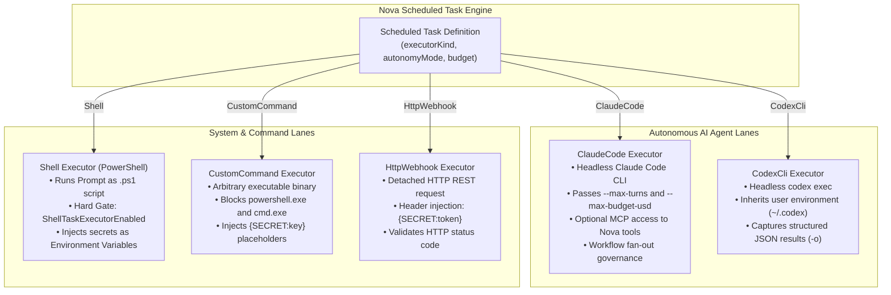
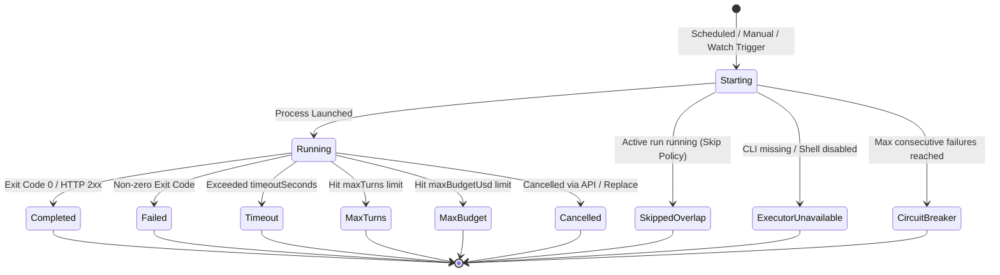

# Task Executors, Autonomy Modes & Budget Governance

Scheduled background automation requires robust, secure execution environments. Tasks cannot rely on human prompts during unattended runs; they must execute within defined privilege boundaries, adhere to strict compute and financial budget limits, and fail safely when errors occur.

Nova AI Workspace provides five specialized execution lanes—spanning autonomous AI coding agents, PowerShell scripts, custom binaries, and HTTP webhooks—governed by fine-grained autonomy policies, per-run spending caps, and cumulative lifetime budget guards.

---

## 1. The Five Execution Lanes (`executorKind`)

Nova partitions task execution across five purpose-built runner engines:



---

## 2. Detailed Executor Specifications

### 1. `ClaudeCode` (Autonomous Claude Agent)
The primary AI agent lane, executing headless runs through the installed Claude Code CLI:

* **Prompt Delivery:** Hands the task's `Prompt` directly to Claude Code.
* **Turn & Budget Flags:** Automatically passes `--max-turns` (default 50) and `--max-budget-usd` (default $1 per run when unspecified).
* **Nova MCP Access (`mcpAccess`):** When enabled, configures Claude Code to connect to Nova's local MCP server, exposing browser automation, navigation, and DOM inspection tools via `--allowedTools "mcp__nova__*"`.
* **Workflow Fan-Out Gate (`allowWorkflowFanout`):**
  * Governs whether a Safe-mode Claude Code run is allowed to invoke the Claude harness Workflow tool (for deterministic multi-agent fan-out).
  * **Crucial Security Guard:** Deliberately configurable **only via the Nova UI Settings**, never over MCP. An autonomous agent is strictly forbidden from granting its own scheduled task fan-out privileges.

### 2. `CodexCli` (Autonomous Codex Agent)
The second first-class AI agent lane, running headlessly through the user's local Codex CLI:

* **Execution Mechanism:** Invokes `codex exec` with prompt and argument templates, capturing structured JSON results via `-o`.
* **Environment & Auth:** Inherits the active user profile's Codex environment and configuration (`~/.codex`).
* **Availability Detection:** Automatically verified at startup via Nova's agent runtime detector.

### 3. `Shell` (PowerShell Script Execution)
Executes the task's `Prompt` as a native Windows PowerShell script:

* **Security Gate:** Requires the setting *"Allow scheduled tasks to run PowerShell scripts (Shell executor)"* (`AppSettings.ShellTaskExecutorEnabled`). If disabled, runs fail immediately with status `ExecutorUnavailable`.
* **Secret Delivery:** Task secrets are injected directly as process environment variables (e.g. `$env:DATABASE_URL`).

### 4. `CustomCommand` (Arbitrary Executable)
Executes an external binary specified by `command`, `argsTemplate`, and `workingDirectory`:

* **Policy Separation:** Explicitly **blocks `powershell.exe` and `cmd.exe`**. Shell scripts must use the dedicated `Shell` executor so that script execution remains strictly governed by the Shell setting.
* **Placeholder Replacement:** Automatically replaces `{SECRET:keyname}` and `{VAR:keyname}` tokens in the argument template before launch.

### 5. `HttpWebhook` (Detached Webhook Caller)
Issues an HTTP/HTTPS request outside the browser context:

* **Payload & Headers:** Sends JSON payloads with custom headers.
* **Secret Substitution:** Replaces `{SECRET:token}` tokens in header definitions (e.g. `Authorization: Bearer {SECRET:github_token}`).
* **Status Code Verification:** Evaluates HTTP response codes (`200 OK`, `201 Created`, etc.) to determine run completion.

---

## 3. Autonomy Modes: Safe vs. Unsafe

When running autonomous AI executors (`ClaudeCode` or `CodexCli`), Nova enforces one of two autonomy modes:

| Autonomy Mode | Command-Line Arguments & Enforcements | Operational Security Boundary |
| :--- | :--- | :--- |
| **`Safe` (Default)** | `--permission-mode dontAsk`<br/>`--allowedTools "mcp__nova__*"` | **Zero Unprompted OS Access:** Prevents the agent from executing destructive local file modifications or arbitrary shell commands outside its workspace. |
| **`Unsafe` (Opt-in)** | `--dangerously-skip-permissions` | **Full Unrestricted Agent Access:** Allows arbitrary file and shell access without user prompting. |

> [!WARNING]
> **The Unsafe Mode Hard Gate:**
> To protect against accidental system compromise, `autonomyMode: "Unsafe"` **is rejected by default**. It can only be activated if the user explicitly adds `"scheduledTaskUnsafeModeEnabled": true` to Nova's `settings.json` file. There is deliberately no UI toggle for this setting.

---

## 4. Spending Caps & Budget Controls

Unattended background agents can rapidly accumulate substantial API token fees if caught in infinite reasoning loops or scraping large web pages. Nova enforces a multi-tier financial governance system:

```
+-----------------------------------------------------------------------------------+
| BUDGET & GOVERNANCE BOUNDARY | ENFORCEMENT MECHANISM        | DEFAULT LIMIT       |
+-----------------------------------------------------------------------------------+
| 1. Per-Run Turn Cap          | maxTurns                     | 50 Turns            |
|                              | Enforced via CLI flags       |                     |
+------------------------------+------------------------------+---------------------+
| 2. Per-Run Budget Cap        | maxBudgetUsd                 | $1.00 USD (Claude)  |
|                              | Terminates run if exceeded   |                     |
+------------------------------+------------------------------+---------------------+
| 3. Cumulative Lifetime Cap   | totalBudgetCapUsd            | Unlimited (opt-in)  |
|                              | Auto-pauses task on breach   |                     |
+------------------------------+------------------------------+---------------------+
| 4. Wall-Clock Timeout        | timeoutSeconds               | 300 Seconds (5 min) |
|                              | Hard SIGTERM / Process kill  |                     |
+-----------------------------------------------------------------------------------+
```

### Cumulative Lifetime Cap (`totalBudgetCapUsd`)
* Nova tracks cumulative costs across all runs in SQLite: `cumulativeCostUsd`, `cumulativeInputTokens`, and `cumulativeOutputTokens`.
* When `cumulativeCostUsd >= totalBudgetCapUsd`, the scheduler automatically sets `IsEnabled: false`. Future runs are suppressed until the budget cap is manually increased or reset.

---

## 5. Run Lifecycle States

Every scheduled execution produces a detailed run entry in `scheduled-tasks.db`:



### Reading Output & Tail Logs
Agents can inspect live or historic task execution logs using [`nova.scheduled_task_run_output`](../../../mcp-reference/tools/scheduled-tasks/nova-scheduled-task-run-output.md):

```json
{
  "name": "nova_scheduled_task_run_output",
  "arguments": {
    "runId": "run-8f3a9e01",
    "tailLines": 100
  }
}
```

Returns stdout, stderr, and any captured `structured_result` JSON object.

---

## 6. Related References

* [Scheduled Tasks Master Hub](../README.md): Subsystem overview, tool matrix, and architecture diagrams.
* [Schedules, Triggers & Concurrency](../scheduling-and-triggers/README.md): Cron expressions, intervals, file watches, and catch-up policies.
* [Workspaces, Secrets & Chaining](../workspaces-secrets-and-chaining/README.md): Task workspaces, DPAPI secrets, variables, and multi-task pipelines.
* [Terminal Workspaces](../../terminal-workspaces/README.md): Interactive terminal dock integration.
* [Scheduled Task Create Tool Reference](../../../mcp-reference/tools/scheduled-tasks/nova-scheduled-task-create.md)
* [Scheduled Task Runs Tool Reference](../../../mcp-reference/tools/scheduled-tasks/nova-scheduled-task-runs.md)
* [Scheduled Task Run Output Tool Reference](../../../mcp-reference/tools/scheduled-tasks/nova-scheduled-task-run-output.md)

---

[Scheduled Tasks Overview](../README.md) · [All core features](../../README.md)
