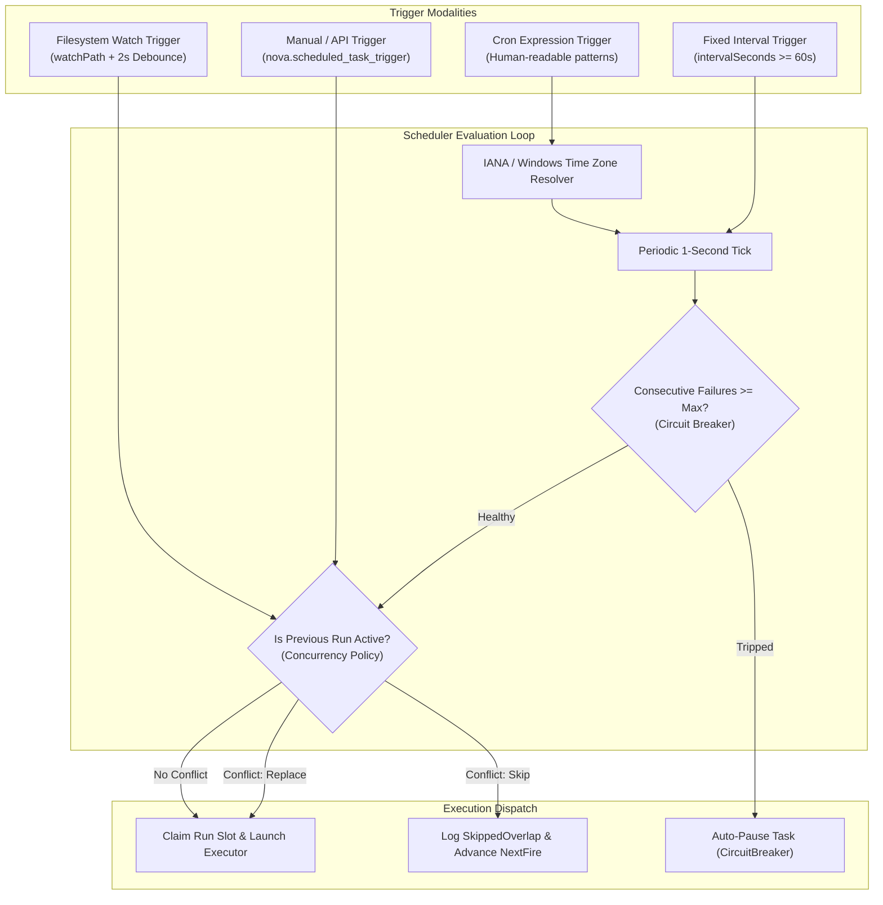
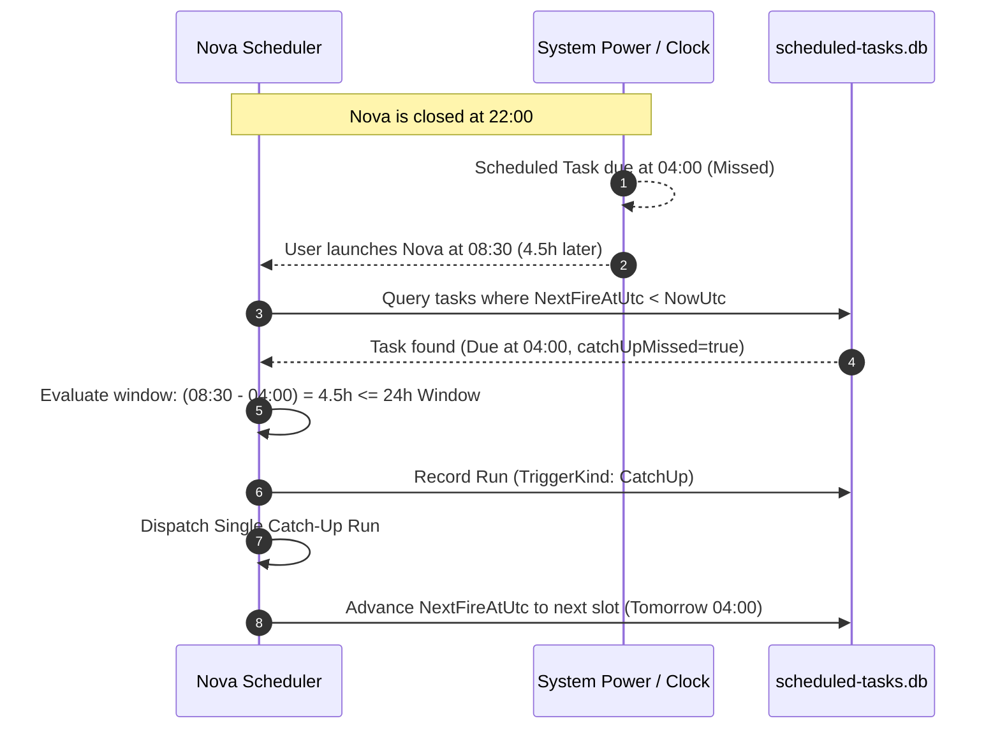

# Schedules, Triggers, Time Zones & Concurrency Governance

Recurring background automation requires precise, predictable scheduling that can accommodate real-world operating conditions: desktop restarts, system sleep states, time zone shifts, and filesystem events. Naive scheduling scripts relying on `sleep` loops fail because they lack persistence, lose state during application restarts, and provide no safeguards against overlapping executions.

Nova AI Workspace provides a persistent, event-driven scheduling engine backed by SQLite (`scheduled-tasks.db`). It supports human-readable cron syntax, fixed interval loops, real-time filesystem directory monitoring, robust downtime catch-up policies, and concurrency controls to prevent runaway processes.

---

## 1. Trigger Architecture Overview

Nova supports four distinct trigger mechanisms for scheduled tasks:



---

## 2. Human-Readable Cron Expressions

Rather than forcing developers to construct complex, error-prone 5-field UNIX cron syntax, Nova's `cronExpression` engine parses standardized human-readable expressions:

| Pattern Syntax | Description & Example | Next Run Calculation |
| :--- | :--- | :--- |
| **`daily HH:MM`** | Fires once every day at the specified 24-hour time.<br/>*Example:* `daily 08:30` | Fires next day at 08:30 local time. |
| **`weekdays HH:MM`** | Fires Monday through Friday only.<br/>*Example:* `weekdays 09:00` | Fires next business day at 09:00. Skips Saturday/Sunday. |
| **`weekly <day> HH:MM`** | Fires once weekly on the specified day of week.<br/>*Example:* `weekly mon 10:00`, `weekly fri 17:00` | Fires on the next occurrence of that weekday. |
| **`hourly :MM`** | Fires once every hour at the specified minute offset.<br/>*Example:* `hourly :15` (fires at 01:15, 02:15, 03:15...) | Advances 60 minutes past the last hour mark. |
| **`every Nh`** | Fires at fixed hour intervals.<br/>*Example:* `every 2h`, `every 6h` | Advances $N$ hours from the scheduled slot. |
| **`every Nm`** | Fires at fixed minute intervals.<br/>*Example:* `every 15m`, `every 45m` | Advances $N$ minutes from the scheduled slot. |

> [!IMPORTANT]
> **Syntax Validation Policy:**
> If a task is created or updated with an invalid cron expression, the engine marks the task as **persisted disabled** (`IsEnabled: false`) rather than misinterpreting the string or falling back to a default interval. This prevents accidental high-frequency execution.

---

## 3. Time Zone Resolution (`timeZoneId`)

Scheduled tasks frequently coordinate with external business hours across global boundaries. Nova supports explicit time zone binding:

* **Supported Formats:**
  * **IANA Time Zone Identifiers:** e.g., `Europe/Berlin`, `America/New_York`, `Asia/Tokyo`, `UTC`.
  * **Windows Time Zone Standard Names:** e.g., `W. Europe Standard Time`, `Eastern Standard Time`.
* **Default Behavior:** If `timeZoneId` is omitted or left empty, the scheduler defaults strictly to **UTC**.
* **Daylight Saving Time (DST) Handling:** The scheduler calculates offsets using the host operating system's timezone database, automatically accounting for biannual clock shifts without duplicate runs or skipped hours.

---

## 4. Interval and Event-Driven Triggers

### Fixed Interval Triggers (`intervalSeconds`)
For high-frequency polling or maintenance routines that repeat at set intervals:

* **Safety Lower Bound:** Minimum allowed interval is **60 seconds** (`intervalSeconds >= 60`).
* **Interval vs. Cron:** If both `cronExpression` and `intervalSeconds` are supplied, `cronExpression` takes precedence. To activate interval mode, set `cronExpression: null`.

### Filesystem Directory Watch (`watchPath`)
Tasks can be triggered reactively when files in a local directory are created, modified, or updated:

```json
{
  "name": "nova_scheduled_task_create",
  "arguments": {
    "displayName": "Process Inbound CSVs",
    "prompt": "Parse newly deposited CSV files in shared/inbox/ and generate summary report.",
    "watchPath": "C:\\Users\\Workspace\\Inbox",
    "intervalSeconds": 0
  }
}
```

* **The 2-Second Debounce Window:** File transfer operations (e.g. copying large datasets or unpacking archives) generate multiple sequential filesystem notifications. Nova applies an internal **2-second debounce filter** to ensure the task triggers only after file writes have completed.
* **Transient Mailboxes:** Inbound files deposited into the task workspace's `shared/inbox/` directory can trigger automated ingestion routines.

---

## 5. Downtime Recovery & Catch-Up Policy (`catchUpMissed`)

In desktop environments, computers are frequently put to sleep, rebooted, or the browser is closed during a scheduled run window. Nova prevents silent failure through its catch-up engine:



### Catch-Up Rules
1. **The 24-Hour Recovery Window:** If `catchUpMissed: true` (default), Nova checks whether the missed fire time occurred within the preceding **24 hours**. If so, it launches exactly **one catch-up run** immediately upon startup.
2. **No Avalanche Runs:** If a system was offline for five days, Nova **does not** fire five successive runs. It executes one run to reconcile state and recalculates the next future fire slot.
3. **Disabled Catch-Up:** When `catchUpMissed: false`, missed occurrences are recorded in the run database with status `Missed`, and the task waits for its next scheduled time.

---

## 6. Concurrency & Overlap Policies (`concurrencyPolicy`)

When a long-running task has not finished before its next scheduled slot arrives, Nova enforces one of three explicit overlap policies:

| Overlap Policy | Operational Behavior | Recorded Status |
| :--- | :--- | :--- |
| **`Skip` (Default)** | The active run is allowed to continue unimpeded. The new scheduled run is skipped, and the scheduler calculates the subsequent fire time. | `SkippedOverlap` |
| **`Replace`** | The engine delivers a cancellation signal to the active run, waits for process termination, and immediately starts the new scheduled run. | Previous: `Cancelled`<br/>New: `Running` |
| **`Queue`** | Reserved queue policy. In current releases, recorded as `SkippedOverlap` because the engine maintains no unbounded background queue. | `SkippedOverlap` |

---

## 7. Circuit Breakers & Failure Safeguards

To prevent broken scripts or failing APIs from consuming excessive compute resources or API budgets, Nova incorporates an automatic per-task circuit breaker:

$$\text{Circuit Breaker Condition: } \text{consecutiveFailureCount} \ge \text{maxConsecutiveFailures}$$

1. **Failure Accumulation:** Every run ending with status `Failed`, `Timeout`, or `ExecutorUnavailable` increments the task's `consecutiveFailureCount`.
2. **Automatic Tripping:** When the count reaches `maxConsecutiveFailures` (default: 3 to 5), the engine automatically trips the circuit breaker:
   * Sets `IsEnabled: false`.
   * Sets last run status to `CircuitBreaker`.
   * Halts all future automated scheduled runs.
3. **Success Reset:** Any run that successfully finishes with status `Completed` immediately resets `consecutiveFailureCount` to `0`.
4. **Programmatic Recovery:** Calling [`nova.scheduled_task_enable`](../../../mcp-reference/tools/scheduled-tasks/nova-scheduled-task-enable.md) resets `consecutiveFailureCount` to `0` and resumes the schedule.

---

## 8. Related References

* [Scheduled Tasks Master Hub](../README.md): Subsystem overview, tool matrix, and architecture diagrams.
* [Task Executors & Autonomy Modes](../executors-and-autonomy/README.md): Runner lanes (`ClaudeCode`, `CodexCli`, `Shell`, `CustomCommand`, `HttpWebhook`) and budget governance.
* [Workspaces, Secrets & Chaining](../workspaces-secrets-and-chaining/README.md): Task workspaces, DPAPI secrets, variables, and multi-task pipelines.
* [Scheduled Task Create Tool Reference](../../../mcp-reference/tools/scheduled-tasks/nova-scheduled-task-create.md)
* [Scheduled Task Trigger Tool Reference](../../../mcp-reference/tools/scheduled-tasks/nova-scheduled-task-trigger.md)
* [Scheduled Task Enable Tool Reference](../../../mcp-reference/tools/scheduled-tasks/nova-scheduled-task-enable.md)

---

[Scheduled Tasks Overview](../README.md) · [All core features](../../README.md)
