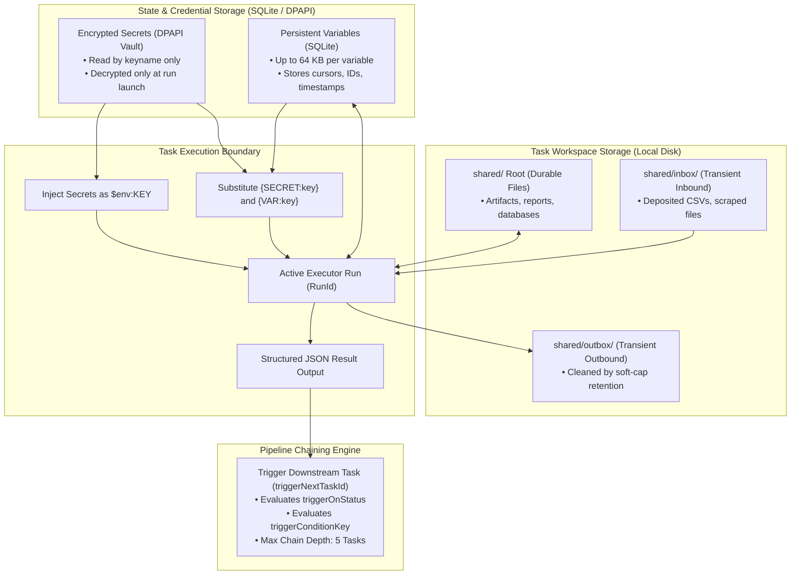
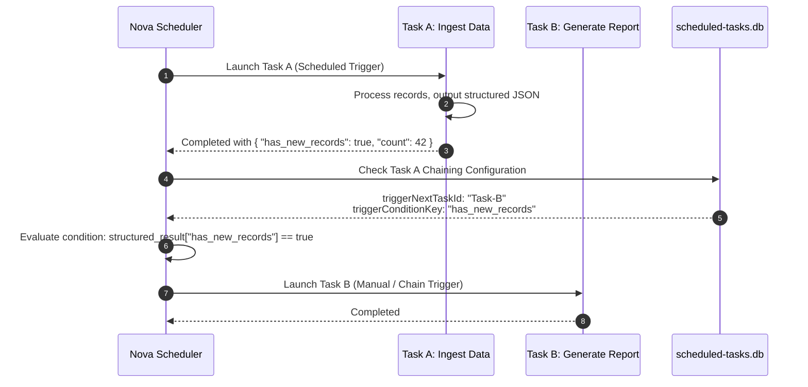

# Workspaces, Encrypted Secrets, Variables & Pipeline Chaining

Sophisticated background automation requires more than isolated command runs: tasks must store state across consecutive runs, manage input and output files safely, consume sensitive credentials without leaking them into logs, and hand off results to downstream tasks in multi-stage workflows.

Nova AI Workspace provides an integrated data plane for scheduled tasks, combining dedicated terminal workspaces, Windows DPAPI-encrypted secrets, persistent key-value variables, and conditional multi-task pipeline chaining.

---

## 1. Architectural Data Plane Overview

The following diagram illustrates how task workspaces, credentials, variables, and chaining interact during a scheduled task run:



---

## 2. Dedicated Task Workspaces

Every scheduled task is bound to a dedicated terminal workspace (`workspaceId`). This bridges background automation directly into Nova's interactive development tools:

* **Interactive Exploration:** A task's workspace can be inspected and managed in Nova's [Terminal Dock](../../terminal-workspaces/README.md).
* **The `shared/` Directory:** Durable storage for files generated or consumed by the task.

### Workspace File MCP Tools
Agents interact with workspace files programmatically without needing raw shell access:

| Tool Name | Action & Constraints |
| :--- | :--- |
| [`nova.scheduled_task_workspace`](../../../mcp-reference/tools/scheduled-tasks/nova-scheduled-task-workspace.md) | Returns workspace root metadata, disk path, and folder status. |
| [`nova.scheduled_task_workspace_list`](../../../mcp-reference/tools/scheduled-tasks/nova-scheduled-task-workspace-list.md) | Lists all files and subdirectories within the task's `shared/` folder. |
| [`nova.scheduled_task_workspace_read`](../../../mcp-reference/tools/scheduled-tasks/nova-scheduled-task-workspace-read.md) | Reads text content from a specified file within `shared/`. |
| [`nova.scheduled_task_workspace_write`](../../../mcp-reference/tools/scheduled-tasks/nova-scheduled-task-workspace-write.md) | Writes text content to a file in `shared/`. Strictly enforces a **1 MiB limit in UTF-8 bytes**. |

### Transient Mailboxes (`inbox/` and `outbox/`)
To support high-frequency file deposits without exhausting disk storage:
* `shared/inbox/` and `shared/outbox/` are treated as **transient mailboxes**.
* Nova enforces automatic soft-cap retention cleanup on transient mailbox folders, purging stale files while keeping durable files in `shared/` intact.

---

## 3. Encrypted Secrets (DPAPI Vault)

Background tasks frequently require access to sensitive credentials—such as database connection strings, GitHub personal access tokens, or API secret keys. Hard-coding secrets into task prompts or shell scripts creates severe security risks.

Nova encrypts task secrets using the **Windows Data Protection API (DPAPI)**, binding decryption keys strictly to the active Windows user account.

### Setting and Listing Secrets
```json
{
  "name": "nova_scheduled_task_secret_set",
  "arguments": {
    "taskId": "task-7b2c91a0",
    "key": "SLACK_WEBHOOK_URL",
    "value": "https://hooks.slack.com/services/T00/B00/XXXX"
  }
}
```

* **Zero-Leak Auditing:** Calling [`nova.scheduled_task_secret_list`](../../../mcp-reference/tools/scheduled-tasks/nova-scheduled-task-secret-list.md) returns only secret key names (`["SLACK_WEBHOOK_URL"]`). Secret values are **never returned over MCP**, preventing credentials from entering conversation memory transcripts or tool logs.
* **Deletion:** Secrets can be removed via `nova.scheduled_task_secret_delete`.

### Delivery Channels: Environment vs. Placeholder Injection
Nova injects secrets into task runners through two secure mechanisms:

1. **Process Environment Variables (Recommended):**
   * Supported by `Shell` and `CustomCommand` executors.
   * Decrypted at run launch and provided directly as process environment variables (e.g. `$env:SLACK_WEBHOOK_URL`).
   * **Security Advantage:** Environment variables are not visible in Windows command-line process arguments (e.g. via Task Manager or Sysinternals Process Explorer).
2. **Template Token Substitution:**
   * In `CustomCommand` argument templates or `HttpWebhook` headers, tokens matching `{SECRET:keyname}` are substituted with decrypted values immediately prior to request dispatch.
   * *Example:* `Authorization: Bearer {SECRET:API_KEY}`.

---

## 4. Persistent Key-Value Variables (`nova.scheduled_task_var_*`)

Tasks often need to remember state between runs—such as the timestamp of the last processed database record, a pagination cursor, or a deduplication list:

```json
{
  "name": "nova_scheduled_task_var_set",
  "arguments": {
    "taskId": "task-7b2c91a0",
    "key": "last_sync_timestamp",
    "value": "2026-10-10T08:00:00Z"
  }
}
```

* **Storage Capacity:** Supports up to **64 KB per variable value**.
* **Variable Tools:**
  * [`nova.scheduled_task_var_set`](../../../mcp-reference/tools/scheduled-tasks/nova-scheduled-task-var-set.md): Stores or updates a key-value pair.
  * [`nova.scheduled_task_var_get`](../../../mcp-reference/tools/scheduled-tasks/nova-scheduled-task-var-get.md): Retrieves the complete value for a specific key.
  * [`nova.scheduled_task_var_list`](../../../mcp-reference/tools/scheduled-tasks/nova-scheduled-task-var-list.md): Lists all keys with value previews.
  * [`nova.scheduled_task_var_delete`](../../../mcp-reference/tools/scheduled-tasks/nova-scheduled-task-var-delete.md): Deletes a stored variable.
* **Argument Substitution:** Tokens matching `{VAR:keyname}` in `CustomCommand` argument templates are populated from stored variables.

---

## 5. Pipeline Chaining & Workflow Orchestration

For complex, multi-stage workflows, scheduled tasks can trigger downstream tasks upon completion:



### Chaining Configuration Fields
* **`triggerNextTaskId`:** The unique ID of the downstream task to execute.
* **`triggerOnStatus`:**
  * `"Completed"` (Default): Fires only if the current run exits successfully with status `Completed`.
  * `"Any"`: Fires regardless of run outcome (e.g. for error alert or cleanup tasks).
* **`triggerConditionKey`:**
  * An optional JSON key to evaluate within the run's `structured_result`.
  * If specified (e.g. `"has_new_records"` or `"anomaly_detected"`), the chained task fires only if the structured JSON contains a truthy value for that key.
* **Chain Depth Guard:** To prevent accidental infinite recursion or circular loops, Nova enforces a hard **maximum chain depth of 5 tasks**.

---

## 6. Task Portability & Templates

### Built-in Templates (`nova.scheduled_task_templates`)
Nova includes ready-to-use blueprints for common operational workflows:
* **Website Status & Health Check:** Periodically pings URLs and audits response latency.
* **SEO & Metadata Audit:** Crawls key pages and evaluates meta tags and structured data.
* **Database Backup Verification:** Validates backup archive integrity and timestamps.
* **Weekly Summary Report:** Compiles analytical metrics and emails executive summaries.
* **Temporary Data Cleanup:** Purges old cache and export files from local folders.

### Export & Import (`nova.scheduled_task_export` / `_import`)
Tasks can be exported and transferred between developer workspaces or environments:
* **`nova.scheduled_task_export`:** Exports task definitions as portable JSON. **Crucial Security Boundary:** Secret values and historical run logs are **strictly excluded** from export payloads.
* **`nova.scheduled_task_import`:** Imports task definitions from JSON, assigning fresh, unique task IDs and initializing clean workspaces.

---

## 7. Related References

* [Scheduled Tasks Master Hub](../README.md): Subsystem overview, tool matrix, and architecture diagrams.
* [Schedules, Triggers & Concurrency](../scheduling-and-triggers/README.md): Cron expressions, intervals, file watches, and catch-up policies.
* [Task Executors & Autonomy Modes](../executors-and-autonomy/README.md): Runner lanes (`ClaudeCode`, `CodexCli`, `Shell`, `CustomCommand`, `HttpWebhook`) and budget governance.
* [Terminal Workspaces](../../terminal-workspaces/README.md): Interactive terminal dock and project workspaces.
* [Vault & DPAPI Credentials](../../privacy/vault-and-secrets/README.md): System-wide credential encryption.
* [Scheduled Task Workspace Write Reference](../../../mcp-reference/tools/scheduled-tasks/nova-scheduled-task-workspace-write.md)
* [Scheduled Task Secret Set Reference](../../../mcp-reference/tools/scheduled-tasks/nova-scheduled-task-secret-set.md)

---

[Scheduled Tasks Overview](../README.md) · [All core features](../../README.md)
