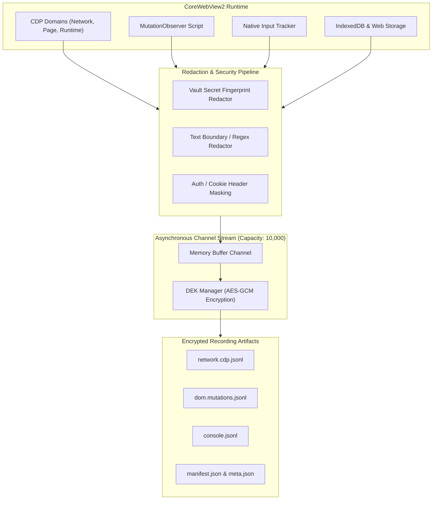

# Session Recording & Time-Travel Debugging

> [!NOTE]
> Nova AI Workspace's session recording engine (`SessionRecording`) provides forensically exact browser session recordings, capturing DOM mutations, CDP network traffic, console logs, IndexedDB states, and native user interactions — with integrated privacy redaction and time-scoped DEK encryption.

---

## 1. Problem Statement & Motivation

Browser automation workflows are often difficult to debug when things go wrong:
1. **Ephemeral Failure States:** When a multi-step workflow fails (such as an automated checkout or complex web form submission), reproducing the exact DOM state and network traffic post-mortem is nearly impossible without full recording.
2. **Data Privacy Risks:** Naive screen recording or unredacted logging risks persisting plain-text passwords, session cookies, bearer tokens, or PII into disk logs.
3. **Performance Degradation:** Continuous DOM serialization and continuous video encoding burden the main UI thread and cause timing drift in automation runs.

**Nova AI Workspace** resolves these issues with a high-throughput, asynchronous streaming pipeline (`SessionRecorder`) that decouples CDP events, DOM mutations, and input tracking, redacting sensitive secrets at ingestion time and persisting records in encrypted chunks.

---

## 2. Architecture & Data Flow

---

## 3. Under the Hood

| Component | Responsibility |
| :--- | :--- |
| **`SessionRecorder`** | Manages recording lifecycles, CDP event leases, TTL countdowns, and tab metadata projections. |
| **`RecordingArtifactWriter`** | Asynchronously flushes compressed JSONL streams with block encryption. |
| **`RecordingDekManager`** | Manages ephemeral Data Encryption Keys (DEKs), protected via Windows DPAPI. |
| **`RecordingRedactionPipeline`** | Sanitizes passwords, credit card numbers, authentication headers, and Vault secrets (`VaultFingerprintBoundaryRedactor`). |
| **`DomMutationObserverLogger`** | Injects a lightweight observer script tracking node additions, attribute changes, and text mutations. |
| **`HarWriter`** | Exports recorded network traffic into standard HAR 1.2 archives compatible with Fiddler and Chrome DevTools. |

---

## 4. Time-Travel & Replay Capabilities

The session recording engine supports post-mortem analysis and diagnostic inspection:
* **DOM Snapshots (`DomSnapshotAutoTrigger`):** Automatically captures full, sanitized DOM snapshots upon critical errors (e.g., HTTP 500, unhandled JS exceptions, or failed assertion gates).
* **Native Interaction Tracking:** Mouse clicks, keystrokes, scrolling, and form submissions are logged with microsecond-precision timestamps (`_startedTickCountMs`), enabling reproducible interaction playback.
* **Storage Snapshotting (`StorageSnapshotService`):** Captures snapshots of `localStorage`, `sessionStorage`, and IndexedDB stores at designated checkpoints.

---

## 5. MCP Tool Reference

Agents control and inspect session recordings using a dedicated MCP tool family:

* **Lifecycle Management:**
  * `nova.session_record_start`: Begins recording a target tab with configurable permission scopes and TTL budgets.
  * `nova.session_record_stop`: Finalizes recording, closes open streams, and validates data integrity.
  * `nova.session_record_status`: Inspects recording state, buffer utilization, and recorded event metrics.
  * `nova.session_record_extend`: Extends the Time-To-Live duration of an active recording session.
* **Query & Extraction:**
  * `nova.session_record_query`: Filters recorded events by timestamp, URL pattern, or event category.
  * `nova.session_record_get_entry`: Fetches and decrypts a specific event entry.
  * `nova.session_record_events`: Retrieves a chronological stream of recorded events.
  * `nova.session_record_interactions`: Extracts user and agent input interactions from the recorded session.
* **Export & Maintenance:**
  * `nova.session_record_export`: Exports sessions as standardized archives (HAR / JSONL / HTML report).
  * `nova.session_record_purge`: Safely erases expired or sensitive recording files from disk.
  * `nova.session_record_dom_snapshot`: Takes an on-demand DOM snapshot during a recorded session.

---

## 6. Security & Redaction Guarantees

1. **Zero-Leak Redaction:** Secrets stored in Nova Vault are dynamically fed into the redaction pipeline as fingerprints. If a vault password appears in a header or DOM mutation, it is replaced with `[REDACTED_VAULT_SECRET]`.
2. **Channel Backpressure:** The bounded memory channel (`ChannelCapacity = 10,000`) prevents unbounded RAM consumption during high-frequency events; deterministic quota accounting (`StreamQuotaCounter`) handles overload states.
3. **DPAPI-Protected Keys:** On-disk recording streams cannot be decrypted without the user-specific Data Encryption Key, safeguarding stored artifacts even if disk files are copied.
