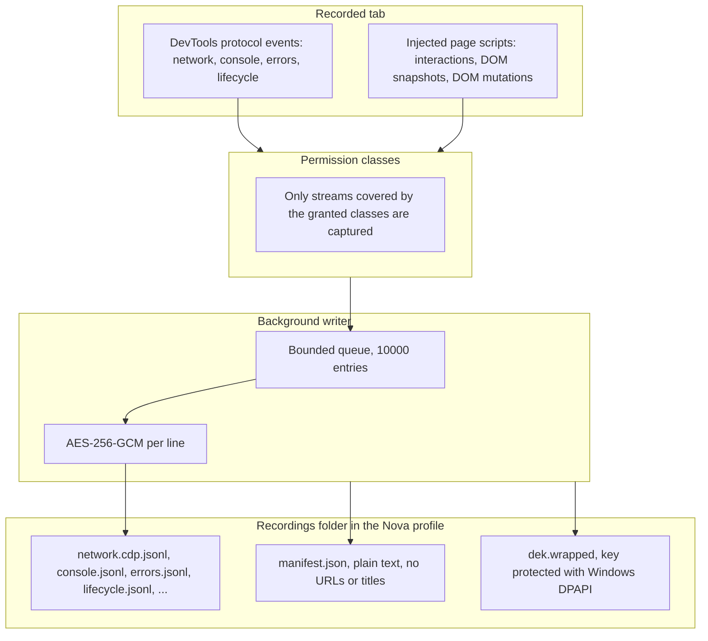

# Session Recording & Time-Travel Debugging

> [!NOTE]
> Nova AI Workspace can record what happens in a browser tab — network traffic, console output, errors, page lifecycle, interactions, DOM snapshots and, on request, further streams such as DOM mutations or WebSocket payloads. Recordings are stored locally and encrypted at rest; agents start, query and export them through the `nova.session_record_*` tools.

---

## 1. Problem Statement & Motivation

Browser automation workflows are often difficult to debug when things go wrong:
1. **Ephemeral Failure States:** When a multi-step workflow fails (such as an automated checkout or complex web form submission), reproducing the exact DOM state and network traffic post-mortem is nearly impossible without a recording.
2. **Data at Rest:** A recording contains whatever the page sent and received. Writing it to disk in plain text would leave session data readable for anything that can open the file.
3. **Performance Degradation:** Recording must not block the browser while a page produces a burst of events.

Nova records into separate JSONL streams per category, writes them through a bounded background queue and encrypts every line before it reaches the disk.

---

## 2. Architecture & Data Flow

---

## 3. What a Recording Contains

A recording is a folder in the `Recordings` subfolder of the Nova profile (`%LOCALAPPDATA%\nova-cognitive\Nova\`; installations from 1.0.0-alpha.18 and earlier keep `%LOCALAPPDATA%\NovaBrowser\`). Which stream files it contains depends on the permission classes granted when the recording was started:

| Stream | Content |
| :--- | :--- |
| `network.cdp.jsonl` | Network requests and responses (bodies only with `request_bodies` / `response_bodies`). |
| `console.jsonl`, `errors.jsonl`, `lifecycle.jsonl` | Console output, page errors, navigation and lifecycle events. |
| `interactions.jsonl` | Agent-driven interactions (`interactions_mcp`) and, with `interactions_native`, real mouse and keyboard input on the page. |
| `dom-snapshots.jsonl` | Index of DOM snapshots (`dom_snapshots`). |
| `security-violations.jsonl`, `performance.jsonl`, `workers.jsonl`, `indexeddb-ops.jsonl` | Security violations, performance entries, worker lifecycle, IndexedDB operations. |
| `websocket-payloads.jsonl`, `indexeddb-values.jsonl`, `dom-mutations.jsonl` | Opt-in streams; only present when the matching class (`websocket_payloads`, `indexeddb_values`, `dom_mutations`) was granted. A recording without them is normal. |

Without an explicit `permissionClasses` list, a recording uses `metadata`, `interactions_mcp` and `dom_snapshots` — no bodies and no storage values. The full list of classes is in [`nova.session_record_start`](../mcp-reference/tools/session-recording/nova-session-record-start.md).

**DOM snapshots** are taken automatically after a recorded click or submit, and on demand with `nova.session_record_snapshot_dom`. A snapshot holds the target element (or the whole document with `fullPage=true`) and is capped at about 256 KB.

**DOM mutations** (`dom_mutations`) are recorded from the top frame only, as rrweb-compatible events, and the stream is Brotli-compressed before encryption.

---

## 4. Lifetime and Limits

| Limit | Value |
| :--- | :--- |
| Default duration (TTL) | 5 minutes |
| Allowed TTL | 5 seconds to 60 minutes; `nova.session_record_extend` adds up to 60 minutes per call |
| Recordings running at the same time | 8 (setting "Maximum concurrent recordings") |
| Writer queue | 10,000 entries; when it is full, the oldest queued entries are dropped |
| Automatic deletion | Recordings older than 7 days are deleted when Nova starts (setting "Auto-delete after (days)", 0 = never) |

While a recording runs, Nova shows a recording indicator in the toolbar (setting "Show recording indicator in toolbar"). The master switch is "Allow session recording" in the Session recording settings card.

---

## 5. MCP Tool Reference

Agents control and inspect session recordings through the `session_recording` bundle:

* **Lifecycle Management:**
  * `nova.session_record_start`: Starts recording a tab with optional TTL and permission classes.
  * `nova.session_record_stop`: Stops a recording and finalizes its files.
  * `nova.session_record_status`: Returns state, expiry, granted permission classes and byte counts.
  * `nova.session_record_extend`: Extends the TTL of an active recording.
* **Query & Extraction:**
  * `nova.session_record_query`: Filters the network stream of a recording by URL regex, method, MIME type, status range, time range, body presence or vault match.
  * `nova.session_record_get_entry`: Returns all events for one network request ID, optionally with the body.
  * `nova.session_record_events`: Reads one stream (console, errors, lifecycle, IndexedDB and others) as decrypted events.
  * `nova.session_record_interactions`: Reads the interaction timeline, filterable by source (`mcp` or `user_dom`), type, selector and time.
  * `nova.session_record_snapshot_dom`: Takes a DOM snapshot on a running recording.
  * `nova.session_record_dom_snapshot`: Returns a stored DOM snapshot by snapshot ID.
* **Export & Maintenance:**
  * `nova.session_record_export`: Decrypts a recording into plain-text JSONL files in a `decoded` subfolder of the recording, plus `manifest.json` and a `_summary.txt`.
  * `nova.session_record_purge`: Deletes finalized recordings older than a given number of days.

---

## 6. Encryption & Redaction

1. **Encryption at rest:** Each recording gets its own random 256-bit key. Every stream line is encrypted with AES-GCM; the key itself is stored only in wrapped form, protected with Windows DPAPI for the current user. A copy of the files on another account or machine cannot be decrypted. DPAPI does not protect against other programs running as the same Windows user — the automatic deletion after 7 days limits how long data stays on disk.
2. **Plain-text manifest:** `manifest.json` stays readable without the key so recordings can be listed; it contains no URLs, host names, tab titles or counts.
3. **Redaction is off by default:** A recording stores raw debug data; the protection boundary is the permission classes you grant per recording. When capture-time redaction is switched on (`sessionRecordingRedactionEnabled` in the settings file; there is no switch on the Settings page), sensitive header values such as `Authorization` and `Cookie`, sensitive query parameters, sensitive JSON fields and values that match a secret stored in the [Vault](vault-and-secrets.md) are replaced with `[redacted:...]` markers before they are written.
4. **Revoked classes stay closed:** If a permission class is revoked after capture, its streams are no longer returned by the read tools and are skipped by the export.
