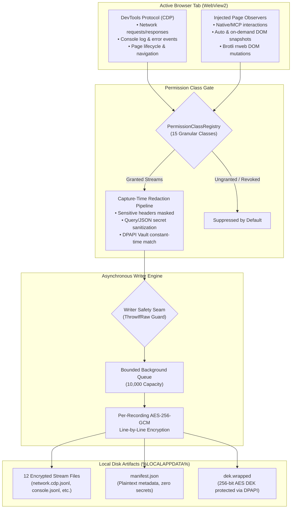

# Session Recording & Time-Travel Debugging

Session Recording provides high-fidelity, tamper-resistant, forensic capture of everything occurring within a browser tab. When automated workflows encounter unexpected regressions, transient network errors, silent UI validation failures, or authentication race conditions, standard logs are rarely sufficient. Session Recording captures network traffic, console output, page errors, document lifecycle, user/agent interactions, and DOM snapshots into encrypted event streams.

Nova combines an asynchronous, bounded capture pipeline with per-recording AES-256-GCM encryption, Windows DPAPI key protection, capture-time secret redaction, and a specialized Model Context Protocol (MCP) tool suite. Agents and developers can interrogate preserved session history post-mortem—correlating interaction clicks with network failures and DOM snapshots without re-running destructive requests.

---

## 1. Concrete Diagnostic Scenario: Why Did the Checkout Fail?

Consider an autonomous purchasing workflow where an agent executes a form submission:
1. The agent invokes `nova.click_selector` on the `#submit-order` button.
2. The page does not transition, and no success confirmation banner appears.
3. The live document displays a generic error message, but the underlying reason is unknown.

Without session recording, debugging requires re-submitting the transaction—risking duplicate orders or losing ephemeral error states. With an active recording:
* The agent queries `nova.session_record_interactions` to locate the exact interaction timestamp and selector ancestry.
* The agent inspects `nova.session_record_query` around that timestamp to evaluate outgoing HTTP POST requests, status codes, and server response headers.
* The agent reads `nova.session_record_events` for `errors.jsonl` and `console.jsonl` to inspect unhandled client-side JavaScript promise rejections.
* The agent retrieves the automatic DOM snapshot taken immediately after the click via `nova.session_record_dom_snapshot` to inspect client-side field validation classes (`is-invalid`).

Within seconds, the agent determines whether the failure was caused by a 500 server error, an unhandled client-side exception, or a missing form field—all without mutating live application state.

---

## 2. High-Level Architecture & End-to-End Data Flow

Nova's session recording pipeline is engineered for zero runtime interference with the host browser. Event collection occurs asynchronously through Chrome DevTools Protocol (CDP) hooks and lightweight page script observers:



### Pipeline Guarantees
1. **Asynchronous Non-Blocking Execution:** All file I/O and encryption operations execute on a dedicated background thread pool. Bursts of page events cannot degrade tab responsiveness or drop UI frame rates.
2. **The 10,000-Entry Bounded Queue:** The writer queue is strictly capped at 10,000 events. Under catastrophic event flooding (e.g., an infinite logging loop), the queue safely drops the oldest unwritten events while logging typed gap markers.
3. **Safety Seam Contract:** Ingested payloads are partitioned at the compiler level. Payloads carrying raw, un-redacted bytes implement raw capture contracts; the writer queue accepts only verified, post-redaction records. Enqueuing un-redacted bytes triggers an immediate runtime exception at the boundary rather than leaking secrets to disk.

---

## 3. The Four Architectural Pillars

The Session Recording system is divided into four functional domains:

```
+-----------------------------------------------------------------------------------+
|                           SESSION RECORDING CORE PILLARS                          |
+-----------------------------------------------------------------------------------+
| 1. Capture Pipeline & Architecture | CDP hooks, page observers, 10,000-entry      |
|                                    | bounded queue, memory safety, gap markers.   |
+------------------------------------+----------------------------------------------+
| 2. Streams & Permission Taxonomy   | 12 stream files, 15 permission classes       |
|                                    | (Waves R1–R4), rrweb Brotli DOM mutations,   |
|                                    | secret-bearing IndexedDB storage stream.     |
+------------------------------------+----------------------------------------------+
| 3. Encryption & Redaction Engine   | Ephemeral 256-bit AES-GCM DEK, Windows       |
|                                    | DPAPI key wrapping, capture-time redaction,  |
|                                    | Vault constant-time fingerprinting.          |
+------------------------------------+----------------------------------------------+
| 4. Querying & Time-Travel Analysis | Post-mortem investigation, regex/MIME/status |
|                                    | query filters, DOM snapshot correlation,     |
|                                    | decrypted exports & standard HAR generation. |
+-----------------------------------------------------------------------------------+
```

---

## 4. Documentation Suite Index

Explore the specialized guides within the Session Recording documentation suite:

| Guide | Focus Area | Key Architectural Concepts |
| :--- | :--- | :--- |
| [Architecture & Capture Pipeline](architecture-and-pipeline/README.md) | Ingestion & Queue Engine | CDP event capture, page observers, 10,000-entry bounded queue, writer safety contracts, `MetadataOnlyRecord`, and runtime gap markers. |
| [Streams & Permission Classes](streams-and-permission-classes/README.md) | Stream Catalog & Taxonomy | The 12 encrypted JSONL streams, 15 permission classes across Waves R1–R4, default safe classes vs secret-bearing storage, Brotli compression. |
| [Encryption & Redaction Pipeline](encryption-and-redaction/README.md) | Cryptographic Storage & Privacy | 256-bit AES-GCM DEK, Windows DPAPI envelope encryption, capture-time sanitization, Vault secret fingerprinting, crash recovery states. |
| [Querying & Time-Travel Debugging](query-and-time-travel/README.md) | Forensic Investigation | Filtering network requests, inspecting console/lifecycle timelines, interaction correlation, DOM snapshots, and standard HAR exports. |

---

## 5. Lifecycle, Time-To-Live (TTL), and Resource Limits

Session recordings are strictly bounded in time, disk footprint, and concurrency to prevent resource exhaustion:

| Limit Dimension | Constrained Value | Operational Rationale |
| :--- | :--- | :--- |
| **Default Duration (TTL)** | 5 minutes (300,000 ms) | Prevents runaway recording sessions from filling disk storage. |
| **Allowed TTL Range** | 5 seconds to 60 minutes | Flexible window for brief task verification or prolonged audits. |
| **TTL Extension** | Up to 60 minutes per call | Active sessions can be extended via `nova.session_record_extend`. |
| **Concurrent Recordings** | Max 8 simultaneous tabs | Bounded memory usage across multi-tab workspaces. |
| **Writer Queue Capacity** | 10,000 entries | Drops oldest items under sustained flood while logging gap markers. |
| **DOM Snapshot Size Cap** | ~256 KB per snapshot | Prevents multi-megabyte string transfers across the JS bridge. |
| **Automatic Purge** | 7 days retention | Completed recordings are automatically purged on Nova startup. |

---

## 6. MCP Tool Capability Matrix

Agents interact with the recording subsystem through the `session_recording` bundle:

| Tool Name | Primary Function | Typical Use Case |
| :--- | :--- | :--- |
| `nova.session_record_start` | Initiates tab recording | Pre-flight setup before executing high-risk autonomous workflows. |
| `nova.session_record_stop` | Terminates active recording | Finalizing stream files and writing the final manifest. |
| `nova.session_record_status` | Returns state and byte counts | Checking recording progress, remaining TTL, and stream sizes. |
| `nova.session_record_extend` | Extends active recording TTL | Granting additional time for long-running workflows. |
| `nova.session_record_query` | Filters network CDP streams | Locating specific API calls by URL regex, HTTP status, or MIME type. |
| `nova.session_record_get_entry` | Retrieves full request lifecycle | Deep inspection of headers, timing, and payload for a single request. |
| `nova.session_record_events` | Reads decrypted stream lines | Paged reading of console logs, errors, worker events, or IndexedDB ops. |
| `nova.session_record_interactions` | Retrieves input timeline | Auditing exact mouse, keyboard, or MCP input dispatch sequences. |
| `nova.session_record_snapshot_dom` | Captures on-demand DOM snapshot | Preserving document HTML before or after an interactive event. |
| `nova.session_record_dom_snapshot` | Reads stored snapshot by ID | Inspecting target element outerHTML and selector ancestry. |
| `nova.session_record_export` | Decrypts files & exports HAR | Generating human-readable post-mortem packages and standard HAR archives. |
| `nova.session_record_purge` | Cleans up historical recordings | Manual disk maintenance and compliance data destruction. |

---

## 7. Security, Privacy & Boundary Guarantees

1. **Envelope Encryption with Windows DPAPI:**
   * Every recording is encrypted with a unique, randomly generated 256-bit AES Data Encryption Key (DEK).
   * The DEK is encrypted at rest using the Windows Data Protection API (DPAPI) tied to the active Windows user account.
   * If recording files are copied to another machine or user account, they cannot be decrypted.
2. **Capture-Time Redaction (Pre-Disk Sanitization):**
   * Redaction occurs in process memory before records enter the background queue.
   * When redaction is enabled, sensitive HTTP headers (`Authorization`, `Cookie`, `Set-Cookie`), credential query parameters, and values matching secrets in Nova's DPAPI Vault are replaced with `[redacted:...]` markers.
3. **Decoupled Plaintext Manifest:**
   * The directory `manifest.json` is stored unencrypted so recordings can be indexed and listed.
   * To prevent metadata leakage, the manifest contains **zero URLs, hostnames, page titles, or query parameters**.
4. **Time-Travel Debugging Boundary:**
   * "Time-travel debugging" in Nova refers to inspecting preserved multi-stream historical evidence.
   * Reading a past recording **does not** revert the live website's server-side database state or rewind submitted transactions.

---

## 8. Related Architecture Guides

* [Closed-Loop System (CLS)](../closed-loop-system-cls/README.md): Outcome verification that validates whether an action achieved its business goal.
* [Tool Observation Bus (TOB)](../tool-observation-bus-tob/README.md): High-level operational telemetry recording agent tool calls and arguments.
* [Privacy & Vault Architecture](../privacy/README.md): Structure of the DPAPI credential Vault, single-use `SecretRef` tokens, and fingerprint noise.
* [Network Interception & Request Replay](../network/network-interception/README.md): Live HTTP interception and session adoption into standalone request drafts.
* [Session Recording Tool Reference](../../mcp-reference/tools/session-recording/README.md): Formal JSON-RPC schemas and parameters for all 13 recording tools.

---

[All core features](../README.md)
