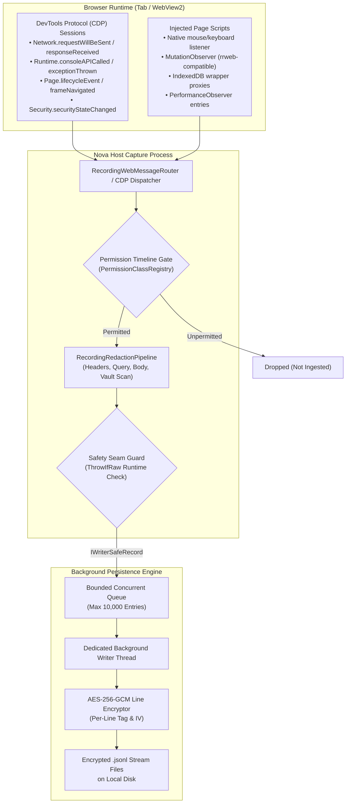
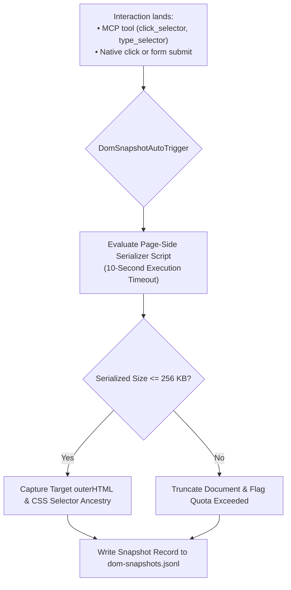

# Architecture & Capture Pipeline

Nova's Session Recording engine is built to capture dense, multi-stream web events without introducing noticeable latency, frame drops, or renderer pauses in the host browser. Capturing live network traffic, high-frequency DOM mutations, console output, and input interactions requires robust isolation between the browser's UI thread and the disk persistence layer.

This guide details the architectural pipeline: from DevTools Protocol (CDP) hooks and injected page-side observers to the 10,000-entry bounded background queue, compiler-enforced safety contracts, and in-stream lossiness gap markers.

---

## 1. End-to-End Ingestion Flow

Event capture originates from two complementary sources within the recorded tab:



### 1. DevTools Protocol (CDP) Hooks
Nova establishes an internal DevTools protocol session with the underlying WebView2 instance:
* `Network`: Captures full HTTP/HTTPS request and response metadata, headers, timing breakdowns, and payloads.
* `Runtime`: Streams console log messages (`console.log`, `warn`, `error`, `debug`, `dir`) and unhandled JavaScript promise rejections.
* `Page`: Captures document lifecycle milestones (`DOMContentLoaded`, `load`, `firstMeaningfulPaint`, navigation commits).
* `Security`: Captures certificate state transitions, Mixed Content warnings, and Content Security Policy (CSP) violations.

### 2. Injected Page Script Observers
To capture state that CDP cannot observe passively, Nova injects lightweight page scripts at document initialization:
* **Native Interactions:** Captures real user clicks, keyboard events, and mouse movements.
* **DOM Mutations:** Evaluates a `MutationObserver` instance recording document tree alterations in an rrweb-compatible format.
* **IndexedDB Proxy:** Wraps `indexedDB.open` and transaction object stores to intercept query metadata and operational keys.
* **PerformanceObserver:** Streams navigation and resource performance timing marks.

---

## 2. The 10,000-Entry Bounded Writer Queue

A common failure mode in browser recording is memory ballooning: if a web page generates thousands of console errors per second or streams massive WebSocket traffic, buffering events in RAM can crash the browser process.

Nova mitigates this risk through a strictly bounded concurrent queue:

$$\text{Queue Capacity} = 10,000 \quad \text{Entries}$$

### Operational Invariants & Overflow Handling
1. **Asynchronous Thread Decoupling:** Enqueuing an event from CDP or page observers is an $O(1)$ memory operation that never blocks the browser thread.
2. **Dedicated Background Writer:** A single worker thread dequeues events, coordinates line-level encryption, and flushes bytes to disk.
3. **Queue Saturation & Drop Semantics:**
   * If the queue reaches its 10,000-entry capacity under extreme burst load, Nova's queue safety contract activates.
   * **Oldest-Drop Policy:** The queue immediately drops the oldest pending entry to accommodate incoming real-time events.
   * **Gap Marker Injection:** When events are dropped, the recorder injects a typed gap marker (`stream_truncated` or `gap_start`) into the `lifecycle.jsonl` stream to explicitly notify post-mortem analysis tools that a data loss window occurred.

---

## 3. The Compiler & Runtime Safety Seam

To guarantee that un-redacted credentials and raw secrets never reach persistent disk storage, Nova implements a strict two-tier safety contract:

```
+-----------------------------------------------------------------------------------+
| SAFETY SEAM INTERFACES    | CONTRACT & ENFORCEMENT                                |
+-----------------------------------------------------------------------------------+
| IRawCapturePayload        | Marks incoming, pre-redaction raw data (raw WebSocket  |
|                           | frames, unparsed IndexedDB objects). Exists ONLY in    |
|                           | redactor-local memory. Cannot be enqueued.             |
+---------------------------+-------------------------------------------------------+
| IWriterSafeRecord         | Marks verified, post-redaction records. Accepted by   |
|                           | RecordingArtifactWriter.EnqueueSafe. Enforced by C#   |
|                           | compiler typing and runtime guards.                   |
+-----------------------------------------------------------------------------------+
```

### The `ThrowIfRaw` Runtime Guard
Even if an implementation error attempts to pass an un-redacted object to the writer:
* The writer executes a runtime guard: `WriterQueueSafetyContract.ThrowIfRaw(record)`.
* If the payload implements `IRawCapturePayload` or fails the writer-safe interface, the recorder throws an immediate runtime exception at the boundary rather than silently persisting sensitive data to disk.

### The `MetadataOnlyRecord` Primitive
When raw content cannot be safely captured—due to size caps, binary payloads, redaction failures, or stream quota exhaustion—Nova does not create an ambiguous gap. Instead, it emits an `IWriterSafeRecord` of type `MetadataOnlyRecord`:

```json
{
  "ts": "2026-10-10T02:40:15.892Z",
  "kind": "metadata_only",
  "reason": "websocket_payload_skipped_binary",
  "contentType": "application/octet-stream",
  "sizeBytes": 65536,
  "sha256": "4b227777d4dd1fc61c6f884f48641d02b4d121d3fd328cb08b5531fcacdabf8a"
}
```

The resulting stream records the exact event timestamp, payload size, SHA-256 fingerprint, and reason code without storing the actual bytes.

---

## 4. In-Stream Lossiness & Gap Markers

When reviewing a session recording, determining whether an absence of data represents an idle page or a dropped event is essential for diagnostic integrity. Nova persists typed gap markers into `lifecycle.jsonl`:

| Gap Marker Kind | Trigger Condition | Replay / Diagnostic Interpretation |
| :--- | :--- | :--- |
| **`gap_start`** | A high-frequency stream entered a temporary lossiness window. | Events during this window may be missing or incomplete. |
| **`gap_end`** | The lossiness window closed; normal capture resumed. | Data recorded after this marker is verified complete. |
| **`checkpoint_required`** | DOM mutation queue overflowed; delta chain is broken. | Replay engine must wait for a fresh baseline before continuing. |
| **`checkpoint_written`** | Fresh DOM baseline snapshot written to disk. | Replay engine can resume DOM reconstruction from this snapshot. |
| **`stream_truncated`** | Hard write boundary reached (shutdown deadline or queue saturation). | Stream ends permanently at this marker; subsequent events dropped. |
| **`payload_suppressed`** | An individual record's body exceeded size limits or failed quota. | Neighboring stream records are intact; only this body was replaced with metadata. |
| **`redaction_state_lost`** | Incremental text redactor lost state across a chunk boundary. | Stream is downgraded to metadata-only until redactor re-synchronizes. |
| **`permission_revoked`** | A permission class was revoked mid-recording by the user. | Stream permanently stops producing records from this timestamp. |

---

## 5. Automated DOM Snapshot Triggers

In addition to continuous event streams, Nova captures full DOM tree snapshots to preserve visual and semantic page context.



### Auto-Trigger Mechanics (`DomSnapshotAutoTrigger`)
* **Trigger Events:** DOM snapshots are captured automatically whenever an agent or user interaction lands (`click`, `submit`, or execution of tools like `nova.click_selector`).
* **Page-Side Cap (~256 KB):** The page-side serializing script caps HTML output at approximately 256 KB. This prevents multi-megabyte DOM strings from stalling the JavaScript bridge on complex web applications.
* **10-Second Execution Timeout:** If a page's rendering engine freezes or runs a heavy synchronous script, the DOM snapshot script times out after 10 seconds. The failure degrades silently without crashing the main recording pipeline.
* **On-Demand Snapshots:** Agents can trigger manual snapshots at any point using [`nova.session_record_snapshot_dom`](../../../mcp-reference/tools/session-recording/nova-session-record-snapshot-dom.md).

---

## 6. Physical Artifact Layout on Disk

Recordings are written to a dedicated folder in the Nova user profile:

```
%LOCALAPPDATA%\NovaBrowser\Recordings\<recording-id>\
```

Inside this directory, the recording is structured as follows:

```
<recording-id>/
├── manifest.json              # Plaintext manifest (zero secrets; ID, timestamps, classes)
├── dek.wrapped                # 256-bit AES DEK wrapped with Windows DPAPI (CurrentUser)
├── network.cdp.jsonl          # Encrypted CDP network requests, responses, and headers
├── console.jsonl              # Encrypted console.log/warn/error entries
├── errors.jsonl               # Encrypted unhandled JavaScript exceptions
├── lifecycle.jsonl            # Encrypted navigation events and in-stream gap markers
├── interactions.jsonl         # Encrypted agent and user click/key/input sequences
├── dom-snapshots.jsonl        # Encrypted DOM snapshot index and HTML payloads
├── security-violations.jsonl  # Encrypted CSP, mixed content, and TLS warnings
├── performance.jsonl          # Encrypted PerformanceObserver timing marks
├── workers.jsonl              # Encrypted Web Worker and Service Worker lifecycle events
├── indexeddb-ops.jsonl        # Encrypted IndexedDB transaction and query metadata
├── websocket-payloads.jsonl   # Encrypted WebSocket text frames (if granted)
├── indexeddb-values.jsonl     # Encrypted secret-bearing IDB records (if granted)
└── dom-mutations.jsonl        # Brotli-compressed, encrypted rrweb mutation stream
```

---

## 7. Related References

* [Session Recording Hub](../README.md): Primary architecture overview, lifecycle rules, and tool matrix.
* [Streams & Permission Classes](../streams-and-permission-classes/README.md): Detailed catalog of the 12 stream files and 15 permission classes.
* [Encryption & Redaction Pipeline](../encryption-and-redaction/README.md): AES-256-GCM envelope encryption, DPAPI keys, and secret sanitization.
* [Querying & Time-Travel Debugging](../query-and-time-travel/README.md): Interrogating network streams, console logs, and DOM snapshots post-mortem.
* [Start Recording Tool Reference](../../../mcp-reference/tools/session-recording/nova-session-record-start.md) · [Snapshot DOM Tool Reference](../../../mcp-reference/tools/session-recording/nova-session-record-snapshot-dom.md)

---

[Session Recording Hub](../README.md)
