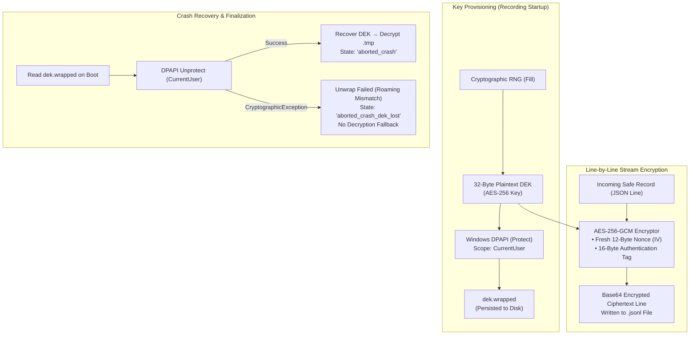

# Encryption & Redaction Pipeline

Session recordings capture high-density forensic data that may inadvertently touch sensitive corporate systems: authentication tokens, proprietary API responses, personal identifiable information (PII), and session cookies. Writing this data to disk in unencrypted plain text would create unacceptable exposure risks.

Nova implements an enterprise-grade cryptographic architecture: every recording is encrypted at rest using an ephemeral **AES-256-GCM Data Encryption Key (DEK)** wrapped via the **Windows Data Protection API (DPAPI)**. When enabled, Nova executes **capture-time secret redaction** in process memory—ensuring that passwords, bearer tokens, and secrets registered in Nova's Vault are scrubbed before reaching the disk.

---

## 1. Cryptographic Architecture at Rest

Nova uses an envelope encryption model to guarantee that recording artifacts are physically tied to the active Windows user account:



### 1. Per-Recording Ephemeral DEK
When a recording starts (`nova.session_record_start`):
* Nova generates a fresh 32-byte (256-bit) cryptographically random Data Encryption Key (DEK) using `RandomNumberGenerator.Fill`.
* The plaintext DEK is held exclusively in volatile process memory for the duration of the recording session.

### 2. Windows DPAPI Key Wrapping
* The DEK is encrypted using the Windows Data Protection API:
  $$\text{WrappedDEK} = \text{DPAPI.Protect}(\text{PlainDEK}, \text{Scope}=\text{CurrentUser})$$
* The wrapped blob is persisted to the recording directory as `dek.wrapped`.
* **Security Invariant:** DPAPI keys are derived from the Windows user's login credentials and machine-specific master keys. If the recording directory is copied to another machine or accessed by a different Windows user account, `dek.wrapped` **cannot be unwrapped**.

### 3. Line-by-Line AES-256-GCM Encryption
Every stream file (`network.cdp.jsonl`, `console.jsonl`, etc.) is encrypted on a line-by-line basis:
* Each JSON record is serialized to UTF-8 bytes.
* A fresh, cryptographically random 12-byte initialization vector (IV) is generated for each line.
* The line is encrypted using AES-256-GCM, producing the ciphertext and a 16-byte authentication tag.
* Lines are formatted as structured records containing the IV, ciphertext, and tag.
* Line-level encryption guarantees that files can be incrementally streamed, queried, and verified without requiring the entire multi-megabyte log to be loaded into memory.

---

## 2. Decoupled Plaintext Manifest (`manifest.json`)

To enable agents and UI tools to discover, query, and list recordings without decrypting every directory on disk, Nova generates a top-level `manifest.json`.

### Privacy Invariants of the Manifest
To prevent metadata leaks, `manifest.json` is strictly sanitized:
* **Included Fields:** Recording ID, status (`recording`, `completed`, `aborted_crash`), start timestamp, expiry timestamp, active duration, total byte counts, and granted permission classes.
* **Excluded Fields:** The manifest **never contains URLs, hostnames, query parameters, document titles, or navigation history**.

```json
{
  "recordingId": "rec_20261010_024015_a1b2",
  "status": "completed",
  "startedAt": "2026-10-10T02:40:15.120Z",
  "completedAt": "2026-10-10T02:45:15.890Z",
  "ttlMs": 300000,
  "grantedClasses": [
    "metadata",
    "interactions_mcp",
    "dom_snapshots"
  ],
  "totalSizeBytes": 1048576,
  "streamCounts": {
    "network.cdp.jsonl": 45,
    "console.jsonl": 12,
    "dom-snapshots.jsonl": 4
  }
}
```

---

## 3. Capture-Time Redaction Pipeline

Nova features an advanced, multi-tier redaction pipeline (`RecordingRedactionPipeline`) that operates in memory at capture time before records enter the background writer queue:

```
+-----------------------------------------------------------------------------------+
| REDACTION TIER             | OPERATIONAL MECHANISM                                |
+-----------------------------------------------------------------------------------+
| 1. Sensitive HTTP Headers  | Authorization, Cookie, Set-Cookie, Proxy-Authorization|
|                            | replaced with [redacted:headers_sensitive].          |
+----------------------------+------------------------------------------------------+
| 2. Sensitive Query Params  | Regex sweep for token, api_key, password, secret, auth|
|                            | replaced with [redacted:query_param].                |
+----------------------------+------------------------------------------------------+
| 3. Sensitive JSON Fields   | Streaming JSON tokenizer sweeps object keys; replaces|
|                            | values for password, client_secret, private_key.     |
+----------------------------+------------------------------------------------------+
| 4. Vault Fingerprinting    | Constant-time byte matching against all credentials  |
|                            | in Nova's DPAPI Vault; replaced with [redacted:vault].|
+-----------------------------------------------------------------------------------+
```

### Master Switch Configuration
Capture-time redaction is controlled by the configuration setting:

$$\text{AppSettings}.\text{SessionRecordingRedactionEnabled} \quad (\text{Default: } \text{false})$$

* When disabled, values under granted classes (such as `request_bodies` or `headers_sensitive`) are persisted verbatim under AES-256-GCM encryption.
* When enabled, the full sanitization sweep executes across all headers, URLs, and text bodies prior to serialization.

### Constant-Time Vault Fingerprint Matching
Nova integrates with its DPAPI-encrypted credential store ([Privacy & Vault](../../privacy/vault-and-secrets/README.md)):
1. The redactor loads cryptographic fingerprints of all active secrets stored in `vault.dat`.
2. During body and header parsing, text is scanned for exact and encoded variations of these secrets (UTF-8 plain, Base64, URL-encoded).
3. Candidate matches are verified using constant-time comparison (`CryptographicOperations.FixedTimeEquals`) to eliminate timing-attack side channels.
4. Any match is replaced with `[redacted:vault_match]`.

---

## 4. Crash Recovery & Finalization States

When Nova launches, the `CrashRecoveryScanner` inspects the `Recordings` directory for recordings that were interrupted by a system crash, power loss, or forced shutdown:

1. **Unwrapping the DEK:** The recovery scanner attempts to unwrap `dek.wrapped` using the current Windows user DPAPI context.
2. **State: `aborted_crash`:**
   * If the DEK is successfully unwrapped, the scanner decrypts any trailing `.tmp` chunks, validates stream line markers, and updates `manifest.json` with status `aborted_crash`.
   * These recordings remain fully queryable and exportable by agents.
3. **State: `aborted_crash_dek_lost`:**
   * If DPAPI unwrapping fails (e.g., the user profile was migrated across domains or machines without DPAPI master keys), Nova marks the recording `aborted_crash_dek_lost`.
   * **Absolute Invariant:** Nova makes **zero fallback decryption attempts** and discards in-memory recovery attempts, guaranteeing cryptographic failure closure.

---

## 5. Retention Policies & Automated Purging

To ensure recording artifacts do not accumulate indefinitely:
* **Automatic Purge on Boot:** On every application startup, Nova evaluates the age of finalized recordings against the configured retention setting (default: **7 days**). Recordings exceeding this age are permanently deleted from disk.
* **Manual Purge via MCP:** Agents can invoke [`nova.session_record_purge`](../../../mcp-reference/tools/session-recording/nova-session-record-purge.md) with `olderThanDays` to reclaim disk storage programmatically:

```json
{
  "olderThanDays": 3
}
```

---

## 6. Related References

* [Session Recording Hub](../README.md): Primary overview, lifecycle constraints, and tool matrix.
* [Architecture & Capture Pipeline](../architecture-and-pipeline/README.md): Ingestion pipeline, bounded queue, and gap markers.
* [Streams & Permission Classes](../streams-and-permission-classes/README.md): Catalog of stream files, permission classes, and Brotli compression.
* [Querying & Time-Travel Debugging](../query-and-time-travel/README.md): Forensic investigation recipes and decrypted HAR exports.
* [Vault & Secrets Architecture](../../privacy/vault-and-secrets/README.md): DPAPI credential storage and SecretRef single-use tokens.
* [Purge Tool Reference](../../../mcp-reference/tools/session-recording/nova-session-record-purge.md)

---

[Session Recording Hub](../README.md)
