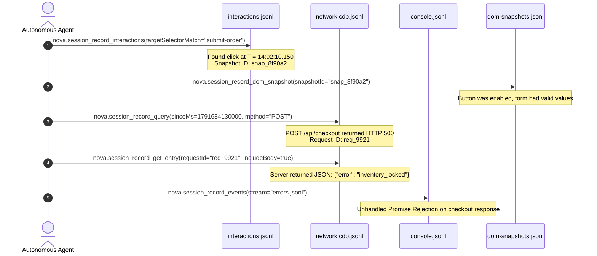

# Querying & Time-Travel Debugging

Time-travel debugging in Nova provides agents and developers with the ability to interrogate preserved session history post-mortem. When an automated workflow breaks, attempting to reproduce the failure on a live web application often alters database records, expires one-time tokens, or encounters different network conditions.

Session Recording transforms debugging into an asynchronous forensic investigation: agents correlate exact input timestamps with network failures, console stack traces, and DOM snapshots without re-executing transactions.

---

## 1. The Multi-Stream Correlation Principle

The fundamental strength of Nova's recording engine is chronological multi-stream correlation. Events across all 12 streams share a unified, high-precision millisecond timestamp (`ts`):



By correlating events across this timeline, the agent definitively determines why the interaction failed without making assumptions.

---

## 2. Playbook 1: Network Investigation with `nova.session_record_query`

The `network.cdp.jsonl` stream contains thousands of HTTP subrequests (images, fonts, telemetry beacons). Sifting through this volume manually causes context saturation.

`nova.session_record_query` provides high-precision filtering:

```json
{
  "recordingId": "rec_20261010_024015_a1b2",
  "urlMatch": "/api/v1/orders",
  "method": "POST",
  "statusGte": 400,
  "statusLte": 599,
  "hasBody": true,
  "limit": 10
}
```

### Supported Filter Capabilities
* `urlMatch`: Case-insensitive regular expression applied to request URLs.
* `method`: Filter by HTTP verb (`GET`, `POST`, `PUT`, `DELETE`, etc.).
* `statusGte` / `statusLte`: Filter by response code ranges (e.g. `400` to `599` for errors).
* `mimeType`: Filter by response content type (e.g. `application/json` or `text/html`).
* `sinceMs` / `untilMs`: Narrow analysis to a time window (Unix milliseconds; an ISO 8601 string is also accepted).
* `hasBody`: Isolate requests that captured payload bodies.
* `vaultMatched`: Filter for requests where redaction detected Vault credentials.

### Deep Payload Inspection via `nova.session_record_get_entry`
Once an interesting `requestId` is identified from query results, call `nova.session_record_get_entry` to inspect its full lifecycle:

```json
{
  "recordingId": "rec_20261010_024015_a1b2",
  "requestId": "req_9921_checkout",
  "includeBody": true
}
```

Returns the request headers, response headers, DNS/connect timing detail (if granted), status code, and decompressed body payload.

---

## 3. Playbook 2: Console & Runtime Errors via `nova.session_record_events`

When a web page fails silently without firing a network request, client-side JavaScript execution is often broken:

1. **Query JavaScript Exceptions:**
   Read `errors.jsonl` to locate uncaught runtime exceptions:
   ```json
   {
     "recordingId": "rec_20261010_024015_a1b2",
     "stream": "errors.jsonl",
     "limit": 20
   }
   ```
   * *Returns:* Exception messages, stack traces, line numbers, and script URLs.
2. **Inspect Console Logs:**
   Read `console.jsonl` to inspect application logging statements around the failure:
   ```json
   {
     "recordingId": "rec_20261010_024015_a1b2",
     "stream": "console.jsonl",
     "limit": 50
   }
   ```
3. **Inspect Security Violations:**
   Read `security-violations.jsonl` to verify whether Content Security Policy (CSP) headers or CORS restrictions blocked third-party script loading.

---

## 4. Playbook 3: Auditing Input Sequences via `nova.session_record_interactions`

To determine whether an interaction was dispatched correctly or if a miscalculated click coordinate hit the wrong element:

```json
{
  "recordingId": "rec_20261010_024015_a1b2",
  "source": "mcp",
  "type": "click",
  "limit": 20
}
```

### Returned Record Attributes
* `source`: Differentiates between agent tool dispatches (`"mcp"`) and native user inputs (`"user_dom"`).
* `type`: Interaction type (`click`, `input`, `keydown`, `submit`).
* `selector`: CSS selector of the targeted DOM element.
* `x`, `y`: Viewport coordinate offsets where the interaction occurred.
* `snapshotId`: Identifier linking to the automatic DOM snapshot captured immediately following the interaction.

---

## 5. Playbook 4: DOM State Verification via `nova.session_record_dom_snapshot`

To inspect the structural state of an element at the moment an interaction took place:

```json
{
  "recordingId": "rec_20261010_024015_a1b2",
  "snapshotId": "snap_8f90a2"
}
```

### Analysis Checklist
* **Attribute Verification:** Was the button marked `disabled` or `aria-disabled="true"`?
* **Validation Classes:** Did form input fields receive `is-invalid` or `error` classes?
* **Ancestor Hierarchy:** Did an invisible overlay modal intercept the click? (Inspect the returned CSS selector ancestor chain).

---

## 6. Playbook 5: Generating Full Decrypted Exports & Standard HAR Files

When an incident investigation must be shared with external engineering teams or loaded into third-party analysis tools:

```json
{
  "recordingId": "rec_20261010_024015_a1b2"
}
```

*(Invoking `nova.session_record_export`).*

### Export Package Contents
`nova.session_record_export` creates a `decoded/` subfolder inside the recording directory containing:
1. **Plain-Text JSONL Streams:** Decrypted copies of all granted stream files (`network.cdp.jsonl`, `console.jsonl`, etc.).
2. **Standard HTTP Archive (`recording.har`):** A fully compliant, standard `.har` file generated via Nova's `HarWriter`. This file can be imported directly into Chrome DevTools Network panel, Postman, Charles Proxy, or Wireshark.
3. **Summary Text (`_summary.txt`):** High-level summary of request counts, error totals, recording duration, and granted permission classes.

> [!WARNING]
> Exported files in the `decoded/` subfolder are **unencrypted plain text**. While capture-time redaction markers are preserved, access controls shift to standard Windows file permissions.

---

## 7. Related References

* [Session Recording Hub](../README.md): Primary overview, lifecycle constraints, and tool matrix.
* [Architecture & Capture Pipeline](../architecture-and-pipeline/README.md): Ingestion pipeline, bounded queue, and gap markers.
* [Streams & Permission Classes](../streams-and-permission-classes/README.md): Catalog of stream files, permission classes, and Brotli compression.
* [Encryption & Redaction Pipeline](../encryption-and-redaction/README.md): AES-256-GCM envelope encryption, DPAPI keys, and secret sanitization.
* [Query Tool Reference](../../../mcp-reference/tools/session-recording/nova-session-record-query.md) · [Export Tool Reference](../../../mcp-reference/tools/session-recording/nova-session-record-export.md)

---

[Session Recording Hub](../README.md)
