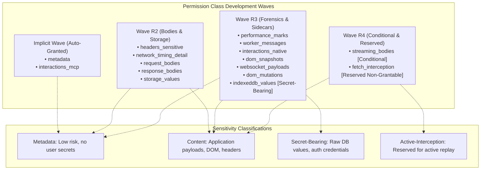

# Streams & Permission Classes

Nova's Session Recording engine enforces fine-grained data segregation by partitioning captured telemetry into **12 distinct stream files**. Recording depth is governed by a formal taxonomy of **15 permission classes**, allowing agents and security policies to balance forensic detail against privacy boundaries.

This guide details the complete stream catalog, permission class taxonomy across development Waves R1–R4, default safety configurations, Brotli compression mechanics, and mid-stream revocation rules.

---

## 1. The Twelve Encrypted Stream Files

When a recording is active, Nova writes incoming events into categorized JSONL (JSON Lines) streams. Each file is encrypted independently using AES-256-GCM. Depending on the granted permission classes, a recording produces a subset of the following streams:

| Stream Filename | Primary Content | Sensitivity | Triggering Permission Class |
| :--- | :--- | :--- | :--- |
| **`network.cdp.jsonl`** | HTTP/HTTPS request and response metadata, URLs, methods, status codes, and headers. | Metadata / Content | `metadata` (bodies require `request_bodies` / `response_bodies`) |
| **`console.jsonl`** | JavaScript console log messages (`console.log`, `warn`, `error`, `info`, `dir`). | Metadata | `metadata` |
| **`errors.jsonl`** | Unhandled runtime exceptions, rejected promises, script load failures. | Metadata | `metadata` |
| **`lifecycle.jsonl`** | Document navigation events (`DOMContentLoaded`, `load`) and in-stream gap markers. | Metadata | `metadata` |
| **`interactions.jsonl`** | Timeline of agent inputs (`interactions_mcp`) and native user keyboard/mouse events. | Metadata / Content | `interactions_mcp`, `interactions_native` |
| **`dom-snapshots.jsonl`** | Indexed DOM snapshots capturing outerHTML and CSS selector ancestry. | Content | `dom_snapshots` |
| **`security-violations.jsonl`** | Content Security Policy (CSP) violations, Mixed Content blocks, TLS alerts. | Metadata | `metadata` |
| **`performance.jsonl`** | PerformanceObserver navigation metrics and user timing marks. | Metadata | `performance_marks` |
| **`workers.jsonl`** | Web Worker and Service Worker lifecycle, registration, and communication events. | Content | `worker_messages` |
| **`indexeddb-ops.jsonl`** | Transaction metadata, object store queries, operation types, and hashed keys. | Metadata | `metadata` |
| **`websocket-payloads.jsonl`** | Inbound and outbound WebSocket text frames. | Content | `websocket_payloads` |
| **`indexeddb-values.jsonl`** | Unmasked database record payloads (strictly quota-capped). | Secret-Bearing | `indexeddb_values` |
| **`dom-mutations.jsonl`** | Continuous, rrweb-compatible DOM tree mutation deltas (Brotli-compressed). | Content | `dom_mutations` |

> [!NOTE]
> Streams like `websocket-payloads.jsonl`, `indexeddb-values.jsonl`, and `dom-mutations.jsonl` are **V2 opt-in sidecars**. If a recording was initiated without granting their matching classes, these files are not created. When queried, Nova returns a capability response stating the stream was not captured—never a misleading empty success.

---

## 2. Permission Class Taxonomy

Nova organizes permission classes across four development waves and four strict sensitivity categories:

### Complete Class Registry Matrix

| Permission Class | Development Wave | Sensitivity Tier | Grantable | Description & Operational Impact |
| :--- | :---: | :--- | :---: | :--- |
| **`metadata`** | Implicit | Metadata | Yes | Core CDP network metadata, console logs, errors, lifecycle, and IndexedDB op metadata. Always granted. |
| **`interactions_mcp`** | Implicit | Metadata | Yes | Logs agent-driven interactions dispatched via MCP tools (`nova.click_selector`, etc.). Always granted. |
| **`headers_sensitive`** | R2 | Content | Yes | Allows capturing sensitive headers (`Authorization`, `Cookie`). Subject to redaction rules. |
| **`network_timing_detail`** | R2 | Metadata | Yes | High-precision DNS, SSL handshake, connect, TTFB, and response timing breakdowns. |
| **`request_bodies`** | R2 | Content | Yes | Captures HTTP POST/PUT/PATCH request payloads. Gzip/text payloads are decompressed. |
| **`response_bodies`** | R2 | Content | Yes | Captures server HTTP response bodies. Filtered against binary MIME types and size caps. |
| **`storage_values`** | R2 | Content | Yes | Captures initial snapshots and mutations of `localStorage` and `sessionStorage`. |
| **`performance_marks`** | R3 | Metadata | Yes | Captures PerformanceObserver resource metrics and custom user timing marks. |
| **`worker_messages`** | R3 | Content | Yes | Captures messages posted between window contexts and Web Workers / Service Workers. |
| **`interactions_native`** | R3 | Content | Yes | Injects listeners to capture real mouse clicks, keyboard presses, and scrolling from the user. |
| **`dom_snapshots`** | R3 | Content | Yes | Enables automated and on-demand DOM tree snapshots (~256 KB cap per snapshot). |
| **`websocket_payloads`** | R3 | Content | Yes | Captures text frames transmitted over WebSocket connections. Binary frames emit metadata only. |
| **`indexeddb_values`** | R3 | **Secret-Bearing** | Yes | **The only secret-bearing class in V2.** Captures deserialized IndexedDB record payloads. Subject to strict quotas. |
| **`dom_mutations`** | R3 | Content | Yes | Enables rrweb-compatible continuous DOM mutation logging. Brotli-compressed host-side. |
| **`streaming_bodies`** | R4 | Content | Yes (Conditional) | Captures chunked HTTP streaming responses. Gated by feature toggle (default off). |
| **`fetch_interception`** | R4 | Active-Interception | **No** | **Reserved non-grantable.** Reserved for future active replay modes. Requests return an explicit refusal. |

---

## 3. The Default Safe Configuration

When an agent invokes `nova.session_record_start` without providing the optional `permissionClasses` array, Nova applies the **Default Safe Set**:

$$\text{Default Granted Classes} = [\text{"metadata"}, \text{"interactions\_mcp"}, \text{"dom\_snapshots"}]$$

### Security Guarantees of the Default Set
* **Zero Body Capture:** Request and response bodies are **completely omitted**.
* **Zero Storage Values:** Web Storage and IndexedDB values are not captured.
* **Zero Native Input Interception:** User keystrokes are not monitored; only agent tool actions are logged.
* **Safe Context Verification:** Grants sufficient visibility into HTTP status codes, console errors, and DOM snapshots to troubleshoot workflows without exposing user authentication secrets.

---

## 4. Special Stream Mechanics

### 1. `dom-mutations.jsonl`: rrweb & Brotli Compression
DOM mutations can generate tens of thousands of fine-grained tree alterations per minute. To preserve disk space and I/O bandwidth:
* Nova evaluates a lightweight `MutationObserver` on the top-level document window.
* Mutations are structured in an industry-standard, rrweb-compatible event format.
* **Brotli Pre-Compression:** Mutation chunks are compressed using Brotli (`System.IO.Compression.BrotliStream`) host-side **before** AES-256-GCM line encryption.
* Reading this stream via [`nova.session_record_events`](../../../mcp-reference/tools/session-recording/nova-session-record-events.md) transparently decrypts and decompresses the payload for client consumption.

### 2. `indexeddb-values.jsonl`: Quotas & The Secret-Bearing Boundary
Because IndexedDB databases frequently store offline authorization tokens, private keys, or encrypted caches:
* `indexeddb_values` is categorized as **`secret-bearing-content`**.
* The Nova user interface requires explicit user confirmation before this class can be enabled.
* **Strict In-Recording Quotas:** To prevent database dumps from consuming storage, this stream enforces a tighter per-recording byte quota. If an object store transaction exceeds the quota, Nova emits a `MetadataOnlyRecord` with reason code `indexeddb_value_quota_exceeded`.

### 3. `fetch_interception`: The Reserved Non-Grantable Invariant
If an agent attempts to pass `fetch_interception` in `permissionClasses`:
* Nova rejects the grant immediately.
* Returns JSON-RPC error `-32002` with error code `permission_request_denied_reserved_active_mode` and property `reservedFor: "v3_active_replay_mode"`.
* Session recording is strictly a **passive observation** mechanism; active request interception belongs to [Network Interception](../../network/network-interception/README.md).

---

## 5. Mid-Recording Permission Revocation

Nova allows users and policies to revoke active permission classes while a recording is in progress:

1. When a class is revoked (e.g. revoking `response_bodies` via Nova's settings):
2. Nova injects a `GapMarkerKind.PermissionRevoked` entry into `lifecycle.jsonl` noting the class and timestamp.
3. The recording pipeline immediately unhooks the associated CDP or page observers.
4. **Persistent Sealing:** All subsequent events in that stream are dropped. The recording's `manifest.json` is updated to reflect the revoked status.
5. In downstream read tools (`nova.session_record_events` or `nova.session_record_export`), revoked streams are withheld from output, guaranteeing that permission retraction is honored post-capture.

---

## 6. Related References

* [Session Recording Hub](../README.md): Primary overview, lifecycle constraints, and tool matrix.
* [Architecture & Capture Pipeline](../architecture-and-pipeline/README.md): Ingestion pipeline, bounded queue, and gap markers.
* [Encryption & Redaction Pipeline](../encryption-and-redaction/README.md): Cryptographic storage, DPAPI envelope keys, and sanitization rules.
* [Querying & Time-Travel Debugging](../query-and-time-travel/README.md): Step-by-step query recipes for network, console, and DOM streams.
* [Record Events Tool Reference](../../../mcp-reference/tools/session-recording/nova-session-record-events.md)

---

[Session Recording Hub](../README.md)
