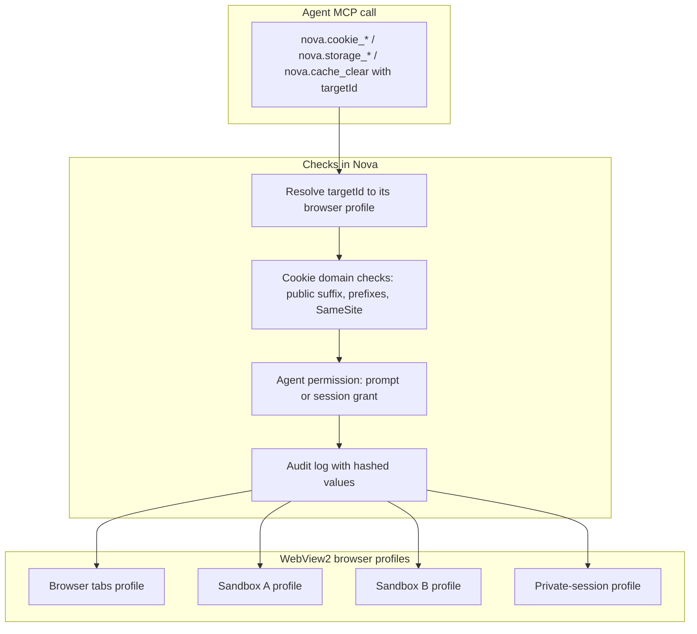

# Site Data & Privacy Management (Cookies, Storage, Cache)

> [!NOTE]
> Nova AI Workspace gives agents and users direct control over cookies (including HttpOnly cookies), `localStorage`, `sessionStorage` and browsing data — per browser profile, with cookie domain checks, a permission prompt for agent access and an audit log that records hashes instead of values.

---

## 1. A Concrete Example: Repair One Session Without Clearing Another

A website in your work sandbox keeps returning to an expired login. Before changing anything, an agent lists cookie metadata for that target and inspects the current page's storage keys. It can then remove a specific cookie or clear a domain's cookies in the selected profile, while your personal sandbox keeps its own session.

The target selects the profile; it does not make every operation page-local. Clearing a whole profile affects other tabs using that profile too. Choosing `diskCache` clears cached files; choosing `cookies`, `allDomStorage` or `allProfile` can also remove session or application data.

## 2. Why Browser-Level Access Matters

In-page JavaScript access (`document.cookie`) has limits:

* **No access to HttpOnly cookies:** Session and authentication cookies are usually flagged `HttpOnly` and are invisible to in-page JavaScript.
* **Limited view:** A page's cookie view is not an inventory of the whole browser profile. Profile-level inspection and clearing need an explicit target and scope.
* **Cookie write constraints:** A requested domain, cookie prefix, `Secure` flag and `SameSite` value must satisfy the applicable rules before a write is attempted.

Nova uses the WebView2 cookie manager of the target's browser profile instead.

---

## 3. Understand the Scope Before Changing Data

| Operation | Scope |
| :--- | :--- |
| Cookie list, write or delete | The browser profile behind `targetId`, narrowed by the requested cookie filters or identity. |
| `cookie_clear` with a domain | Cookies for that domain and its subdomains in the selected profile. |
| `cookie_clear` without a domain | All cookies in the selected profile. |
| `storage_inspect`, `storage_set`, `storage_delete` | The current target document's origin and selected local or session storage. |
| `cache_clear` | The requested browsing-data categories across the selected profile. |

Ordinary browser tabs share their normal profile. Sandbox targets and tabs belonging to a sandbox use that sandbox's profile; private-session tabs use their private profile. A tab ID alone therefore does not tell you whether a clear operation affects one tab or several.

### Architecture

Nova resolves the actual profile from the target before applying profile-level operations or permission grants. Page-storage tools then execute against the target's current document.

---

## 4. Access Controls and Validation

1. **HttpOnly, Secure and SameSite cookies:**
   * Cookies are read and written through the browser's cookie manager, without scripts in the page. `nova.cookie_list` returns metadata only by default; values need `includeValues=true` together with a `domainFilter` and count as a high-impact secret read.
2. **Deterministic cookie IDs:**
   * Each cookie gets a `cookieId` derived from profile, name, domain and path, so identically named cookies on different subdomains or paths stay distinguishable.
3. **Cookie domain checks:**
   * `nova.cookie_set` only accepts the page's own host or a parent domain, blocks a built-in list of common public suffixes (such as `com`, `de`, `io`, `co.uk`; not the complete Public Suffix List), and enforces the `__Secure-` / `__Host-` prefix rules and `Secure` for `SameSite=None`. `dryRun=true` validates without writing.
4. **Agent permission prompt:**
   * Agent access to cookies and storage is controlled by the setting "Agent cookie/storage access": "Always ask" (default), "Ask once per session" or "Always allow". The prompt "Website data access" offers "Allow once" and "Allow for session"; active grants can be revoked under "Active agent permissions".
5. **High-impact clears:**
   * `nova.cookie_clear` without `domain` clears all cookies of the profile; with `domain` only that domain and its subdomains. Both `nova.cookie_clear` and `nova.cache_clear` require `_meta.intent` and go through the permission prompt.
   * For `cache_clear`, even the accepted `localStorage` category maps to WebView2's `AllDomStorage`: it clears local storage, session storage and IndexedDB together. Use a page-storage key deletion when that is the intended scope.
6. **Audit log without values:** Changes are logged with a short SHA-256 hash of the value, not the value itself.
7. **Cookie inspector:**
   * With "Show cookie inspector in URL bar" (Settings → Tools, Cookie inspector card), an icon in the address bar opens a panel to view, edit and delete the site's cookies and local storage.

---

## 5. MCP Tooling for Site Data Management

All tools are in the `site_data_management` bundle and require a `targetId` (tab or sandbox).

| Tool | Purpose |
| :--- | :--- |
| `nova.cookie_list` | Lists cookies, filtered by URI, name or domain, paginated (up to 500 per call). |
| `nova.cookie_set` | Creates or replaces a cookie with expiry, `HttpOnly`, `Secure` and `SameSite`. |
| `nova.cookie_delete` | Deletes one cookie by `cookieId` or by name, domain and path. |
| `nova.cookie_clear` | Clears cookies for one domain or for the whole profile. |
| `nova.storage_inspect` | Reads `localStorage` or `sessionStorage` keys, optionally with values. |
| `nova.storage_set` | Sets a web storage value. |
| `nova.storage_delete` | Removes a web storage key. |
| `nova.cache_clear` | Clears browsing data of the profile by type, for example `diskCache`, `cacheStorage`, `serviceWorkers`, `cookies`, `allDomStorage` (local and session storage and IndexedDB together), `history`, `allSite` or `allProfile`. |

---

## Related Documentation

* **[Multi-Sandbox Session Isolation](sandbox-isolation.md)** — Separate browser profiles per sandbox.
* **[Proxy Routing & Network](proxy-and-network.md)** — Shared browser routing and tab-scoped request interception.
