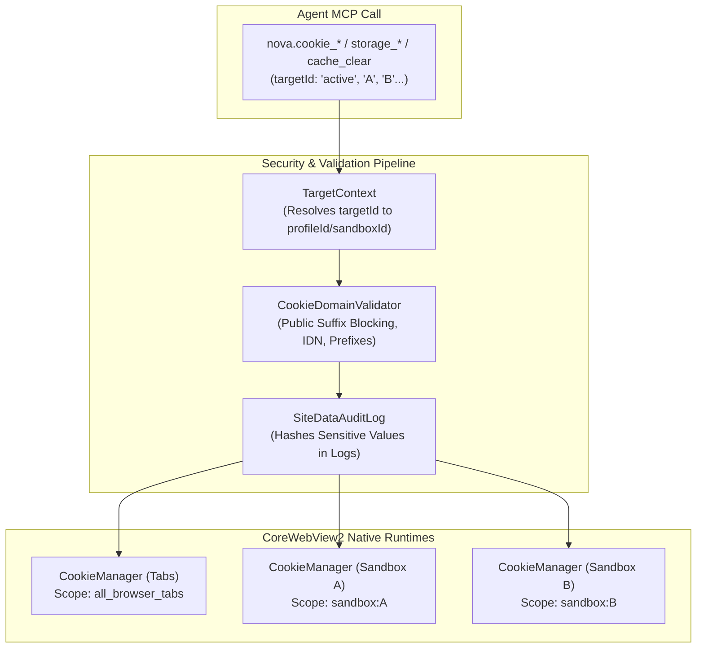

# Site Data & Privacy Management (Cookies, Storage, Cache)

> [!NOTE]
> The Site Data Management subsystem provides AI agents and operators with precise, programmatic control over cookies (including HttpOnly), LocalStorage, SessionStorage, and browser caches—secured by Public Suffix validation and audit logging.

---

## 1. Problem Statement: Why `document.cookie` Fails in Automation

Conventional browser automation tools rely on in-page JavaScript access (`document.cookie`):
* **Zero Access to HttpOnly Cookies:** Critical session and authentication cookies are flagged as `HttpOnly` by modern web services, rendering them invisible to in-page JavaScript.
* **Missing Isolation Boundaries:** Erroneous cookie clearing commands can inadvertently destroy cookies across all open tabs or sandboxes.
* **Security Hazards from Unvalidated Domain Attributes:** Writing cookies across top-level domains (e.g. `.com` or `.co.uk`) creates cookie-tossing vulnerabilities and security breaches.

Nova resolves this via native **WebView2 CookieManager integration**.

---

## 2. Architecture & Isolation Model

---

## 3. Core Features & Security Guarantees

1. **Full Access to HttpOnly, Secure, and SameSite Cookies:**
   * Agents inspect and audit authenticated sessions without executing invasive scripts in the page context.
2. **Deterministic Cookie Identification:**
   * Every cookie is assigned an unambiguous `cookieId` calculated from `{profileId, name, domain, path}`, preventing collisions between identically named cookies across subdomains.
3. **Public Suffix Blocking:**
   * The built-in validator prevents setting cookies across public suffix boundaries (e.g. `github.io`, `co.uk`, `com`), thwarting cross-tenant attacks.
4. **Guards Against Accidental Global Purges:**
   * `nova.cookie_clear` requires a specific `domain` parameter by default. Clearing all cookies profile-wide is classified as a *high-impact action* requiring explicit operator confirmation.
5. **Visual Cookie Inspector:**
   * In addition to MCP endpoints, Nova features an integrated WinUI interface for live inspection and editing of cookies and storage.

---

## 4. MCP Tooling for Site Data Management

| Tool | Purpose |
| :--- | :--- |
| `nova.cookie_list` | Lists cookies with filters for domain, name, or path (paginated). |
| `nova.cookie_set` | Creates or updates a cookie with explicit flags (Secure, HttpOnly, SameSite). |
| `nova.cookie_delete` | Deletes a single cookie by `cookieId` or name/domain/path tuple. |
| `nova.cookie_clear` | Purges cookies selectively for a domain or profile-wide. |
| `nova.storage_inspect` | Reads `localStorage` and `sessionStorage` for the target origin. |
| `nova.storage_set` | Sets values directly in web storage for a domain. |
| `nova.storage_delete` | Removes web storage keys. |
| `nova.cache_clear` | Selectively purges HTTP cache, DOM storage, or IndexedDB data. |

---

## 5. Production Code References

* **Site Data Service & Abstraction:** `NovaBrowser/Core/SiteData/SiteDataService.cs`
* **Domain & Prefix Validation:** `NovaBrowser/Core/SiteData/CookieDomainValidator.cs`
* **MCP Site Data Handler:** `NovaBrowser/Core/Mcp/McpSiteDataHandler.cs`
* **Audit Logging:** `NovaBrowser/Core/SiteData/SiteDataAuditLog.cs`

---

## Related Documentation

* **[Multi-Sandbox Session Isolation](sandbox-isolation.md)** — Partitioned user data profiles and storage.
* **[Proxy Routing & Stealth Network](proxy-and-network.md)** — SOCKS5/HTTP routing and WebRTC leak protection.
