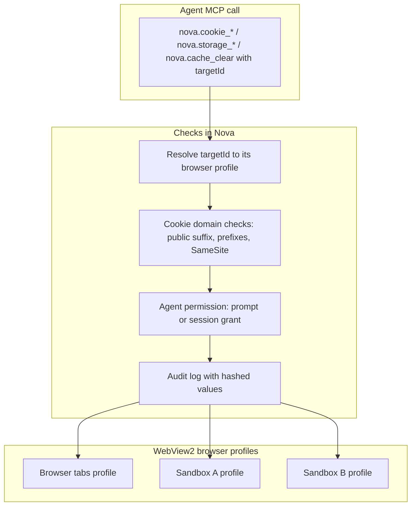

# Site Data & Privacy Management (Cookies, Storage, Cache)

> [!NOTE]
> Nova AI Workspace gives agents and users direct control over cookies (including HttpOnly cookies), `localStorage`, `sessionStorage` and browsing data — per browser profile, with cookie domain checks, a permission prompt for agent access and an audit log that records hashes instead of values.

---

## 1. Problem Statement: Why `document.cookie` Fails in Automation

Conventional browser automation tools rely on in-page JavaScript access (`document.cookie`):
* **No access to HttpOnly cookies:** Session and authentication cookies are usually flagged `HttpOnly` and are invisible to in-page JavaScript.
* **Missing isolation boundaries:** A careless clear command can wipe cookies for every tab or sandbox at once.
* **Unvalidated domain attributes:** Setting cookies on a public suffix (for example `.com` or `.co.uk`) enables cookie tossing across unrelated sites.

Nova uses the WebView2 cookie manager of the target's browser profile instead.

---

## 2. Architecture & Isolation Model

All browser tabs share one profile; every sandbox has its own. An operation only affects the profile of the `targetId` it names.

---

## 3. Core Features & Security Guarantees

1. **HttpOnly, Secure and SameSite cookies:**
   * Cookies are read and written through the browser's cookie manager, without scripts in the page. `nova.cookie_list` returns metadata only by default; values need `includeValues=true` together with a `domainFilter` and count as a high-impact secret read.
2. **Deterministic cookie IDs:**
   * Each cookie gets a `cookieId` derived from profile, name, domain and path, so identically named cookies on different subdomains or paths stay distinguishable.
3. **Cookie domain checks:**
   * `nova.cookie_set` only accepts the page's own host or a parent domain, blocks a built-in list of common public suffixes (such as `com`, `de`, `io`, `co.uk`; not the complete Public Suffix List), and enforces the `__Secure-` / `__Host-` prefix rules and `Secure` for `SameSite=None`. `dryRun=true` validates without writing.
4. **Agent permission prompt:**
   * Agent access to cookies and storage is controlled by the setting "Agent cookie/storage access": "Always ask" (default), "Ask once per session" or "Always allow". The prompt "Website data access" offers "Allow once" and "Allow for session"; active grants can be revoked under "Active agent permissions".
5. **High-impact clears:**
   * `nova.cookie_clear` without `domain` clears all cookies of the profile; with `domain` only that domain and its subdomains. Both `nova.cookie_clear` and `nova.cache_clear` require `_meta.intent` and go through the permission prompt.
6. **Audit log without values:** Changes are logged with a short SHA-256 hash of the value, not the value itself.
7. **Cookie inspector:**
   * With "Show cookie inspector in URL bar" (Settings → Tools, Cookie inspector card), an icon in the address bar opens a panel to view, edit and delete the site's cookies and local storage.

---

## 4. MCP Tooling for Site Data Management

All tools are in the `site_data_management` bundle and require a `targetId` (tab or sandbox).

| Tool | Purpose |
| :--- | :--- |
| `nova.cookie_list` | Lists cookies, filtered by URI, name or domain, paginated (up to 500 per call). |
| `nova.cookie_set` | Creates or replaces a cookie with expiry, `HttpOnly`, `Secure` and `SameSite`. |
| `nova.cookie_delete` | Deletes one cookie by `cookieId` or by name, domain and path. |
| `nova.cookie_clear` | Clears cookies for one domain or for the whole profile. |
| `nova.storage_inspect` | Reads `localStorage` or `sessionStorage` keys, optionally with values. |
| `nova.storage_set` | Sets a web storage value. |
| `nova.storage_delete` | Removes a web storage key. |
| `nova.cache_clear` | Clears browsing data of the profile by type, for example `diskCache`, `cacheStorage`, `serviceWorkers`, `cookies`, `allDomStorage` (local and session storage and IndexedDB together), `history`, `allSite` or `allProfile`. |

---

## Related Documentation

* **[Multi-Sandbox Session Isolation](sandbox-isolation.md)** — Separate browser profiles per sandbox.
* **[Proxy Routing & Network](proxy-and-network.md)** — Proxy profiles per tab and sandbox.
