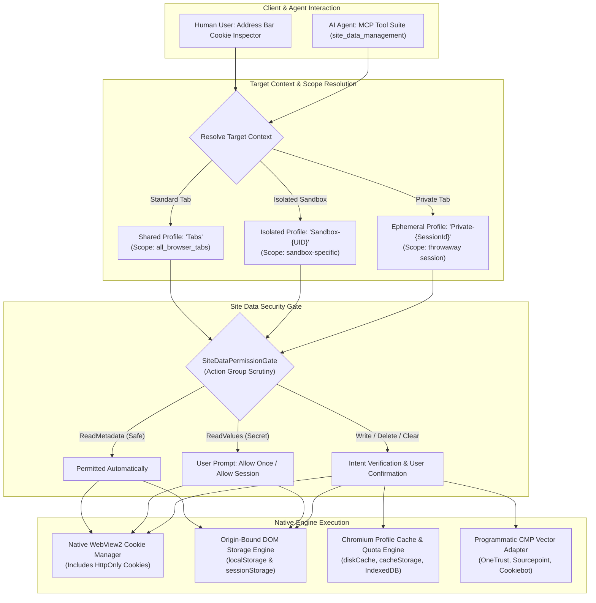

# Site Data Management

Site Data Management provides architectural isolation, granular inspection, and controlled mutation of the state websites persist across browsing sessions: HTTP and DOM cookies, Web Storage (`localStorage` and `sessionStorage`), offline assets (Cache Storage and Service Workers), and browser disk caches. 

Nova pairs a human-facing address-bar **Cookie Inspector** with a high-security, permission-governed **Model Context Protocol (MCP)** tool suite. This dual interface ensures users and autonomous agents can diagnose authentication loops, inspect token metadata without leaking secrets, and perform surgical cache invalidation without compromising neighboring profiles or sandboxes.

---

## 1. Architectural Overview & Isolation Model

Web state in Nova is partitioned across three distinct runtime profile boundaries. Every site-data operation resolves its target to an immutable context before executing, preventing cross-profile leakage and race conditions:



### The Three Profile Scopes

1. **Standard Browser Tabs (`Tabs` Profile):**
   * All standard browser tabs share a single shared profile directory.
   * **Key Invariant:** A cookie operation or browsing-data clear executed against any standard browser tab impacts **all open browser tabs** sharing that profile. Selecting a specific tab does not restrict profile-level clearing to that tab.
2. **Sandbox Isolation (`Sandbox-{UID}` Profiles):**
   * Each sandbox container maintains an independent user data directory with its own cookie jar, web storage databases, HTTP disk cache, and service worker registrations.
   * Modifying cookies, deleting storage keys, or clearing caches within a sandbox has **zero impact** on standard tabs or other sandbox containers.
3. **Private Sessions (`Private-{SessionId}` Profiles):**
   * Private tabs execute within isolated, in-memory, or throwaway disk profiles.
   * Private tabs never inherit cookies from the shared `Tabs` profile and destroy their state upon tab closure.

### Frozen Target Context Invariant

Every site-data operation resolves the caller's `targetId` into an immutable context record prior to permission evaluation. This record captures:
* `TargetId`: Unique identifier of the calling tab or sandbox context.
* `ProfileId`: Profile name (`Tabs`, sandbox persistent ID, or private session ID).
* `CurrentUri`: The top-level document URI captured at the precise moment of invocation.
* `ProfileScope`: Descriptive scope label (`all_browser_tabs`, `sandbox_{id}`, `private_session_{id}`).
* `IsSharedProfile`: Boolean flag signaling whether mutations affect multiple concurrent tabs.

Freezing the context at call time eliminates race conditions where an asynchronous navigation during a user permission prompt could alter the target origin or profile scope mid-flight.

---

## 2. The Four Pillars of Site Data

Nova structures site-data management into four functional domains:

```
+-----------------------------------------------------------------------------------+
|                            SITE DATA MANAGEMENT DOMAINS                           |
+-----------------------------------------------------------------------------------+
| 1. HTTP & DOM Cookies        | Native browser cookie manager, RFC 6265bis         |
|                              | HttpOnly visibility, Public Suffix List rules,     |
|                              | triple identity (name, domain, path), prefixes.    |
+------------------------------+----------------------------------------------------+
| 2. Web Storage & Offline     | Origin-bound localStorage and sessionStorage,      |
|                              | key inspection, value length bounding,             |
|                              | IndexedDB operational audit stream.                |
+------------------------------+----------------------------------------------------+
| 3. Cache & Profile Cleanup   | 9 granular data categories (diskCache,             |
|                              | cacheStorage, serviceWorkers, allDomStorage),      |
|                              | allSite vs allProfile scope separation.            |
+------------------------------+----------------------------------------------------+
| 4. Consent Management (CMP)  | Programmatic vendor APIs (OneTrust, Sourcepoint,   |
|                              | Cookiebot), ConsentStateVector verification,       |
|                              | autonomous-safe RejectOptional enforcement.        |
+-----------------------------------------------------------------------------------+
```

### Pillar 1: HTTP and DOM Cookies
Unlike standard JavaScript automation restricted to `document.cookie`, Nova operates directly at the browser engine level. This provides full visibility into `HttpOnly` security cookies, `SameSite` constraints, and partition keys, while enforcing strict validation rules against cookie prefix abuse (`__Secure-`, `__Host-`) and public suffix poisoning.

### Pillar 2: Web Storage & Offline State
Nova separates modern application storage into surgical, key-level operations for `localStorage` and `sessionStorage`, and macro-level management for complex databases like `IndexedDB`. Storage tools enforce key filtering and maximum entry boundaries to prevent context saturation during agent analysis.

### Pillar 3: Cache Invalidation & Profile Clearing
When resources become stale or application bundles desynchronize, Nova allows targeted invalidation of disk caches, service workers, or Cache Storage without requiring destructive profile resets. High-level composite categories (`allSite`, `allProfile`) are explicitly guarded against unintended session loss.

### Pillar 4: Consent Management Platforms (CMP)
Handling cookie banners programmatically via DOM clicks frequently results in modal loops or incorrect tracking acceptance. Nova provides typed CMP integration via programmatic vendor APIs, verifying before-and-after consent vectors (`ConsentStateVector`) and enforcing strict rejection of optional trackers by default.

---

## 3. Documentation Suite Index

Explore each specialized module within the Site Data Management documentation suite:

| Topic | Primary Focus | Key Capabilities & Enforcements |
| :--- | :--- | :--- |
| [Cookies](cookies/README.md) | Browser Cookie Engine | Triple identity `{name, domain, path}`, deterministic `cookieId` hashing, `HttpOnly` access, PSL validation, `__Secure-`/`__Host-` prefixes, Unix expiry. |
| [Web Storage](web-storage/README.md) | Origin-Bound State | `localStorage` vs `sessionStorage`, bounded key inspection, length-limited value previews, IndexedDB recording diagnostics, replay adoption. |
| [Cache & Cleanup](cache-and-cleanup/README.md) | Resource Invalidation | 9 browsing-data categories, `diskCache` vs `cacheStorage`, `allDomStorage` wipe scope, `allSite` vs `allProfile` boundaries, Vault separation. |
| [Cookie Inspector](cookie-inspector/README.md) | Address-Bar Human UI | Address-bar trigger, sensitive value masking, manual cookie creation/editing, storage accordions, clipboard preview formatting, profile cleanup. |
| [Permissions & Audit](permissions-and-audit/README.md) | Security & Compliance | 3-tier policy (`always_ask`, `ask_first`, `always_allow`), 5 action groups, sticky session denial invariants, audit log schema without secret leaks. |
| [Troubleshooting](troubleshooting/README.md) | Diagnostic Playbooks | Resolving login loops, stale session tokens, immediate data reappearance, CMP modal traps, permission stalls, and sandbox identity recovery. |

---

## 4. Scope & Tool Decision Matrix

Choosing the correct tool and scope ensures issues are resolved with the smallest possible operational footprint:

| Operational Goal | Recommended Tool / Action | Scope | Permission Impact |
| :--- | :--- | :--- | :--- |
| **Audit cookie names and security flags** | `nova.cookie_list` (`includeValues: false`) | Filtered domain / path in profile | Safe read (auto-allowed) |
| **Inspect authentication tokens** | `nova.cookie_list` (`includeValues: true`, `domainFilter: "..."`) | Specific domain in profile | High-impact secret read (prompt) |
| **Surgically update a session cookie** | `nova.cookie_set` | Exact `{name, domain, path}` | Mutation prompt |
| **Remove a corrupted tracking cookie** | `nova.cookie_delete` | Specific cookie ID or triple | Mutation prompt |
| **Sign out of a specific web domain** | `nova.cookie_clear` (`domain: "example.com"`) | Domain and subdomains in profile | Scoped clear prompt |
| **Inspect application state keys** | `nova.storage_inspect` (`includeValues: false`) | Current document origin | Safe read (auto-allowed) |
| **Read an auth token from storage** | `nova.storage_inspect` (`includeValues: true`) | Current document origin | Secret read (prompt) |
| **Clear stale CSS/JS bundles** | `nova.cache_clear` (`dataTypes: ["diskCache"]`) | Entire target profile | Cache clear prompt |
| **Unregister broken service workers** | `nova.cache_clear` (`dataTypes: ["serviceWorkers", "cacheStorage"]`) | Entire target profile | Storage clear prompt |
| **Dismiss cookie consent banners** | `nova.cmp_apply` (`intent.mode: "RejectOptional"`) | Current document DOM | Standard automation |
| **Reset all device/origin permissions** | `nova.site_permissions_reset_origin` (`origin: "..."`) | Target origin | Origin reset prompt |

---

## 5. Security & Privacy Guarantees

1. **HttpOnly Protection with Responsible Disclosure:**
   * JavaScript running within a web page cannot access `HttpOnly` cookies via `document.cookie`.
   * Nova's browser engine layer can read `HttpOnly` cookies to allow agent diagnostics, but treats this as a **high-impact secret read** requiring explicit user consent and an active domain filter.
2. **Deterministic Cookie Identification:**
   * Cookies are never addressed solely by name. A cookie is uniquely identified by the tuple `{profileId, name, domain, path}`.
   * Nova calculates a 24-character hex ID: `SHA256(profileId | name | domain | path)[0..12]`, ensuring stable referencing across asynchronous tool calls.
3. **Audit Log Secret Sanitization:**
   * The `SiteDataAuditLog` records every operation, tool name, agent identity, target ID, affected origin, and cookie/key identifier.
   * **Absolute Invariant:** Raw secret values (cookie values, auth tokens, passwords) are **never written to disk logs**.
4. **Vault Storage Isolation:**
   * Nova's DPAPI-encrypted credential Vault (`vault.dat`) is completely decoupled from the browser engine's internal password autosave and cache stores. Running `allProfile` or `allSite` clears will never purge or alter credentials stored in the Nova Vault.

---

## 6. Related Architecture Guides

* [Sandbox Isolation & Container Security](../sandbox-isolation/README.md): Details the physical storage separation between sandboxes, user data directories, and private sessions.
* [Privacy & Credential Protection](../privacy/README.md): Architecture of the DPAPI-encrypted Vault, ephemeral single-use `SecretRef` tokens, and canvas/audio fingerprint protection.
* [Network Interception & Request Replay](../network/network-interception/README.md): Adopting live browser cookies and web storage keys into redacted HTTP replay requests.
* [Site Data & Identity Tool Reference](../../mcp-reference/tools/site-data-and-identity/README.md): Formal JSON-RPC schemas and parameter specifications for all site-data tools.

---

[All core features](../README.md)
