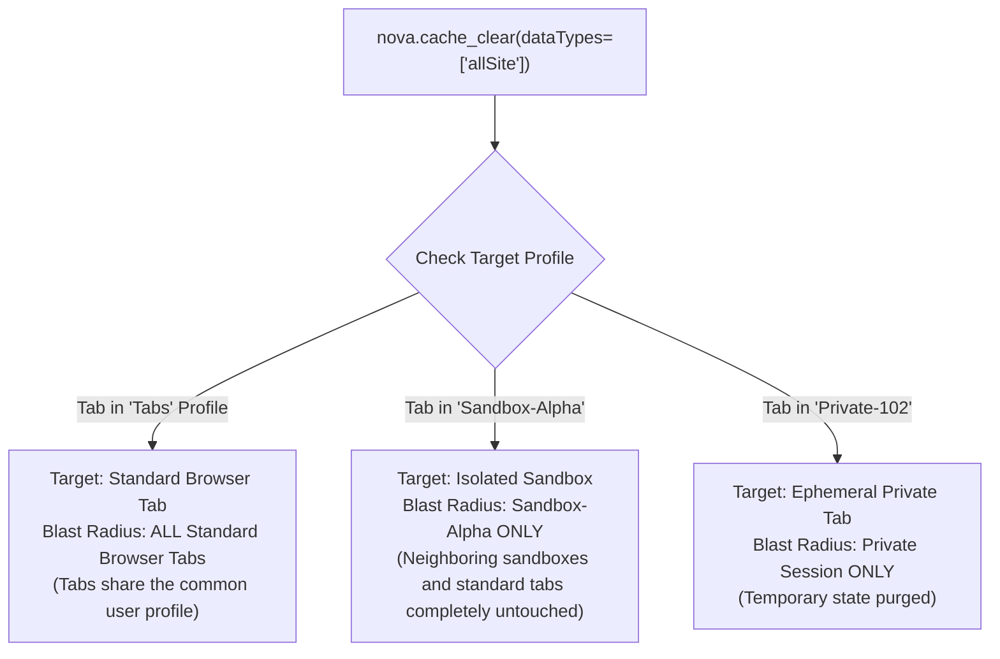

# Cache & Cleanup

Web browsers store high volumes of data to accelerate page loading and preserve offline capabilities: compiled scripts, stylesheets, cached API responses, service worker workers, and offline caches. When web applications deploy new software versions or encounter corrupt assets, stale cached resources frequently cause rendering anomalies, script execution errors, or broken navigation flows.

Nova provides a high-precision cache invalidation and profile cleanup engine through `nova.cache_clear`. Unlike blunt browser data resets, Nova allows agents and users to target specific resource subsystems—from individual HTTP disk caches to full composite profile resets—while maintaining strict isolation across sandboxes and external credential vaults.

---

## 1. The Nine Browsing-Data Categories

`nova.cache_clear` accepts an array of one or more typed `dataTypes`. These categories map directly to the underlying Chromium browser profile storage engines:

| Category | Subsystem Invalidation Scope | Common Operational Use Case |
| :--- | :--- | :--- |
| **`diskCache`** | HTTP network cache files on disk (images, stylesheets, JavaScript bundles, fonts). | Invalidate stale CSS/JS bundles after a frontend code deployment. |
| **`cacheStorage`** | Programmatic Cache Storage API (`window.caches`) used by Single-Page Apps. | Reset progressive web app (PWA) asset caches and offline shell resources. |
| **`serviceWorkers`** | Active Service Worker registrations, background fetchers, and push sync workers. | Terminate stuck or malfunctioning background service workers. |
| **`cookies`** | All HTTP and DOM cookies across all domains in the target profile. | Complete authentication reset across the target profile. |
| **`allDomStorage`** | Combined `localStorage`, `sessionStorage`, and `IndexedDB` across all domains. | Purge corrupted client-side databases and stored application state. |
| **`localStorage`** | **Alias for `allDomStorage`**. Wipes `localStorage`, `sessionStorage`, and `IndexedDB` together. | Historical compatibility alias (treated identically to `allDomStorage`). |
| **`history`** | Browsing navigation history and download record lists. | Clear navigation breadcrumbs without deleting downloaded files from disk. |
| **`allSite`** | Composite site data: `allDomStorage` + `cookies` + `cacheStorage` + file-system API. | Clean all website state across the profile while keeping browser settings intact. |
| **`allProfile`** | Factory reset: `allSite` + `diskCache` + `history` + autofill + browser settings. | Complete profile refresh to a clean state. |

---

## 2. Invariant: Absence of Domain Filtering in Cache Clearing

A critical architectural constraint governs `nova.cache_clear`:

$$\text{Cache Clearing Scope} = \text{Target Profile} \quad (\text{Domain Filtering is Not Supported})$$

* The browser engine's disk cache, Cache Storage API, and IndexedDB subsystems are organized internally by database files and memory-mapped block caches rather than simple per-domain folders.
* **Consequently, `nova.cache_clear` does not accept a domain parameter.**
* When an agent invokes `nova.cache_clear`, the selected categories are cleared **across the entire profile** of the target tab.
* If a domain-scoped cleanup is required, use targeted tools:
  * To delete cookies for a single domain: use [`nova.cookie_clear`](../cookies/README.md) with `domain: "example.com"`.
  * To delete Web Storage for a single domain: use [`nova.storage_delete`](../web-storage/README.md) within that origin.

---

## 3. Deep Dive: `allSite` vs. `allProfile`

Understanding the boundary between composite categories prevents accidental loss of browser settings:

```
+-----------------------------------------------------------------------------------+
| COMPONENT                 | allSite Clear                     | allProfile Clear  |
+-----------------------------------------------------------------------------------+
| Cookies                   | CLEARED (all domains)             | CLEARED           |
| localStorage              | CLEARED (all origins)             | CLEARED           |
| sessionStorage            | CLEARED (all origins)             | CLEARED           |
| IndexedDB                 | CLEARED (all origins)             | CLEARED           |
| Cache Storage API         | CLEARED                           | CLEARED           |
| HTTP Disk Cache           | RETAINED                          | CLEARED           |
| Navigation History        | RETAINED                          | CLEARED           |
| Download History List     | RETAINED                          | CLEARED           |
| Form Autofill Data        | RETAINED                          | CLEARED           |
| Password Autosave Store   | RETAINED                          | CLEARED           |
| Browser Profile Settings  | RETAINED                          | CLEARED           |
| Downloaded Files on Disk  | UNTOUCHED (always safe)           | UNTOUCHED         |
| Nova Encrypted Vault      | UNTOUCHED (isolated)              | UNTOUCHED         |
+-----------------------------------------------------------------------------------+
```

### The Nova Vault Separation Invariant

Nova distinguishes between the browser engine's internal password autosave mechanism and Nova's external DPAPI-encrypted credential store:

1. **Browser Password Autosave:** The built-in Chromium password store that offers to save passwords via browser popups. This store lives inside the browser profile and is purged when `allProfile` is cleared.
2. **Nova Encrypted Vault (`vault.dat`):** Nova's enterprise credential manager, secured with Windows Data Protection API (DPAPI) and isolated in `%LOCALAPPDATA%\NovaBrowser\vault.dat`.
3. **Absolute Invariant:** Executing `allProfile` or `allSite` clears will **never touch or alter secrets stored in Nova's Vault**. Credentials registered via `nova.vault_set` remain cryptographically intact.

---

## 4. Multi-Profile & Multi-Tab Isolation

The operational blast radius of any cache clearing operation is strictly bounded by the target's profile:



* **Standard Browser Tabs:** Standard tabs share the `"Tabs"` profile (`all_browser_tabs`). A cache clear executed on `Tab 1` affects `Tab 2`, `Tab 3`, and all other open standard tabs.
* **Sandbox Containers:** Each sandbox possesses an independent disk profile directory. Clearing the disk cache or DOM storage in `Sandbox A` leaves `Sandbox B` and all standard tabs completely isolated.

---

## 5. Interactive UI vs. Automated Agent Clear

Nova provides two paths to execute cache and site-data cleanup:

### 1. Interactive UI: The Cookie Inspector Cleanup Dialog
Users can trigger manual cleanup via the address bar:
1. Open the **Cookie Inspector** from the URL bar on the affected page.
2. Choose **Clear all site data for this profile...**.
3. A confirmation modal presents category checkboxes:
   * `[x] Cookies`
   * `[x] DOM Storage (localStorage, sessionStorage, IndexedDB)`
   * `[x] Cache (disk cache, Cache Storage, service workers)`
   * `[ ] Browsing history`
4. The dialog displays the active profile scope and warns if multiple tabs will be affected.
5. Click **Clear** to execute.

### 2. Autonomous Agent Tool: `nova.cache_clear`
Autonomous agents invoke `nova.cache_clear` through JSON-RPC:
* **Mandatory Intent Parameter:** Agents must provide `_meta.intent` describing the root cause and justification for the clearing operation (e.g., `"Clearing diskCache and serviceWorkers to resolve stale bundle compilation errors on target origin"`).
* **Permission Gate Evaluation:** Destructive clears pass through the [Site Data Permission Gate](../permissions-and-audit/README.md) to ensure the user has authorized profile-level modifications.

```json
{
  "targetId": "tab-101",
  "dataTypes": [
    "diskCache",
    "serviceWorkers",
    "cacheStorage"
  ],
  "_meta": {
    "intent": "Resolve stale chunk loading errors after frontend deployment"
  }
}
```

---

## 6. Post-Clear Verification & Cache Rehydration

Clearing a cache subsystem resets disk and memory storage at that exact instant. However:
1. **In-Memory JavaScript State:** Pages that remain open during a cache clear may still hold old script state, global variables, or API responses in JavaScript memory. **Always reload or navigate the page** (`nova.navigate` or `nova.reload`) after clearing caches.
2. **Cache Rehydration:** When the website reloads, the browser will immediately download fresh copies of HTML, CSS, JavaScript, and images, and may register a new service worker. A cache database showing new files after reload is expected and demonstrates successful rehydration.

---

## 7. Related References

* [Cookies Architecture Guide](../cookies/README.md): Detailed RFC 6265bis specifications and domain-scoped cookie clearing.
* [Web Storage Architecture Guide](../web-storage/README.md): Key-level manipulation of `localStorage` and `sessionStorage`.
* [Site Data Permissions & Audit](../permissions-and-audit/README.md): Authorization policies and audit log guarantees.
* [Site Data Troubleshooting](../troubleshooting/README.md): Diagnostic workflows for stale content, offline loops, and data recreation.
* [Cache Clear Tool Reference](../../../mcp-reference/tools/site-data-and-identity/nova-cache-clear.md)

---

[Site Data Management](../README.md)
