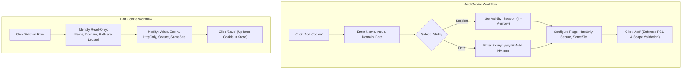

# Cookie Inspector

The Cookie Inspector is Nova's human-facing diagnostic surface for inspecting, modifying, and purging site data directly from the browser window. Embedded within the address bar, the inspector provides instant visual insight into cookies, Web Storage (`localStorage` and `sessionStorage`), and profile-wide storage state without requiring developer tools.

---

## 1. Enabling & Accessing the Inspector

The Cookie Inspector icon can be toggled via Nova's global settings:

1. Open **Settings → Tools → Cookie inspector**.
2. Enable **Show cookie inspector in URL bar**.
3. Navigate to any website in a standard tab, sandbox container, or private session.
4. Click the **Cookie Inspector icon** located at the right edge of the address bar.

```
+-----------------------------------------------------------------------------------+
|  https://app.example.com/dashboard                             [Cookie Icon] [▼]  |
+-----------------------------------------------------------------------------------+
| Cookie Inspector Flyout                                                           |
| Target: app.example.com | Profile: Sandbox - Engineering                          |
| Scope: sandbox_isolated                                                           |
|-----------------------------------------------------------------------------------|
| [Cookies (14)]  [Web Storage]  [Clear Site Cookies]  [Profile Cleanup...]         |
+-----------------------------------------------------------------------------------+
```

### Profile & Scope Awareness

The header of the inspector flyout immediately identifies the target's active storage boundary:
* **Standard Tabs:** Displays `Profile: Tabs (Shared across all browser tabs)`. A prominent warning reminds the user that profile-wide actions impact all standard tabs.
* **Sandbox Containers:** Displays `Profile: Sandbox - <Name>` with an isolated badge. Mutations are physically restricted to that sandbox container.
* **Private Sessions:** Displays `Profile: Private Session (Ephemeral)`. Reminds the user that state will be purged upon tab closure.

---

## 2. Inspecting & Masking Cookie Values

The Cookies section renders a table of all cookies applicable to the active page:

| UI Column | Data Displayed | Diagnostic Utility |
| :--- | :--- | :--- |
| **Name** | Cookie name (e.g., `session_token`) | Primary cookie identifier. |
| **Value** | Masked string (`••••••••••••••`) with **Reveal** icon | Protects credentials from shoulder surfing and screen capture. |
| **Domain** | Effective domain (e.g., `.example.com`) | Identifies subdomain sharing scope. |
| **Path** | Directory path (e.g., `/` or `/api`) | RFC 6265bis path filter. |
| **Security Badges** | `[HttpOnly]`, `[Secure]`, `[SameSite: Lax]` | Visual indicator of security attributes. |
| **Validity** | `Session` or timestamp (`2026-12-31 23:59`) | Differentiates in-memory vs persistent cookies. |
| **Actions** | **Edit** (Pencil) and **Delete** (Trash) | Row-level mutations. |

### Current Site vs. Profile Total
The inspector header displays two metrics:
1. **Cookies on this site:** Cookies matching the active document's domain and path hierarchy.
2. **Total cookies in profile:** Complete cookie inventory across the entire profile. This indicator helps identify whether stale cookies from other domains are bloating the profile database.

---

## 3. Creating & Editing Cookies

Users can create new cookies or fine-tune existing tokens directly through modal forms.



### Adding a New Cookie
1. Click **Add cookie** in the panel toolbar.
2. Fill in the required fields:
   * **Name & Value:** Raw key-value strings.
   * **Domain:** Pre-populated with the current page's hostname. May be adjusted to an allowed parent domain (e.g., `.example.com`).
   * **Path:** Pre-populated with `/`.
   * **Validity:** Choose **Session** (lifetime tied to process) or **Pick date** (enter target date in `yyyy-MM-dd HH:mm` format).
   * **Security Flags:** Toggle `HttpOnly`, `Secure`, and select `SameSite` (`Lax`, `Strict`, or `None`).
3. Click **Add**. If any validation constraint fails (such as attempting to set a cookie on a Public Suffix like `.com` or setting `SameSite=None` without `Secure`), the interface highlights the conflicting field.

### Editing an Existing Cookie
1. Locate the cookie row and click **Edit**.
2. **The Immutability Invariant:** **Name, Domain, and Path are read-only** in edit mode. Because these three fields define the cookie's immutable identity under RFC 6265bis, changing them would not update the existing cookie—it would spawn a new one while leaving the old one orphaned.
3. To alter a cookie's name, domain, or path, **delete** the old cookie and create a new one using **Add cookie**.
4. In edit mode, users can safely update the **Value**, **Validity**, **HttpOnly**, **Secure**, and **SameSite** properties.
5. Click **Save** to commit the changes to the browser profile, then reload the page to verify application behavior.

---

## 4. Web Storage Previews & Diagnostic Copy

Expanding the **Web Storage** accordion provides insight into origin-bound client-side state:

* **`localStorage` Section:** Displays persistent key-value pairs stored for the active origin.
* **`sessionStorage` Section:** Displays tab-scoped key-value pairs for the active browsing session.

### The Diagnostic Copy Action
Each storage row includes a dedicated **Copy** icon:
* Clicking the copy icon copies the string `key=preview` to the system clipboard.
* **Important Invariant:** For large JSON blobs or serialized tokens, the displayed preview is truncated (bounded by default to 200 characters). The copy button copies this **truncated diagnostic excerpt**, not an unlimited full database export.
* To retrieve complete, un-truncated storage values for automation, use the agent tool [`nova.storage_inspect`](../web-storage/README.md) with `includeValues: true` and appropriate permission grants.

---

## 5. Site vs. Profile Cleanup Controls

The Cookie Inspector provides two distinct destruction boundaries:

```
+-----------------------------------------------------------------------------------+
| CLEANUP ACTION            | SCOPE IMPACT                                          |
+-----------------------------------------------------------------------------------+
| Clear cookies for this    | Deletes cookies for the active domain and subdomains. |
| site                      | Leaves Web Storage, caches, and other domains intact. |
+---------------------------+-------------------------------------------------------+
| Clear all site data for   | Opens modal dialog with selectable categories across  |
| this profile...           | the entire profile (Cookies, DOM Storage, Cache,      |
|                           | History). Impacts ALL tabs in that profile!           |
+-----------------------------------------------------------------------------------+
```

### 1. "Clear cookies for this site"
* Immediately purges all cookies matching the current website's domain and subdomains.
* Does not delete `localStorage`, `sessionStorage`, `IndexedDB`, or cached images/scripts.
* Safe starting point for resolving broken sessions on a specific website without affecting other sites.

### 2. "Clear all site data for this profile..."
* Opens a dedicated confirmation modal with category checkboxes:
  * **Cookies:** All cookies across all websites in this profile.
  * **DOM Storage:** All `localStorage`, `sessionStorage`, and `IndexedDB` across all websites.
  * **Cache:** All HTTP disk caches, Cache Storage API entries, and Service Worker registrations.
  * **Browsing History:** History logs and download lists (downloaded files remain on disk).
* **Warning for Standard Tabs:** If invoked from a standard browser tab, this operation clears data for **every standard tab** in the workspace. In an isolated sandbox, it impacts only that sandbox.

---

## 6. Interaction with Agent Permissions

The Cookie Inspector UI is designed for human interactive use and operates independently of the agent permission system:
* Revealing a cookie value in the human UI does **not** generate an agent session grant.
* Enabling the Cookie Inspector in settings does not authorize autonomous agents to read sensitive tokens.
* Agent operations must still pass through the [Site Data Permission Gate](../permissions-and-audit/README.md).

---

## 7. Related References

* [Cookies Architecture Guide](../cookies/README.md): Detailed RFC 6265bis specifications, prefix enforcement, and deterministic `cookieId` hashing.
* [Web Storage Architecture Guide](../web-storage/README.md): Bounded key inspection, storage types, and IndexedDB operations.
* [Cache & Cleanup Guide](../cache-and-cleanup/README.md): Deep dive into browsing data categories and profile wipe scopes.
* [Site Data Troubleshooting](../troubleshooting/README.md): Playbooks for login loops, stale tokens, and data recreation.

---

[Site Data Management](../README.md)
