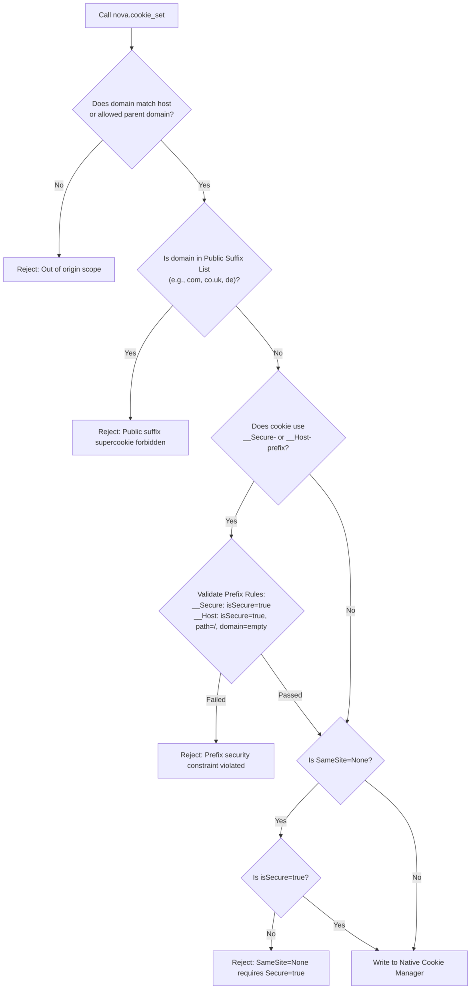

# Cookies

HTTP and DOM cookies represent the foundational state mechanism for web sessions, authentication tokens, and user preferences. In modern single-page applications and multi-tenant architectures, improper cookie manipulation frequently causes authentication loops, CSRF vulnerabilities, or accidental session destruction across shared tabs.

Nova addresses these challenges by interacting directly with the browser engine's native cookie manager. This provides visibility into `HttpOnly` credentials that standard page scripts cannot inspect, enforces RFC 6265bis security constraints, and provides deterministic cookie identification for surgical mutations.

---

## 1. Browser Engine Architecture vs. `document.cookie`

Standard web automation relies on injecting JavaScript to inspect `document.cookie`. This approach suffers from critical blind spots and security limitations:

| Architectural Dimension | Page JavaScript (`document.cookie`) | Nova Native Engine (`nova.cookie_*`) |
| :--- | :--- | :--- |
| **HttpOnly Visibility** | Completely invisible (blocked by browser security). | Fully accessible through native browser cookie manager APIs. |
| **Attribute Metadata** | Reads only `name=value` pairs; cannot read `Domain`, `Path`, `Expires`, `SameSite`, or `Secure` flags. | Inspects complete metadata records for every cookie in the target profile. |
| **Partitioning & Scope** | Scoped strictly to the active document origin and framing context. | Scoped to the target profile (`Tabs`, sandbox, or private session). |
| **Mutation Safety** | Overwriting a cookie requires guessing its exact domain and path. | Targets cookies via deterministic 24-character hexadecimal IDs. |
| **Prefix Enforcement** | Subject to browser-specific DOM setter quirks. | Validates RFC 6265bis prefixes (`__Secure-`, `__Host-`) prior to writing. |

---

## 2. The Triple Identity Model

A cookie is **never** uniquely identified by its name alone. Under RFC 6265bis, cookie identity is defined by the triple tuple:

$$\text{Cookie Identity} = \{\text{Name}, \text{Domain}, \text{Path}\}$$

A website can legitimately store multiple cookies sharing the identical name `session_id`, provided they differ in domain or path:
* `session_id` on `example.com` with path `/`
* `session_id` on `api.example.com` with path `/`
* `session_id` on `example.com` with path `/auth`

```
Profile Cookie Store
├── example.com
│   ├── /
│   │   └── session_id = "token-alpha"  [ID: a8f410c92be1...]
│   └── /auth
│       └── session_id = "token-beta"   [ID: 7c19b042ea09...]
└── api.example.com
    └── /
        └── session_id = "token-gamma"  [ID: 3e9d81fa0218...]
```

Attempting to delete or update a cookie by name alone creates ambiguous execution paths. Nova resolves this by computing a deterministic, stable identifier for every cookie within its profile.

### Deterministic `cookieId` Generation

When `nova.cookie_list` returns cookie records, each item includes a deterministic `cookieId`:

$$\text{cookieId} = \text{HexEncode}\Big(\text{SHA-256}\big(\text{profileId} \parallel \text{name} \parallel \text{NormalizeDomain}(\text{domain}) \parallel \text{NormalizePath}(\text{path})\big)\Big)[0..12]$$

The resulting 24-character hexadecimal string provides a stable reference across asynchronous tool calls:

```json
{
  "cookieId": "8b7e2a4f01c9d8a35e412b90",
  "name": "auth_token",
  "domain": ".example.com",
  "path": "/",
  "expires": 1792019200,
  "isHttpOnly": true,
  "isSecure": true,
  "sameSite": "Lax"
}
```

### Normalization Invariants

To guarantee identity consistency across differing input formats:
1. **Domain Normalization (`NormalizeDomain`):**
   * Leading and trailing dots are stripped (`.example.com` $\to$ `example.com`).
   * Internationalized Domain Names (IDN) are normalized to ASCII Punycode via RFC 3490 rules (e.g., `münchen.de` $\to$ `xn--mnchen-3ya.de`).
   * Evaluated case-insensitively.
2. **Path Normalization (`NormalizePath`):**
   * Default path is normalized to `/` if omitted or empty.
   * Ensures leading slash (`api` $\to$ `/api`).
   * **Case-Sensitivity Invariant:** Cookie paths are strictly **case-sensitive** per RFC 6265 §5.1.4. `/Api` and `/api` represent distinct cookie paths and produce different `cookieId` values. Folding them together would cause cookie deletions to hit the wrong session.

---

## 3. Cookie Domain Validation & Security Guardrails

When setting or mutating cookies via `nova.cookie_set`, Nova applies rigorous validation rules before writing to the underlying browser profile:



### Domain Scoping Rules
* A cookie domain must either exactly match the target document's current hostname or be an allowed parent domain.
* For example, a page loaded from `app.service.example.com` may set cookies for `app.service.example.com`, `.service.example.com`, or `.example.com`. It cannot set cookies for `other.example.com` or `service.com`.

### Public Suffix List (PSL) Protection
To prevent malicious or accidental "supercookie" injection across independent tenant boundaries, Nova blocks setting cookies on common multi-level public suffixes:
* Generic TLDs: `.com`, `.org`, `.net`, `.edu`, `.gov`, `.mil`, `.int`
* Country-Code Second-Level TLDs: `.co.uk`, `.org.uk`, `.gov.uk`, `.co.jp`, `.ne.jp`, `.com.au`, `.net.au`, `.com.br`, `.co.kr`, `.co.in`, `.com.cn`, `.com.tw`
* Single-Level ccTLDs and New gTLDs: `.de`, `.fr`, `.it`, `.es`, `.nl`, `.ch`, `.io`, `.app`, `.dev`, `.ai`, `.me`
* *Rule:* Setting a cookie on `co.uk` from `store.co.uk` is rejected outright.

### RFC 6265bis Prefix Constraints
* **`__Secure-` Prefix:** If a cookie name starts with `__Secure-`, it **must** have `isSecure: true` and must be transmitted over HTTPS.
* **`__Host-` Prefix:** If a cookie name starts with `__Host-`, it **must** satisfy three simultaneous requirements:
  1. `isSecure: true` (HTTPS only).
  2. `path: "/"` (scoped to the entire host).
  3. Domain attribute must be omitted or empty (must not be shared with subdomains).

### `SameSite` and `Secure` Coupling
* `SameSite=None`: Used for cross-site contextual cookies. RFC 6265bis mandates that `SameSite=None` **must always** be paired with `isSecure: true`. Any attempt to set `SameSite=None` on an insecure cookie is rejected.
* `SameSite=Lax`: Default browser behavior. Withholds cookies on cross-site subrequests (images, iframes) while attaching them to top-level navigations.
* `SameSite=Strict`: Restricts cookie transmission exclusively to first-party same-site requests.

---

## 4. Lifecycle & Expiry Mechanics

In Nova, cookie persistence is governed by the `expires` attribute, expressed as a **Unix timestamp in seconds**:

| Value of `expires` | Lifecycle Behavior | Operational Impact |
| :--- | :--- | :--- |
| `0` or omitted | **Session Cookie** | Retained in memory for the lifetime of the browsing context. |
| Future timestamp (e.g. `1792019200`) | **Persistent Cookie** | Written to disk in the profile's SQLite cookie database. Remains valid until expiry or revocation. |
| Past timestamp (e.g. `1000`) | **Expired Cookie** | Treated by the browser engine as expired and **immediately deleted**. |

> [!NOTE]
> Setting a future expiry timestamp does not guarantee that the server-side session remains valid until that time. Web applications can revoke tokens server-side in Redis/database stores independently of client-side cookie lifetimes.

---

## 5. Tool Protocol Reference

The `site_data_management` capability bundle provides four dedicated cookie tools:

### 1. `nova.cookie_list`
Retrieves cookies matching specified filter criteria within the target profile:
* **Metadata Default:** Returns cookie names, domains, paths, security flags, and `cookieId` records without disclosing secret values. This is classified as a safe read and auto-allowed by the security gate.
* **Sensitive Secret Read:** Setting `includeValues: true` requires an explicit, non-empty `domainFilter`. This triggers a high-impact secret read prompt under the [Site Data Permission Gate](../permissions-and-audit/README.md).
* **Pagination:** Supports `offset` and `limit` to prevent context exhaustion in profiles with thousands of tracking cookies.

```json
{
  "targetId": "tab-101",
  "domainFilter": "example.com",
  "includeValues": false
}
```

### 2. `nova.cookie_set`
Creates a new cookie or replaces an existing cookie matching the `{name, domain, path}` triple:
* Supports `name`, `value`, `domain`, `path`, `expires`, `isHttpOnly`, `isSecure`, and `sameSite`.
* **Dry Run Mode:** Setting `dryRun: true` validates the proposal against PSL, origin scope, and prefix rules without writing to disk.

```json
{
  "targetId": "tab-101",
  "cookie": {
    "name": "app_theme",
    "value": "dark",
    "domain": "example.com",
    "path": "/",
    "sameSite": "Lax",
    "isSecure": true
  },
  "dryRun": false
}
```

### 3. `nova.cookie_delete`
Removes an identified cookie from the profile:
* Accepts either a specific `cookieId` or explicit `{name, domain, path}` parameters.
* Supports `dryRun: true` to verify matches before executing deletion.

```json
{
  "targetId": "tab-101",
  "cookieId": "8b7e2a4f01c9d8a35e412b90",
  "dryRun": false
}
```

### 4. `nova.cookie_clear`
Performs bulk cookie deletion:
* **Domain Scoped:** Providing `domain: "example.com"` clears cookies for that domain and all its subdomains (`*.example.com`) within the target profile.
* **Profile-Wide:** Omitting `domain` wipes **every cookie** across the target profile.
* **Warning:** In standard browser tabs (`Tabs` profile), a profile-wide clear logs out all standard tabs simultaneously.

---

## 6. Integration: Session Adoption in Request Replay

Nova's [Network Request Replay](../../network/network-interception/README.md) allows developers and agents to construct raw HTTP requests using authentication sessions captured from the browser:

1. When drafting a request in `nova.network_replay`, the agent can invoke `adoptSession: true`.
2. Nova resolves all applicable cookies for the draft request's destination URL—including `HttpOnly` security cookies.
3. Adoption passes through the [Site Data Permission Gate](../permissions-and-audit/README.md) to ensure the user approves reading session secrets.
4. Adopted cookies are attached to the outgoing request headers while remaining redacted in tool preview logs to prevent credential leakage.

---

## 7. Related References

* [Cookie Inspector Guide](../cookie-inspector/README.md): Using the interactive address-bar panel to view, add, and edit cookies manually.
* [Site Data Permissions & Audit](../permissions-and-audit/README.md): Understanding action groups, session grants, and audit log guarantees.
* [Site Data Troubleshooting](../troubleshooting/README.md): Step-by-step resolution of login loops and cookies that reappear after deletion.
* [Cookie List Tool Reference](../../../mcp-reference/tools/site-data-and-identity/nova-cookie-list.md) · [Cookie Set](../../../mcp-reference/tools/site-data-and-identity/nova-cookie-set.md) · [Cookie Delete](../../../mcp-reference/tools/site-data-and-identity/nova-cookie-delete.md) · [Cookie Clear](../../../mcp-reference/tools/site-data-and-identity/nova-cookie-clear.md)

---

[Site Data Management](../README.md)
