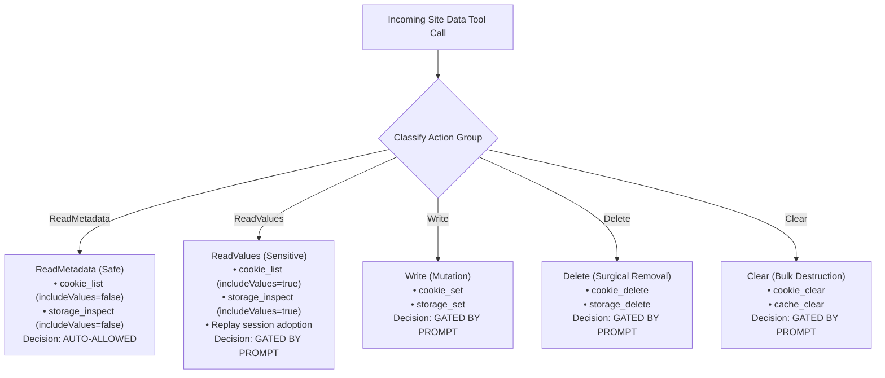

# Site Data Permissions & Audit

Managing website state introduces significant security risks: session cookies contain authentication tokens, `localStorage` holds OAuth bearer tokens, and bulk clearing operations can disrupt active user sessions across multiple tabs.

Nova implements a defense-in-depth security model through the **Site Data Permission Gate** and **Site Data Audit Log**. This architecture strictly separates safe metadata reads from sensitive credential disclosures, enforces scoped session authorizations, guarantees sticky user denials over global policies, and ensures that raw secrets never leak into persistent audit logs.

---

## 1. The Three-Tier Access Policy

Nova governs agent access to site data through a global configuration setting (**Settings → Tools → Site data and cookies → Agent cookie/storage access**):

```
+-----------------------------------------------------------------------------------+
| POLICY LEVEL     | KEY IDENTIFIER   | BEHAVIOR FOR SENSITIVE OPERATIONS           |
+-----------------------------------------------------------------------------------+
| Always Ask       | always_ask       | Every sensitive read, write, or clear prompts |
| (Default)        |                  | the user for approval. Recommended for daily|
|                  |                  | interactive workflows.                      |
+------------------+------------------+---------------------------------------------+
| Ask Once per     | ask_first        | Prompts on the first protected operation    |
| Session          |                  | within a specific {session, profile, domain,|
|                  |                  | actionGroup} scope. Subsequent calls in that|
|                  |                  | scope are auto-authorized for the session.  |
+------------------+------------------+---------------------------------------------+
| Always Allow     | always_allow     | Auto-allows protected operations, including |
|                  |                  | bulk clears. Intended for autonomous CI/CD  |
|                  |                  | and headless batch automation.              |
+-----------------------------------------------------------------------------------+
```

---

## 2. The Five Action Groups

Permissions are not evaluated as a blunt binary toggle. Operations are classified into five distinct action groups:



### 1. `ReadMetadata` (Safe Read)
* **Operations:** Listing cookie names, domains, paths, expiry dates, security flags, or storage key names.
* **Security Classification:** Safe. Discloses website structure and state presence without revealing secret credentials.
* **Evaluation:** Auto-allowed across all policy tiers without user interruption.

### 2. `ReadValues` (Sensitive Secret Read)
* **Operations:** Retrieving actual cookie values (`nova.cookie_list` with `includeValues: true`), reading storage key contents (`nova.storage_inspect` with `includeValues: true`), or adopting browser sessions into network replay requests.
* **Security Classification:** Sensitive. Discloses live session tokens, JWTs, or passwords.
* **Evaluation:** Requires explicit user authorization under `always_ask` and `ask_first`.

### 3. `Write` (Mutation)
* **Operations:** Setting or updating cookies (`nova.cookie_set`) or writing storage keys (`nova.storage_set`).
* **Evaluation:** Evaluates domain and origin bounds; prompts user for confirmation.

### 4. `Delete` (Surgical Removal)
* **Operations:** Deleting a single cookie by ID (`nova.cookie_delete`) or deleting a single storage key (`nova.storage_delete`).
* **Evaluation:** Prompts user to confirm removal of the identified entry.

### 5. `Clear` (Bulk Destruction)
* **Operations:** Clearing cookies for a domain or profile (`nova.cookie_clear`) or clearing browsing-data categories (`nova.cache_clear`).
* **Evaluation:** High-impact. Requires mandatory `_meta.intent` justification and user approval.

---

## 3. Session Grant Scoping & Sticky Denials

When a sensitive operation triggers a user prompt, the dialog presents two choices:
* **Allow once:** Authorizes the current operation only; no grant is recorded.
* **Allow for session:** Creates a session grant recorded in memory.

### Dimensional Scoping of Session Grants
Session grants are strictly scoped across four dimensions:

$$\text{Grant Scope} = \{\text{AgentId}, \text{ProfileId}, \text{Domain}, \text{ActionGroup}\}$$

* **Grant Isolation:** An approval to read cookie values on `github.com` does **not** authorize reading cookies on `google.com`.
* **Action Isolation:** An approval to read values (`ReadValues`) on `example.com` does **not** authorize deleting cookies (`Delete`) or clearing the cache (`Clear`) on that domain.
* **Profile Isolation:** An approval granted in `Sandbox A` does **not** grant access in `Sandbox B` or the shared `Tabs` profile.

### The Sticky Denial Invariant

To guarantee user supremacy over automated systems:

$$\text{Recorded Session Denial} > \text{Global Always-Allow Policy}$$

1. If a user clicks **Deny** on an authorization prompt, Nova records an explicit session denial for that `{ProfileId, Domain, ActionGroup}` scope.
2. Subsequent calls by the agent within that scope are immediately rejected with JSON-RPC error code `-32002` (`PermissionDenied`).
3. **Absolute Invariant:** Even if the user or an agent subsequently changes the global policy to `always_allow`, the recorded session denial remains strictly in effect until the application session is restarted or explicitly revoked.

---

## 4. Active Grants Management & Revocation

Users can inspect and revoke active session grants at any time without restarting Nova:

1. Open **Settings → Tools → Site data and cookies**.
2. Locate the **Active agent permissions** list.
3. Each entry details:
   * **Agent:** Identifier of the authorized agent.
   * **Profile:** Target profile (`all_browser_tabs` or sandbox name).
   * **Domain:** Scoped domain (or `All domains` if profile-wide).
   * **Action:** Scoped action group (`Read values`, `Write`, `Delete`, `Clear`).
4. Click **Revoke** on any entry to immediately invalidate the grant.
5. *Note:* Revoking a grant prevents future operations; it does not undo already completed reads or writes.

---

## 5. Site Data Audit Log Specifications

Nova maintains a tamper-resistant operational log of all site-data interactions in the user data directory:

```
%LOCALAPPDATA%\NovaBrowser\Logs\site-data-audit.jsonl
```

### Record Schema
Each line in the log is a structured JSON record:

```json
{
  "timestamp": "2026-10-10T02:45:00.123Z",
  "toolName": "nova.cookie_list",
  "actionGroup": "ReadValues",
  "agentId": "research-assistant-01",
  "targetId": "tab-101",
  "profileId": "sandbox_work_2026",
  "origin": "https://app.example.com",
  "targetIdentifier": "auth_token",
  "isModified": false,
  "userDecision": "AllowedBySessionGrant",
  "success": true
}
```

### Privacy & Sanitization Guarantees
* **Zero Secret Logging Invariant:** The audit log **never writes raw cookie values, bearer tokens, or password strings** to disk.
* **Deterministic Tracking:** The log records the affected cookie name, domain, path, or storage key, allowing administrators to audit which items were accessed without persisting sensitive authentication payload data.

---

## 6. One-Click Origin Permission Purge

In addition to cookie and storage management, web applications acquire permissions for hardware APIs (camera, microphone, notifications, geolocation).

Nova provides `nova.site_permissions_reset_origin` to completely purge all stored permissions for an origin in a single atomic call:
* Resets camera, microphone, speaker, and geolocation permissions.
* Clears desktop notification grants.
* Purges remembered per-site device preferences.
* Unconditionally terminates active WebRTC media streams and drops in-memory clipboard-read decisions.

```json
{
  "origin": "https://meet.example.com"
}
```

---

## 7. Related References

* [Cookies Architecture Guide](../cookies/README.md): Cookie identity, PSL validation, and HttpOnly security.
* [Web Storage Architecture Guide](../web-storage/README.md): Key inspection and request replay mapping.
* [Cache & Cleanup Guide](../cache-and-cleanup/README.md): Invalidation categories and Vault isolation.
* [Site Data Troubleshooting](../troubleshooting/README.md): Diagnosing permission stalls and unapproved agent calls.
* [Reset Origin Permissions Tool Reference](../../../mcp-reference/tools/site-data-and-identity/nova-site-permissions-reset-origin.md)

---

[Site Data Management](../README.md)
