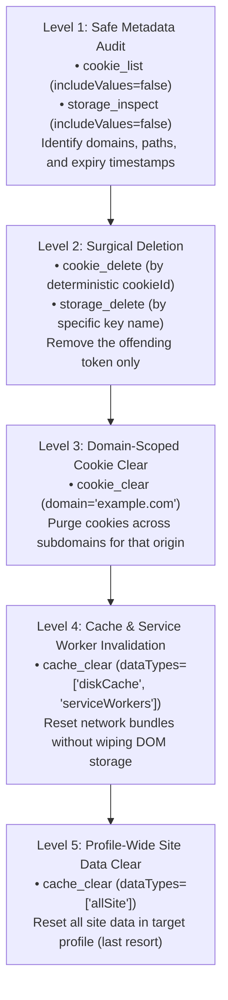

# Site Data Troubleshooting

Site data issues typically manifest as frustrating, cyclical failure modes: users stuck in endless authentication loops, cookies that instantly reappear after deletion, applications serving stale offline bundles, or agents stalled on permission gates.

This guide provides structured diagnostic playbooks for troubleshooting web state in Nova. It emphasizes surgical, non-destructive interventions over blunt profile resets, ensuring that issues are resolved without disrupting neighboring tabs or unrelated sessions.

---

## 1. The Diagnostic Hierarchy

Always begin troubleshooting at the narrowest possible operational scope before escalating to destructive clears:



### Safe Agent Diagnostic Prompt
When directing an AI agent to troubleshoot an affected website, use this bounded instruction template:

> "Investigate why https://app.example.com keeps returning to the login page in my current sandbox. Start by inspecting cookie metadata and local storage keys without revealing secret values. Identify if multiple cookies share the same name across different paths, or if an expired token exists. Propose the smallest surgical deletion before making any changes, and re-check the page afterward."

---

## 2. Playbook 1: Infinite Login Loops & Expired Sessions

### Symptoms
* Navigating to a web application constantly redirects back to `/login` or an identity provider (SSO).
* Entering valid credentials succeeds, but subsequent page loads immediately prompt for login again.

### Common Root Causes
1. **Conflicting Triple-Identity Cookies:** Two cookies named `session_id` exist: one on `.example.com` at path `/`, and another on `app.example.com` at path `/auth`. The server receives both and rejects the malformed header.
2. **Expired Client-Side Token with Valid Server Session:** An expired OAuth access token in `localStorage` blocks frontend routing, even though the server-side session cookie remains valid.
3. **`SameSite` Cookie Attribute Mismatches:** An authentication cookie set with `SameSite=Strict` is dropped during redirects from external identity providers (Google/Okta SSO).

### Step-by-Step Remediation Workflow
1. **Audit Cookie Metadata:**
   Call `nova.cookie_list` with `domainFilter: "example.com"` and `includeValues: false`. Examine the `path`, `domain`, and `expires` attributes.
   * *Check:* Are there duplicate cookie names with differing paths (`/` vs `/app`)?
   * *Check:* Has the Unix expiry timestamp already passed?
2. **Audit Web Storage Keys:**
   Call `nova.storage_inspect` with `storageType: "local"` and `includeValues: false`.
   * *Check:* Are there keys named `access_token`, `id_token`, or `auth_state`?
3. **Perform Surgical Cookie Removal:**
   Target the stale or conflicting cookie using its unique 24-character `cookieId`:
   ```json
   {
     "targetId": "tab-101",
     "cookieId": "8b7e2a4f01c9d8a35e412b90",
     "dryRun": false
   }
   ```
4. **Reload and Verify:**
   Reload the page (`nova.reload`) and attempt a clean login. Verify whether the application issues a fresh, single session cookie.

---

## 3. Playbook 2: Data Reappears Immediately After Deletion

### Symptoms
* An agent or user deletes a cookie or storage key, but refreshing the page immediately restores the identical value.

### Root Causes & Remediation

| Cause | Mechanism | Remediation |
| :--- | :--- | :--- |
| **In-Memory JavaScript State** | The single-page app retains the session token in an active JavaScript closure or Redux store. On page activity, the app re-writes the token back to `localStorage`. | Navigate the tab to `about:blank`, delete the storage key, then navigate back to the website URL. |
| **Service Worker Cache Interception** | A registered Service Worker intercepts network requests and serves a cached HTTP response containing a `Set-Cookie` header. | Unregister the service worker and clear Cache Storage: `nova.cache_clear(dataTypes: ["serviceWorkers", "cacheStorage"])`. |
| **Server-Side Re-Issuance** | The web server issues a new session or tracking cookie on every incoming request if none is present. | Verify whether the cookie value changed. A new value indicates normal server re-issuance rather than deletion failure. |

---

## 4. Playbook 3: Consent Management (CMP) & Cookie Banner Traps

### Symptoms
* An automated workflow stalls because an opaque cookie banner blocks clicks to underlying buttons.
* Naive clicking on "Reject All" opens an accordion sub-menu instead of dismissing the modal, or triggers a multi-step iframe trap.

### Remediation via `nova.cmp_apply`
Instead of attempting fragile visual clicks against dynamic DOM elements, use Nova's programmatic CMP tool:

1. **Invoke Programmatic Rejection:**
   ```json
   {
     "targetId": "tab-101",
     "mode": "auto",
     "intent": {
       "mode": "RejectOptional"
     }
   }
   ```
2. **How It Works:**
   * Automatically detects vendor framework APIs (OneTrust, Sourcepoint TCF v2, Cookiebot).
   * Verifies the consent vector (`ConsentStateVector`) before and after execution to confirm optional tracking was disabled.
   * Handles cross-origin iframes (e.g. Sourcepoint on German media portals).
3. **The `AcceptAll` Invariant:**
   * Automated agents are strictly **blocked** from calling `intent.mode: "AcceptAll"` (returns `-32035` `accept_all_blocked`). If a user wishes to accept all cookies, they must do so manually in the browser UI.
4. **Visual Blocker Fallback:**
   * If the website uses an unrecognized custom cookie banner without a supported CMP framework, fall back to visual dismissal:
   ```json
   {
     "targetId": "tab-101",
     "maxAttempts": 3
   }
   ```
   *(Using `nova.dismiss_blockers`).*

---

## 5. Playbook 4: Permission Denials & Agent Stalls

### Symptoms
* An agent reports JSON-RPC error `-32002` (`PermissionDenied`) when attempting to read site data or clear storage.
* The agent repeatedly asks the user for permission, or gets stuck waiting indefinitely.

### Diagnosis & Resolution
1. **Decouple Metadata from Secrets:**
   * Ensure the agent is requesting metadata (`includeValues: false`) whenever possible. Metadata reads are auto-allowed without prompting.
   * If values are genuinely needed, ensure the agent provides an explicit `domainFilter` for cookies.
2. **Identify Sticky Session Denials:**
   * If the user previously clicked **Deny** on an authorization prompt during the current session, Nova records a **sticky session denial**.
   * *Invariant:* Even if the user switches the global setting to **Always allow**, the sticky denial takes precedence.
3. **Clearing Active Denials & Grants:**
   * Open **Settings → Tools → Site data and cookies**.
   * Under **Active agent permissions**, review the grant list.
   * If a scope is blocked, restart the browser or close and re-open the affected tab to reset session memory.

---

## 6. Playbook 5: Lost Sandboxes vs. Deleted Site Data

### Critical Distinction
Users occasionally confuse profile loss with cookie expiration:

* **Site Data Loss (Cookies/Storage Cleared):**
  * The sandbox container still exists in Nova's sidebar.
  * Opening the sandbox loads the start URL, but the user is signed out.
  * *Resolution:* Log in again. The sandbox container, persistent UID, and isolation boundaries are intact.
* **Sandbox Profile Loss (Container Disappeared):**
  * The sandbox container is missing from the sidebar entirely.
  * *Resolution:* Do NOT attempt to fix this with cookie tools. Follow the comprehensive recovery steps in [Sandbox & Session Recovery](../../../troubleshooting/sandbox-and-session-recovery.md).

---

## 7. Related References

* [Cookies Architecture Guide](../cookies/README.md): Deterministic `cookieId` hashing, triple identity, and PSL validation.
* [Cookie Inspector UI Guide](../cookie-inspector/README.md): Address-bar manual inspection and editing.
* [Web Storage Architecture Guide](../web-storage/README.md): Bounded key inspection and request replay mapping.
* [Cache & Cleanup Guide](../cache-and-cleanup/README.md): Invalidation categories and Vault isolation.
* [Site Data Permissions & Audit](../permissions-and-audit/README.md): Authorization policies and audit log guarantees.
* [CMP Apply Tool Reference](../../../mcp-reference/tools/guarded-actions/nova-cmp-apply.md) · [Dismiss Blockers](../../../mcp-reference/tools/browser-automation/nova-dismiss-blockers.md)

---

[Site Data Management](../README.md)
