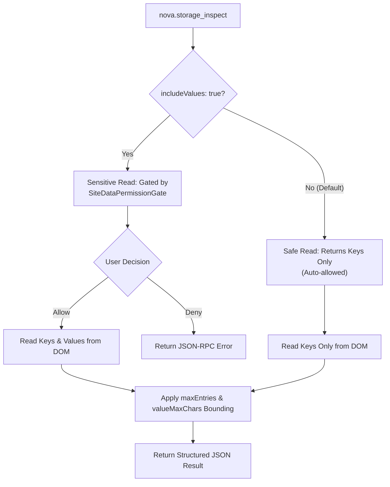

# Web Storage

Web Storage (`localStorage` and `sessionStorage`) provides client-side key-value persistence for modern web applications. While cookies are transmitted with every HTTP request, Web Storage is accessed exclusively through client-side JavaScript to store authentication bearer tokens, client-side state vectors, cached JSON payloads, and user interface preferences.

Nova provides surgical MCP tools to inspect, modify, and delete individual Web Storage keys within the active document origin. These operations are strictly bounded to prevent context exhaustion and gated against unauthorized credential extraction.

---

## 1. Storage Topologies: `localStorage` vs. `sessionStorage`

Nova distinguishes between two primary Web Storage paradigms:

```
+-----------------------------------------------------------------------------------+
| CHARACTERISTIC          | localStorage (storageType: local) | sessionStorage (storageType: session) |
+-----------------------------------------------------------------------------------+
| Persistence Lifetime    | Persistent across browser restarts| Destroyed when the tab or session   |
|                         | until explicitly cleared.         | context closes.                     |
| Origin Scope            | Same-Origin (scheme + host + port)| Same-Origin (scheme + host + port). |
| Multi-Tab Sharing       | Shared across all tabs in the same| Isolated to the specific tab; not   |
|                         | profile matching the origin.      | shared across neighboring tabs.     |
| Common Use Cases        | Refresh tokens, theme settings,   | Transient form drafts, step-wizard  |
|                         | long-lived application caches.    | state, ephemeral session keys.      |
+-----------------------------------------------------------------------------------+
```

### The Top-Level Document Origin Invariant

Nova's Web Storage tools operate strictly within the **top-level document origin** of the target tab:
* Tools do not provide an ambient, cross-origin inventory of embedded third-party iframes (e.g. payment widgets or advertising frames) unless the agent explicitly targets that frame context.
* If a tab navigates from `https://auth.example.com` to `https://app.example.com`, the active storage origin transitions immediately. Target context resolution captures the document origin at call start to guarantee atomic execution.

---

## 2. Granular MCP Storage Operations

The `site_data_management` capability bundle provides three dedicated tools for interacting with Web Storage:



### 1. `nova.storage_inspect`
Inspects keys and values in the target's current origin:
* `storageType`: Explicit selection between `"local"` and `"session"`.
* `keyFilter`: Substring or prefix filter to narrow the inventory (e.g., `"token_"` or `"auth"`).
* `maxEntries`: Maximum number of keys returned (defaults to 50; bounds context size).
* `valueMaxChars`: Maximum character length returned for any single value (defaults to 200). Values exceeding this length are safely truncated with an ellipsis.
* `includeValues`: Defaults to `false`. When `false`, returns only key names, preventing accidental credential exposure. Setting `includeValues: true` requires user approval under the [Site Data Permission Gate](../permissions-and-audit/README.md).

```json
{
  "targetId": "tab-101",
  "storageType": "local",
  "keyFilter": "auth",
  "includeValues": false,
  "maxEntries": 20
}
```

### 2. `nova.storage_set`
Writes or updates a string value for a specific key in the selected store:
* Accepts `targetId`, `storageType`, `key`, and `value`.
* **String Constraint:** In Web Storage, all values are strings. Objects and arrays must be serialized as JSON strings prior to writing.
* **Mutation Notice:** Writing a storage key updates the underlying store immediately, but web applications holding cached state in JavaScript memory variables may require a page reload to recognize the change.

```json
{
  "targetId": "tab-101",
  "storageType": "local",
  "key": "app_theme",
  "value": "dark"
}
```

### 3. `nova.storage_delete`
Removes a specific named key from the store:
* Accepts `targetId`, `storageType`, and `key`.
* Does not affect other keys or neighboring origins.

```json
{
  "targetId": "tab-101",
  "storageType": "session",
  "key": "stale_wizard_draft"
}
```

---

## 3. The IndexedDB Boundary & Diagnostic Capture

Web Storage tools are strictly engineered for `localStorage` and `sessionStorage`. They **do not** browse, query, or edit structured databases managed by `IndexedDB` or `CacheStorage`.

```
+-----------------------------------------------------------------------------------+
| STORAGE TECHNOLOGY     | INSPECTION / EDIT TOOL      | DESTRUCTION BOUNDARY       |
+-----------------------------------------------------------------------------------+
| localStorage           | nova.storage_inspect / set  | nova.storage_delete / clear|
| sessionStorage         | nova.storage_inspect / set  | nova.storage_delete / clear|
| IndexedDB              | Session Recording Stream    | nova.cache_clear           |
|                        | (indexeddb-ops.jsonl)       | (allDomStorage category)   |
| Cache Storage API      | Service Worker Inspection   | nova.cache_clear           |
|                        |                             | (cacheStorage category)    |
+-----------------------------------------------------------------------------------+
```

### Invariant: Profile-Level DOM Storage Destruction
When executing broad cleanup operations via `nova.cache_clear`:
* Selecting `dataTypes: ["allDomStorage"]` (or its accepted alias `dataTypes: ["localStorage"]`) **purges localStorage, sessionStorage, and IndexedDB simultaneously** across the entire profile.
* There is no MCP tool to clear IndexedDB for a single origin without wiping all other DOM storage in that profile. See [Cache & Cleanup](../cache-and-cleanup/README.md).

### Diagnostic Observation via Session Recording
When diagnosing complex web applications that store transactional state or offline databases in IndexedDB, Nova provides an alternative, non-destructive diagnostic path via [Session Recording](../../session-recording/README.md):
1. A session recording captures all IndexedDB operations into an event stream: `indexeddb-ops.jsonl`.
2. Captured events record database names, object store names, operation types (`put`, `get`, `delete`, `openCursor`), and hashed keys.
3. **Secret Protection:** Stored database values are withheld by default. Capturing actual record values requires opting into the high-security `indexeddb_values` permission class.

---

## 4. Integration: Mapping Stored Values into Request Replay

Many modern Single-Page Applications (SPAs) store OAuth bearer tokens in `localStorage` rather than HTTP cookies. Nova's [Network Interception & Replay](../../network/network-interception/README.md) allows agents to adopt these tokens directly into HTTP request drafts:

1. In `nova.network_replay`, the agent specifies an explicit header mapping:
   ```json
   {
     "targetId": "tab-101",
     "adoptSession": true,
     "storageHeaderMappings": [
       {
         "storageType": "local",
         "key": "access_token",
         "headerName": "Authorization",
         "valuePrefix": "Bearer "
       }
     ]
   }
   ```
2. Nova reads the named key from the active document origin.
3. The read passes through the [Site Data Permission Gate](../permissions-and-audit/README.md) as a sensitive secret read.
4. The adopted value is formatted with the requested prefix (`Bearer <token>`) and attached to the outgoing request.
5. In tool inspection outputs, the token value is strictly redacted to prevent credentials from entering model context transcripts.

---

## 5. Related References

* [Cookies Architecture Guide](../cookies/README.md): Native browser cookie engine, RFC 6265bis prefix enforcement, and deterministic identity hashing.
* [Cookie Inspector UI Guide](../cookie-inspector/README.md): Visual previews of Web Storage keys and the clipboard diagnostic copy button.
* [Cache & Cleanup Guide](../cache-and-cleanup/README.md): Category definitions, `allDomStorage` wipe scopes, and profile reset boundaries.
* [Site Data Troubleshooting](../troubleshooting/README.md): Handling stale application tokens and state that reappears after deletion.
* [Storage Inspect Tool Reference](../../../mcp-reference/tools/site-data-and-identity/nova-storage-inspect.md) · [Storage Set](../../../mcp-reference/tools/site-data-and-identity/nova-storage-set.md) · [Storage Delete](../../../mcp-reference/tools/site-data-and-identity/nova-storage-delete.md)

---

[Site Data Management](../README.md)
