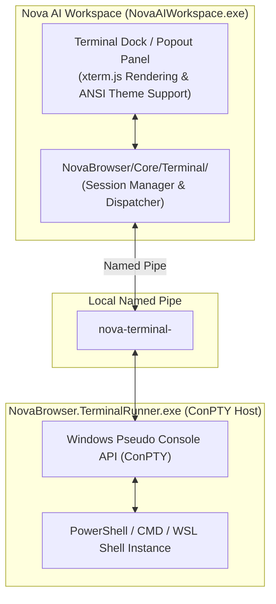

# Terminal Workspaces & ConPTY Integration

> [!NOTE]
> The Terminal Workspace subsystem embeds native Windows Pseudo Consoles (ConPTY) directly into Nova AI Workspace. By delegating console processes to the standalone `NovaBrowser.TerminalRunner.exe`, active shells, dev servers, and build jobs survive restarts and UI reloads of the main browser application.

---

## 1. Problem Statement: Flat Subprocesses vs. True Pseudo Terminals

Autonomous AI agents frequently need to run command-line tools: Git commands, unit test suites, local development servers, and package managers.
* **Limitations of Flat Subprocess Spawns (`Process.Start`):**
  * Lack of authentic VT100 / ANSI escape code support (interactive prompts, cursors, and progress bars corrupt output).
  * Orphaned background tasks when the parent browser crashes or reboots.
  * Inability to cleanly distinguish between human operator commands and automated agent commands.

**Nova AI Workspace** resolves this through an embedded **ConPTY Terminal Architecture**.

---

## 2. Architecture & ConPTY Host Wiring

---

## 3. Core Capabilities of Terminal Workspaces

1. **Authentic Terminal Emulation (ConPTY + xterm.js):**
   * Full fidelity support for interactive console applications, cursor repositioning, 24-bit ANSI colors, and control keys (e.g. `Ctrl+C`).
2. **Persistence Across Browser Restarts (Process Independence):**
   * `NovaBrowser.TerminalRunner.exe` runs decoupled in the background. If Nova is restarted or updated, running terminal processes remain live and reconnect seamlessly upon application launch.
3. **Workspace & Project Scoping:**
   * Terminals can be bound directly to specific project directories and environment variables.
   * Tight integration with Nova's recurring task engine (`scheduled_tasks`) for automated periodic builds.
4. **Isolated Human vs. Agent Sessions:**
   * Agents spawn dedicated background sessions without interfering with the user's active interactive shell.

---

## 4. MCP Tooling for Terminal Workspaces

| Tool | Purpose |
| :--- | :--- |
| `nova.terminal_open` | Spawns a new ConPTY terminal session in a designated working directory. |
| `nova.terminal_run_command` | Executes a command string and awaits completion or timeout. |
| `nova.terminal_read` | Reads recent scrollback buffer content (with optional ANSI stripping). |
| `nova.terminal_write` | Writes raw input or answers interactive CLI prompts. |
| `nova.terminal_send_key` | Transmits named control keys (`Enter`, `Escape`, `Ctrl+C`) to abort hanging jobs. |
| `nova.terminal_get_state` | Queries lifecycle status, working directory, and exit codes. |
| `nova.terminal_close` | Terminates the session and cleanly kills the ConPTY process tree. |

---

## 5. Production Code References

* **Terminal Core & Session Manager:** `NovaBrowser/Core/Terminal/`
* **Terminal Runner Process Project:** `NovaBrowser.TerminalRunner/`
* **WinUI 3 Host & Docking Integration:** `NovaBrowser/Views/MainPage.TerminalShell.cs`

---

## Related Documentation

* **[Scheduled Tasks & Automation](scheduled-tasks.md)** — Cron scheduling and background workspace tasks.
* **[Outrider Process Boundary](outrider-boundary.md)** — Native process boundary and hardware resilience.
