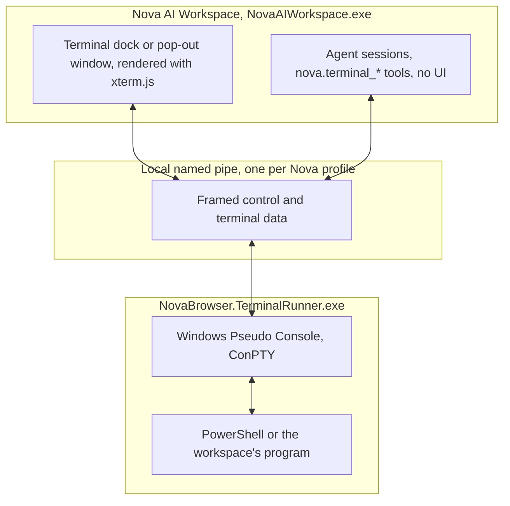

# Terminal Workspaces & ConPTY Integration

> [!NOTE]
> Nova AI Workspace has a built-in terminal based on the Windows Pseudo Console (ConPTY). Console processes run in the separate helper `NovaBrowser.TerminalRunner.exe`, allowing running shells, dev servers and build jobs to outlive the browser process. Nova can reconnect its dock terminals after a restart; agent sessions use a separate registry.

---

## 1. A Concrete Example: Run a Build and Inspect Its Result

An agent opens its own PowerShell session, starts a build and reads the output. Nova's external terminal runner hosts the shell, while the terminal tools expose its state and output. The user's dock terminals remain in a separate registry.

If `terminal_run_command` times out, its wait ended; the session stays open and the command may still be running. Inspect output and state before retrying. Sending the same command again could duplicate work or write into a program that is still waiting for input.

## 2. Session, Command and Workspace Are Different

| Concept | Meaning |
| :--- | :--- |
| Workspace | A saved project entry with a working directory and program configuration. |
| Session | A live shell and pseudo console hosted by the terminal runner. |
| Command result | Output and a completion/exit-code observation for a submitted command. |

`terminal_run_command` detects completion through a marker written after the command, or through shell exit. Session state describes the shell, not necessarily the last command. Exit code 0 is process-level evidence; check the expected files, tests or other outcome before declaring the task complete.

The allowed starting-directory check keeps sessions in predictable locations. It does not confine the shell's filesystem access: commands run with the user's Windows permissions and can change directory.

## 3. Why Use a Persistent Pseudo Terminal?

Autonomous AI agents frequently need to run command-line tools: Git commands, unit test suites, local development servers, and package managers.

* **Limitations of flat subprocess spawns (`Process.Start`):**
  * No real terminal: interactive prompts, cursor movement and progress bars break the output.
  * Without explicit lifecycle management, reconnecting to processes after a parent restart is difficult.
  * No separation between the user's shells and the agent's shells.

Nova runs every terminal in a real pseudo console and keeps the user's terminals and the agent's terminals apart.

---

## 4. Architecture & ConPTY Host Wiring

---

## 5. Core Capabilities of Terminal Workspaces

1. **Real terminal emulation (ConPTY + xterm.js):**
   * Interactive console programs, cursor movement, colours and control keys such as `Ctrl+C` work as in a normal Windows terminal. Input and output are UTF-8.
2. **Survives Nova restarts:**
   * `NovaBrowser.TerminalRunner.exe` is not tied to the Nova process. As long as it has running sessions it stays alive, and Nova can reconnect dock sessions after restart. Process survival is separate from recovery of an agent's session ID and buffered output. If no Nova attaches for a whole day, the runner ends its sessions; with no sessions and no Nova attached it exits after a short grace period.
3. **Workspaces:**
   * A workspace is a named project entry in the terminal's recent-projects list. It starts a program in a working directory: PowerShell by default, or a command-line tool on the PATH such as `claude` or `codex`, or a custom command line. Without a working directory, the workspace uses its own folder in the Nova profile.
   * [Scheduled tasks](../scheduled-tasks/README.md) are bound to a workspace too, so their run files can be opened in the terminal dock.
4. **User and agent sessions are separate:**
   * Sessions opened with `nova.terminal_open` belong to the agent and have no interactive dock view. They are kept in a separate registry from the user's dock terminals, so the agent's terminal-session tools do not read or write the user's terminals. The dock picker can list agent sessions for visibility.
   * Agent sessions are always PowerShell and start in an isolated temporary folder unless `cwd` points into an allowed location (a terminal workspace, the runtime temp folder or the install folder).

---

## 6. MCP Tooling for Terminal Workspaces

Session tools are in the `terminal_ops` bundle; the dock and settings tools are in `app_shell_recovery`.

| Tool | Purpose |
| :--- | :--- |
| `nova.terminal_open` | Opens an agent-owned PowerShell session (default 120 × 30 characters). |
| `nova.terminal_run_command` | Submits a command and waits for completion (default 30 seconds, up to 3,600); timeout leaves the session open. |
| `nova.terminal_read` | Reads the most recent raw output (default 16 KB, up to about 200 KB). |
| `nova.terminal_write` | Writes raw input, for example to answer an interactive prompt. |
| `nova.terminal_send_key` | Sends a named key such as `Enter`, `Ctrl+C` or `ArrowUp`. |
| `nova.terminal_get_state`, `nova.terminal_list` | Status, working directory and exit code of one or all agent sessions. |
| `nova.terminal_close` | Ends the session and its process tree and cleans up its temporary folder. |
| `nova.terminal_dock_get_state`, `nova.terminal_dock_set_state` | Reads or sets the visible dock: `expanded`, `collapsed` or `hidden` (running sessions keep running). |
| `nova.terminal_settings_get`, `nova.terminal_settings_set` | Terminal theme, font size and whether programs may print colours (`programColors='off'` sets `NO_COLOR`). |

---

## Related Documentation

* **[Scheduled Tasks & Automation](../scheduled-tasks/README.md)** — Scheduled runs bound to terminal workspaces.
* **[Outrider Process Boundary](../outrider-boundary/README.md)** — Nova's other helper process, for native OS and hardware probes.

[All core features](../README.md)
