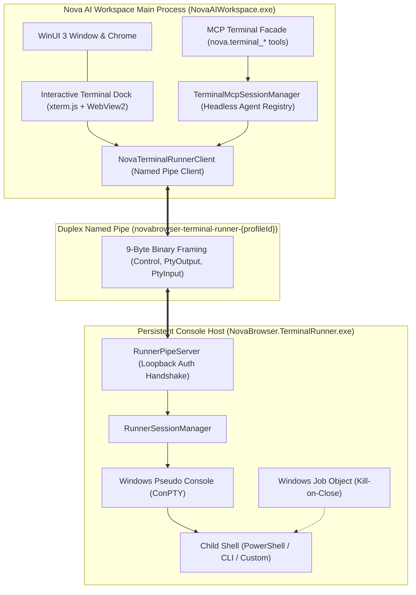
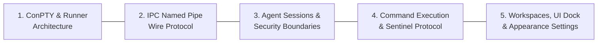
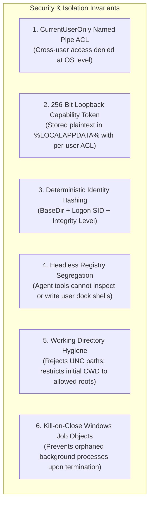

# Terminal Workspaces & ConPTY Integration

> [!NOTE]
> **Nova AI Workspace** features an enterprise-grade terminal execution environment built on the native Windows Pseudo Console (**ConPTY**) and modern virtual terminal emulation via **xterm.js**. Console processes run inside an external helper process—**`NovaBrowser.TerminalRunner.exe`**—which operates independently of the main browser UI process (`NovaAIWorkspace.exe`). This architecture ensures that development servers, compilations, test suites, and shell processes survive browser crashes, window reloads, and software updates without interruption.

---

## 1. Executive Summary & Core Architectural Axiom

Traditional agentic web browsers execute CLI commands via flat, non-interactive subprocess calls (such as `Process.Start` or `child_process.exec`). In real-world development workflows, flat subprocess execution breaks down:
* **Interactive Prompts Fail:** Tools like package managers (`npm init`), Git prompts, and authentication CLIs hang indefinitely waiting for stdin that flat subprocesses cannot provide.
* **Terminal Formatting Corrupts Output:** ANSI/VT100 escape sequences, cursor rewrites, progress bars, and box-drawing characters turn into unreadable escape noise.
* **Browser Restarts Kill Work:** If the browser reloads, updates, or crashes, every child process running in its tree is forcefully terminated.
* **No Isolation Between Human and Agent:** In flat systems, agents and users share or cross-pollute the same shell session and command history.

**The Nova Terminal Invariant:**
> *"Nova runs every terminal session inside a native Windows Pseudo Console (ConPTY), hosts sessions in a persistent external runner, and enforces a strict, physical separation between interactive human dock sessions and headless agent automation."*

---

## 2. The 5 Pillars of Terminal Workspaces

Nova's terminal architecture is divided into five specialized sub-systems, each thoroughly specified in its dedicated documentation guide:

| Sub-System | Scope & Responsibilities | Deep Dive Specification |
| :--- | :--- | :--- |
| **ConPTY & Runner Architecture** | Native ConPTY setup, Win32 flags & handle lifecycle, TTY console-handle invariant, Job Object tree enforcement, deterministic profile identity, 10s idle vs. 24h orphan lifecycle, and dual-stage acceptance gate (`--self-test`). | [ConPTY & Runner Architecture](conpty-and-runner-architecture.md) |
| **IPC Named Pipe Wire Protocol** | Duplex named pipe protocol, 9-byte binary header framing, atomic pre-composed writes, dual-channel single-writer architecture, synchronous sink registration invariant, JSON control frames, and `PtyOutputRing` circular buffer. | [IPC Wire Protocol](ipc-wire-protocol.md) |
| **Agent Sessions & Security** | Physical separation between human dock sessions and headless agent sessions, PowerShell sanitization (`Remove-Module PSReadLine`), CWD allowed-root policy, concurrency cap of 8 with automatic exited eviction, and ephemeral directory reclamation. | [Agent Sessions & Security](agent-sessions-and-security.md) |
| **Command Execution & Markers** | `terminal_run_command` mechanics, unique nonce sentinels (`NOVAEXIT_{nonce}`), high-efficiency tail scanning (256-byte overlap margin), `$?` vs `$LASTEXITCODE` exit code resolution, `RunGate` semaphore, and non-destructive timeouts. | [Command Execution & Markers](command-execution-and-markers.md) |
| **Workspaces, UI Dock & Settings** | `TerminalWorkspace` persistent entity model, `.nova/` onboarding injection, scheduled task workspaces, PowerShell discovery engine, real-time activity monitoring (2s/6s pulsing dot), mount failure recovery, WinUI 3 dock chrome, permission gating, and `NO_COLOR` environment toggles. | [Workspaces, UI Dock & Settings](workspaces-and-ui-dock.md) |

---

## 3. Session, Command, and Workspace: Conceptual Hierarchy

To prevent ambiguity, Nova defines distinct boundaries for terminal concepts:

| Entity | Lifecycle & Storage | Ownership & Visibility |
| :--- | :--- | :--- |
| **Terminal Workspace** | Stored in `%LOCALAPPDATA%\NovaBrowser\terminal-workspaces.json`. Identifies a directory, optional startup CLI (`claude`, `codex`, `powershell`), onboarding configuration, and favorites status. | Shared project entity. Visible in UI dock picker and accessible to scheduled task automation. |
| **Runner Session** | Persistent ConPTY instance hosted in `NovaBrowser.TerminalRunner.exe`. Assigned an integer ID. Tracks cumulative output offsets and child process state. | External helper level. Survives browser restarts; cleaned up when explicitly terminated or when the 24-hour orphan timer expires. |
| **Agent Session** | Headless wrapper tracked by `TerminalMcpSessionManager` in memory. Identified by an opaque public ID (`term_{hex}`). | Exclusively automation-owned. **Completely hidden from and isolated from human dock terminals.** |
| **Command Execution** | Discrete execution lifecycle within a session. Managed via `nova.terminal_run_command`. | Bounded by a timeout. **A command timeout never closes or kills the session.** |

---

## 4. Complete Terminal MCP Tool Catalog

Terminal capabilities are exposed through 12 dedicated tools across the `terminal_ops` and `app_shell_recovery` tool bundles:

### 4.1 Headless Agent Session Tools (`terminal_ops`)

| MCP Tool Name | Primary Parameters | Key Behavioral Guarantees |
| :--- | :--- | :--- |
| **`nova.terminal_open`** | `shell?`, `cwd?`, `cols?`, `rows?` | Opens an agent-owned headless session. Defaults to `120x30`. Enforces CWD allowed-roots policy. Rejects when session cap (8) is reached. |
| **`nova.terminal_run_command`** | `sessionId`, `command`, `timeoutSeconds?` | Submits a command and awaits completion via a unique sentinel nonce. Returns output and exit code. On timeout, session remains open for diagnosis. |
| **`nova.terminal_read`** | `sessionId`, `maxBytes?` | Reads up to 200 KB (default 16 KB) from the session's raw output ring. Reports cumulative byte count and whether scrollback truncation occurred. |
| **`nova.terminal_write`** | `sessionId`, `data` | Injects raw UTF-8 text into the PTY stream. Ideal for answering interactive prompts (`y/N`) or feeding multi-line scripts. |
| **`nova.terminal_send_key`** | `sessionId`, `key` | Translates named keys (`Enter`, `Tab`, `Escape`, `Ctrl+C`, `Ctrl+D`, `ArrowUp`, etc.) into VT escape sequences or control bytes. |
| **`nova.terminal_close`** | `sessionId` | Terminates the child shell and its entire process tree via Windows Job Objects. Cleans up ephemeral working directories. |
| **`nova.terminal_get_state`** | `sessionId` | Returns running state (`running` vs `exited`), exit code, working directory, and start timestamp. |
| **`nova.terminal_list`** | *(none)* | Returns an overview of all active and recently exited agent-owned terminal sessions. |

### 4.2 Interactive Dock UI Tools (`app_shell_recovery`)

| MCP Tool Name | Primary Parameters | Key Behavioral Guarantees |
| :--- | :--- | :--- |
| **`nova.terminal_dock_get_state`** | *(none)* | Inspects the current visual state of the terminal dock (`expanded`, `collapsed`, `hidden`) and active tab count. |
| **`nova.terminal_dock_set_state`** | `state` (`expanded` \| `collapsed` \| `hidden`) | Modifies the terminal dock state. **Strictly blocked** unless the user has explicitly enabled `TerminalAgentCanControlDock` in settings. |

### 4.3 Terminal Appearance & Environment Settings

| MCP Tool Name | Primary Parameters | Key Behavioral Guarantees |
| :--- | :--- | :--- |
| **`nova.terminal_settings_get`** | *(none)* | Reads current terminal theme, font size, and program color rules. Evaluates why colors are enabled or suppressed. |
| **`nova.terminal_settings_set`** | `theme?`, `fontSize?`, `programColors?` | Modifies appearance. Setting `programColors='off'` injects `NO_COLOR=1` into all newly spawned terminal shells. |

---

## 5. Security & Isolation Architecture

1. **Local Loopback Trust Model:** The named pipe connecting Nova to `TerminalRunner` uses `PipeOptions.CurrentUserOnly`. Only processes running within the same Windows logon session and integrity level can open the pipe.
2. **Hygiene vs. Jail:** The CWD check ensures agents launch shells in predictable locations (workspace directories or ephemeral temp folders). It is an operational hygiene boundary, not an OS sandbox: the shell executes with the user's standard Windows permissions.
3. **No Sidecar Command Interpretation:** In alignment with Nova's zero-sidecar rule, `TerminalRunner` never parses, modifies, or inspects shell payloads. It operates strictly as a byte transport layer, passing input and output transparently between the pseudo console and the caller.

---

## Detailed Topic Guides

For complete implementation specifications, protocol frame layouts, and edge-case behaviors, consult the subcategory documentation:

1. **[ConPTY & Runner Architecture](conpty-and-runner-architecture.md)** — Process lifecycles, Win32 flags, Job Objects, TTY handle invariant, acceptance gates (`--self-test`), and lifetime management.
2. **[IPC Named Pipe Wire Protocol](ipc-wire-protocol.md)** — Binary framing, atomic pre-composed writes, dual-channel single-writer architecture, synchronous sink registration, and ring buffers.
3. **[Agent Sessions & Security](agent-sessions-and-security.md)** — Headless registry separation, PSReadLine unloading, CWD validation, concurrency caps, and ephemeral scratch reclamation.
4. **[Command Execution & Markers](command-execution-and-markers.md)** — Nonce sentinels, high-efficiency tail scanning, exit code resolution, `RunGate`, and timeouts.
5. **[Workspaces, UI Dock & Settings](workspaces-and-ui-dock.md)** — Persistent workspaces, onboarding injection, PowerShell discovery, real-time activity monitoring, WinUI dock, and `NO_COLOR`.

---

## Related Documentation

* **[Scheduled Tasks & Automation Engine](../scheduled-tasks/README.md)** — Automated task runs bound to terminal workspaces.
* **[TerminalRunner Component Reference](../../components/terminal-runner.md)** — Standalone component specification for `NovaBrowser.TerminalRunner.exe`.
* **[Outrider Process Boundary](../../components/outrider/README.md)** — Nova's disposable native OS and hardware diagnostic process.
* **[MCP Reference & Capability Bundles](../../mcp-reference/README.md)** — Complete catalog of all MCP tools and discovery bundles.

[All core features](../README.md)
