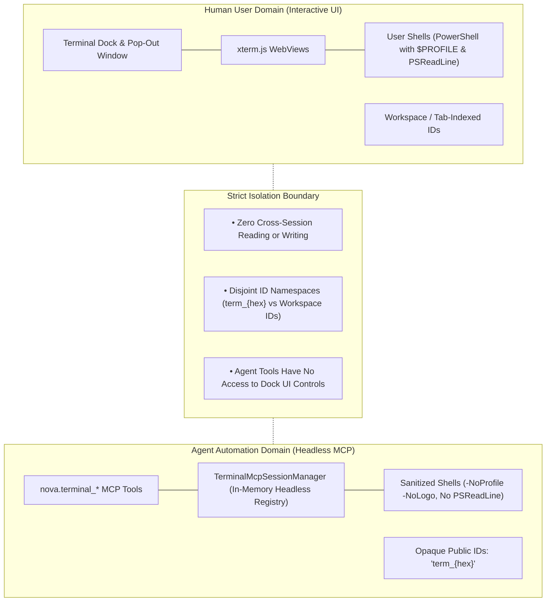
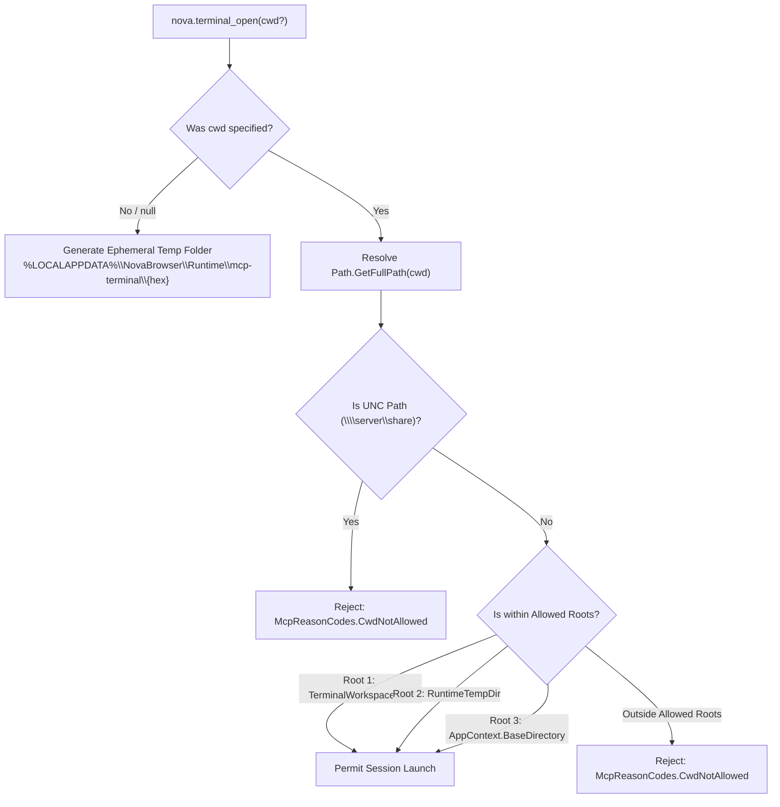

# Agent Sessions & Security Boundaries

> [!NOTE]
> This guide outlines the isolation architecture, shell sanitization protocols, working directory validation rules, and concurrency limits governing agent-owned terminal sessions in Nova AI Workspace.

---

## 1. Physical Separation of Agent and Human Sessions

A critical security principle in Nova AI Workspace is that **autonomous agents and human users never share the same terminal session namespace**.



### 1.1 The Dual-Registry Architecture
1. **Interactive Human Sessions (`MainPage.TerminalShell`):**
   * Bound to WinUI 3 controls and rendered via xterm.js inside WebView2.
   * Runs the user's customized PowerShell profile (`$PROFILE`) and full line-editing capabilities (`PSReadLine`).
   * Used interactively by developers sitting at the keyboard.
2. **Headless Agent Sessions (`TerminalMcpSessionManager`):**
   * Completely headless with **zero UI overhead**.
   * Assigned an opaque 64-bit random identifier (`term_` + 16 hex characters).
   * Managed in a separate, in-memory automation registry.
   * **Inviolable Invariant:** The MCP tools (`nova.terminal_read`, `nova.terminal_write`, `nova.terminal_run_command`) resolve identifiers *only* against the agent registry. It is mathematically impossible for an agent to read output from, write input to, or terminate a human developer's interactive dock session.
3. **Observability Without Interference:** The human terminal dock includes an "Agent Sessions" view in the project picker. This allows human operators to observe what background agents are executing, but agents have no reciprocal visibility into user terminals.

---

## 2. Headless Shell Sanitization & Environment Cleanliness

Agent sessions must produce deterministic, machine-parsable output. When launching an agent terminal, Nova enforces strict shell sanitization:

```powershell
powershell.exe -NoProfile -NoLogo -NoExit -Command "Remove-Module PSReadLine -Force -ErrorAction SilentlyContinue"
```

### 2.1 The Rationale Behind Shell Flags

| Flag / Command | Problem Prevented | Impact on Agent Automation |
| :--- | :--- | :--- |
| **`-NoProfile`** | User profile scripts (`$PROFILE`) often echo custom greeting messages, import noisy modules, or alter formatting prompts. | Eliminates prompt pollution; ensures standard PowerShell environment. |
| **`-NoLogo`** | Default PowerShell copyright banner spans 4 lines on startup. | Prevents initial banner text from contaminating command output buffers. |
| **`-NoExit`** | Standard interactive execution flag. | Keeps the shell open to receive subsequent commands over ConPTY. |
| **`Remove-Module PSReadLine`** | **Critical bug fix:** `PSReadLine` silently corrupts non-ASCII and syntax-colored output in headless consoles. | Guarantees lossless UTF-8 pass-through (detailed below). |

### 2.2 The PSReadLine Removal Invariant
During initial development, empirical testing revealed two critical failure modes caused by PowerShell's default `PSReadLine` module when operating behind a ConPTY host:
1. **Glyph Dropping:** When rendering structured tables or file trees containing Unicode box-drawing characters (`┌─┐`, `├──┤`) or emojis, `PSReadLine`'s line layout engine swallowed those characters, rendering corrupted, broken tables to the agent.
2. **ANSI Syntax Coloring:** `PSReadLine` automatically color-codes echoed input commands, injecting complex ANSI escape sequences into the stream.

By executing `Remove-Module PSReadLine` prior to displaying the first prompt, Nova restores direct, lossless UTF-8 stream transmission. While this disables interactive arrow-key history editing, agents submit commands programmatically and do not require interactive line-editing capabilities.

---

## 3. Working Directory Validation & Security Hygiene

Autonomous agents frequently need to create build artifacts or execute repositories. Nova implements strict rules governing the initial current working directory (`cwd`):



### 3.1 Default Ephemeral Directory
If an agent opens a terminal without specifying `cwd`, Nova creates a brand-new, isolated folder:
```
%LOCALAPPDATA%\NovaBrowser\Runtime\mcp-terminal\{16-hex-random}\
```
This guarantees that scratch commands do not pollute the user's project folders, the repository root, or the system temp directory.

### 3.2 Allowed Roots Policy
If an explicit `cwd` is supplied, it must resolve strictly within one of three sanctioned roots:
1. **`StoragePaths.TerminalWorkspacesDir`:** The persistent workspace directory (`%LOCALAPPDATA%\NovaBrowser\terminal-workspaces`).
2. **`StoragePaths.RuntimeTempDir`:** Nova's designated runtime temporary tree.
3. **`AppContext.BaseDirectory`:** Nova's application installation directory.

**Explicit Denials:**
* **UNC / Network Paths:** Paths starting with `\\` are strictly rejected with `McpReasonCodes.CwdNotAllowed` to prevent SMB authentication coercion and remote network execution risks.
* **Arbitrary System Drives:** Specifying `C:\Windows` or arbitrary root paths is rejected.

### 3.3 The Hygiene vs. Operating System Boundary Axiom
> [!IMPORTANT]
> The working directory validation check is **operational hygiene, not an operating system sandbox**.
> 
> A terminal session executes as a real user shell with the standard Windows permissions of the logged-in user. While an agent cannot *start* a session outside the allowed roots, once the shell is active, commands like `cd C:\Users\...` will succeed if user permissions allow it. The confinement exists in the separation of the agent registry, not in kernel filesystem sandboxing.

---

## 4. Session Concurrency Cap & Resource Limits

To protect system stability from runaway agent loops that could spawn hundreds of background shells, Nova enforces strict concurrency constraints:

* **Session Cap (`MaxConcurrentSessions = 8`):** At most **8 concurrent agent terminal sessions** may exist simultaneously.
* **Automatic Exited Eviction:** If an agent attempts to open a 9th session and an older session has already exited (`Running == false`), Nova automatically evicts the oldest exited session from memory to make room.
* **Cap Rejection:** If all 8 sessions are actively running, `nova.terminal_open` fails with:
  ```json
  {
    "ok": false,
    "reasonCode": "terminal_session_cap",
    "message": "Too many open terminal sessions (max 8). Close one first."
  }
  ```
* **Double-Checked Cap Lock:** The session count is verified both before runner session creation and inside an atomic lock during registry insertion, preventing concurrent open bursts from exceeding the limit.

---

## Related Documentation

* **[Terminal Workspaces Hub](README.md)** — Architectural overview and tool reference.
* **[ConPTY & Runner Architecture](conpty-and-runner-architecture.md)** — Process lifecycles, Job Objects, and ConPTY setup.
* **[IPC Named Pipe Wire Protocol](ipc-wire-protocol.md)** — Binary framing and stream buffering.
* **[Command Execution & Markers](command-execution-and-markers.md)** — Sentinel detection, exit codes, and timeouts.
* **[Workspaces, UI Dock & Settings](workspaces-and-ui-dock.md)** — Workspace configuration and theme settings.

[Back to Terminal Workspaces](README.md)
