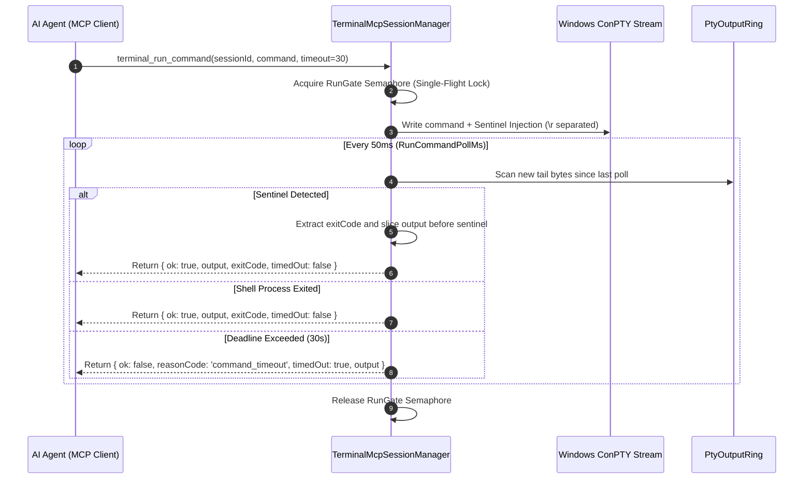

# Command Execution & Sentinel Protocol

> [!NOTE]
> This specification covers command submission, completion detection, exit-code capture, and interactive key handling across Nova's terminal MCP tools.

---

## 1. The `nova.terminal_run_command` Execution Flow

When an agent invokes `nova.terminal_run_command`, Nova submits the command to the underlying shell and awaits completion:



---

## 2. The Unique Completion Sentinel Protocol

Because `TerminalRunner` does not intercept or interpret shell internal state (the *zero-sidecar rule*), completion detection is achieved by appending a unique, verifiable sentinel:

```powershell
{command}
Write-Output "NOVAEXIT_{nonce}_$(if($?){0}elseif($LASTEXITCODE){$LASTEXITCODE}else{1})_END"
```

### 2.1 The Newline (`\r`) Separation Invariant
> [!IMPORTANT]
> The command and the sentinel are separated by a carriage return (`\r`), **never a semicolon (`;`)**.
> 
> In PowerShell, semicolons concatenate statements on the same logical line. If an agent runs a command with a trailing comment (e.g. `git status # check files`), a semicolon would place the `Write-Output` statement inside the comment, preventing it from ever executing. The tool call would hang until the timeout elapsed! Separating statements with `\r` guarantees that the sentinel executes on its own independent line.

### 2.2 Accurate Exit Code Resolution (`$?` vs. `$LASTEXITCODE`)
Determining whether a PowerShell command succeeded is notoriously complex:
* **Native Binaries:** Native tools (`git`, `npm`, `dotnet`, `python`) populate `$LASTEXITCODE` when they terminate. They do not alter `$?` directly.
* **PowerShell Cmdlets:** Built-in cmdlets (`Get-ChildItem`, `Remove-Item`, `Select-String`) update the boolean `$?`, but leave `$LASTEXITCODE` completely untouched.
* **The Failure Mode:** If only `$LASTEXITCODE` was checked, a failing cmdlet would falsely report `0` (or report a stale code from an earlier native command). If only `$?` was checked, failing native binaries would lose their precise exit code (e.g. code `137` or `2`).

**The Solution:** Nova evaluates `$?` first:
```powershell
$(if($?){0}elseif($LASTEXITCODE){$LASTEXITCODE}else{1})
```
* If `$?` is true $\rightarrow$ Reports `0` (Success).
* If `$?` is false and `$LASTEXITCODE` is set $\rightarrow$ Reports the native executable's exact exit code.
* If `$?` is false and `$LASTEXITCODE` is null $\rightarrow$ Reports `1` (Cmdlet failure).

### 2.3 Signed NTSTATUS & Crash Code Matching
Many crashing Windows executables terminate with negative exit codes or 32-bit NTSTATUS exceptions (e.g. `-1` on abort, or `-1073741819` / `0xC0000005` on access violations).

Nova's regex matches signed integers:
```csharp
Regex.Match(output, Regex.Escape(marker) + @"_(-?\d+)_END", RegexOptions.CultureInvariant);
```
Matching the optional negative sign (`-?`) ensures that crash codes are parsed immediately, preventing aborted processes from waiting out the full command timeout.

---

## 3. Concurrency Protection: The Single-Flight `RunGate`

Terminal shells are inherently stateful, single-threaded input queues. If two command executions interleave, their inputs and outputs cross-pollute, and whichever command finishes first consumes the other's sentinel.

* **Per-Session Semaphore:** Every session owns a `SemaphoreSlim RunGate = new(1, 1)`.
* **Zero-Wait Rejection:** If an agent issues `terminal_run_command` while another command is executing in the same session, Nova rejects immediately with:
  ```json
  {
    "ok": false,
    "reasonCode": "command_rejected",
    "message": "Another terminal_run_command is still running in this session. Wait for it, read its progress with terminal_read, or open a second session."
  }
  ```
* Agents that need to run independent tasks concurrently must call `nova.terminal_open` to spawn distinct sessions.

---

## 4. Single-Line Command Invariant

To preserve unambiguous attribution between submitted commands and returned exit codes:
* `nova.terminal_run_command` **rejects multi-line strings** containing `\r` or `\n`.
* An injected newline would execute intermediate lines before the sentinel is evaluated, making it impossible to determine whether earlier statements succeeded or failed.
* **Guidance for Agents:** For multi-line scripts or interactive replies, agents must use `nova.terminal_write` to stream raw text, or save the script to a `.ps1` file and invoke it as a single command.

---

## 5. The Non-Destructive Timeout Invariant

When a command exceeds its `timeoutSeconds` (default 30 seconds, maximum 3,600 seconds):
> [!IMPORTANT]
> **A command timeout never closes or kills the terminal session.**
> 
> Reaching a timeout simply means the command has not finished printing its completion sentinel. The underlying program (such as a long compilation, a local dev server, or a tool waiting for interactive confirmation) is often still actively executing.

### Recovery Workflow on Timeout
When an agent receives `reasonCode: "command_timeout"`:
1. **Inspect Progress:** Call `nova.terminal_read(sessionId)` to read the latest output and determine whether the program is still compiling or waiting for input.
2. **Answer Interactive Prompts:** If the output shows `Are you sure? (y/n):`, submit the answer using `nova.terminal_write(sessionId, data="y\r")`.
3. **Cancel Runaway Jobs:** If the job is stuck or hung, interrupt it cleanly using `nova.terminal_send_key(sessionId, key="ctrl+c")`.

---

## 6. Key Translation Catalog (`nova.terminal_send_key`)

The `nova.terminal_send_key` tool converts human-readable key names into precise VT100 control sequences and ASCII control codes:

| Key Name Argument | Translated Byte Sequence | Hex Values | Functional Behavior |
| :--- | :---: | :---: | :--- |
| `"enter"` / `"return"` | `\r` | `0x0D` | Submits carriage return. |
| `"tab"` | `\t` | `0x09` | Triggers shell autocomplete or field navigation. |
| `"escape"` / `"esc"` | `\x1b` | `0x1B` | Sends ASCII Escape (cancels prompts or exits vi modes). |
| `"backspace"` | `\x7f` | `0x7F` | Erases preceding character. |
| `"delete"` / `"del"` | `\x1b[3~` | `0x1B 0x5B 0x33 0x7E` | Forward delete in VT emulation. |
| `"up"` / `"arrowup"` | `\x1b[A` | `0x1B 0x5B 0x41` | Navigates command history backward. |
| `"down"` / `"arrowdown"`| `\x1b[B` | `0x1B 0x5B 0x42` | Navigates command history forward. |
| `"right"` / `"arrowright"`| `\x1b[C` | `0x1B 0x5B 0x43` | Moves cursor right. |
| `"left"` / `"arrowleft"`| `\x1b[D` | `0x1B 0x5B 0x44` | Moves cursor left. |
| `"home"` | `\x1b[H` | `0x1B 0x5B 0x48` | Moves cursor to start of line. |
| `"end"` | `\x1b[F` | `0x1B 0x5B 0x46` | Moves cursor to end of line. |
| `"ctrl+c"` | `\x03` | `0x03` | Sends SIGINT / Interrupt signal (stops running command). |
| `"ctrl+d"` | `\x04` | `0x04` | Sends EOF (exits bash / REPL sessions). |
| `"ctrl+z"` | `\x1a` | `0x1A` | Sends EOF in Windows shells. |
| `"ctrl+l"` | `\x0c` | `0x0C` | Clears terminal screen. |

---

## Related Documentation

* **[Terminal Workspaces Hub](README.md)** — Architectural overview and tool reference.
* **[ConPTY & Runner Architecture](conpty-and-runner-architecture.md)** — Process lifecycles, Job Objects, and ConPTY setup.
* **[IPC Named Pipe Wire Protocol](ipc-wire-protocol.md)** — Binary framing, JSON schemas, and ring buffers.
* **[Agent Sessions & Security](agent-sessions-and-security.md)** — Isolation and working directory validation.
* **[Workspaces, UI Dock & Settings](workspaces-and-ui-dock.md)** — Workspace configuration and theme settings.

[Back to Terminal Workspaces](README.md)
