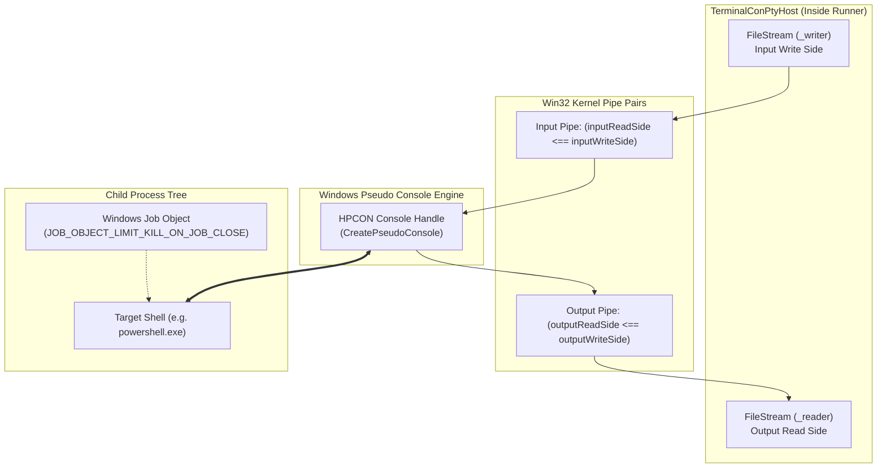
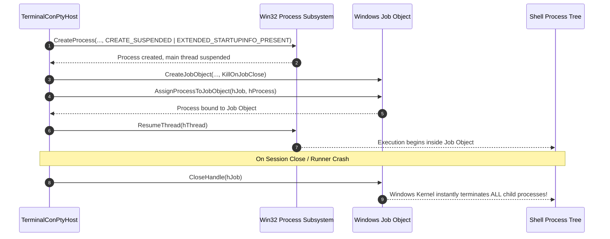
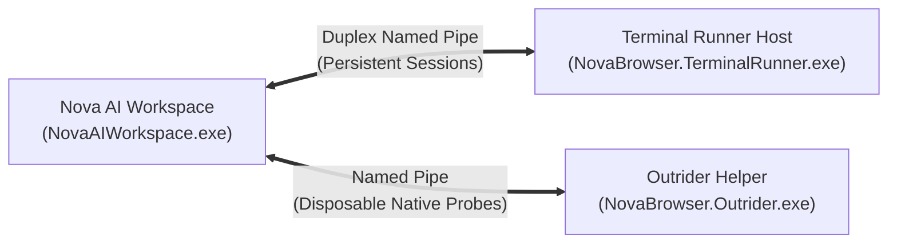
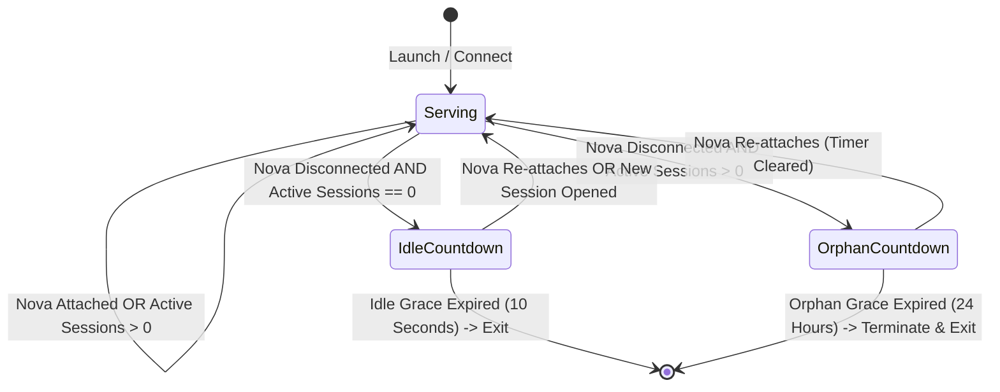
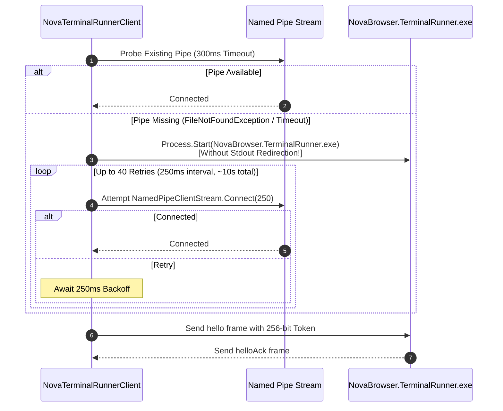
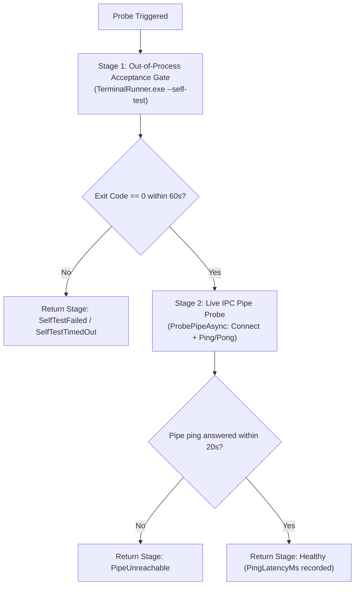

# ConPTY & TerminalRunner Architecture

> [!NOTE]
> This guide details the low-level operating system integration, process lifecycle management, and Windows Pseudo Console (**ConPTY**) architecture powering Nova AI Workspace's terminal execution environment.

---

## 1. Native Windows Pseudo Console (ConPTY) Host

Traditional Windows console applications historically relied on hidden `conhost.exe` windows or redirected anonymous pipes. Anonymous pipe redirection fails for interactive CLI tools because standard pipes lack terminal semantics (cursor positioning, ANSI/VT escape sequences, raw keyboard input, window resize notifications).

Nova leverages the **Windows Pseudo Console (ConPTY) API** introduced in Windows 10 (build 17763+), implemented in `TerminalConPtyHost`.



### 1.1 The Pipe and Handle Setup Invariant
Setting up a ConPTY host requires strict synchronization of four separate pipe handles:
1. **Pipe Creation:** Two distinct pipe pairs are created via Win32 `CreatePipe`:
   * Input pipe: `inputReadSide` and `inputWriteSide`.
   * Output pipe: `outputReadSide` and `outputWriteSide`.
2. **Pseudo Console Initialization:** `CreatePseudoConsole` is called, binding `inputReadSide` and `outputWriteSide` to the new `HPCON` handle with initial dimensions (`COORD { X = cols, Y = rows }`).
3. **Handle Duplication & Ownership Cleanup:**
   * The ConPTY subsystem duplicates the child-facing pipe handles into its internal subsystem.
   * `TerminalConPtyHost` **must immediately close** its local copies of `inputReadSide` and `outputWriteSide`.
   * If these child-facing ends are not closed immediately, the pipes will never signal EOF when the child process exits, causing read loops to block permanently.
4. **Host Stream Binding:** The host wraps the remaining ends (`inputWriteSide` and `outputReadSide`) in managed `FileStream` instances backed by owning `SafeFileHandle` wrappers.

### 1.2 Teardown Order Invariant
When terminating a session, the teardown sequence is critical to prevent kernel deadlocks:
> [!IMPORTANT]
> `ClosePseudoConsole(hpcon)` **must execute strictly before** the output stream (`_reader`) is closed or disposed.
> 
> If the read stream is closed before `ClosePseudoConsole` is invoked, the ConPTY background driver blocks attempting to drain buffer flushes. Conversely, closing `ClosePseudoConsole` first causes the driver to flush remaining bytes and close its pipe handle, allowing the host read loop to observe clean EOF and exit normally.

---

## 2. Windows Job Objects: Guaranteed Process Tree Cleanup

A pervasive failure mode in developer tooling is the **orphaned process leak**: an agent starts a compilation (`dotnet watch`, `npm run dev`, `docker-compose`), and when the terminal is closed, the root shell exits but the background child processes remain running, locking file handles and consuming CPU.

Nova enforces process tree hygiene via **Windows Job Objects** (`JobObjectHelper`):



### 2.1 The Spawn Suspended Invariant
To prevent race conditions where a child spawns grandchild processes before job assignment finishes:
* The shell process is created with `CREATE_SUSPENDED`.
* The thread attribute list binds `PROC_THREAD_ATTRIBUTE_PSEUDOCONSOLE = (IntPtr)0x00020016` to link standard handles directly to `HPCON`.
* The process is assigned to the Job Object configured with `JOB_OBJECT_LIMIT_KILL_ON_JOB_CLOSE`.
* Only after successful job assignment does `ResumeThread` awaken the main thread.
* **The Graceful Degradation Fallback:** If a restrictive host security product or enterprise endpoint agent blocks `AssignProcessToJobObject`, the failure is logged and recorded (`JobAssignmentFailed = true`), but the terminal is permitted to start. Refusing to launch would trade a rare orphaned process for a guaranteed terminal outage.

### 2.2 Win32 Creation Flags & Environment Marshalling
Spawning a ConPTY child process requires precise low-level Win32 flag orchestration in `TerminalConPtyHost`:

| Win32 Constant | Value | Purpose in Nova Terminal Host |
| :--- | :---: | :--- |
| `EXTENDED_STARTUPINFO_PRESENT` | `0x00080000` | Instructs `CreateProcess` to interpret the startup parameter as `STARTUPINFOEX` containing the ConPTY thread attribute list. |
| `CREATE_SUSPENDED` | `0x00000004` | Freezes the primary thread at entry point, guaranteeing that `AssignProcessToJobObject` completes before any code executes. |
| `CREATE_UNICODE_ENVIRONMENT` | `0x00000400` | Informs the kernel that the environment block pointer references 16-bit Unicode characters (`wchar_t`) rather than legacy ANSI. |
| `PROC_THREAD_ATTRIBUTE_PSEUDOCONSOLE` | `0x00020016` | Binds the `HPCON` pseudo console handle directly to the child process's standard input, output, and error streams. |

* **Zero Handle Leakage (`bInheritHandles = false`):** Because ConPTY transfers stdio handles through the attribute list, handle inheritance is explicitly disabled. Child processes never inherit Nova's or the runner's internal pipe, file, or socket handles.
* **Native Environment Marshalling:** Environment blocks are compiled as contiguous, null-delimited (`\0`), double-null-terminated (`\0\0`) UTF-16 blocks allocated in unmanaged memory via `Marshal.AllocHGlobal`. The unmanaged pointer is freed immediately after `CreateProcess` returns, preventing memory leaks.

---

## 3. The Persistent Helper Process (`NovaBrowser.TerminalRunner.exe`)

Console processes do not run inside `NovaAIWorkspace.exe`. They are hosted inside the dedicated helper process: **`NovaBrowser.TerminalRunner.exe`**.



### 3.1 Architectural Difference: TerminalRunner vs. Outrider

| Dimension | `NovaBrowser.TerminalRunner.exe` | `NovaBrowser.Outrider.exe` |
| :--- | :--- | :--- |
| **Primary Mission** | Persistent console host for long-running shells, dev servers, and jobs. | Disposable native execution probe for hardware, TLS, and OS introspection. |
| **Parent Superversion** | **Independent lifetime.** Survives Nova restarts, crashes, and updates. | **Supervised lifecycle.** Automatically killed if parent Nova process exits. |
| **Heartbeat Model** | No heartbeat. Operates on a pure wall-clock idle/orphan state machine. | Active heartbeat monitoring; strict parent-PID watch. |
| **Process Tree Policy** | Job Object per terminal session. | Job Object per probe invocation. |

---

## 4. Runner Lifetime State Machine (`RunnerLifetime`)

The runner uses a deterministic wall-clock state machine that balances two competing requirements:
1. **Never kill working sessions:** Long-running dev servers or builds must survive when Nova restarts.
2. **Never leak running processes forever:** Abandoned runner instances must not hold open directory locks on `dist/` or consume system memory indefinitely.



### 4.1 The Three Lifetime Invariants
* **Attached Guard:** As long as an authenticated Nova connection is open, the runner **never exits**, regardless of session count.
* **The 10-Second Idle Grace:** When the runner hosts zero sessions and has no attached Nova connection, it waits for **10 seconds** (`IdleExitGraceSeconds = 10`) before exiting. This short grace allows Nova to briefly disconnect during hot reloads without churning runner processes, while ensuring the process exits quickly so software updaters and builds can overwrite `dist/NovaBrowser.TerminalRunner.exe` without meeting `ERROR_ACCESS_DENIED`.
* **The 24-Hour Orphan Grace:** If Nova crashes or is closed while active sessions exist, the runner enters the **24-hour orphan grace period** (`OrphanExitGraceHours = 24`). The runner maintains hosted dev servers and shells for a full day. If a user reopens Nova within 24 hours, the terminal dock re-attaches to the surviving sessions. If unattended for 24 hours, the runner terminates all sessions and exits.

---

## 5. Deterministic Profile Identity & Security Handshake

Nova supports running multiple isolated browser profiles concurrently. Each profile must connect strictly to its own dedicated `TerminalRunner` instance without interference.

### 5.1 Profile Identity Derivation (`TerminalRunnerIdentity`)
The named pipe and mutex names are computed deterministically from three invariant system attributes:
```csharp
var seed = $"{normalizedBaseDir}|{logonSid}|{integritySid}";
var hash = SHA256.HashData(Encoding.UTF8.GetBytes(seed));
var profileId = Convert.ToHexString(hash.AsSpan(0, 8)); // 16 hex chars
```

* **Storage Base Directory:** Normalizes profile root path (`%LOCALAPPDATA%\NovaBrowser`).
* **Windows Logon SID:** Ensures remote desktop (RDP) sessions and local physical console sessions never cross or share runner pipes.
* **Process Integrity Level:** Ensures an elevated (Administrator) Nova instance and a standard-user Nova instance run completely isolated terminal hosts.
* **Pipe Name:** `novabrowser-terminal-runner-{profileId}`.
* **Mutex Name:** `Local\NovaBrowser.TerminalRunner.{profileId}`.

### 5.2 Named Pipe Security & Capability Handshake
1. **OS-Level Pipe ACL:** The pipe is opened with `PipeOptions.CurrentUserOnly`. Windows kernel security blocks access from any other user account on the machine.
2. **Capability Token Verification:** Nova generates a 256-bit cryptographic token stored in `%LOCALAPPDATA%\NovaBrowser\terminal-runner.token`. Upon connecting, Nova transmits this token in the `hello` control frame. The runner verifies the token against disk before accepting session commands.

---

## 6. The Connect-or-Spawn State Machine & TTY Console-Handle Invariant

`NovaTerminalRunnerClient.ConnectAsync` handles establishing, spawning, and reconnecting the IPC channel to `NovaBrowser.TerminalRunner.exe`.



### 6.1 The TTY Console-Handle Invariant
When spawning `NovaBrowser.TerminalRunner.exe`, `ProcessStartInfo` is configured with:
* `UseShellExecute = false`
* `CreateNoWindow = true`
* **`RedirectStandardOutput = false` and `RedirectStandardError = false`**

> [!IMPORTANT]
> **The Console-Handle Invariant:** Standard output and standard error must **never** be redirected when launching `TerminalRunner`.
> 
> Under Windows, redirecting stdout/stderr causes the OS loader to replace the process's standard console handles (`STD_OUTPUT_HANDLE`) with anonymous pipe handles. When the runner subsequently attempts to initialize ConPTY (`CreatePseudoConsole`) for child shells, the Windows console subsystem fails or creates corrupted pseudo consoles because the calling process lacks a true Win32 console handle. Launching the runner without redirected I/O guarantees that it can allocate, bind, and duplicate pseudo consoles cleanly.

---

## 7. The Dual-Stage Acceptance Gate & Health Probe (`TerminalRunnerHealthProbe`)

In Nova's About settings and system diagnostics, validating the terminal subsystem requires more than a simple IPC ping.



### 7.1 Why Pipe Ping Alone is Insufficient
A runner whose window station, desktop heap, or console allocation has degraded can still accept TCP/pipe connections and reply to JSON ping frames. If a health probe merely tests the pipe, it reports "Ready" even when the runner is completely incapable of launching shells.

`TerminalRunnerHealthProbe` executes in two sequential stages:
1. **Stage 1: The Standalone Acceptance Gate (`--self-test`):**
   * Spawns `NovaBrowser.TerminalRunner.exe --self-test` as an isolated one-shot process.
   * Tests whether `CreatePseudoConsole` succeeds on the host.
   * Launches a temporary child shell and verifies that it detects a valid TTY.
   * Verifies that the child process is contained inside a Job Object and terminates cleanly when closed.
   * Verifies that the runner itself is not trapped in an unwanted parent Job Object.
   * Expects exit code `0` (`SelfTestPassExitCode`) within a 60-second budget.
2. **Stage 2: Live Pipe Latency Probe:**
   * Only after Stage 1 passes does Nova connect to the active runner pipe, transmit a `ping` frame, and record round-trip latency (`PingLatencyMs`).

---

## 8. Mutex Ownership & Crash Recovery (`RunnerSingleton`)

To ensure only one runner process serves a profile at any given time, `NovaBrowser.TerminalRunner.exe` employs a named system mutex: `Local\NovaBrowser.TerminalRunner.{profileId}`.

### 8.1 Seamless Crash Takeover (`AbandonedMutexException`)
If a runner process terminates abnormally (system power failure, OS task kill, or hardware crash), the Windows kernel marks the owned mutex as *abandoned*.

When a newly spawned runner attempts to acquire the mutex:
```csharp
try
{
    _owned = _mutex.WaitOne(TimeSpan.Zero);
}
catch (AbandonedMutexException)
{
    // The previous runner process crashed without releasing the mutex.
    // The OS grants ownership to this new instance.
    _owned = true;
}
```
Handling `AbandonedMutexException` allows the new runner to immediately take over without hanging or failing to start due to stale lock files.

### 8.2 Clean Shutdown for Installer Updates (`shutdown`)
When Nova is preparing to install an update or close completely:
* Nova transmits the `shutdown` control frame over the named pipe.
* The runner terminates all active session Job Objects, unregisters its named pipe server, releases its singleton mutex, and exits cleanly.
* This releases all file locks on `dist\NovaBrowser.TerminalRunner.exe`, ensuring installer updates and builds complete without file-in-use errors.

---

## Related Documentation

* **[Terminal Workspaces Hub](README.md)** — Architectural overview and tool reference.
* **[IPC Named Pipe Wire Protocol](ipc-wire-protocol.md)** — Framing format, ring buffers, and control payloads.
* **[Agent Sessions & Security](agent-sessions-and-security.md)** — Isolation between agent sessions and human dock terminals.
* **[Command Execution & Markers](command-execution-and-markers.md)** — Sentinel detection, exit codes, and timeouts.
* **[Workspaces, UI Dock & Settings](workspaces-and-ui-dock.md)** — Workspace persistence and appearance customization.

[Back to Terminal Workspaces](README.md)
