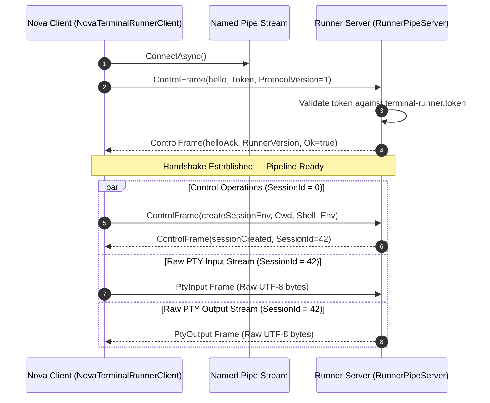
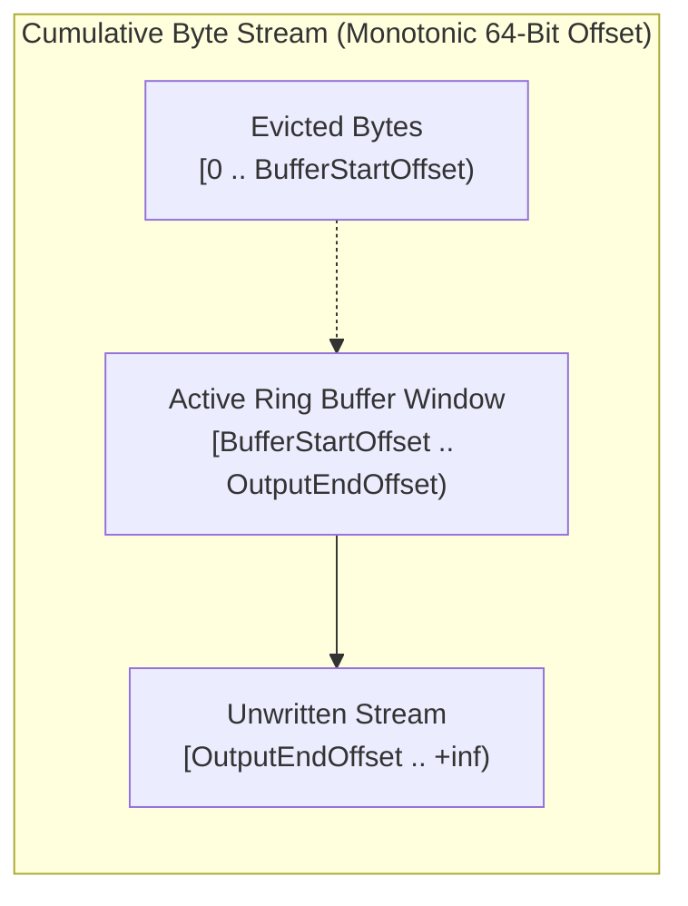

# IPC Named Pipe Wire Protocol

> [!NOTE]
> This specification defines the low-level binary envelope, framing rules, control message schemas, and circular stream buffering used across the duplex Named Pipe connecting **Nova AI Workspace** (`NovaAIWorkspace.exe`) and **`NovaBrowser.TerminalRunner.exe`**.

---

## 1. Protocol Architecture & Connection Lifecycle

Communication between Nova and the terminal runner occurs over a single, full-duplex Windows Named Pipe named `novabrowser-terminal-runner-{profileId}`.



---

## 2. The 9-Byte Binary Envelope Framing

Every message transmitted over the pipe—whether a JSON control directive or a stream of raw PTY bytes—is wrapped in a fixed 9-byte header:

```
 0                   1                   2                   3
 0 1 2 3 4 5 6 7 8 9 0 1 2 3 4 5 6 7 8 9 0 1 2 3 4 5 6 7 8 9 0 1
+-+-+-+-+-+-+-+-+-+-+-+-+-+-+-+-+-+-+-+-+-+-+-+-+-+-+-+-+-+-+-+-+
|                   PayloadLength (int32 LE)                    |
+-+-+-+-+-+-+-+-+-+-+-+-+-+-+-+-+-+-+-+-+-+-+-+-+-+-+-+-+-+-+-+-+
|   FrameType   |            SessionId (int32 LE)...            |
+-+-+-+-+-+-+-+-+-+-+-+-+-+-+-+-+-+-+-+-+-+-+-+-+-+-+-+-+-+-+-+-+
|  ...SessionId |          Payload Data (0 to N bytes)          |
+-+-+-+-+-+-+-+-+                                               +
|                               ...                             |
+-+-+-+-+-+-+-+-+-+-+-+-+-+-+-+-+-+-+-+-+-+-+-+-+-+-+-+-+-+-+-+-+
```

### 2.1 Header Field Definitions

| Field Name | Type / Size | Valid Values | Description |
| :--- | :---: | :---: | :--- |
| **`PayloadLength`** | `int32` (4 Bytes LE) | `0` to `1,048,576` | Length of the payload in bytes. Guarded by `MaxFrameBytes = 1 MB`. Negative or oversize lengths immediately abort the connection. |
| **`FrameType`** | `byte` (1 Byte) | `0`, `1`, `2` | Identifies payload type:<br/>• `0x00`: **`Control`** (UTF-8 JSON)<br/>• `0x01`: **`PtyOutput`** (Raw console bytes from child to host)<br/>• `0x02`: **`PtyInput`** (Raw input bytes from host to child) |
| **`SessionId`** | `int32` (4 Bytes LE) | `0` or `1..N` | Routing identifier. **Always `0` for control frames.** For `PtyOutput` and `PtyInput`, matches the runner's session integer ID. |
| **`Payload`** | `byte[]` | `Length` Bytes | Variable payload data. Parsed as JSON if `FrameType == 0`; forwarded as raw unparsed bytes otherwise. |

---

## 3. The Pre-Composed Atomic Write Invariant

In high-concurrency environments, asynchronous cancellation tokens pose a severe risk to stream framing:
> [!IMPORTANT]
> If a write operation is cancelled midway between transmitting the 9-byte header and the payload body, the receiver will read a valid header but receive payload bytes belonging to the *subsequent* frame. The stream framing becomes permanently corrupted and unrecoverable.
> 
> To guarantee stream integrity, `TerminalRunnerProtocol.WriteFrameAsync` enforces the **Pre-Composed Write Invariant**:
> 1. The header and payload are composed into a single contiguous buffer: `new byte[9 + payload.Length]`.
> 2. `cancellationToken.ThrowIfCancellationRequested()` is verified strictly **before** writing begins.
> 3. The write call itself executes with `CancellationToken.None`, ensuring that once the first byte enters the named pipe, the entire frame is committed atomically.

---

## 4. Control Frame Schema & Message Catalog

Control frames (`FrameType == 0`) serialize a unified `ControlFrame` JSON object. Unused fields are omitted on the wire (`JsonIgnoreCondition.WhenWritingNull`):

```json
{
  "type": "createSessionEnv",
  "requestId": 104,
  "command": "powershell.exe -NoProfile -NoLogo",
  "cwd": "C:\\Workspace\\Project",
  "cols": 120,
  "rows": 30,
  "env": {
    "API_KEY": "secret_value_123"
  }
}
```

### 4.1 Message Catalog Reference

| Message `type` | Direction | Key Payload Attributes | Purpose & Behavioral Rules |
| :--- | :---: | :--- | :--- |
| **`hello`** | Client $\rightarrow$ Runner | `token`, `protocolVersion=1` | Initial handshake. Transmits the 256-bit capability token. |
| **`helloAck`** | Runner $\rightarrow$ Client | `ok`, `runnerVersion`, `protocolVersion` | Confirms authentication. Echoes runner assembly version. |
| **`ping` / `pong`** | Bi-directional | *(none)* | Liveness verification frame. |
| **`listSessions`** | Client $\rightarrow$ Runner | *(none)* | Requests array of active session IDs. |
| **`sessionList`** | Runner $\rightarrow$ Client | `sessions` (`int[]`) | Returns IDs of all currently live sessions. |
| **`createSession`** | Client $\rightarrow$ Runner | `requestId`, `command`, `cwd`, `cols`, `rows` | Spawns a new shell process in a pseudo console. |
| **`createSessionEnv`** | Client $\rightarrow$ Runner | `requestId`, `command`, `cwd`, `cols`, `rows`, `env` | Spawns shell with injected environment variables (used for workspace secrets). |
| **`sessionCreated`** | Runner $\rightarrow$ Client | `requestId`, `sessionId`, `jobAssignmentFailed` | Confirms shell creation. Returns the unique integer `sessionId`. |
| **`attachSession`** | Client $\rightarrow$ Runner | `sessionId`, `resumeOffset` | Attaches a Nova display or reader to an existing session, replaying from `resumeOffset`. |
| **`attachAck`** | Runner $\rightarrow$ Client | `sessionId`, `startOffset` | Confirms attachment and indicates starting byte offset. |
| **`detachSession`** | Client $\rightarrow$ Runner | `sessionId` | Detaches the active view while keeping the child shell running in the background. |
| **`detachAck`** | Runner $\rightarrow$ Client | `sessionId` | Confirms detachment. |
| **`resize`** | Client $\rightarrow$ Runner | `sessionId`, `cols`, `rows` | Resizes the underlying ConPTY dimensions (`ResizePseudoConsole`). |
| **`terminateSession`** | Client $\rightarrow$ Runner | `sessionId` | Closes the session's Job Object, killing the shell and all descendant processes. |
| **`terminateAll`** | Client $\rightarrow$ Runner | *(none)* | Emergency stop: immediately terminates all sessions currently hosted by the runner. |
| **`shutdown`** | Client $\rightarrow$ Runner | *(none)* | Deliberate quit: terminates all sessions and causes the runner process to exit cleanly. |
| **`shutdownAck`** | Runner $\rightarrow$ Client | `ok=true` | Confirms shutdown request received. |
| **`sessionExited`** | Runner $\rightarrow$ Client | `sessionId`, `exitCode` | Unsolicited notification sent when a child shell process terminates. |
| **`freshReplayUnavailable`**| Runner $\rightarrow$ Client | `sessionId` | Sent when the requested `resumeOffset` has been evicted from the output ring. |
| **`sessionStats`** | Client $\rightarrow$ Runner | `sessionId` | Queries ring buffer state without attaching. |
| **`sessionStatsAck`** | Runner $\rightarrow$ Client | `sessionId`, `ringStartOffset`, `ringEndOffset`, `running` | Returns buffer bounds and running status. |

---

## 5. The Output Ring Buffer (`PtyOutputRing`)

Each session inside the runner maintains an in-memory output ring (`PtyOutputRing`) designed for high-performance terminal capture and reattachment:



### 5.1 Cumulative Offset Accounting
* Terminal output is treated as a continuous, monotonic stream of bytes.
* Cumulative byte counts frequently exceed 2 GB for long-running compilation loops; therefore, offsets are strictly 64-bit integers (`long`).
* **`BufferStartOffset`:** The earliest byte offset still retained in memory.
* **`OutputEndOffset`:** The total cumulative bytes written to the session since creation.

### 5.2 Clamped Reads and Race Protection
When reading output from the ring (`ReadFromClamped(startOffset)`):
* The requested offset is clamped against `BufferStartOffset` inside a single lock.
* If a concurrent write evicts bytes while a read is being calculated, the read automatically clamps to the earliest surviving byte rather than throwing an out-of-bounds error or returning an empty string.

### 5.3 Slow Consumer Protection
If Nova's UI thread or renderer cannot consume terminal output as fast as a child process generates it:
* The runner **never pauses or blocks the child process**.
* Instead, the active attachment buffer drops the UI view (`attachment.TryEnqueueOutput(bytes)` fails $\rightarrow$ view detached).
* The child process continues executing unhindered, and the full output continues accumulating in the session's raw output ring. Nova can simply re-attach and request the latest tail.

---

## Related Documentation

* **[Terminal Workspaces Hub](README.md)** — Architectural overview and tool reference.
* **[ConPTY & Runner Architecture](conpty-and-runner-architecture.md)** — Process lifecycles, Job Objects, and ConPTY host setup.
* **[Agent Sessions & Security](agent-sessions-and-security.md)** — Headless agent session isolation.
* **[Command Execution & Markers](command-execution-and-markers.md)** — Nonce sentinel detection and exit codes.
* **[Workspaces, UI Dock & Settings](workspaces-and-ui-dock.md)** — Workspace configuration and theme settings.

[Back to Terminal Workspaces](README.md)
