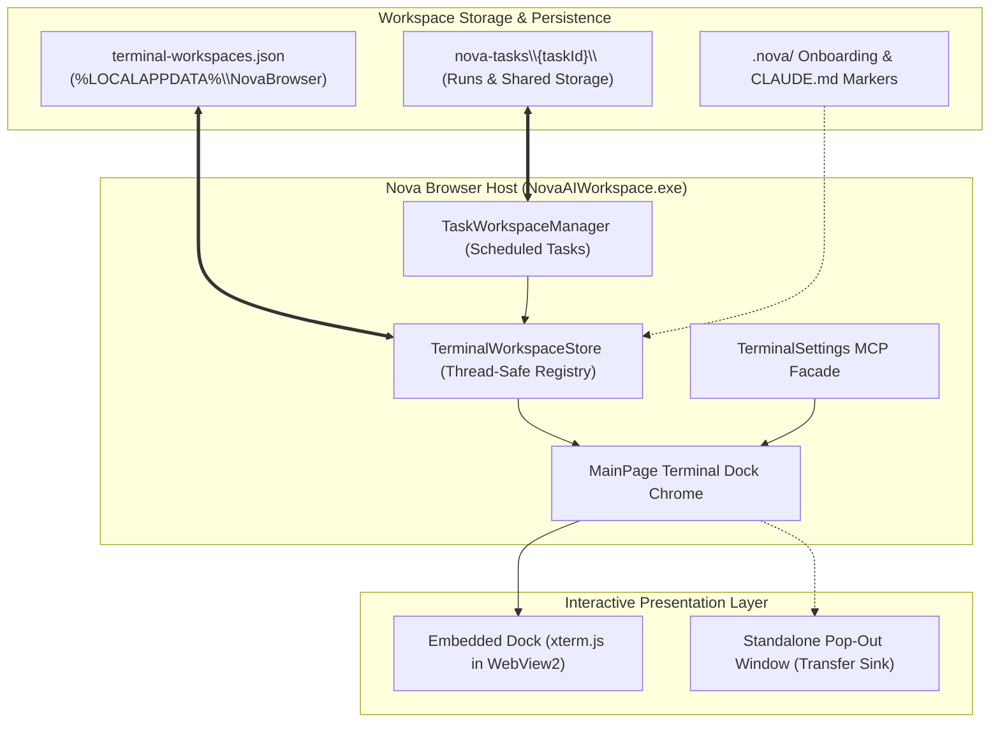
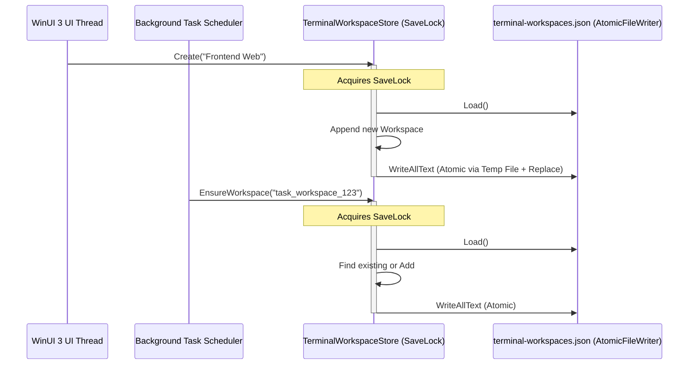
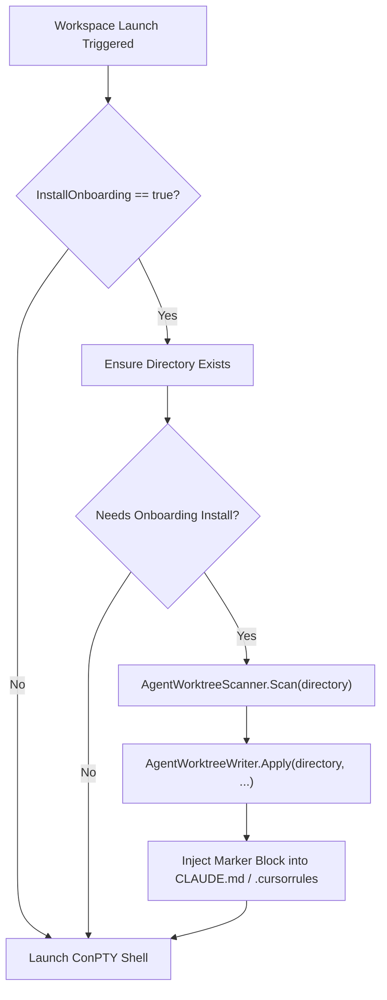
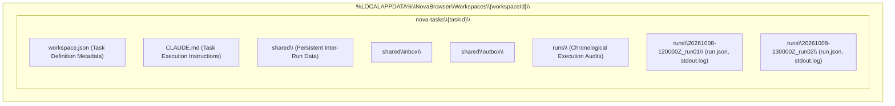
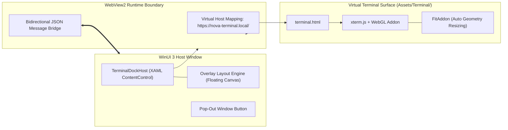
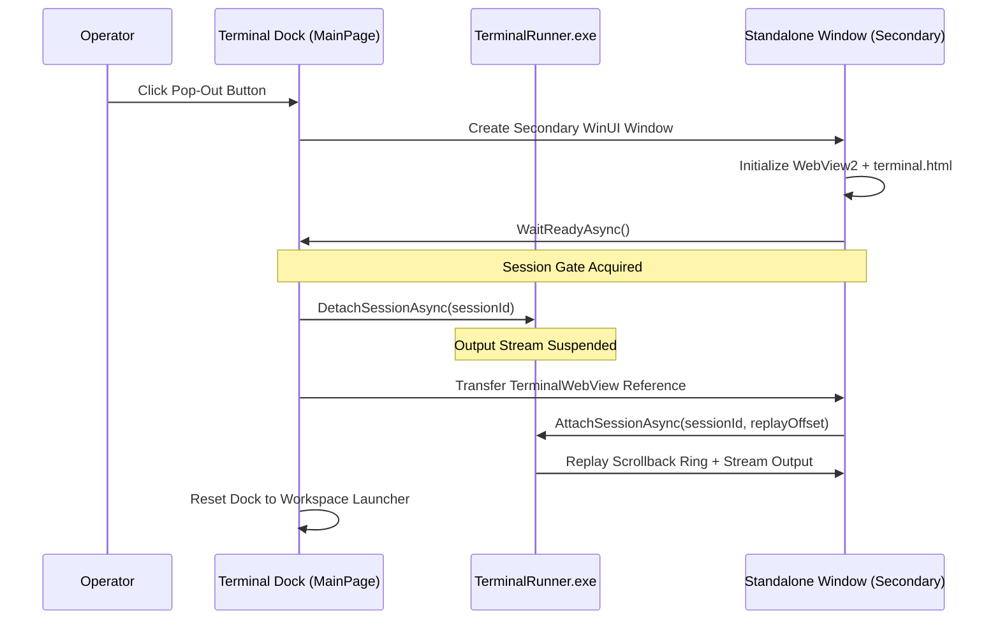
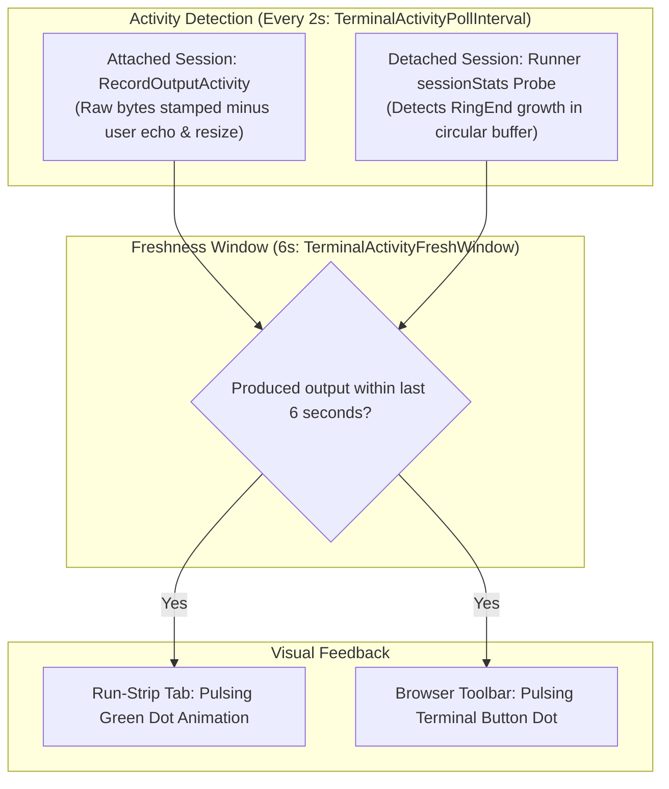
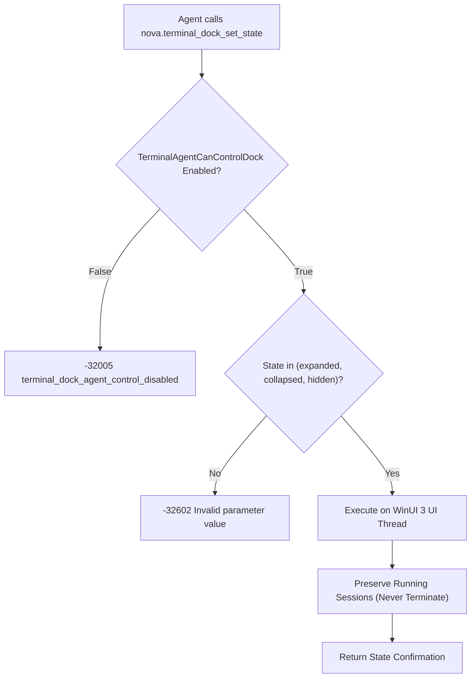
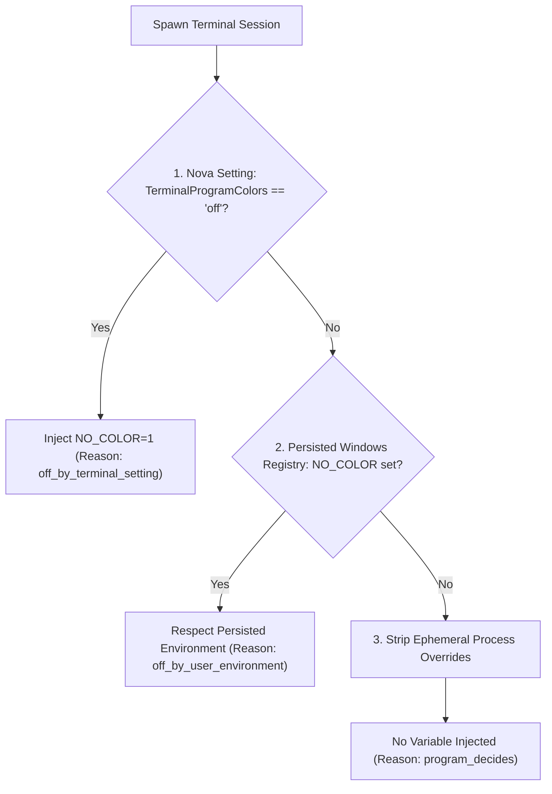

# Workspaces, UI Dock & Appearance Settings

> [!NOTE]
> This guide details the high-level user interface, project workspace management, agent onboarding injection, and terminal environment styling of **Nova AI Workspace**. It covers the `TerminalWorkspace` persistent entity model, integration with scheduled tasks, the WinUI 3 + xterm.js interactive dock architecture, pop-out window transfer mechanics, agent dock permission gating, and the three-tier `NO_COLOR` environment resolution hierarchy.

---

## 1. Executive Summary & Architectural Overview

While headless agent commands execute transparently in the background, human operators interact with terminal environments through project-centric workspaces and a docked WinUI 3 console. Nova bridges both worlds while preserving strict operational boundaries:



### Core Invariants

1. **Workspace Identity Stability:** A workspace's unique ID (`Id: string`, 32-character lowercase hex GUID) defines its on-disk folder path. Once assigned, this directory path is **immutable**. Renaming a workspace in the UI modifies only its `DisplayName`, ensuring that CLI state directories (such as Claude Code's project session buckets or Git commit caches) are never forked or orphaned.
2. **Transfer-Only Window Pop-Out:** A ConPTY runner session supports at most one active consumer attachment. Popping a terminal out of the browser dock into a standalone desktop window is a **stream transfer**, never a mirror or clone. The dock releases the session and returns to the workspace launcher.
3. **Strict Dock Agent Permission Gate:** Headless automation cannot arbitrarily expand, collapse, or hide the user's interactive terminal dock. The `nova.terminal_dock_set_state` MCP tool is strictly blocked unless the human user explicitly toggles `TerminalAgentCanControlDock` in browser settings.
4. **Three-Tier Color Hierarchy:** Nova isolates child terminal processes from parent environment pollution. Transferred variables like `NO_COLOR=1` from parent test harnesses or CI runners are stripped unless explicitly defined in the user's persistent Windows registry or selected in Nova settings.

---

## 2. Terminal Workspace Data Model & Persistence

A **Terminal Workspace** is a persistent project configuration that associates a working directory with an optional startup shell, onboarding assets, and display metadata.

### 2.1 Entity Schema (`TerminalWorkspace`)

Workspaces are stored as a JSON array in `%LOCALAPPDATA%\NovaBrowser\terminal-workspaces.json`:

```json
[
  {
    "id": "7f8b9c0d1e2f3a4b5c6d7e8f9a0b1c2d",
    "displayName": "Nova Core Engine",
    "shell": "powershell.exe",
    "workingDirectory": "C:\\Projects\\NovaBrowser",
    "installOnboarding": true,
    "isFavorite": true,
    "isTaskOwned": false,
    "createdUtc": "2026-08-15T09:30:00Z",
    "lastUsedUtc": "2026-10-08T14:22:10Z"
  }
]
```

| Field | Type | Default | Description |
| :--- | :--- | :--- | :--- |
| `Id` | `string` | `Guid.NewGuid().ToString("N")` | Stable 32-character hexadecimal GUID. Serves as the on-disk directory name under `%LOCALAPPDATA%\NovaBrowser\Workspaces\{id}\`. **Never modified after creation.** |
| `DisplayName` | `string` | `""` | User-facing display title. Clamped to a maximum of 80 characters. Editing this field renames the workspace in the UI without altering filesystem paths. |
| `Shell` | `string` | `""` (defaults to `powershell.exe`) | CLI command or binary launched upon opening. Supports standard shells (`powershell.exe`, `cmd.exe`) or PATH-resolvable tools (`claude`, `codex`). |
| `WorkingDirectory` | `string` | `""` | Target project root. If empty, defaults to the internal Nova-owned workspace directory (`Workspaces\{id}\`). |
| `InstallOnboarding` | `bool` | `true` | When `true`, launching the workspace automatically seeds `.nova/` reference documentation and updates agent instruction markers (`CLAUDE.md`). |
| `IsFavorite` | `bool` | `false` | When `true`, workspace is pinned to the favorites section of the terminal dock launcher. |
| `IsTaskOwned` | `bool` | `false` | Indicates whether the workspace was created by Nova's scheduled task engine. Governs deletion lifecycle. |
| `CreatedUtc` | `DateTime` | `DateTime.UtcNow` | Creation timestamp. |
| `LastUsedUtc` | `DateTime` | `DateTime.UtcNow` | Updated whenever the workspace is launched; drives recent-first sorting in the dock picker. |

### 2.2 Thread-Safe Registry Mutex (`TerminalWorkspaceStore`)

The workspace registry must handle concurrent access: the human user creates and renames workspaces on the WinUI 3 UI thread, while the scheduled task background scheduler seeds and updates workspaces from background thread pools.

`TerminalWorkspaceStore` coordinates mutations through a process-wide `lock (SaveLock)`:



* **Atomic Disk Commits:** Serialization uses `AtomicFileWriter`, writing to a temporary file (`.tmp`) before performing an atomic filesystem replace. This eliminates corruption risks if the process terminates mid-write.
* **Pure Mutation Lambdas:** Methods like `Mutate(Func<List<TerminalWorkspace>, bool>)` serialize read-modify-save operations within a single locked critical section.

---

## 3. Agent Onboarding Injection (`.nova/`)

When a workspace is created or launched with `InstallOnboarding = true`, Nova's `AgentOnboardingInstaller` ensures that AI coding agents operating inside the directory have direct access to Nova's MCP capabilities and operating context.

### 3.1 Onboarding Lifecycle & Worktree Placement

Unlike MCP tools that require explicit confirmation prompts (such as `nova.install_onboarding`), opening an interactive workspace in Nova implies human consent. Onboarding installation is executed automatically:



### 3.2 Injected Assets & Marker Format

1. **`.nova/` Reference Folder:** Nova creates a `.nova/` directory at the project root containing read-only agent documentation:
   * `.nova/nova-quickstart.md`: Guide to using Nova's browser automation tools.
   * `.nova/tools-reference.md`: Schema overview for tab control, DOM extraction, and vault secrets.
2. **Agent Configuration Markers:** Nova injects structured instructions into existing agent rule files (`CLAUDE.md`, `.cursorrules`, or `AGENT.md`):

```markdown
<!-- NOVA-MANAGED: START (Do not modify this block manually) -->
## Nova Browser Agent Integration
This workspace is running with Nova Browser MCP integration.
* Use `nova.tabs` and `nova.navigate` for automated web verification.
* Use `nova.vault_get` to retrieve authorized local credentials.
* Reference docs are located at `.nova/nova-quickstart.md`.
<!-- NOVA-MANAGED: END -->
```

> [!TIP]
> `AgentOnboardingInstaller` operates on a **best-effort** basis. If the target project directory is read-only or filesystem access fails, the failure is logged and the terminal shell launches regardless. Onboarding installation never blocks terminal availability.

---

## 4. Scheduled Task Workspace Integration

Nova's automation engine ([Scheduled Tasks](../scheduled-tasks/README.md)) executes autonomous recurring tasks in dedicated project workspaces.



### 4.1 Folder Layout & Path Invariants

All artifacts associated with a scheduled task live in a sandboxed subfolder of the workspace:
* **Path:** `StoragePaths.TerminalWorkspacesDir\{workspaceId}\nova-tasks\{taskId}\`
* **Directory Confinement:** `TaskWorkspaceManager` strictly verifies that resolved task paths reside within the workspace root. Path traversal attempts (`..\`) trigger an immediate `InvalidOperationException`.
* **Execution Artifacts:**
  * `runs/{timestamp}_{runId}/`: Contains `run.json` manifests, standard output captures (`stdout.log`), standard error logs, and generated artifacts.
  * `shared/`: Holds persistent mailboxes (`inbox/`, `outbox/`) and state files shared across sequential executions.

### 4.2 Lifecycle & Cleanup Rules (`IsTaskOwned`)

The `IsTaskOwned` boolean flag in `TerminalWorkspace` differentiates user workspaces from automation fixtures:
1. **User Workspaces (`IsTaskOwned = false`):** Created by the human operator. If a scheduled task targets this workspace, task deletion removes only `nova-tasks\{taskId}\`. The parent workspace and its files are **never deleted**.
2. **Task-Owned Workspaces (`IsTaskOwned = true`):** Auto-generated by Nova specifically to host an automated pipeline. When the referencing scheduled task is deleted, Nova automatically prunes the workspace from `terminal-workspaces.json` and schedules its on-disk directory for reclamation.

---

## 5. WinUI 3 Dock & xterm.js Web Component Architecture

The visible terminal dock embeds modern virtual terminal emulation directly into the WinUI 3 browser chrome.



### 5.1 WebView2 Virtual Host & Binary Channel

To eliminate CORS issues and filesystem path exposure, Nova serves the terminal web bundle via a secure virtual host mapping:
* **Virtual Origin:** `https://nova-terminal.local/terminal.html`
* **Local Asset Path:** `%BASEDIR%\Assets\Terminal\`
* **Query Parameters:** Themes and font sizes are passed during navigation:
  `https://nova-terminal.local/terminal.html?theme=nova&fontSize=medium`

#### Data Flow Across the Bridge

1. **Host to Web (Output Streaming):**
   * PTY output chunks arrive from the named pipe reader loop.
   * `TerminalWebView` buffers raw bytes and coalesces them into **one bridge dispatch per UI dispatcher turn**. This prevents high-frequency ANSI redraws (such as per-character rendering in `PSReadLine`) from flooding the WinUI thread.
   * Chunks are encoded as Base64 strings to ensure binary safety across WebView2's JSON bridge (`PostWebMessageAsJson`).
2. **Web to Host (Input & Geometry):**
   * Keystrokes, pastes, and terminal resize events (`ready`, `input`, `resized`, `link`) post messages back to C# via `window.chrome.webview.postMessage(...)`.

### 5.2 Pop-Out Window Mechanics (Transfer Semantics)

Users can undock any terminal session into a dedicated desktop window by clicking the pop-out header button:



> [!IMPORTANT]
> **Single-Attachment Invariant:** `NovaBrowser.TerminalRunner.exe` strictly enforces that each running session connects to at most one client sink. A pop-out is a **transfer**, not a mirror. When undocked, the session's active sink shifts entirely to the pop-out window, and the main browser dock resets to the workspace launcher. Closing the pop-out window pauses the session without terminating the shell.

### 5.3 PowerShell Inventory Discovery Engine (`PowerShellInstallationDiscovery`)

When configuring a new terminal workspace, Nova automatically inventories all available PowerShell installations on the host system:
* **Detection Scope:** Discovers both modern PowerShell Core / 7+ (`pwsh.exe`) and legacy Windows PowerShell 5.1 (`powershell.exe`).
* **Path & Registry Scanning:** Inspects `PATH`, standard `%ProgramFiles%\PowerShell` installations, and `%SystemRoot%\System32\WindowsPowerShell\v1.0`.
* **Version Disambiguation:** When multiple builds of the same version exist (e.g. standard install vs. Microsoft Store package), the UI automatically appends the binary's folder path to the dropdown label.
* **Pre-Seeded CLI Options:** In addition to discovered PowerShell runtimes, the dropdown offers instant presets for AI developer CLIs (`claude`, `codex`).

### 5.4 Real-Time Terminal Activity Monitoring Engine

When multiple agent sessions execute in background tabs or while the dock is minimized, operators need immediate visual feedback indicating which shells are producing output.



* **Poll Cadence vs. Freshness Window:** Nova polls activity every **2 seconds** (`TerminalActivityPollInterval = 2s`), checking against a **6-second freshness window** (`TerminalActivityFreshWindow = 6s`). A 6-second window spans three poll intervals, ensuring that batch-oriented compilation outputs create a smooth, steady pulsing animation without flickering between chunks.
* **Dual-Source Measurement (`IsTerminalSessionWorking`):**
  * *Attached Sessions:* Byte chunks passing through the active sink update `session.LastOutputActivityTicks`. Echo from user keystrokes and window resizes are explicitly excluded so that user typing does not trigger false agent-activity alerts.
  * *Detached Sessions:* Because detached shells stream no bytes to Nova, the poll queries the runner's `sessionStats` op to inspect the circular buffer's monotonic `RingEnd` offset. If `RingEnd` has advanced, output activity is confirmed.
* **Toolbar Notification:** The activity verdict drives a pulsing dot on the main browser window's terminal toggle button, alerting the operator that an agent is actively working even when the terminal dock is completely hidden or collapsed.

### 5.5 Terminal Mount Failure Recovery Overlay

Terminal initialization can occasionally fail due to environment anomalies (such as developer cleaning of `dist\Assets\Terminal` while the app is running, or GPU composition driver stalls).

* **Preventing Dead Black Stencils:** Historically, a failed WebView2 mount left an empty, opaque black rectangle, indistinguishable from a slow-starting shell.
* **The Structured Recovery Card:** When `CreateTerminalViewAsync` fails, the dock host intercepts the error and displays a centered, high-contrast WinUI 3 recovery card over the dock canvas:
  * Informs the operator: *"This terminal could not be opened. Try again, and restart Nova if it keeps failing."*
  * Provides a direct **"Try again"** button that safely retries `ShowExistingTerminalSessionAsync`.
  * Logs the underlying exception technical details to Serilog without cluttering the UI.

### 5.6 Ephemeral Quick-Workspace Scratch Cleaner (`TerminalQuickWorkspaceCleaner`)

For ad-hoc tasks, Nova provides an ephemeral "Quick Terminal" operating inside `%LOCALAPPDATA%\NovaBrowser\RuntimeTemp\quick-workspace`.

* **Safe Deletion Guard:** When resetting or clearing the quick workspace, `TerminalQuickWorkspaceCleaner.Clear()` uses `DirectoryCleanupGuards.TryDeleteDirectoryTreeUnderRoot`.
* **Root Confinement:** The cleaner strictly verifies that the target directory resides inside `StoragePaths.RuntimeTempDir`. Any path resolution error or symlink evasion attempt aborts the delete operation, safeguarding user files outside the temporary directory.

---

## 6. Dock State Management & Permission Gating

Nova provides MCP tools for inspecting and manipulating the visual state of the terminal dock, protected by explicit human authorization.



### 6.1 Dock MCP Tool Reference

#### `nova.terminal_dock_get_state` (Category: `Safe`)
Reads the current visual display state and session statistics:

```json
{
  "name": "nova.terminal_dock_get_state",
  "arguments": {}
}
```

**Response Payload (`structuredContent`):**
```json
{
  "ok": true,
  "state": "expanded",
  "enabled": true,
  "visible": true,
  "collapsed": false,
  "sessionCount": 2,
  "hasActiveSession": true,
  "agentControlAllowed": true,
  "sessionsPreservedByHidden": true
}
```

#### `nova.terminal_dock_set_state` (Category: `Normal`)
Adjusts the visual dock presentation:

```json
{
  "name": "nova.terminal_dock_set_state",
  "arguments": {
    "state": "collapsed"
  }
}
```

Supported `state` values:
* `expanded`: Terminal dock is fully visible and displaying active terminal output.
* `collapsed`: Dock is minimized to the bottom tab strip bar (showing session tabs only).
* `hidden`: Dock is completely hidden from view.

### 6.2 The Security Gate (`TerminalAgentCanControlDock`)

To protect user workflows from intrusive UI manipulations, `nova.terminal_dock_set_state` requires prior authorization:
* **Setting Flag:** `AppSettings.TerminalAgentCanControlDock` (Default: `false`).
* **Human-Only Configuration:** This setting can only be toggled manually by the operator in **Settings > Terminal**. Agents cannot alter this setting.
* **Rejection Error Structure:**

```json
{
  "jsonrpc": "2.0",
  "id": 12,
  "error": {
    "code": -32005,
    "message": "Terminal dock control is disabled in Settings > Terminal.",
    "data": {
      "tool": "nova.terminal_dock_set_state",
      "requestedState": "expanded",
      "status": "blocked",
      "reasonCode": "terminal_dock_agent_control_disabled",
      "recoveryHint": "Enable terminal dock agent control in Terminal settings before using this tool."
    }
  }
}
```

> [!NOTE]
> **Session Preservation Guarantee:** Collapsing or hiding the dock alters **visual chrome visibility only**. Shell processes, background builds, and ConPTY streams continue running unaffected (`sessionsPreserved = true`). Hiding the dock never closes a session.

---

## 7. Appearance Settings & The 3-Tier Color Hierarchy

Terminal aesthetics and color emission rules are managed through `nova.terminal_settings_get` and `nova.terminal_settings_set`.

### 7.1 Settings Inspection & Mutation

#### Supported Options

| Setting Parameter | Allowed Values | Default | Effect |
| :--- | :--- | :--- | :--- |
| `theme` | `nova`, `dark` | `nova` | Applies color schemes to xterm.js (background, foreground, cursor, ANSI palette). Updated live across all open sessions. |
| `fontSize` | `small` (12px), `medium` (14px), `large` (16px), `veryLarge` (18px) | `medium` | Adjusts terminal font size dynamically. Live-applied to dock and pop-out views. |
| `programColors` | `auto`, `off` | `auto` | Governs whether child processes receive color flags. `off` injects `NO_COLOR=1`. Applied to **newly spawned sessions only**. |

#### `nova.terminal_settings_get` Example Response
```json
{
  "ok": true,
  "theme": "nova",
  "fontSize": "medium",
  "programColors": "auto",
  "colorsEnabled": true,
  "colorsReasonCode": "program_decides",
  "autoInstallOnboarding": true,
  "agentCanControlDock": false,
  "themeValues": ["nova", "dark"],
  "fontSizeValues": ["small", "medium", "large", "veryLarge"],
  "programColorsValues": ["auto", "off"],
  "schemaVersion": "1"
}
```

### 7.2 The 3-Tier Color Decision Hierarchy

Modern CLI programs consult environment variables like `NO_COLOR`, `FORCE_COLOR`, and `CLICOLOR` to decide whether to output ANSI styling. An inherited variable from an external parent process can break CLI rendering across an entire application.

Nova implements a deterministic three-tier hierarchy in `TerminalEnvironmentDefaults`:



1. **Tier 1: Nova In-App Setting (`TerminalProgramColors`):**
   * The user's explicit preference inside Nova takes highest priority.
   * If set to `off`, Nova injects `NO_COLOR=1` into the child process environment.
2. **Tier 2: Persisted Windows Registry Variables:**
   * If Nova is set to `auto`, it checks the user's permanent machine/user registry (`EnvironmentVariableTarget.User` and `Machine`).
   * If the user intentionally set `NO_COLOR` system-wide, Nova respects that preference (`off_by_user_environment`).
3. **Tier 3: Ephemeral Process Leaks (Stripped):**
   * Variables that exist only within Nova's current process environment (inherited from parent IDEs, CI runners, or test harnesses) are **actively removed** via `StripInheritedColourOverrides`.
   * This prevents situations where running a test harness with `NO_COLOR=1` causes user terminals inside Nova to lose syntax highlighting.

#### Environment Variables Maintained by Nova

| Variable | Value | Purpose |
| :--- | :--- | :--- |
| `TERM_PROGRAM` | `NovaBrowser` | Self-identifies the terminal emulator (equivalent to `TERM_PROGRAM=vscode`). |
| `TERM_PROGRAM_VERSION` | *(Current Nova Assembly Version)* | Informs CLIs of terminal capabilities. |
| `NO_COLOR` | `1` *(only when programColors == 'off')* | Standard open-source color suppression standard. |

> [!WARNING]
> Nova deliberately **avoids** setting `FORCE_COLOR` or `CLICOLOR_FORCE`. Forcing colors causes CLI tools to emit ANSI escape codes even when output is piped to files (e.g., `cmd > output.txt`), corrupting log files. Windows ConPTY natively supports truecolor virtual terminal mode without requiring artificial overrides.

---

## 8. Diagnostic & Troubleshooting Reference

| Symptom / Error | Root Cause | Resolution Strategy |
| :--- | :--- | :--- |
| `terminal_dock_agent_control_disabled` (`-32005`) | An agent attempted to call `nova.terminal_dock_set_state` while operator dock control was disabled. | Open **Settings > Terminal** and toggle **Allow Agent Dock Control** to `On`. |
| Pop-out window opens with a blank white surface | The pop-out window WebView2 mounted before `WaitReadyAsync()` completed, dropping initial scrollback replay. | Ensure the pop-out flow completes its ready handshake before detaching the primary dock session. |
| Workspace directory is reset or CLI history forks | Code attempted to rename a workspace by changing its `Id` rather than its `DisplayName`. | Ensure `TerminalWorkspace.Id` remains strictly immutable; only edit `DisplayName`. |
| Colors missing in all terminals despite `auto` setting | Persistent `NO_COLOR` environment variable defined in Windows User/System environment variables. | Inspect `colorsReasonCode` in `nova.terminal_settings_get`. If `off_by_user_environment`, remove `NO_COLOR` from Windows environment settings. |
| Scheduled task workspace directory missing | Task attempted execution before `EnsureTaskWorkspaceAsync` created `nova-tasks\{taskId}\`. | Ensure scheduled task startup initiates through `TaskWorkspaceManager`. |

---

## 9. Related Documentation

* **[Terminal Workspaces Hub](README.md)** — Architectural overview and entry point.
* **[ConPTY & Runner Architecture](conpty-and-runner-architecture.md)** — Low-level process lifecycle, ConPTY host, and Job Objects.
* **[IPC Named Pipe Wire Protocol](ipc-wire-protocol.md)** — Binary framing, JSON control frames, and ring buffer management.
* **[Agent Sessions & Security](agent-sessions-and-security.md)** — Headless agent isolation, PSReadLine unloading, and path policies.
* **[Command Execution & Markers](command-execution-and-markers.md)** — Nonce completion sentinels, exit code capture, and timeouts.
* **[Scheduled Tasks Engine](../scheduled-tasks/README.md)** — Autonomous scheduled tasks bound to terminal workspaces.

[Back to Core Features](../README.md)
