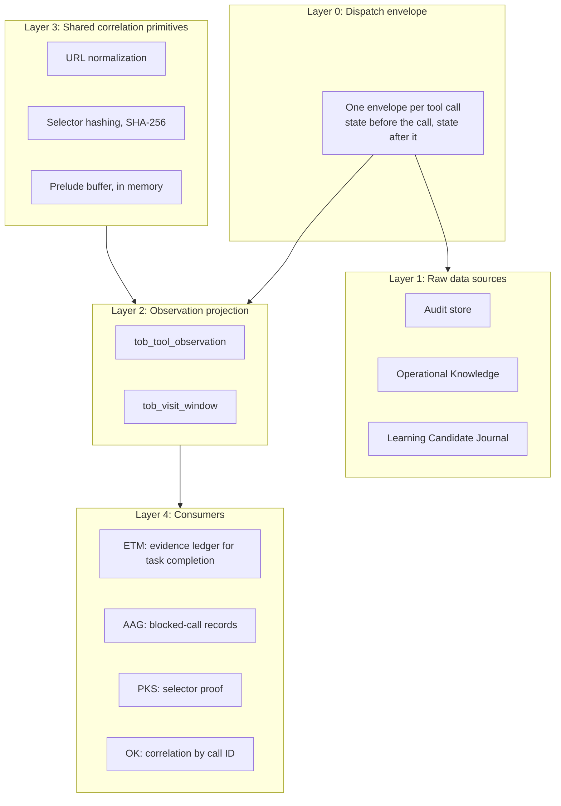

# Tool Observation Bus (TOB) — Server-Observed Evidence Ledger

> [!NOTE]
> The **Tool Observation Bus (TOB)** is the server-side observation layer of Nova AI Workspace. It records what agents actually execute, builds visit windows from those records, and provides evidence to AAG, PKS, and task completion checks.

---

## 1. Start with a claim: “I checked the page”

An agent reports that it checked a page and completed an action. That report alone does not tell Nova which page was inspected, whether content was returned, or whether the action was blocked before it could run.

For example, an agent opens an article and calls a tool that returns its text. TOB records the resolved target, page context, timing, outcome and content-exposure signals. In an active task scope, those observations can be linked to the article's work unit. A navigation call by itself supplies different evidence from a call that exposed the article's content.

If an awareness gate blocks a later click, the record says it was blocked. It does not turn the attempted click into an executed action.

**The TOB Guiding Principle:**
> *"What the agent says is a claim. What Nova observes is evidence."*

TOB keeps agent statements and server-side observations apart. It records evidence available to Nova, not the agent's private reasoning. Content exposure supports a claim that content was available to the agent; it does not prove understanding, and a dispatched click does not by itself prove the intended business outcome.

### How this connects to learning and verification

* **TOB** supplies execution observations and selector proof.
* **[ALP](learning-pipeline-alp.md)** evaluates journal evidence for candidate generation and trust decisions.
* **[PKS](pks.md)** preserves recognition, playbooks, verification steps and health.
* **[CLS](closed-loop-system.md)** checks the expected effect of an action and returns outcomes that can inform subsequent learning.

TOB answers “what evidence did Nova observe?”; CLS answers “did the specified outcome occur?” The distinction keeps a successful tool call from being treated as proof of every larger claim.

---

## 2. Evidence Grades

The evidence ledger grades task completions:

| Grade | Criteria & Meaning |
| :---: | :--- |
| **`strong`** | A matching visit window with a read signal and dwell time of at least 1 second. Strong evidence of content exposure on the located page, not proof of comprehension. |
| **`weak`** | A matching observation exists, but no read signal or no visit window. |
| **`none`** | Deterministic locators exist, ingestion is complete, and no observation was found. |
| **`unknown`** | No deterministic locators, or a gap in the measurement. |

> [!IMPORTANT]
> `none` is only assigned when data ingestion is complete. Otherwise the grade is `unknown`.

`strong` can only be reached for units located by exact URL or route; units located only by a selector or a URL prefix reach at most `weak`.

---

## 3. Synergies: TOB & AAG & PKS

While **AAG** decides whether a call may run, **TOB** keeps the record of what ran:

* **Blocked calls:** When an AAG gate blocks a call, TOB stores a separate observation with the gate ID, so a blocked call is never mistaken for a failed one.
* **PKS selector proof:** When a scoped call succeeds on a selector whose hash matches a known PKS phenomenon on that site, TOB records a `tob_verified` outcome for that phenomenon (at most once per phenomenon per 60 seconds). This feeds the phenomenon's health and promotion evidence without the agent reporting anything.

Selector proof shows a successful interaction with that selector. It is narrower than verification of an entire playbook or its intended consent choice; those outcomes need their own checks.

---

## 4. The Dispatch Envelope Lifecycle

Every MCP tool call is framed by a dispatch envelope:

1. **State before execution:**
   * Captures the target tab, its normalized URL, page epoch, tab state version, and start time.
   * Assigns a random call ID (`dispatch_call_id`) and a monotonic sequence number (`dispatch_seq`).
2. **Execution or preflight block:**
   * If an AAG gate blocks the call, TOB records it with `outcome_kind = blocked_preflight` and the gate ID.
   * Otherwise the tool runs.
3. **State after execution:**
   * Captures the state after completion (URL, page epoch, tab state version) even if the tool failed.
   * Records duration, outcome, and the signal flags below.

---

## 5. Signal Flags

TOB classifies each tool call with a bitmask of signal flags, including:

| Signal Flag | Meaning |
| :--- | :--- |
| `ContentExposed` | Text or structured content was returned to the agent. |
| `VisualExposed` | A screenshot or other image was returned to the agent. |
| `DomExposed` | DOM nodes, selector results, or layout data were returned. |
| `SelectorTouched` | A DOM selector was addressed (clicked, focused, or typed into). |
| `NavigationIntent` | A page navigation was requested. |
| `NavigationCommitted` | The navigation was committed. |
| `MutationAttempted` | A mutating action was dispatched. |
| `MutationCommitted` | A mutation was confirmed. |
| `InputSupplied` | Keyboard or mouse input was supplied. |
| `SearchExecuted` | A search on the page was executed. |

Further flags cover console and file exposure, viewport-only versus full-document reads, and whether the target was resolved.

---

## 6. The TOB Layers

Observations are only projected while a scope is active, for example a running task instance. Calls made shortly before a scope opens are held in the in-memory prelude buffer and attached to the scope when it opens.

---

## 7. Implementation notes

| Component | Responsibility |
| :--- | :--- |
| **`DispatchEnvelopeBuilder`** | Builds the before/after snapshots and the call ID for each MCP call. |
| **`ToolObservationProjector`**| Writes envelopes into the table `tob_tool_observation`. |
| **`VisitWindowBuilder`** | Aggregates calls into visit windows with dwell time and read signals. |
| **`EvidenceLedger`** | Computes evidence grades (`strong`/`weak`/`none`/`unknown`) for task verification. |
| **`TobSelectorProofEmitter`**| Records selector proofs for matching PKS phenomena. |
| **`PreludeBuffer`** | Holds recent calls in memory until a scope opens. |

---

## Related Documentation

* **[Agent Awareness Gates (AAG)](aag.md)** — Precondition gates in the tool pipeline.
* **[Phenomenological Knowledge Store (PKS)](pks.md)** — Procedural UI memory and learned playbooks.
* **[Closed-Loop System (CLS)](closed-loop-system.md)** — Verified state transitions.
* **[Episodic Task Memory (ETM)](etm-and-task-memory.md)** — Work unit tracking and task URL coverage.
