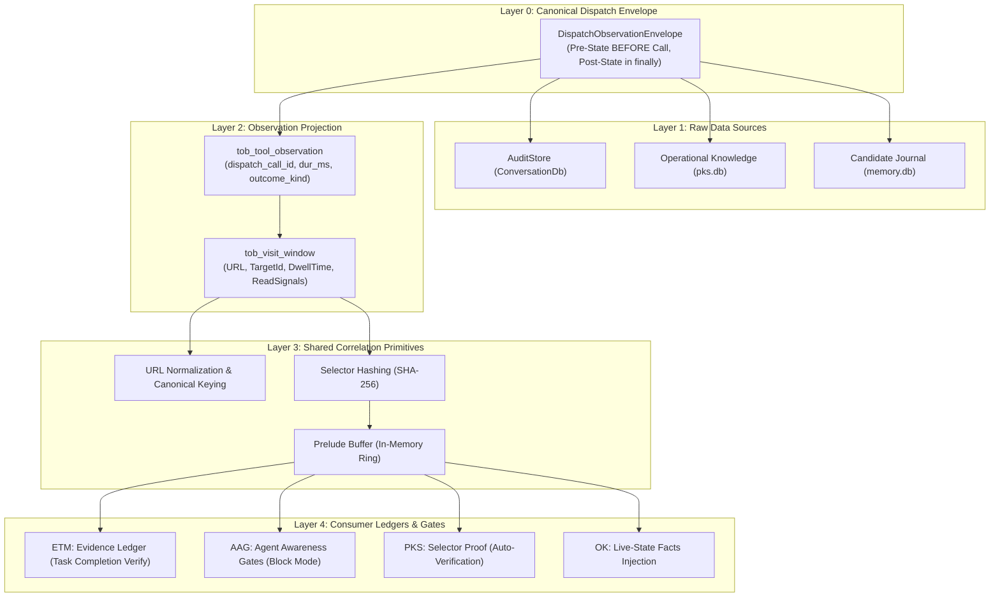

# Tool Observation Bus (TOB) — Server-Side Truth & Evidence Ledger

> [!NOTE]
> The **Tool Observation Bus (TOB)** (`Tob`) is the server-side observation and evidence engine of Nova AI Workspace. It creates a tamper-proof record of what agents actually execute at runtime, calculates objective visit windows, and provides verified evidence to AAG, PKS, and the task completion ledger.

---

## 1. Problem Statement & Guiding Principle

Conventional browser automation frameworks suffer from a fundamental vulnerability: **The system believes the agent's unverified claims.**
* An agent claims: *"I read the API documentation and submitted the form successfully."*
* In reality, the tab was visited for only 50 milliseconds (no dwell time), a click missed the target, and the form was never submitted.

**The TOB Guiding Principle:**
> *"What the agent says is a claim. What Nova observes is evidence."*

TOB decouples agent statements from server-side reality. Only what Nova independently measures on the host and WebView2 engine levels before and after a tool call is recorded as proven fact.

---

## 2. The 5-Layer TOB Architecture

---

## 3. The Dispatch Envelope Lifecycle

Every single MCP tool execution in `DispatchToolCallAsync` is framed by the `DispatchEnvelopeBuilder`:

1. **Pre-State Freeze (BEFORE Execution):**
   * Captures active tab, normalized URL (`page_url_before_norm`), render epoch (`page_epoch_before`), tab state version, and start timestamp (`started_at_ms`).
   * Assigns an immutable `dispatch_call_id` (UUIDv4) and a monotonic sequence index `dispatch_seq`.
2. **Tool Execution or Preflight Block:**
   * If blocked by AAG (e.g. missing bootstrap bundle, unconfirmed destructive action), TOB records `outcome_kind = blocked_preflight`, `block_stage`, and `gate_id`.
   * If permitted, the tool executes input handling, DOM operations, or network extraction.
3. **Post-State Freeze (in the `finally` Block):**
   * Captures state after completion (`page_url_after_norm`, `page_epoch_after`, `tab_state_version_after`).
   * Computes execution duration (`duration_ms`), outcome code, and applies semantic `ObservationSignalFlags`.

---

## 4. Signal Flags & Bitmask (`TobSignalFlags`)

TOB classifies each tool execution with a precise semantic bitmask:

| Signal Flag | Semantic Meaning |
| :--- | :--- |
| `ContentExposed` | Visible plain text or structured content was returned to the agent. |
| `VisualExposed` | A screenshot or visual proof-crop was transmitted to the agent. |
| `DomExposed` | DOM nodes, selector query results, or layout geometries were exposed. |
| `SelectorTouched` | A DOM selector was addressed (clicked, focused, or typed into). |
| `NavigationIntent` | A page navigation was requested. |
| `NavigationCommitted` | The browser engine confirmed the navigation commit event. |
| `MutationAttempted` | A DOM mutation was dispatched. |
| `MutationCommitted` | A real DOM mutation was empirically verified. |
| `InputSupplied` | Hardware keyboard or mouse input events were injected. |

---

## 5. Evidence Grades

The `EvidenceLedger` evaluates task completions against empirical criteria:

| Grade | Criteria & Meaning |
| :---: | :--- |
| **`strong`** | **Verified Proof:** Materialized visit window (`tob_visit_window`) with confirmed read signal, minimum dwell time (**Dwell Time $\ge$ 1.0s**), and locator match. The agent demonstrably observed the content. |
| **`weak`** | **Weak Proof:** Observation match present, but no read signal captured or dwell time under 1 second (e.g. transient tab hop). |
| **`none`** | **Definitive Void:** Deterministic locators exist, ingestion is fully complete, but **no observation** found. The agent's completion claim is provably false. |
| **`unknown`** | **Unassessable:** No deterministic locators defined or an instrumentation measurement gap occurred. |

> [!IMPORTANT]
> The status `none` may only be assigned by the Evidence Ledger **when data ingestion is fully complete**. Under partial synchronization, the grade defaults to `unknown`.

---

## 6. Synergies: TOB & AAG

While **AAG** is the **decision and protection policy layer** (gates, blockers, guarded tools), **TOB** is the **sensory nervous system and evidence archive**:

* **AAG Queries TOB:** *"Did the agent actually perceive the page prior to submitting the form (`perceive_first`)?"* → TOB checks the Prelude Buffer for a `strong` visit window.
* **AAG Leverages TOB IDs:** When AAG blocks a call, TOB stores the rejection reason deterministically, eliminating phantom failures.
* **PKS Selector Proof:** Following a successful click, TOB issues a cryptographic proof via `TobSelectorProofEmitter` (`selector_hash` + `dispatch_call_id`). PKS uses this proof to promote phenomena from L0 to L1/L2.

---

## 7. Under the Hood

| Component | Responsibility |
| :--- | :--- |
| **`DispatchEnvelopeBuilder`** | Encapsulates pre- and post-state snapshots for all MCP calls with UUIDs. |
| **`ToolObservationProjector`**| Asynchronous projection of envelopes into the SQLite table `tob_tool_observation`. |
| **`VisitWindowBuilder`** | Aggregates calls into visit windows with dwell time and read signals. |
| **`EvidenceLedger`** | Computes evidence grades (`strong`/`weak`/`none`/`unknown`) for task verification. |
| **`TobSelectorProofEmitter`**| Delivers verified selector proofs to the PKS learning engine. |
| **`PreludeBuffer`** | In-memory ring buffer for low-latency gate checks without disk I/O. |

---

## Related Documentation

* **[Agent Awareness Gates (AAG)](aag.md)** — Multi-stage safety gates and verification policies.
* **[Phenomenological Knowledge Store (PKS)](pks.md)** — Procedural UI memory and learned fast-paths.
* **[Closed-Loop System (CLS)](closed-loop-system.md)** — Automated closed feedback verification loop.
* **[Episodic Task Memory (ETM)](etm-and-task-memory.md)** — Work unit tracking and exhaustive task URL coverage.
