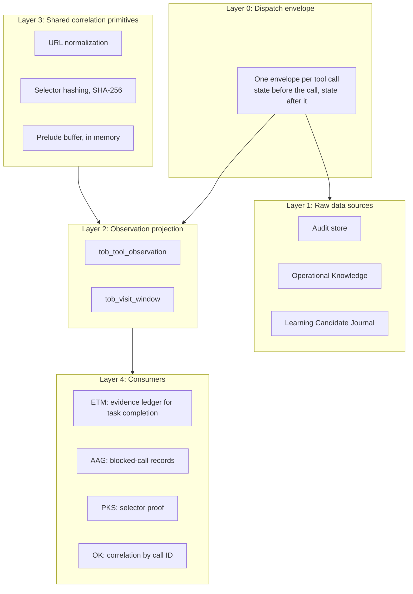

# Tool Observation Bus (TOB) — Server-Side Truth & Evidence Ledger

> [!NOTE]
> The **Tool Observation Bus (TOB)** is the server-side observation layer of Nova AI Workspace. It records what agents actually execute, builds visit windows from those records, and provides evidence to AAG, PKS, and task completion checks.

---

## 1. Problem Statement & Guiding Principle

Conventional browser automation frameworks share a fundamental weakness: **the system believes the agent's unverified claims.**
* An agent claims: *"I read the API documentation and submitted the form successfully."*
* In reality, the tab was visited only briefly, a click missed the target, and the form was never submitted.

**The TOB Guiding Principle:**
> *"What the agent says is a claim. What Nova observes is evidence."*

TOB keeps agent statements and server-side observations apart. Only what Nova records itself before and after a tool call counts as an observation.

---

## 2. The TOB Layers

Observations are only projected while a scope is active, for example a running task instance. Calls made shortly before a scope opens are held in the in-memory prelude buffer and attached to the scope when it opens.

---

## 3. The Dispatch Envelope Lifecycle

Every MCP tool call is framed by a dispatch envelope:

1. **State before execution:**
   * Captures the target tab, its normalized URL, page epoch, tab state version, and start time.
   * Assigns a random call ID (`dispatch_call_id`) and a monotonic sequence number (`dispatch_seq`).
2. **Execution or preflight block:**
   * If an AAG gate blocks the call, TOB records it with `outcome_kind = blocked_preflight` and the gate ID.
   * Otherwise the tool runs.
3. **State after execution:**
   * Captures the state after completion (URL, page epoch, tab state version) even if the tool failed.
   * Records duration, outcome, and the signal flags below.

---

## 4. Signal Flags

TOB classifies each tool call with a bitmask of signal flags, including:

| Signal Flag | Meaning |
| :--- | :--- |
| `ContentExposed` | Text or structured content was returned to the agent. |
| `VisualExposed` | A screenshot or other image was returned to the agent. |
| `DomExposed` | DOM nodes, selector results, or layout data were returned. |
| `SelectorTouched` | A DOM selector was addressed (clicked, focused, or typed into). |
| `NavigationIntent` | A page navigation was requested. |
| `NavigationCommitted` | The navigation was committed. |
| `MutationAttempted` | A mutating action was dispatched. |
| `MutationCommitted` | A mutation was confirmed. |
| `InputSupplied` | Keyboard or mouse input was supplied. |
| `SearchExecuted` | A search on the page was executed. |

Further flags cover console and file exposure, viewport-only versus full-document reads, and whether the target was resolved.

---

## 5. Evidence Grades

The evidence ledger grades task completions:

| Grade | Criteria & Meaning |
| :---: | :--- |
| **`strong`** | A visit window with a read signal, a dwell time of at least 1 second, and a locator match. The agent demonstrably read the content. |
| **`weak`** | A matching observation exists, but no read signal or no visit window. |
| **`none`** | Deterministic locators exist, ingestion is complete, and no observation was found. |
| **`unknown`** | No deterministic locators, or a gap in the measurement. |

> [!IMPORTANT]
> `none` is only assigned when data ingestion is complete. Otherwise the grade is `unknown`.

`strong` can only be reached for units located by exact URL or route; units located only by a selector or a URL prefix reach at most `weak`.

---

## 6. Synergies: TOB & AAG & PKS

While **AAG** decides whether a call may run, **TOB** keeps the record of what ran:

* **Blocked calls:** When an AAG gate blocks a call, TOB stores a separate observation with the gate ID, so a blocked call is never mistaken for a failed one.
* **PKS selector proof:** When a scoped call succeeds on a selector whose hash matches a known PKS phenomenon on that site, TOB records a `tob_verified` outcome for that phenomenon (at most once per phenomenon per 60 seconds). This feeds the phenomenon's health and promotion evidence without the agent reporting anything.

---

## 7. Under the Hood

| Component | Responsibility |
| :--- | :--- |
| **`DispatchEnvelopeBuilder`** | Builds the before/after snapshots and the call ID for each MCP call. |
| **`ToolObservationProjector`**| Writes envelopes into the table `tob_tool_observation`. |
| **`VisitWindowBuilder`** | Aggregates calls into visit windows with dwell time and read signals. |
| **`EvidenceLedger`** | Computes evidence grades (`strong`/`weak`/`none`/`unknown`) for task verification. |
| **`TobSelectorProofEmitter`**| Records selector proofs for matching PKS phenomena. |
| **`PreludeBuffer`** | Holds recent calls in memory until a scope opens. |

---

## Related Documentation

* **[Agent Awareness Gates (AAG)](aag.md)** — Precondition gates in the tool pipeline.
* **[Phenomenological Knowledge Store (PKS)](pks.md)** — Procedural UI memory and learned playbooks.
* **[Closed-Loop System (CLS)](closed-loop-system.md)** — Verified state transitions.
* **[Episodic Task Memory (ETM)](etm-and-task-memory.md)** — Work unit tracking and task URL coverage.
