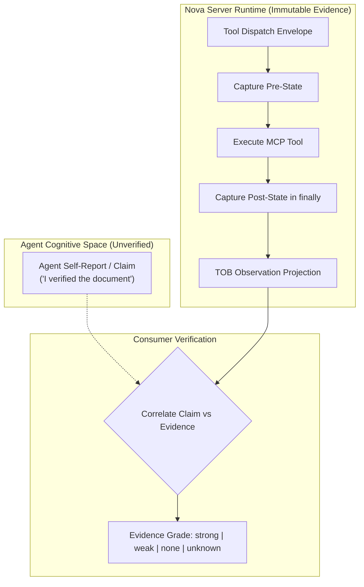
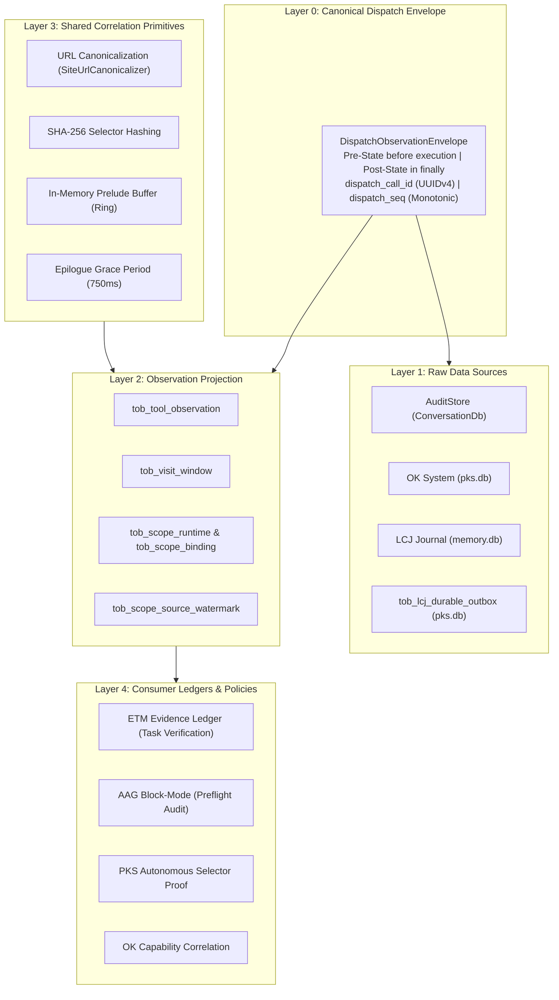
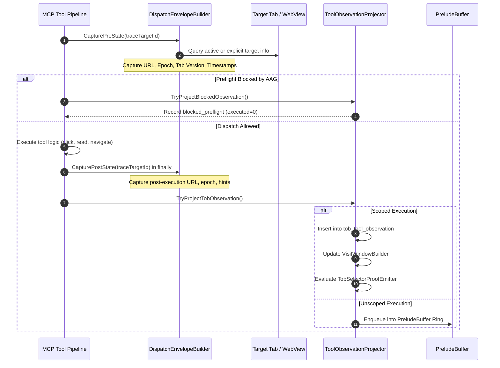
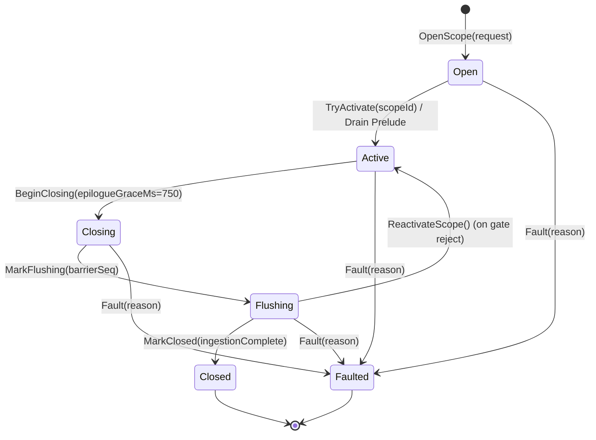
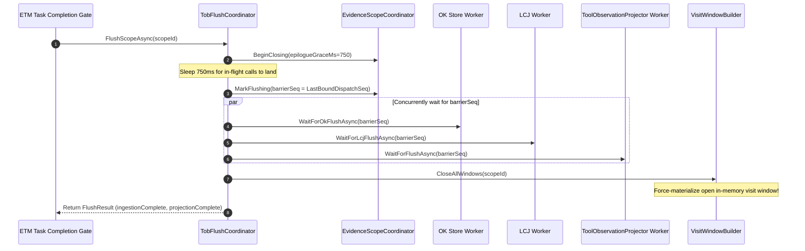
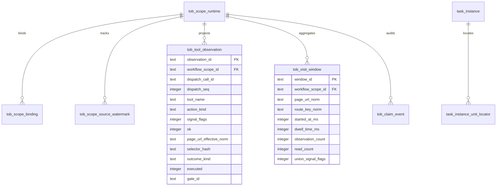
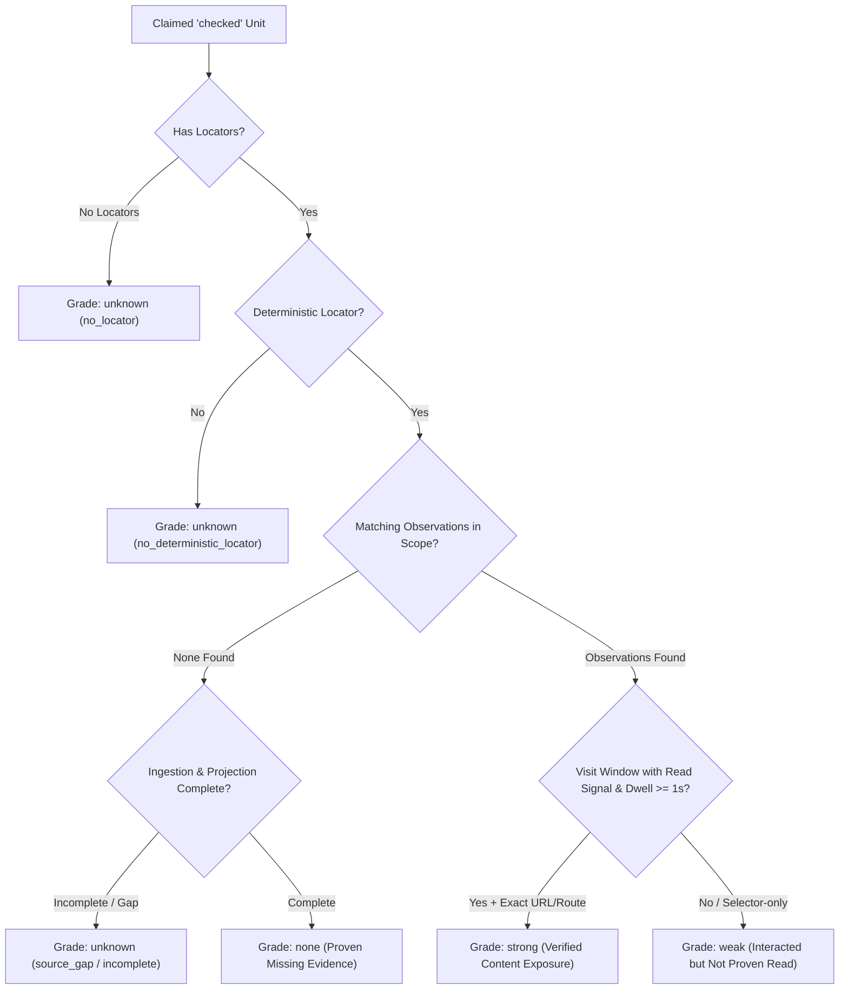
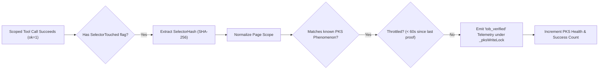

# Tool Observation Bus (TOB) — Server-Observed Evidence Ledger

> [!NOTE]
> The **Tool Observation Bus (TOB)** is Nova AI Workspace's core observation and evidence infrastructure. Operating server-side within the browser runtime, TOB captures immutable records of what agents actually execute, projects these records into structured observation streams, synthesizes visit windows, and provides verifiable evidence to Agent Awareness Gates (AAG), the Phenomenological Knowledge Store (PKS), and the Episodic Task Memory (ETM) Evidence Ledger.

---

## 1. Executive Summary & The Core Axiom

In traditional agentic environments, an orchestrator relies primarily on what the language model reports:
* *“I have read the checkout policy.”*
* *“I clicked the confirmation button.”*
* *“I verified all 120 items on the list.”*

In reality, language models frequently hallucinate completion: an agent may claim it read a document when navigation failed; it may assert it clicked a button that was blocked by an awareness gate; or it may claim to have reviewed a page after glancing at it for 12 milliseconds without triggering a content read.

**The TOB Guiding Principle:**
> *"What the agent says is a claim. What Nova observes is evidence."*

TOB creates a strict, unbridgeable separation between agent self-reports and server-side execution observations:
* **Content Exposure $\neq$ Comprehension:** Exposing page text proves the agent had access to the data; it does not prove cognitive understanding.
* **Dispatched Click $\neq$ Business Outcome:** Dispatching an input event proves the action was attempted; only closed-loop verification (CLS) confirms the intended state transition occurred.
* **Blocked Calls $\neq$ Execution Failures:** If a preflight awareness gate rejects a tool call, TOB records it as blocked preflight evidence, preventing failed attempts from masquerading as executed actions.



### The Four Knowledge & Verification Pillars

| Subsystem | Architectural Role | Core Question Answered |
| :--- | :--- | :--- |
| **TOB (Tool Observation Bus)** | **Execution Evidence Ledger** | *“What actions did the agent actually dispatch, and what content was exposed?”* |
| **[CLS (Closed-Loop System)](../closed-loop-system-cls/README.md)** | **State Transition Enforcement** | *“Did the page state transition match the declared postcondition contract?”* |
| **[PKS (Knowledge Store)](../learning/phenomenological-knowledge-store-pks/README.md)** | **Procedural Memory** | *“How does this interface behave, and which playbooks have proven reliable?”* |
| **[AAG (Awareness Gates)](../agent-awareness-gates-aag/README.md)** | **Pre-Dispatch Safety** | *“Does the agent possess valid situational context to execute this call?”* |

---

## 2. The 5-Layer Bus Architecture

TOB is structured into five distinct architectural layers spanning the execution lifecycle from initial dispatch to high-level policy evaluation:



### Detailed Layer Breakdown

1. **Layer 0 — Canonical Dispatch Envelope:**
   * Every MCP tool invocation is wrapped in a `DispatchObservationEnvelope`.
   * Captures `PreState` immediately before execution and `PostState` inside a guaranteed `finally` block.
   * Assigns an immutable `dispatch_call_id` (UUIDv4), a monotonic `dispatch_seq`, and a short correlation ID (`request_id_short`).
2. **Layer 1 — Raw Data Sources:**
   * Receives envelope copies across independent persistence sinks: `AuditStore` (human-readable audit log), `OKStore` (operational knowledge graph), and `LCJ` (learning candidate journal).
   * Includes `tob_lcj_durable_outbox` in `pks.db` as a reserved durability bridge.
3. **Layer 2 — Observation Projection:**
   * Projects structured observations into relational SQLite tables (`pks.db`, Migrations V14 & V15).
   * Manages scope bindings (`tob_scope_runtime`, `tob_scope_binding`) and tracks barrier progress (`tob_scope_source_watermark`).
4. **Layer 3 — Shared Correlation Primitives:**
   * **URL Normalization:** Canonicalizes query strings, fragments, and route parameters via `SiteUrlCanonicalizer`.
   * **Selector Hashing:** Computes deterministic SHA-256 hashes of normalized CSS selectors.
   * **Prelude Ring Buffer:** Preserves unscoped dispatches in RAM and backfills them upon scope activation.
5. **Layer 4 — Consumers:**
   * **ETM Evidence Ledger:** Computes mathematical evidence grades (`strong`/`weak`/`none`/`unknown`) for task units upon completion.
   * **AAG Block-Mode:** Records preflight blocks without tool dispatch.
   * **PKS Selector Proof:** Autonomously validates UI phenomena in procedural memory without requiring agent claims.

---

## 3. The Dispatch Envelope Lifecycle & Surface Capture

Every tool execution follows a deterministic, fail-safe envelope lifecycle:



### 3.1 Pre-State and Post-State Capture
* **Pre-State:** Captured immediately before tool dispatch. Records target ID, target session ID, tab state version, navigation epoch (`pageEpoch`), raw URL, normalized route URL, and start timestamp (`started_at_ms`).
* **Post-State:** Captured in a `finally` block, ensuring capture occurs even if the tool throws an unhandled exception, times out, or encounters renderer process termination.
* **Effective Fields:** To handle intermediate navigations cleanly, TOB derives effective attributes (`page_url_effective_norm`, `page_epoch_effective`) using `COALESCE(postState, preState)`.

### 3.2 The Foreign Target Resolution Invariant
> [!IMPORTANT]
> When an agent interacts with a background tab by supplying an explicit `targetId`, TOB **does not borrow the identity of the foreground active tab**.
> 
> In multi-tab workflows, attributing background clicks to the foreground URL corrupts PKS selector proofs, visit windows, and task verification. `DispatchEnvelopeBuilder.CaptureSnapshot` explicitly checks whether `traceTargetId` differs from `ActiveTargetId`. If foreign, it resolves the specific tab's URL and title independently. If unresolvable, the URL fields remain empty rather than falling back to the wrong tab!

---

## 4. Signal Flags & Tool Classification (`ObservationSignalFlags`)

TOB categorizes every tool execution using a 64-bit bitmask (`ObservationSignalFlags`). This bitmask describes exactly what data was exposed to the agent and what mutations were committed to the browser runtime:

| Signal Flag | Bit | Description & Behavioral Meaning |
| :--- | :---: | :--- |
| **`ContentExposed`** | `1 << 0` | Readable text or structured data was returned to the agent context. |
| **`VisualExposed`** | `1 << 1` | A visual image or screenshot was returned to the agent. |
| **`DomExposed`** | `1 << 2` | Raw DOM nodes, layout geometries, or element trees were exposed. |
| **`SelectorTouched`** | `1 << 3` | A specific DOM selector was targeted (clicked, typed, focused). |
| **`NavigationIntent`** | `1 << 4` | Navigation was initiated (URL change, back, forward, reload). |
| **`NavigationCommitted`** | `1 << 5` | Navigation was confirmed committed by the browser engine. |
| **`MutationAttempted`** | `1 << 6` | A DOM mutation was dispatched (click, type, option select). |
| **`MutationCommitted`** | `1 << 7` | DOM mutation was confirmed effective on the target page. |
| **`InputSupplied`** | `1 << 8` | Physical or synthetic user input was provided (keystrokes, text). |
| **`SearchExecuted`** | `1 << 9` | In-page text search or grep query was performed. |
| **`ConsoleExposed`** | `1 << 10` | Browser console logs or errors were returned. |
| **`FileExposed`** | `1 << 11` | External or local file payload was read. |
| **`ViewportOnly`** | `1 << 12` | Read or capture was strictly constrained to the visible viewport. |
| **`FullDocument`** | `1 << 13` | Complete document tree or full-page scroll was exposed. |
| **`TargetResolved`** | `1 << 14` | Target WebView/tab was successfully located and matched. |

### 4.1 Tool-to-Signal Mapping Rules

`ObservationClassifier` inspects the tool name and execution outcome to assign action kinds (`read`, `navigate`, `interact`, `write`, `meta`) and surface types:

* **`nova.perceive`:** Classified as `read` on `webpage`. Flags: `ContentExposed | VisualExposed | DomExposed | TargetResolved`.
* **`nova.read_text` / `nova.read_text_structured`:** Classified as `read` on `dom_node`. Flags: `ContentExposed | DomExposed | TargetResolved`.
* **`nova.read_dom`:** Classified as `read` on `dom_node`. Flags: `ContentExposed | DomExposed | FullDocument | TargetResolved`.
* **`nova.click_selector`:** Classified as `interact` on `dom_node`. Flags: `SelectorTouched | MutationAttempted | (MutationCommitted) | TargetResolved`.
* **`nova.type_selector`:** Classified as `interact` on `dom_node`. Flags: `SelectorTouched | InputSupplied | MutationAttempted | (MutationCommitted) | TargetResolved`.
* **`nova.navigate` / `nova.back` / `nova.forward`:** Classified as `navigate` on `webpage`. Flags: `NavigationIntent | (NavigationCommitted) | TargetResolved`.

### 4.2 The Perceive-First Surface Exposure Filter
To prevent agents from bypassing AAG's `safety.perceive_first` gate with cheap no-ops, TOB enforces a strict surface exposure filter:
* Invocations of `nova.search_text` **do not qualify** as surface exposure, even though they expose text.
* Only substantive observation tools (`nova.perceive`, `nova.read_text`, `nova.read_dom`, `nova.dom_extract`) set `_surfaceExposedByTarget = true`.

---

## 5. Scope Lifecycle State Machine & The 8 Core Invariants

To prevent unbounded database growth during regular interactive browsing, TOB observations are **scope-gated**: they are only projected to SQLite when an active workflow scope exists (such as a running ETM task instance or a tab claim lease).



### The 8 Frozen Scope Invariants
1. **Single Identity Invariant:** Every dispatch receives exactly one `dispatch_call_id` and monotonic `dispatch_seq`.
2. **Bracketing Guarantee:** Pre-State is captured strictly before tool execution; Post-State is captured strictly in `finally`.
3. **Single Scope Binding:** A dispatch may bind to at most one workflow scope (`WorkflowScopeBinding`).
4. **Mutual Exclusion per Target:** Only one scope in states `open | active | closing` may exist for any given `target_session_id`.
5. **No Binding in Flushing:** Once a scope enters `flushing`, no new dispatches can bind to it.
6. **Frozen Sequence Barrier:** `barrier_seq` is strictly frozen upon entering `flushing`; all dispatches with `seq <= barrier_seq` must commit before correlation runs.
7. **Complete Ingestion Prerequisite:** Grade `none` may only be assigned when data ingestion and projection are 100% complete; any gap degrades to `unknown`.
8. **Retention Precedence:** Scope retention never prunes records before the task's final `evidence_snapshot_json` is generated.

### 5.1 In-Memory Prelude Buffer
When an agent performs setup calls (navigating to a starting URL, dismissing an initial popup) *before* explicitly creating an ETM task instance, those dispatches are unscoped.
* Unscoped dispatches are held in an in-memory ring buffer (`PreludeBuffer`: max 512 per target, max 4,096 globally, 60s TTL).
* When `OpenScope` is invoked, TOB drains the last 30 seconds (`PreludeWindowMs = 30_000`) of matching dispatches and backfills them into `tob_tool_observation` with `binding_mode = 'prelude_backfill'`.

### 5.2 Epilogue Grace Window
When a task requests completion, the agent may have issued a final verification call that is still in transit.
* `BeginClosing` initiates an `epilogue_grace_ms` period (default **750 ms**).
* Any calls completing within this grace window bind with `binding_mode = 'epilogue_grace'` before the sequence barrier is locked.

### 5.3 Crash Recovery Invariant
If Nova AI Workspace terminates unexpectedly while scopes are active, `EvidenceScopeCoordinator.RecoverFromDb()` runs on startup:
* Recovers all scopes in states `open`, `active`, `closing`, or `flushing` from `tob_scope_runtime`.
* Restores them to `Active` in memory, rebuilding reverse target indexes so target tabs are not deadlocked against new scopes.

---

## 6. The Flush & Barrier Protocol (`TobFlushCoordinator`)

Before an evidence consumer (such as the ETM Evidence Ledger) can grade task completion, it must guarantee that all asynchronous background worker threads have flushed their data to disk.



### The In-Memory Visit Window Flush Invariant
> [!IMPORTANT]
> The visit window of the page the agent is currently sitting on resides *purely in memory* (`VisitWindowBuilder._openWindows`) until a page change occurs or the scope closes.
> 
> If the flush protocol did not explicitly close the window, the current page would never count as a materialized visit window in SQLite! `TobFlushCoordinator` calls `_visitWindowBuilder.CloseAllWindows(scopeId)` before returning, ensuring the open window is inserted into `tob_visit_window` ahead of the correlation query.

---

## 7. Database Schema & Storage Architecture (`pks.db`)

All TOB tables reside in `pks.db` and are initialized via Migrations V14 and V15:



### 7.1 Relational Table Catalog

| Table Name | Primary Role | Retention Policy |
| :--- | :--- | :--- |
| **`tob_tool_observation`** | Relational projection of executed or blocked tool calls. | Scope End + 7d (normal) / 30d (problematic) |
| **`tob_visit_window`** | Materialized, coalesced page visits with dwell times and read counts. | Scope End + 7d (normal) / 30d (problematic) |
| **`tob_claim_event`** | Audit log of agent status claims (`unit_checked`). | Scope End + 30d |
| **`tob_scope_runtime`** | Scope lifecycle state machine and barrier metadata. | Scope End + 30d |
| **`tob_scope_binding`** | Multi-target session and tab bindings for scopes. | Cascades on scope deletion |
| **`tob_scope_source_watermark`** | Ingestion barrier watermarks per data pipeline. | Cascades on scope deletion |
| **`task_instance_unit_locator`** | Typed locator definitions for ETM work units. | Task Instance Lifetime |
| **`tob_lcj_durable_outbox`** | Reserved durability bridge for future LCJ integration. | Scope End + 7d / 30d |

---

## 8. Evidence Ledger & Task Verification (`EvidenceLedger`)

When an autonomous task instance completes, the **Evidence Ledger** evaluates whether the agent's claims are backed by physical evidence:



### 8.1 Evidence Grades

| Evidence Grade | Required Criteria | Practical Meaning |
| :---: | :--- | :--- |
| **`strong`** | Matching visit window in `tob_visit_window` with `read_count > 0`, `dwell_time_ms >= 1000` (1 second), and exact URL or route locator match. | Strong proof that the target page was loaded, displayed, and content was returned to the agent for at least 1 second. |
| **`weak`** | Matching observation exists in `tob_tool_observation`, but lacks a substantive read signal, lacks a visit window, or is located *only* by selector hash or URL prefix. | The agent touched or interacted with the target, but content exposure or dwell time was not established. |
| **`none`** | Deterministic locators exist, data ingestion and projection are 100% complete, and zero matching observations exist. | **Proven fabrication / omission:** The agent claimed completion, but Nova observed zero corresponding actions. |
| **`unknown`** | No deterministic locators exist, or a measurement gap occurred (`unknown_due_to_source_gap`, `projection_incomplete`, `scope_binding_missing`). | Indeterminate: Nova cannot prove or disprove the claim due to missing instrumentation. |

### 8.2 Locator Types & Source Classes
* **`url_exact`:** Full canonical URL (`SiteUrlCanonicalizer`). Can reach grade `strong`.
* **`route_key`:** Normalized pathname without domain (e.g. `settings/security`). Can reach grade `strong`.
* **`selector` / `selector_hash`:** CSS selector or SHA-256 hash. Reaches at most grade `weak` (visit windows do not index selectors).
* **`document_page`:** Multi-page document or PDF page reference.
* **Locator Sources:** `declared` (explicitly supplied in task profile) or `derived` (inferred from unit ref).

### 8.3 The Evidence Snapshot Schema (`evidence_snapshot_json`)
Upon task completion, the ledger compiles an immutable JSON summary saved to `task_instance.evidence_snapshot_json`:

```json
{
  "schemaVersion": 1,
  "workflowScopeId": "scope-9f8a2b1c",
  "completedAtMs": 1728394000120,
  "completeness": {
    "ingestionComplete": true,
    "projectionComplete": true,
    "budgetTruncated": false
  },
  "counts": {
    "claimedCheckedUnits": 12,
    "observedCheckedUnits": 11,
    "strong": 10,
    "weak": 1,
    "none": 1,
    "unknown": 0
  },
  "perUnitExceptions": {
    "itemCount": 2,
    "items": [
      {
        "unitKey": "doc-terms-page",
        "grade": "weak",
        "reasons": ["no_read_like_observation"]
      },
      {
        "unitKey": "doc-refund-policy",
        "grade": "none",
        "reasons": ["no_matching_observation"]
      }
    ]
  }
}
```

---

## 9. Autonomous PKS Selector Proof (`TobSelectorProofEmitter`)

When an agent interacts with web pages, TOB autonomously validates and promotes UI patterns in the Phenomenological Knowledge Store (PKS) without requiring the agent to self-report:



* **Zero Agent Overhead:** Operates entirely in the background. If a scoped call touches a selector whose SHA-256 hash matches a known phenomenon on that domain, TOB reports `tob_verified`.
* **60-Second Throttle:** Emits at most one proof per `(scope, phenomenon)` pair per 60 seconds (`ThrottleIntervalMs = 60_000`), preventing rapid loops from skewing health statistics.
* **Thread-Safe Telemetry:** Held under `_pksWriteLock` to prevent concurrent `pks_upsert` calls from overwriting health counters.

---

## 10. AAG Preflight Block Recording (Migration V15)

When an Agent Awareness Gate (such as `setup.bootstrap_required` or `safety.perceive_first`) halts a tool call, the tool implementation never executes. However, recording this attempt is vital for debugging and compliance.

TOB handles this via **Blocked Preflight Projections** (`TryProjectBlocked`):
* **Schema Fields:** `ok = 0`, `executed = 0`, `outcome_kind = 'blocked_preflight'`, `block_stage = 'aag_preflight'`, `error_code = 'aag_blocked:<gateId>'`.
* **Unscoped Projection:** Blocked calls are written unscoped (`workflow_scope_id = NULL`), as an awareness failure occurs before scope binding can take place.
* **Gate Mode Separation:** The configured gate mode (`Block`, `ShadowBlock`, `Warn`) is **not stored** in the database row; it is resolved dynamically from settings to prevent stale data.

---

## 11. Dual-Tier Retention Policy (`TobRetentionPolicy`)

To maintain high SQLite query performance and prevent database file bloat, TOB implements an automated, dual-tier retention policy:

```mermaid
flowchart TD
    Job["Retention Job (Fire-and-Forget)"] --> Classify{"Scope Status & Class"}
    Classify -->|Clean Normal Scope (closed)| R1["Delete if closed_at_ms > 7 Days"]
    Classify -->|Problematic Scope (none, unknown, incomplete, faulted)| R2["Delete if closed_at_ms > 30 Days"]
    Classify -->|Unscoped Blocked Calls (blocked_preflight)| R3["Delete if projected_at_ms > 30 Days"]

    R1 --> Prune["Delete from tob_scope_runtime & Cascade to Children"]
    R2 --> Prune
    R3 --> Prune
    Prune --> Orphan["Delete Orphaned Observations & Visit Windows"]
```

* **Normal Scopes (7 Days):** Cleanly completed scopes with full ingestion and zero exceptions are purged after 7 days.
* **Problematic Scopes (30 Days):** Scopes containing `none` or `unknown` grades, incomplete ingestion, or faulted terminations are retained for 30 days to facilitate operator audits.
* **Unscoped Blocked Calls (30 Days):** AAG blocked-call observations are pruned after 30 days based on `projected_at_ms`.
* **Defensive CASCADE Deletion:** Explicitly pre-deletes child rows in `tob_scope_binding` and `tob_scope_source_watermark` before removing runtime rows, protecting legacy databases against SQLite Error 19 foreign key failures.

---

## 12. Operational Health Metrics (`TobHealthMetrics`)

To diagnose whether a poor task verification score was caused by agent incompetence or browser infrastructure delays, TOB tracks atomic operational metrics:

| Metric Name | Type | Diagnostic Meaning |
| :--- | :---: | :--- |
| `ScopeGatedCallCount` | Counter | Total tool calls evaluated against active scopes. |
| `BackfilledPreludeCallCount` | Counter | Unscoped calls rescued from the prelude buffer and bound to a new scope. |
| `ProjectedObservations` | Counter | Total observations written to `tob_tool_observation`. |
| `VisitWindowsFlushed` | Counter | Total visit windows materialized to `tob_visit_window`. |
| `ClaimEventsWritten` | Counter | Total agent claim events recorded in `tob_claim_event`. |
| `FlushTimeouts` | Counter | Number of times a sequence barrier timed out waiting for subsystem flushes. |
| `IngestionIncompleteCompletions` | Counter | Tasks completed while data pipelines had uncommitted in-flight dispatches. |
| `UnscopedDropCount` | Counter | Unscoped calls discarded after prelude buffer overflow. |
| `SelectorProofEmitted` | Counter | Total autonomous PKS selector proof telemetry events dispatched. |

---

## 13. Summary: The TOB Architectural Matrix

| Layer / Component | Core Responsibility | Invariant / Guarantee | Primary Failure Mode Addressed |
| :--- | :--- | :--- | :--- |
| **Dispatch Envelope** | Atomic before/after capture. | Captures post-state in guaranteed `finally`; unique UUIDv4 call ID. | Prevents unrecorded dispatches on unhandled tool crashes. |
| **Foreign Target Resolver** | Multi-tab identity binding. | Traced background target never borrows active foreground tab URL. | Prevents attributing background clicks to the foreground URL. |
| **Prelude Buffer** | Unscoped call preservation. | Holds up to 512 dispatches per target in RAM; drains upon scope activation. | Captures setup navigations executed prior to formal task creation. |
| **Epilogue Grace Window** | In-flight completion grace. | Delays barrier freezing by 750 ms for late verification calls. | Prevents dropping final verification clicks from task evidence. |
| **Flush Coordinator** | Multi-subsystem synchronization. | Waits for OK, LCJ, and Projector up to frozen `barrier_seq`. | Eliminates race conditions between async DB writes and task evaluation. |
| **Visit Window Builder** | Temporal interaction aggregation. | Coalesces continuous interactions; splits on inactivity > 2.5s. | Synthesizes true dwell time from individual discrete tool calls. |
| **Evidence Ledger** | Mathematical proof grading. | Grade `none` strictly prohibited unless ingestion is 100% complete. | Prevents falsely accusing an agent of omission during telemetry lag. |
| **Selector Proof Emitter** | Autonomous PKS promotion. | Auto-emits `tob_verified` on selector hash match; 60s throttle. | Continuously validates UI playbooks without agent self-reporting. |
| **AAG Block Projector** | Preflight block audit trail. | Projects blocked calls with `outcome_kind = 'blocked_preflight'`. | Distinguishes awareness-gate blocks from tool execution failures. |
| **Dual-Tier Retention** | SQLite bloat & prune control. | 7-day clean / 30-day problematic retention; pre-delete CASCADE safety. | Prevents SQLite disk space exhaustion and query latency degradation. |

---

## Related Documentation

* **[Agent Awareness Gates (AAG)](../agent-awareness-gates-aag/README.md)** — Precondition gates and tab leasing in the MCP dispatch pipeline.
* **[Closed-Loop System (CLS)](../closed-loop-system-cls/README.md)** — Transition contracts, stability verification, and outcome reaction.
* **[Phenomenological Knowledge Store (PKS)](../learning/phenomenological-knowledge-store-pks/README.md)** — Procedural UI memory, playbooks, and autonomous health tracking.
* **[Episodic Task Memory (ETM)](../learning/episodic-task-memory-etm/README.md)** — Work unit tracking, task URL coverage, and evidence ledger consumers.
* **[Agent Learning Pipeline (ALP)](../learning/agent-learning-pipeline-alp/README.md)** — Knowledge promotion and journal evaluation.

[All core features](../README.md)
