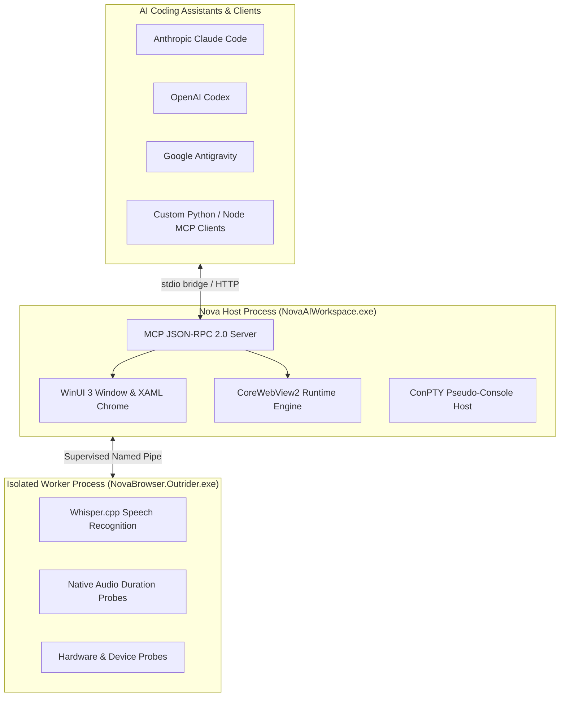

# Nova AI Workspace — Developer Guide

> [!NOTE]
> Welcome to the Nova AI Workspace Developer and Contributor Guide. This documentation covers the architecture, build pipeline, testing suites, safety boundaries, and development workflows for engineers contributing to Nova.

---

## 1. Architecture Overview

Nova AI Workspace is a modern Windows application engineered from the ground up for hybrid human-agent operation:
* **Host Process (`NovaAIWorkspace.exe`):** Built with .NET 8, WinUI 3 (Windows App SDK), and Microsoft Edge WebView2. Manages UI rendering, tab lifecycles, and window orchestration.
* **Outrider Process (`NovaBrowser.Outrider.exe`):** Dedicated isolated child process for high-risk native OS, hardware, and audio inference tasks (Whisper.cpp). Protects the host UI thread from driver hangs or native crashes.
* **MCP Remote Control Server:** High-throughput JSON-RPC 2.0 server supporting 400+ Model Context Protocol tools over token-authenticated Streamable HTTP on `127.0.0.1`, with a stdio bridge for CLI and desktop clients.
* **ConPTY Terminal Dock:** Native Windows pseudo-console dock embedded beneath the browser canvas.

---

## 2. Topic Index

| Guide | Description | Key Focus Areas |
| :--- | :--- | :--- |
| **[Building from Source](building-from-source.md)** | Toolchain setup, prerequisites, and build commands. | Local .NET 8 SDK, `build.ps1`, `rebuild.bat`, `dist/` layout. |
| **[Running Tests & Quality Gates](running-tests.md)** | Automated testing, verification, and code scanning. | xUnit, profile isolation, smoke tests, scanner reports. |
| **[Outrider Architecture](outrider-architecture.md)** | Subprocess isolation boundary for native OS tasks. | Named pipe IPC, watchdog supervision, crash resilience. |

---

## 3. Development Guidelines & Tenets

1. **Quality & Precision Over Speed:** Code changes must be deliberate, thoroughly tested, and accompanied by automated regression tests.
2. **Strict Test Profile Isolation:** Never run integration tests against the live user profile in `%LOCALAPPDATA%\NovaBrowser`. Always set `NOVA_TEST_LOCALAPPDATA_DIR`.
3. **No AI Attribution Trailers:** Commit messages and pull request descriptions must never include AI attribution lines (such as `Co-Authored-By: Claude`).
4. **UTF-8 Without BOM, LF Line Endings:** Text files are UTF-8 without a byte order mark and use LF line endings (`.bat`/`.cmd` stay CRLF). A pre-commit hook rejects files that start with a BOM.
