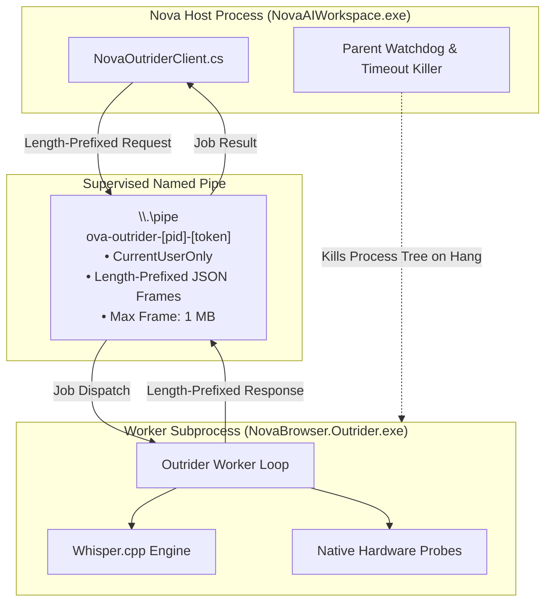

# Outrider Subprocess Boundary

> [!NOTE]
> `NovaBrowser.Outrider.exe` is Nova's canonical isolated child process designed to protect the browser host and UI thread from driver hangs, native crashes, and untrusted hardware probes.

---

## 1. Architectural Purpose

Modern desktop browsers must interact with device drivers, multimedia codecs, and native C/C++ libraries:
* **Native Crash Vulnerability:** Loading unmanaged C++ DLLs (such as neural inference libraries or media parsers) directly into the main browser process means a single memory fault or segmentation violation terminates the entire browser and all open tabs.
* **Driver Hangs:** Querying specific audio or video hardware on Windows via COM/WinRT can hang indefinitely if a third-party audio driver is misbehaving.
* **Thread Contention:** CPU-heavy workloads (such as AVX2 speech recognition) starve the WinUI 3 dispatcher, causing UI stutter.

Nova resolves this by strictly isolating risky tasks inside **Outrider**.

---

## 2. Process Lifecycle & Boundaries

1. **Lazy Spawning:** Outrider is not launched until the first native workload (e.g. speech transcription or hardware audit) is requested.
2. **Hidden Execution:** Runs with `CreateNoWindow = true` as a hidden background worker.
3. **Session-Specific Named Pipe:** Uses a parent-generated, cryptographically random pipe name scoped strictly to the current user (`PipeOptions.CurrentUserOnly`).
4. **Hard Limits:**
   * Maximum payload size: 1 MB per frame.
   * Maximum concurrent worker jobs: 3 parallel tasks.
   * Execution timeout: Worker enforced deadline between 1 ms and 60,000 ms.
5. **Fail-Closed Semantics:** If Outrider hangs or crashes, Nova's watchdog terminates the subprocess tree, returns a degraded error to the requesting agent, and restarts a fresh Outrider instance on demand. The browser UI thread remains 100% stable.
