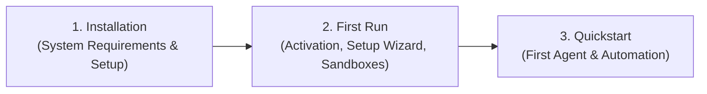

# Getting Started with Nova AI Workspace

**Nova AI Workspace** is a Windows browser that you and your AI agents use together: you browse as usual, and agents such as Claude Code or Codex control the same browser through Nova's local MCP server.

---

## Getting Started Journey

Follow these three structured steps to get Nova up and running:

1. **[Installation Guide](installation.md)**
   Check system requirements (Windows 10/11 x64), download and run the setup, and check that Nova is reachable for your AI program.

2. **[First Run & UI Tour](first-run.md)**
   Activate Nova, connect your AI programs with the setup wizard, and get to know sandboxes (separate logins side by side), the terminal dock, downloads, and the permission center.

3. **[5-Minute Quickstart](quickstart.md)**
   Connect your first AI agent (Claude Code, Antigravity, OpenAI Codex), run the bootstrap handshake, and watch the agent work in a Nova tab.

---

## Next Steps

Once your workspace is running and connected:
* Configure your specific AI client in **[Agent Integration](../integration/README.md)**.
* Explore Nova's building blocks in **[Core Features](../core-features/README.md)**.
* Read how sandboxes keep logins apart in **[Sandbox Isolation](../core-features/sandbox-isolation.md)**.
