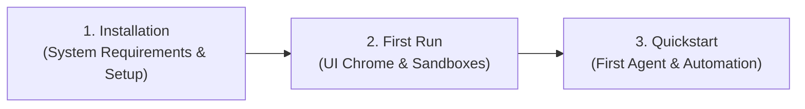

# Getting Started with Nova AI Workspace

Welcome to **Nova AI Workspace** — the native, cognitive desktop and browser environment built specifically for autonomous AI agents and modern human-agent pairing.

---

## Getting Started Journey

Follow these three structured steps to get Nova up and running:

1. **[Installation Guide](installation.md)**
   Check system requirements (Windows 10/11 x64), download and run the setup, and check that Nova is reachable for your AI program.

2. **[First Run & UI Tour](first-run.md)**
   Walk through the First Run Experience, learn about independent multi-sandbox profiles (A/B testing, isolated logins), the ConPTY Terminal dock, the native downloads drawer, and the Permission Center.

3. **[5-Minute Quickstart](quickstart.md)**
   Connect your first AI agent (Claude Code, Antigravity, OpenAI Codex), execute the bootstrap handshake, and watch Nova perform safe, deterministic web automation under real-time observation.

---

## Next Steps

Once your workspace is running and connected:
* Configure your specific AI client in **[Agent Integration](../integration/README.md)**.
* Explore the deep architectural pillars in **[Core Features](../core-features/README.md)**.
* Review safety guarantees in **[Security & Privacy](../core-features/sandbox-isolation.md)**.
