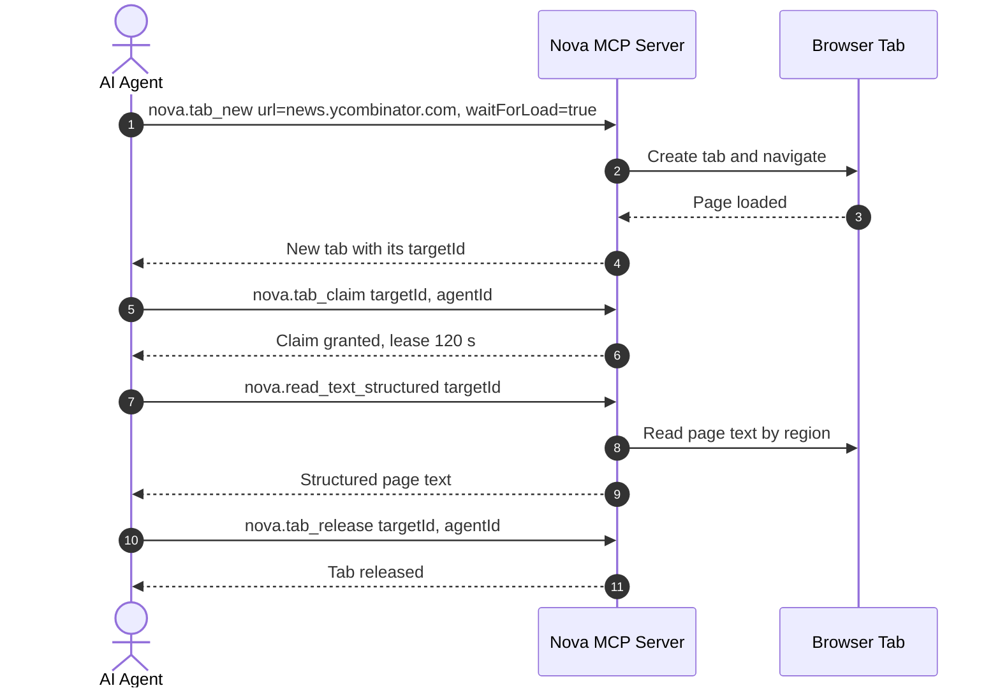

# 5-Minute Quickstart

This walkthrough takes you from a freshly started **Nova AI Workspace** to your first agent-driven web task.

---

## 1. Prerequisites

1. Nova AI Workspace is installed and running (`NovaAIWorkspace.exe`).
2. Your AI program (such as Claude Code, OpenAI Codex, Claude Desktop or Google Antigravity) is installed on your machine.

---

## 2. Step 1: Check That Agents May Connect

1. Start Nova and open **Settings → AI & agents → Connection & setup**.
2. Check that **Enable local agent control** and **Allow agents to control the browser** are ticked. Both are on by default.
3. Nova runs its local MCP server on `127.0.0.1` (port `27183` by default), protected by an access token. It keeps its entry up to date in Claude Code, Claude Desktop, Codex and Antigravity by itself.

---

## 3. Step 2: Connect Your Agent

If your AI program is not connected yet, click **Set up** on the same settings page and use **Connect** next to your program in the wizard. Restart the program afterwards; AI programs read their MCP configuration only at startup.

Then start an agent session, for example with Claude Code:
```bash
claude
```

Optionally, let the agent install Nova's reference files into your project:
```
Call nova.install_onboarding with this project's folder as projectRoot.
```
Nova writes `.nova/nova-mcp.quick.md` and `.nova/nova-mcp.md` into the project and adds a short marked section to the project's `CLAUDE.md`, `AGENTS.md` or `GEMINI.md`, so later sessions find Nova's instructions. For a folder Nova has not onboarded before, the call also needs `"confirmNewLocation": true`.

*(For Claude Desktop, Codex, Antigravity or your own agents, see the [Agent Integration Hub](../integration/README.md).)*

---

## 4. Step 3: The Bootstrap Handshake

An agent session starts with two calls:

```json
// Call 1: load the session instructions and notes that match the task
nova.get_instructions({
  "taskKeywords": ["research", "documentation"]
})

// Call 2: load the tools for browser automation
nova.tools_bundle({
  "bundle": "browser_automation",
  "includeUnavailable": true
})
```

* `nova.get_instructions` returns Nova's working rules for agents, hints for the current site, and operator notes that match `taskKeywords`.
* `nova.tools_bundle` returns the tools of one bundle plus the list of all bundles (`knownBundles`, `bundleCatalog`), so the agent can load further bundles when it needs them. Nova has more than 400 tools in total; see the [tool catalog](../mcp-reference/tool-catalog.md).

---

## 5. Step 4: Your First Automated Action

Ask your agent to perform a simple research task:

> *"Open Hacker News in a new tab, claim the tab, and extract the top 5 articles."*

A typical sequence looks like this:



### What happens here
1. **Claiming the tab (`nova.tab_claim`):** the agent reserves the tab for itself. Other agents cannot act on it until it is released or the lease runs out (120 seconds by default, adjustable with `ttlMs`). `nova.tab_new` can also claim the new tab directly with its `claim` parameter.
2. **Reading text instead of screenshots (`nova.read_text_structured`):** the agent reads the page text grouped by region, which costs far fewer tokens than a screenshot. A `selector` limits the scan to one part of the page.
3. **Releasing (`nova.tab_release`):** frees the tab for you and other agents right away instead of waiting for the lease to run out.

---

## 6. What Next?

* Explore the full agent configuration options in **[Agent Integration](../integration/README.md)**.
* Learn how Nova learns from sites in **[PKS & Continuous Learning](../core-features/pks.md)**.
* Read how Nova performs mouse and keyboard input in **[Input Dispatch & Shadow DOM Traversal](../core-features/humanized-input-engine.md)**.
