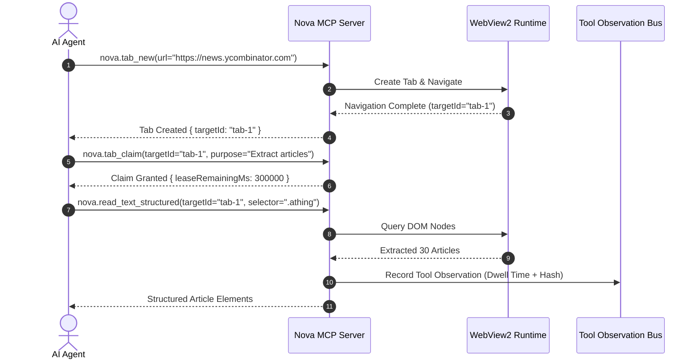

# 5-Minute Quickstart

This walkthrough takes you from a freshly launched **Nova AI Workspace** to your first autonomous, verified web interaction in under five minutes.

---

## 1. Prerequisites

1. Nova AI Workspace is installed and running (`NovaAIWorkspace.exe`).
2. Your AI agent CLI (such as Claude Code, OpenAI Codex, or Google Antigravity) is installed on your machine.

---

## 2. Step 1: Launch Nova & Verify MCP Engine

1. Start `NovaAIWorkspace.exe`.
2. Check the bottom status indicator or open Settings (`Ctrl+,`).
3. Ensure **MCP Remote Control** is toggled to **Enabled**.
4. Nova automatically binds its local Named Pipe `\\.\pipe\nova-mcp` and generates a rotating bearer token for secure session authentication.

---

## 3. Step 2: Connect Your Agent

If using **Claude Code**, run the automated onboarding tool inside your agent prompt:
```bash
# In your terminal workspace:
claude
```

Within your agent session, trigger the initial onboarding:
```
Call nova.install_onboarding to setup workspace templates and rules.
```
Nova automatically creates `.nova/nova-mcp.quick.md` and `.nova/nova-mcp.md` in your project root, providing the agent with the authoritative tool catalog and recovery instructions.

*(For detailed setup with Claude Desktop, Codex, or custom Python/Node agents, see the [Agent Integration Hub](../integration/README.md).)*

---

## 4. Step 3: The Bootstrap Handshake

Every agent session starts with a standardized two-call handshake:

```json
// Call 1: Load session contract and operator hints
nova.get_instructions({
  "taskKeywords": ["research", "documentation"]
})

// Call 2: Discover tool capabilities and clear bootstrap warnings
nova.tools_bundle({
  "bundle": "browser_automation",
  "includeUnavailable": true
})
```

* `nova.get_instructions` returns active domain knowledge, site quirks, and operator preferences.
* `nova.tools_bundle` returns the full `bundleCatalog` (all 400+ available tools mapped to concise capability bundles).

---

## 5. Step 4: Your First Automated Action

Ask your agent to perform a simple research task:

> *"Open Hacker News in a new tab, claim the tab, and extract the top 5 articles."*

Watch how the agent executes the request:



### Key Highlights During Execution:
1. **Target Claiming (`nova.tab_claim`):** The agent leases the tab exclusively for 5 minutes (`leaseRemainingMs: 300000`), preventing other subagents or background tasks from interfering with the page.
2. **Structured DOM Perception (`nova.read_text_structured`):** Instead of requesting a costly 4K screenshot and burning thousands of vision tokens, the agent extracts structured text directly from the DOM in milliseconds.
3. **Objective Observation (TOB):** Nova's Tool Observation Bus records the interaction into the server-side evidence ledger, proving that the page was genuinely loaded, rendered, and observed.

---

## 6. What Next?

Congratulations! Your agent is now pairing with Nova AI Workspace.

* Explore the full agent configuration options in **[Agent Integration](../integration/README.md)**.
* Learn how Nova's self-learning engine works in **[PKS & Continuous Learning](../core-features/pks.md)**.
* Discover how to automate complex forms and avoid bot detection in **[Humanized Input Engine](../core-features/humanized-input-engine.md)**.
