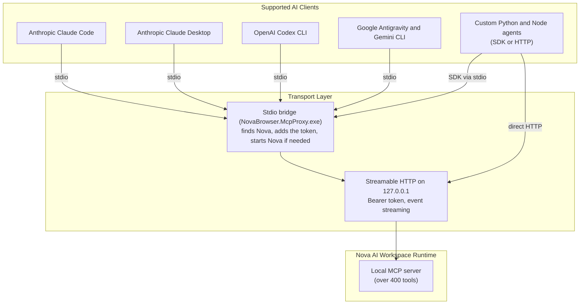

# Agent Integration Hub

AI agents connect to Nova AI Workspace over the open **Model Context Protocol (MCP)**.

---

## Supported Agent Clients

When Nova starts, it registers itself with Claude Code, Claude Desktop, OpenAI Codex and Google Antigravity if they are installed. Other MCP clients and your own agents connect by hand, through the stdio bridge or directly over HTTP:

---

## Integration Guides

Choose the guide matching your agent client:

1. **[Claude Code CLI (`claude-code.md`)](claude-code.md)**
   Setup for Anthropic's autonomous terminal agent. Learn how Nova registers itself, how to add it by hand, run `nova.install_onboarding`, and structure agent instructions.

2. **[Claude Desktop (`claude-desktop.md`)](claude-desktop.md)**
   Configure Anthropic's official desktop application on Windows using `NovaBrowser.McpProxy.exe` as the stdio bridge.

3. **[OpenAI Codex CLI (`openai-codex.md`)](openai-codex.md)**
   The Codex entry in `~/.codex/config.toml`, running tasks and coordinating several agents.

4. **[Google Antigravity & Gemini CLI (`google-antigravity.md`)](google-antigravity.md)**
   The bridge switches these clients need (`--antigravity-tool-names`, `--mirror-structured-content`), loading tools in bundles and coordinating several agents.

5. **[Custom Python & Node.js Agents (`custom-agents.md`)](custom-agents.md)**
   Build custom agent loops using the official Python MCP SDK, Node.js MCP SDK, or a direct Streamable HTTP connection with Nova's access token.

---

## Transports & Security Principles

* **Local only by default:** Nova's MCP server listens on `127.0.0.1`. Other machines cannot connect unless you switch on **Allow access from other devices on the network** in Nova's settings.
* **Access token:** Every request needs Nova's access token. It is stored encrypted for your Windows account and stays the same across restarts until you choose **Regenerate token** in Nova's settings, so registered AI programs keep working. The stdio bridge reads it by itself; Nova does not write it into the config files of your AI programs.
* **What leaves your machine:** The MCP connection itself stays on your computer. What your AI program reads through Nova goes on to that program's provider, under its terms. What Nova itself transmits is listed in the [privacy notice](../../PRIVACY.md).
